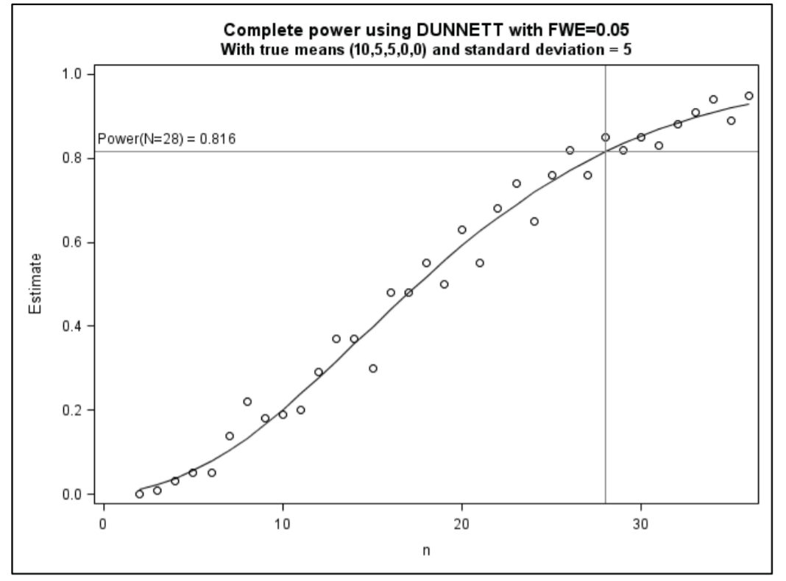

```{r setup, include=FALSE, echo = FALSE,message = FALSE, error = FALSE, warning = FALSE}
knitr::opts_chunk$set(echo = TRUE)

# <!-- ---------------------------------------------------------------------- -->
# <!--                    1. load the required packages                       -->
# <!-- ---------------------------------------------------------------------- --> 

## if(!require(psych)){install.packages("psych")}

packages<-c("tidyverse", "knitr", "papeR")
ipak <- function(pkg){
  new.pkg <- pkg[!(pkg %in% installed.packages()[, "Package"])]
  if (length(new.pkg)) 
    install.packages(new.pkg, dependencies = TRUE)
  sapply(pkg, require, character.only = TRUE)
}
ipak(packages)
# <!-- ---------------------------------------------------------------------- --> 


# <!-- ---------------------------------------------------------------------- -->
# <!--                        2. Basic system settings                        -->
# <!-- ---------------------------------------------------------------------- -->
setwd(dirname(rstudioapi::getSourceEditorContext()$path))
getwd()
Sys.setlocale("LC_ALL","English")

## convert backslash to forward slash in R
# gsub('"', "", gsub("\\\\", "/", readClipboard()))

### get the path
# rstudioapi::getSourceEditorContext()$path
# dirname(rstudioapi::getSourceEditorContext()$path)

### set working directory
# getwd()
# setwd("c:/Users/zbai/Desktop")
# Sys.setlocale("LC_ALL","English")

### get the R Version
# paste(R.Version()[c("major", "minor")], collapse = ".")

### convert backslash to forward slash 
# scan("clipboard",what="string")
# gsub('"', "", gsub("\\\\", "/", readClipboard()))
# <!-- ---------------------------------------------------------------------- --> 


# <!-- ---------------------------------------------------------------------- -->
# <!--     3. Load the SASmarkdown package if the SAS output is required      -->
# <!-- ---------------------------------------------------------------------- -->
# library(SASmarkdown)
# ### Set SAS output
# ### Reset engine to R
# saspath <- "C:/SASHome/SASFoundation/9.4/sas.exe"
# sasopts <- "-nosplash -linesize 75"
# knitr::opts_chunk$set(engine="sashtml", engine.path=saspath,
#         engine.opts=sasopts, comment=NA)
# 
# # run these commands to convince yourself that
# # within this knitr session the engine changed.
# knitr::opts_chunk$get()$engine
# knitr::opts_chunk$get()$engine.path
# knitr::opts_chunk$get()$engine.opts
# <!-- ---------------------------------------------------------------------- -->


# <!-- ---------------------------------------------------------------------- -->
# <!--                         4. Import the datasets                         -->
# <!-- ---------------------------------------------------------------------- -->
### Import csv data
# pfad <- "~/Desktop/SASUniversityEdition/myfolders/Daten"
# mydata1 <- read.csv(file.path(pfad, "yourcsv_data.csv"), 
#                     sep=";", 
#                     header=TRUE)   

### Import xlsx data
# library(readxl)
# mydata2 <- read_excel("C:/Users/zbai/Documents/GitHub/R-Projects/SAS/Yimeng/results-text.xlsx")

### Import sas data
# library(sas7bdat)
# mydata3 <- read.sas7bdat("~/Desktop/SASUniversityEdition/myfolders/Daten/uis.sas7bdat")

### Import from copyboard
# copdat <- read.delim("clipboard")
# Data_D01 <- copdat

# <!-- ---------------------------------------------------------------------- -->
# <!--                           5. Some Tools                                -->
# <!-- ---------------------------------------------------------------------- -->

## To check out vignettes for one specific package
# browseVignettes("ggplot2")


# <!-- ---------------------------------------------------------------------- -->
```


Using the usual method for determination of the appropriate sample size, the following
items should be specified:

* a primary endpoint
* the applied statistical test
* the null and alternative hypothesis
* the probability of erroneously rejecting the null hypothesis (the type I error)
* the probability of erroneously failing to reject the null hypothesis (the type II error)
* the expected drop-out rate
* the software used for sample size calculation
* assumptions made for the sample size calculation as well as their sources

In some instances, such as time-to-event analyses, the event rate is of primary interest for evaluating power, and assumptions should be made to extrapolate from the required number of events to the eventual sample size of the trial.

```{r,echo = F,message = FALSE, error = FALSE, warning = FALSE}
library('mindr')
# input <- rstudioapi::getSourceEditorContext()$path
# mm(from = input, type = 'file', widget_name = '04_ggplot2.html', root = "")

input <- rstudioapi::getSourceEditorContext()$path 
## file.show(input) # Open the input file with the default program, if any
input_txt <- readLines(input, encoding = "UTF-8")
## Convert to mind map text, markdown outline, R script, and HTML widget ####
mm_output <- mm(input_txt, 
                output_type = c("widget"),
                root = "")
mm_output$widget
```


## Distribution

### Quantile Function in SAS

| Distribution            | Argument       |
|-------------------------|----------------|
| Bernoulli               | BERNOULLI      |
| Beta                    | BETA           |
| Binomial                | BINOMIAL       |
| Cauchy                  | CAUCHY         |
| Chi-Square              | CHISQUARE      |
| Conway-Maxwell-Poisson  | CONMAXPOI      |
| Exponential             | EXPONENTIAL    |
| F                       | F              |
| Gamma                   | GAMMA          |
| Generalized Poisson     | GENPOISSON     |
| Geometric               | GEOMETRIC      |
| Hypergeometric          | HYPERGEOMETRIC |
| Laplace                 | LAPLACE        |
| Logistic                | LOGISTIC       |
| Lognormal               | LOGNORMAL      |
| Negative binomial       | NEGBINOMIAL    |
| Normal                  | NORMAL\|GAUSS  |
| Normal mixture          | NORMALMIX      |
| Pareto                  | PARETO         |
| Poisson                 | POISSON        |
| T                       | T              |
| Tweedie                 | TWEEDIE        |
| Uniform                 | UNIFORM        |
| Wald (inverse Gaussian) | WALD\|IGAUSS   |
| Weibull                 | WEIBULL        |

```
data new;                                                                                                                       
   a=quantile('BERN', .75, .25);   
   b=quantile('BETA', 0.1, 3, 4);    
   c=quantile('BINOM', .4, .5, 10);   
   d=quantile('CAUCHY', .85);    
   e=quantile('CHISQ', .6, 11);     
   f=quantile('CONMAXPOI', .2, 2.3, .4);   
   g=quantile('EXPO', .6);   
   h=quantile('F', .8, 2, 3); 
   i=quantile('GAMMA', .4, 3);  
   j=quantile('GENPOISSON', .9, 1, .7);   
   k=quantile('HYPER', .5, 200, 50, 10);  
   l=quantile('LAPLACE', .8);  
   m=quantile('LOGISTIC', .7);     
   n=quantile('LOGNORMAL', .5);  
   o=quantile('NEGB', .5, .5, 2);     
   p=quantile('NORMAL', .975);    
   q=quantile('NORMALMIX', 0.5, 1, 0.2, 1.1, 0.1);   
   r=quantile('PARETO', .01, 1);  
   s=quantile('POISSON', .9, 1);    
   t=quantile('T', .8, 5);   
   u=quantile('TWEEDIE', .8, 5);      
   v=quantile('UNIFORM', 0.25);       
   w=quantile('WALD', .6, 2);                                                                                                  
   x=quantile('WEIBULL', .6, 2); 
run;
```


### Binomial distribution

In probability theory and statistics, the binomial distribution with parameters n and p is the discrete probability distribution of the number of successes in a sequence of n independent experiments, each asking a yes–no question, and each with its own Boolean-valued outcome: success (with probability p) or failure (with probability q = 1 − p). 

$$
\begin{array}{l}
f(k, n, p)=\operatorname{Pr}(k ; n, p)=\operatorname{Pr}(X=k)=\left(\begin{array}{l}
n \\
k
\end{array}\right) p^{k}(1-p)^{n-k} \\\\
 \begin{array}{l}
k=0,1,2, \ldots, n, \text { where } \\\\
\left(\begin{array}{l}
n \\
k
\end{array}\right)=\frac{n !}{k !(n-k) !}
\end{array}
\end{array}
$$

**Expected value and variance**

$${\displaystyle \operatorname {E} (X)=\operatorname {E} (X_{1}+\dotsb +X_{n})=\operatorname {E} (X_{1})+\dotsb +\operatorname {E} (X_{n})=np.}$$
$$
{\displaystyle {\begin{aligned}\mu &=\sum _{k=0}^{n}k{\binom {n}{k}}p^{k}(1-p)^{n-k}\\&=np\sum _{k=0}^{n}k{\frac {(n-1)!}{(n-k)!k!}}p^{k-1}(1-p)^{(n-1)-(k-1)}\\&=np\sum _{k=1}^{n}{\frac {(n-1)!}{(n-k)!(k-1)!}}p^{k-1}(1-p)^{(n-1)-(k-1)}\\&=np\sum _{k=1}^{n}{\binom {n-1}{k-1}}p^{k-1}(1-p)^{(n-1)-(k-1)}\\&=np\sum _{\ell =0}^{n-1}{\binom {n-1}{\ell }}p^{\ell }(1-p)^{(n-1)-\ell }\quad {\text{mit }}\ell :=k-1\\&=np\sum _{\ell =0}^{m}{\binom {m}{\ell }}p^{\ell }(1-p)^{m-\ell }\qquad {\text{mit }}m:=n-1\\&=np\left(p+\left(1-p\right)\right)^{m}=np1^{m}=np.\end{aligned}}}
$$

$$
{\displaystyle \operatorname {Var} (X)=\operatorname {Var} (X_{1}+\dotsb +X_{n})=\operatorname {Var} (X_{1})+\dotsb +\operatorname {Var} (X_{n})=n\operatorname {Var} (X_{1})=np\left(1-p\right)=npq.}
$$

$$
\begin{array}{l}
\operatorname{Var}(X)\\=\sum_{k=0}^{n} k^{2} \cdot P(X=k)-(n p)^{2} \\
=\sum_{k=0}^{n} k^{2} \cdot\left(\begin{array}{c}
n \\
k
\end{array}\right) p^{k}(1-p)^{n-k}-n^{2} p^{2} \\
=n^{2} {p}^{2}-n p^{2}+n p-x^{2} p^{2} \\
=n p(1-p)=n p q
\end{array}
$$

```
dbinom(x, size, prob)
pbinom(x, size, prob)
qbinom(p, size, prob)
rbinom(n, size, prob)

x - 是数字的向量
p - 是概率向量
n - 是观察次数
size - 是试验的次数
prob - 是每次试验成功的概率
```


### Negative binomial distribution
 
满足以下条件的称为负二项分布 $X \sim \mathrm{NB}(r, p)$
1. 实验包含一系列独立的实验。
2. 每个实验都有成功、失败两种结果。
3. 成功的概率是恒定的。
4. 实验持续到次失败, r可以为任意正数。

Probability mass function
$$
f(k ; r, p) \equiv \operatorname{Pr}(X=k)=\left(\begin{array}{c}
k+r-1 \\
k
\end{array}\right) p^{r}(1-p)^{k}
$$
The binomial coefficient, and is equal to
$$
\left(\begin{array}{c}
k+r-1 \\
k
\end{array}\right)=\frac{(k+r-1) !}{(r-1) !(k) !}=\frac{(k+r-1)(k+r-2) \cdots(r)}{(k) !}
$$

- **Expectation**: $r /(1-p)-r=r p /(1-p)$.
- **Variance**: $r(1-p) / p^{2}$.

### Multinomial distribution

$$
{\displaystyle {\begin{aligned}f(x_{1},\ldots ,x_{k};n,p_{1},\ldots ,p_{k})&{}=\Pr(X_{1}=x_{1}{\text{ and }}\dots {\text{ and }}X_{k}=x_{k})\\&{}={\begin{cases}{\displaystyle {n! \over x_{1}!\cdots x_{k}!}p_{1}^{x_{1}}\times \cdots \times p_{k}^{x_{k}}},\quad &{\text{when }}\sum _{i=1}^{k}x_{i}=n\\\\0&{\text{otherwise,}}\end{cases}}\end{aligned}}}
$$

```{r multinomial distribution,echo = T,message = FALSE, error = FALSE, warning = FALSE}
## 其中p, x均为向量，分别代表各试验结果的概率和发生次数
## p=c(p1, p2, ..., pk), x=c(x1, x2, ..., xk)
multi <- function(p, x) {
  n <- sum(x)                      ##试验次数
  f1 <- prod(p^x)
  f2 <- prod(factorial(x))
  factorial(n)*f1/f2               ##返回值
}

p <- c(71, 35, 72)/178
x <- c(3, 1, 2)
multi(p, x)
```

### Normal Distribution

$${\displaystyle f(x)={\frac {1}{\sigma {\sqrt {2\pi }}}}e^{-{\frac {1}{2}}\left({\frac {x-\mu }{\sigma }}\right)^{2}}}$$
$$
F(x;\mu,\sigma)
=
\frac{1}{\sigma\sqrt{2\pi}}
\int_{-\infty}^x
 \exp
 \left( -\frac{(t - \mu)^2}{2\sigma^2}
\ \right)\, dt.
$$

**Moment generating function**

设 $x$ 为随机变量, 若存在正实数 $h$, 使得对于 $(-h, h)$ 中任一实数 $t, \quad E\left(e^{t \Sigma}\right)$ 均存在, 则称 $m_{x}(t)=E\left(e^{t x}\right)$ 为 $x$ 的矩母函数(moment generating function), 通过它可以比较方便的求出随机变量各阶原点矩,若 $x \sim N\left(\mu, \sigma^{2}\right)$, 即其概率密度函数为 $f(x)=\frac{1}{\sqrt{2 \pi} \sigma} \exp \left(-\frac{(x-\mu)^{2}}{2 \sigma^{2}}\right)$, 它的矩母函数是
$$M_{y}(t)=e^{t \mu+t^{2} \sigma^{2} / 2}$$

**Prove**

$$\begin{align}
M_{x}(t)&=\int_{-\infty}^{\infty} \frac{1}{\sqrt{2 \pi} \sigma} \exp \left(-\frac{(x-\mu)^{2}}{2 \sigma^{2}}+t x\right) d \\
&=\int_{-\infty}^{\infty} \frac{1}{\sqrt{2 \pi} \sigma} \exp \left(-\frac{\left[x-\left(\mu+t \sigma^{2}\right)\right]^{2}}{2 \sigma^{2}}+t \mu+\frac{t^{2} \sigma^{2}}{2}\right) d x \\
&=e^{t \mu+t^{2} \sigma^{2} / 2}
\end{align}$$
注意其中 $\frac{1}{\sqrt{2 \pi} \sigma} \exp \left(-\frac{\left[x-\left(\mu+t \sigma^{2}\right)\right]^{2}}{2 \sigma^{2}}\right)$ 是 $N\left(\mu+t \sigma^{2}, \sigma^{2}\right)$ 的概率密度函数, 它在 $(-\infty, \infty)$上的积分值为 1


$$M_{x}^{(k)}(0)=E\left(x^{k}\right)$$
 
**Prove**
 
$$M_{x}^{(k)}(0)=\int_{-\infty}^{\infty} x^{k} f(x) d x=E\left(x^{k}\right)$$

### Multivariate normal distribution

The multivariate normal distribution of a k-dimensional random vector $\mathbf{X}=\left(X_{1}, \ldots, X_{k}\right)^{\mathrm{T}}$ can be written in the following notation:
$$
\mathbf{X} \sim \mathcal{N}(\boldsymbol{\mu}, \boldsymbol{\Sigma})
$$
or to make it explicitly known that $\mathrm{X}$ is $\mathrm{k}$ -dimensional.
$$
\mathbf{X} \sim \mathcal{N}_{k}(\boldsymbol{\mu}, \boldsymbol{\Sigma})
$$
with k-dimensional mean vector
$$
\boldsymbol{\mu}=\mathrm{E}[\mathbf{X}]=\left(\mathrm{E}\left[X_{1}\right], \mathrm{E}\left[X_{2}\right], \ldots, \mathrm{E}\left[X_{k}\right]\right)^{\mathrm{T}}
$$
and \{ldisplaystyle k(times k\}k $\mathrm{k}$ covariance matrix
$$
\Sigma_{i, j}:=\mathrm{E}\left[\left(X_{i}-\mu_{i}\right)\left(X_{j}-\mu_{j}\right)\right]=\operatorname{Cov}\left[X_{i}, X_{j}\right]
$$

**For the Bivariate case**

$${\displaystyle f(x,y)={\frac {1}{2\pi \sigma _{X}\sigma _{Y}{\sqrt {1-\rho ^{2}}}}}\mathrm {e} ^{-{\frac {1}{2(1-\rho ^{2})}}\left[({\frac {x-\mu _{X}}{\sigma _{X}}})^{2}-2\rho ({\frac {x-\mu _{X}}{\sigma _{X}}})({\frac {y-\mu _{Y}}{\sigma _{Y}}})+({\frac {y-\mu _{Y}}{\sigma _{Y}}})^{2}\right]}}$$
$${\displaystyle {\boldsymbol {\mu }}={\begin{pmatrix}\mu _{X}\\\mu _{Y}\end{pmatrix}},\quad {\boldsymbol {\Sigma }}={\begin{pmatrix}\sigma _{X}^{2}&\rho \sigma _{X}\sigma _{Y}\\\rho \sigma _{X}\sigma _{Y}&\sigma _{Y}^{2}\end{pmatrix}}.}$$

The **conditional expectation** of $X_1$ given $X_2$ is:
$$\operatorname{E}(X_1 \mid X_2=x_2) = \mu_1 + \rho \frac{\sigma_1}{\sigma_2}(x_2 - \mu_2)$$


### Poisson distribution

The Poisson distribution is popular for modeling the number of times an event occurs in an interval of time or space.

$$\!f(k;\lambda )=\Pr(X=k)={\frac {\lambda ^{k}e^{-\lambda }}{k!}},$$
$$\lambda =\operatorname {E} (X)=\operatorname {Var} (X).$$


### Exponential distribution

The exponential distribution is the probability distribution of the time interval between events in the Poisson point process, that is, when events occur continuously and independently at a constant average rate. This is a special case of **gamma distribution**. It is a continuous simulation of geometric distribution and has the key feature of no memory.

<!-- 指数分布是在泊松点过程中，即事件以恒定的平均速率连续且独立发生的过程中，事件之间时间间隔的概率分布。 这是**伽玛分布的一种特殊情况**。 它是几何分布的连续模拟，并且具有无记忆的关键特性. 从意义来看：指数分布解决的问题是“要等到一个随机事件发生，需要经历多久时间”，伽玛分布解决的问题是“要等到n个随机事件都发生，需要经历多久时间”。 -->

$${\displaystyle f(x;\lambda )={\begin{cases}\lambda e^{-\lambda x}&x\geq 0,\\0&x<0.\end{cases}}}$$

The cumulative distribution function is given by
$${\displaystyle F(x;\lambda )={\begin{cases}1-e^{-(\lambda x)}&x\geq 0,\\0&x<0.\end{cases}}}{\displaystyle F(x;\lambda )={\begin{cases}1-e^{-(\lambda x)}&x\geq 0,\\0&x<0.\end{cases}}}$$

**Mean, variance, moments and median**

The mean or expected value of an exponentially (distributed random variable $X$ with rate parameter $\lambda$
is given by
$$
\mathrm{E}[X]=\frac{1}{\lambda}
$$
The variance of $X$ is given by
$$
\operatorname{Var}[X]=\frac{1}{\lambda^{2}}
$$
The moments of $X$, for $n \in \mathbb{N}$ are given by
$$
\mathrm{E}\left[X^{n}\right]=\frac{n !}{\lambda^{n}} \cdot \mathrm{E}\left[X^{n}\right]=\frac{n !}{\lambda^{n}}
$$
The median of $X$ is given by
$$
\mathrm{m}[X]=\frac{\ln (2)}{\lambda}<\mathrm{E}[X]
$$
where In refers to the natural logarithm. Thus the absolute difference between the mean and median
is
$$
|\mathrm{E}[X]-\mathrm{m}[X]|=\frac{1-\ln (2)}{\lambda}<\frac{1}{\lambda}=\sigma[X]
$$
**Properties of Exponential Distributions**

If $X \sim \operatorname{exponential}(\lambda)$, then the following hold.
1. The cdf of $X$ is given by
$$
F(x)=\left\{\begin{array}{ll}
0 & \text { for } x<0 \\
1-e^{-\lambda x}, & \text { for } x \geq 0
\end{array}\right.
$$
2. For any $0<p<1$, the $(100 p)^{\text {th }}$ percentile is $\pi_{p}=\frac{-\ln (1-p)}{\lambda}$
3. The mean of $X$ is $\mathrm{E}[X]=\frac{1}{\lambda}$
4. The variance of $X$ is $\operatorname{Var}(X)=\frac{1}{\lambda^{2}}$
5. The mgf of $X$ is
$$
M_{X}(t)=\frac{1}{1-(t / \lambda)}, \quad \text { for } t<\lambda
$$
6. $X$ satisfies the Memoryless Property, i.e., $P(X>t+s \mid X>s)=P(X>t)$, for any $t, s \geq 0$


### Gamma distribution

Gamma distribution is the distribution of the sum of multiple independent and identically distributed (iid) of exponential distribution variables.

**Probability Density Function**

The general formula for the probability density function of the gamma distribution is
$$
f(x)=\frac{\left(\frac{x-\mu}{\beta}\right)^{\gamma-1} \exp \left(-\frac{x-\mu}{\beta}\right)}{\beta \Gamma(\gamma)} \quad x \geq \mu ; \gamma, \beta>0
$$
where $\gamma$ is the shape parameter, $\mu$ is the location parameter, $\beta$ is the scale parameter, and $\Gamma$ is the gamma function which has the formula
$$
\Gamma(a)=\int_{0}^{\infty} t^{a-1} e^{-t} d t
$$
The case where $\mu=0$ and $\beta=1$ is called the standard gamma distribution. The equation for the standard gamma distribution reduces to
$$
f(x)=\frac{x^{\gamma-1}-x}{\Gamma(\gamma)} \quad x \geq 0 ; \gamma>0
$$

**Gamma distribution & Exponential distribution**

From the meaning: 

* the problem solved by exponential distribution is "how long does it take to wait until a random event occurs", 
* the problem solved by gamma distribution is "how long does it take to wait until n random events occur at same time".

From the formula

* A random variable $X$ has a gamma distribution with parameters $\alpha, \lambda>0$, write $X \sim \operatorname{gamma}(\alpha, \lambda)$, if $X$ has pdf given by
$$
f(x)=\left\{\begin{array}{ll}
\frac{\lambda^{\alpha}}{\Gamma(\alpha)} x^{\alpha-1} e^{-\lambda x}, & \text { for } x \geq 0 \\
0 & \text { otherwise }
\end{array}\right.
$$
where $\Gamma(\alpha)$ is a function (referred to as the gamma function) given by the following integral:
$$
\Gamma(\alpha)=\int_{0}^{\infty} t^{\alpha-1} e^{-t} d t
$$
When $\alpha$ turns to 1, the gamma distribution becomes the exponential distribution.
* A random variable $X$ has an exponential distribution with parameter $\lambda>0$, write $X \sim$ exponential $(\lambda)$, if $X$ has pdf given by
$$
f(x)=\left\{\begin{array}{ll}
\lambda e^{-\lambda x}, & \text { for } x \geq 0 \\
0 & \text { otherwise }
\end{array}\right.
$$


### Weibull Distribution

**Definition**

A random variable $X$ has a Weibull distribution with parameters $\alpha, \beta>0$, write $X \sim$ Weibull $(\alpha, \beta)$, if $X$ has pdf given by
$$
f(x)=\left\{\begin{array}{ll}
\frac{\alpha}{\beta^{\alpha}} x^{\alpha-1} e^{-(x / \beta)^{\alpha}}, & \text { for } x \geq 0 \\
0 & \text { otherwise }
\end{array}\right.
$$
Where $\alpha$ is scale parameter and $\beta$ is shape parameter. 

Weibull distribution is related to many distributions. When $\alpha=1$, the Weibull distribution is an exponential distribution with  $\lambda = 1/\beta$, so the exponential distribution is a special case of both the Weibull distributions and the gamma distributions.

**Properties of Weibull Distributions**

If $X \sim$ Weibull $(\alpha, \beta)$, then the following hold.

1. The cdf of $X$ is given by
$$
F(x)=\left\{\begin{array}{ll}
0 & \text { for } x<0 \\
1-e^{-(x / \beta)^{\alpha}}, & \text { for } x \geq 0
\end{array}\right.
$$
2. For any $0<p<1$, the $(100 p)^{\text {th }}$ percentile is $\pi_{p}=\beta(-\ln (1-p))^{1 / \alpha}$.
3. The mean of $X$ is $\mathrm{E}[X]=\beta \Gamma\left(1+\frac{1}{\alpha}\right)$.
4. The variance of $X$ is $\operatorname{Var}(X)=\beta^{2}\left[\Gamma\left(1+\frac{2}{\alpha}\right)-\left[\Gamma\left(1+\frac{1}{\alpha}\right)\right]^{2}\right]$

### Chi-Squared Distribution

**Definition**

A random variable $X$ has a chi-squared distribution with $k$ degrees of freedom, where $k$ is a positive integer, write $X \sim \chi^{2}(k)$, if $X$ has pdf given by
$$
f(x)=\left\{\begin{array}{ll}
\frac{1}{\Gamma(k / 2) 2^{k / 2}} x^{k / 2-1} e^{-x / 2}, & \text { for } x \geq 0 \\
0 & \text { otherwise }
\end{array}\right.
$$

The chi-squared distributions are a special case of the gamma distributions with $\alpha=\frac{k}{2}, \lambda=\frac{1}{2}$, which can be used to establish the following properties of the chi-squared distribution.

**Properties of Chi-Squared Distributions**

If $X \sim \chi^{2}(k)$, then $X$ has the following properties.

1. The mgf of $X$ is given by
$$
M_{X}(t)=\frac{1}{(1-2 t)^{k / 2}}, \quad \text { for } t<\frac{1}{2}
$$
2. The mean of $X$ is $\mathrm{E}[X]=k_{r}$ i.e., the degrees of freedom.
3. The variance of $X$ is $\operatorname{Var}(X)=2 k$, i.e., twice the degrees of freedom.


The main applications of the chi-squared distributions relate to their importance in the field of statistics, which result from the following relationships between the chi-squared distributions and the normal distributions.

**Relationships of Chi-Squared Distributions (Normal Distributions)**

1. If $Z$ is a standard normal random variable, i.e., $Z \sim N(0,1)$, then the distribution of $Z^{2}$ is chi-squared with $k=1$ degree of freedom.
2. If $X_{1}, \ldots, X_{n}$ is a collection of independent, chi-squared random variables each with 1 degree of freedom, i.e., $X_{i} \sim \chi^{2}(1)$, for each $i=1, \ldots, n$, then the sum $X_{1}+\cdots+X_{n}$ is also chi-squared with $k=n$ degrees of freedom.
3. If $X \sim \chi^{2}\left(k_{1}\right)$ and $Y \sim \chi^{2}\left(k_{2}\right)$ are independent random variables, then $X+Y \sim \chi^{2}\left(k_{1}+k_{2}\right)$.


### Beta Distribution

**Definition**

A random variable $X$ has a beta distribution with parameters $\alpha, \beta>0$, write $X \sim \operatorname{beta}(\alpha, \beta)$, if $X$ has pdf given by
$$
f(x)=\left\{\begin{array}{ll}
\frac{\Gamma(\alpha+\beta)}{\Gamma(\alpha) \Gamma(\beta)} x^{\alpha-1}(1-x)^{\beta-1}, & \text { for } 0 \leq x \leq 1 \\
0 & \text { otherwise }
\end{array}\right.
$$
Note $\Gamma(\alpha)$ is the gamma function.

The parameters, $\alpha$ and $\beta$, are both shape parameters for the beta distribution, varying their values changes the shape of the pdf.


**Properties of Chi-Squared Distributions**

If $X \sim \operatorname{beta}(\alpha, \beta)$, then:

1. the mean of $X$ is $\mathrm{E}[X]=\frac{\alpha}{\alpha+\beta}$,
2. the variance of $X$ is $\operatorname{Var}(X)=\frac{\alpha \beta}{(\alpha+\beta)^{2}(\alpha+\beta+1)}$
 


## Binomial CI 

### Point Estimates

1. MLE (Maximum Likelihood Estimate)
2. LaPlace point estimates
3. Wilson point estimates
4. Jeffreys point estimates

**MLE (Maximum Likelihood Estimate)**

MLE是样本比例或成功用户数除以总尝试次数。这是所报告的最常见的点估计。

$$\hat p=x/n$$

**LaPlace point estimates**

一个著名的大样本问题来自拉普拉斯在1800年代初期的开创性工作。他提出了一个问题，即您可以确定明天的太阳会升起，因为您知道过去的5000年（1,825,000天）每天都在升起。您可以确定它会上升，但不能完全确定。太阳可能会爆炸，或者大的小行星可能会将地球粉碎成碎片。为了回答这个问题，他提出了拉普拉斯继承定律，即在分子上加一个，在分母上加两个（（x + 1）/（n + 2））。应用此过程，您将确定99.999945％的明天明天会升起-接近100％，但略微偏离了那个极端。当样本量较小时，调整幅度会更大。

$$\hat p=(x+1)/(n+2)$$
**Wilson point estimates**

Wilson's点估计值是调整后的Wald CI的中点。 它是通过将分子的临界值平方和分子分母的临界值平方相加而得出的。 Wilson's方法更为保守。

$$\hat p=\frac{x+\frac{1}{2} z^{2}}{n+z^{2}}$$

**Jeffreys point estimates**

Jeffreys（1961）在LaPlace和MLE方法之间进行了折衷。Jeffreys区间是在对二项式比例p使用非信息性Jeffreys之前获得的贝叶斯可信区间。这个问题的Jeffreys先验是带有参数（1/2，1/2）的Beta分布，它是共轭先验。在n次试验中观察到x次成功之后，p的后验分布是带有参数（x + 1/2，n – x + 1/2）的Beta分布。

$$\hat p=(x+0.5)/(n+1)$$


### Binomial CI for Small Samples

#### Wald CI

Wald方法是计算二项式置信区间的最常用公式, 不幸的是，当样本量较小时，尤其是当完成率不接近50％时，它产生的间隔太窄。

$$\hat{p} \pm z_{\alpha / 2} \sqrt{\hat{p}(1-\hat{p}) / n}$$


```{r Wald,echo = T,message = FALSE, error = FALSE, warning = FALSE}
library("pwr")
# Tests of proportions
pwr.2p.test(h = ES.h(0.65, 0.6), sig.level = 0.05, power = 0.9, alternative = "greater")
```
    
#### Clopper-Pearson or “Exact” CI

为了改善Wald区间的较差平均覆盖率，更为复杂的方法，称为Clopper-Pearson或“精确”方法. 精确方法使用小样本可提供更可靠的置信区间（Clopper和Pearson，1934）。但是，在实际实践中，
当标称置信度为95％时，“精确”区间会产生过于保守的置信区间，其真实覆盖率接近99％。
当样本量较小（n <15）时，这种过度保守的性质尤其容易受到伤害（Agresti and Coull，1996）

$$\begin{aligned}
\left[1+\frac{n-x+1}{x F_{2 x, 2(n-x+1), 1-\alpha / 2}}\right]^{-1} & 
<p<\left[1+\frac{n-x}{(x+1) F_{2(x+1), 2(n-x), \alpha / 2}}\right]^{-1}
\end{aligned}$$

#### Wilson score CI

精确间隔太宽而Wald间隔太窄。第三种方法称为“得分”间隔（Wilson，1927年）并不过分保守，对于标称95％的间隔，其平均覆盖率接近95％。不幸的是，它的计算与精确方法一样繁琐，并且当完成率接近0或1时，它存在一些严重的覆盖问题（Agresti和Coull，1998）

$$\left(\hat{p}+\frac{z_{\alpha / 2}^{2}}{2 n} \pm z_{\alpha / 2} \sqrt{\left[\hat{p}(1-\hat{p})+z_{\alpha / 2}^{2} / 4 n\right] / n}\right) /\left(1+z_{\alpha / 2}^{2} / n\right)$$

#### Adjusted Wald CI

另一种可供选择的方法，由Agresti and Coull. 命名为Adjusted Wald方法，
仅要求在95％的置信区间内，将观察到的完成率加两个成功和两个失败，然后使用Wald公式计算95％的二项式置信区间。
对于大多数p值，它的覆盖范围与Score方法一样好，并且通常在完成率接近0或1时更好。
该方法非常简单，并且在统计文献中已被推荐, 相加两次成功和两次失败”（或分子加上两个，分母增加四个）是从正态分布的临界值中得出的。

$$\frac{\hat{p}+\frac{z_{1-\alpha / 2}^{2}}{2 n}+z_{1-\alpha / 2} \sqrt{\frac{\hat{p}(1-\hat{p})}{n}+\frac{z_{1-\alpha / 2}^{2}}{4 n^{2}}}}{1+\frac{z_{1-\alpha / 2}^{2}}{n}}  < \hat{p} <\frac{\hat{p}+\frac{z_{\alpha / 2}^{2}}{2 n}+z_{\alpha / 2} \sqrt{\frac{\hat{p}(1-\hat{p})}{n}+\frac{z_{\alpha / 2}^{2}}{4 n^{2}}}}{1+\frac{z_{\alpha / 2}^{2}}{n}}$$


### R Packages

#### Package binom


Package [binom](https://cran.r-project.org/web/packages/binom/binom.pdf) can provide different binomial CI and Test such as

* exact - Pearson-Klopper method. See also binom.test.
* asymptotic - the text-book definition for confidence limits on a single proportion using the Central Limit Theorem.
* wilson - Wilson method.
* prop.test - equivalent to prop.test(x = x, n = n, conf.level = conf.level)$conf.int.
* bayes - see binom.bayes.
* logit - see binom.logit.
* cloglog - see binom.cloglog.
* probit - see binom.probit.
* profile - see binom.profile.


|  Function           |  Description                                                                  |
|---------------------|------------------------------------------------------------------------------------------------------------------------------------------------------------------------------------------------------------------------------------------------------------------------------------------------------------------------------------------------------------------------------------------------------|
| binom.bayes         | Binomial confidence intervals using Bayesian inference |
|                     |二项式分布概率上使用beta优先级，从beta的后验确定两侧置信区间。  二项式实验中使用先于p分布（成功概率）的共轭beta，从β后验构造一个置信区间。根据贝叶斯定理，给定数据x的p的后验分布为：p \| x〜Beta（x + prior.shape1，n-x +prior.shape2)默认的priority是Jeffrey′sprior，它是Beta（0.5，0.5）分布 。 因此，后验均值为（x +0.5）/（n + 1）。 |
| binom.logit         | Binomial confidence intervals using the logit parameterization                      |
| binom.probit        | Binomial confidence intervals using the probit parameterization                     |
| binom.cloglog       | 在观察到的比例上（cloglog）参数化来构造置信区间   The complementary-log-log link function says that $$\eta(x) = \log(-\log(1-\pi_x))=\mathbf{x}\beta$$|
| binom.lrt           | Binomial confidence intervals using the lrt likelihood -- likelihood ratio test (LRT) 置信区间基于对MLE附近的二项式偏差进行分析。                                         |
| binom.profile       | Binomial confidence intervals using the profile likelihood  当使用标准方法难以获得准确的间隔估计值时，例如，当对数似然函数的形状高度非正态或有大量麻烦参数时，通常使用轮廓似然.当似然函数具有多个参数时，只关注其中一部分参数，而将其他参数视为常数，此时似然函数就被称为profile likelihood。                            |
| binom.sim           | Simulates confidence intervals for binomial data                              |
| binom.confint       | Binomial confidence intervals                                                 |
| binom.coverage      | Probability coverage for binomial confidence intervals                        |
| binom.plot          | Coverage plots for binomial confidence intervals                              |
| binom.length        | Expected length for binomial confidence intervals                             |
| binom.power         | Power curves for binomial parameterizations                                   |
| cloglog.sample.size | Power and sample size for a binomial proportion using the cloglog parameterization  |
| cloglog.sample.size | Power and sample size for a binomial proportion using the cloglog parameterization  |


```{r Bino CI,echo = T,message = FALSE, error = FALSE, warning = FALSE}
## Which method to use to construct the interval. Any combination of 
##   c("exact", "ac", "asymptotic", "wilson", "prop.test", "bayes", 
##    "logit", "cloglog", "probit") 
##   is allowed. Default is "all".
   
library("binom")
binom.confint(x=26, n=79, conf.level = 0.95, methods = "all")

library("pwr")
library("binomSamSize")

one_propotion1 <- function(seq,p0,h1,corr,power){
  data <- data.frame(p1=seq,p0=rep(p0,length(seq)))
  for(i in 1:length(seq)) {
    data$n[i] <- pwr.p.test(h=ES.h(p1 = seq[i], p2 = p0),power=power,sig.level=0.025,alternative=h1)$n
    
    data$wald.ne[i] <- ceiling(data$n[i])

    data$wd.Length[i] <- binom.length(p=seq[i], n=data$wald.ne[i], 
                                      conf.level = 0.95, method = c("asymptotic"))$length[1]/2
    
  
    data$ac.ne[i] <- ciss.agresticoull(seq[i],data$wd.Length[i], alpha=0.05)
    data$ac.Length[i] <- binom.length(p=seq[i], n=data$ac.ne[i], 
                                      conf.level = 0.95, method = c("ac"))$length[1]/2
    
  
    data$wald.ne.drop[i] <- ceiling(data$n[i]/0.9)
    data$ac.ne.drop[i] <- ceiling(data$ac.ne[i]/0.9) 
    
    
    data$wald.ns[i] <- ceiling(data$n[i]/2)
    data$ac.ns[i] <- ceiling(data$ac.ne[i]/2)
    
    data$wd.Length[i] <- round(data$wd.Length[i],3)
    data$ac.Length[i] <- round(data$ac.Length[i],3)
    
    data$wald.ne.cor[i] <- ceiling((1+corr)*data$n[i])
    data$ac.ne.cor[i] <- ceiling((1+corr)*data$ac.ne[i])
    
    data$wd.Length.cor[i] <- round(binom.length(p=seq[i], n=data$wald.ne.cor[i], 
                                                conf.level = 0.95, method = c("asymptotic"))$length[1]/2,3)
    data$ac.Length.cor[i] <- round(binom.length(p=seq[i], n=data$ac.ne.cor[i], 
                                                conf.level = 0.95, method = c("ac"))$length[1]/2,3)
  }
  data <- data[,c(1,2,4,6,8,9,10,11,5,7,12,13,14,15)]
  return(data)
}

one_propotion1(seq=seq(0.005,0.02,0.005),p0=0.05,h1="less",corr=0.5, power=0.8)
```
 
 
#### Package: pwr

[Basic Functions for Power Analysis](https://cran.r-project.org/web/packages/pwr/pwr.pdf)

| 方法                | 功效计算的对象                                                                     |
|---------------------|------------------------------------------------------------------------------------|
| pwr.2p.test()       | 两比例(n相等)                                                                      |
| pwr.2p2n.test()     | 两比例(n不相等)                                                                    |
| pwr.anova.test()    | 平衡的单因素ANOVA                                                                  |
| pwr.chisq.test()    | 卡方检验                                                                           |
| pwr.f2.test()       | 广义线性模型                                                                       |
| pwr.p.test()        | 比例(单样本)                                                                       |
| pwr.r.test()        | 相关系数                                                                           |
| pwr.t.test()        | t检验(单样本、两样本、配对)                                                        |
| pwr.t2n.test()      | t检验(n不相等的两样本)           


### Incidence rate CI

Incidence rate is the rate at which new clinical events occur in a population. It is the number of new events divided by the population at risk of an event in a specific time period, sometimes it is the person-time at risk.

$$r=\frac{a}{N}$$
$$\mathrm{SE}=\sqrt{\frac{1-r}{\mathrm{a}}}$$
$100(1-\mathrm{a}) \%$ confidence interval is defined as:
$$
(\mathrm{e}^{\ln \mathrm{r}-\mathrm{z}_{1-\frac{\alpha}{2}} \mathrm{SE}}, \mathrm{e}^{\ln \mathrm{r}+\mathrm{z}_{1-\frac{\alpha}{2}} \mathrm{SE}})
$$
 

                                                  |


 

## Test 1-Sample Proportion

#### 2-Sided Equality based on Wald CI

$$
\begin{array}{l}
H_{0}: p=p_{0} \\
H_{1}: p \neq p_{0}
\end{array}
$$
Formulas of sample size and power, respectively:
$$
\begin{array}{c}
n=p(1-p)\left(\frac{z_{1-\alpha / 2}+z_{1-\beta}}{p-p_{0}}\right)^{2} \\
1-\beta=\Phi\left(z-z_{1-\alpha / 2}\right)+\Phi\left(-z-z_{1-\alpha / 2}\right) \quad, \quad z=\frac{p-p_{0}}{\sqrt{\frac{p(1-p)}{n}}}
\end{array}
$$
#### Non-Inferiority or Superiority

$$
\begin{array}{l}
H_{0}: p-p_{0} \leq \delta \\
H_{1}: p-p_{0}>\delta
\end{array}
$$
and $\delta$ is the superiority or non-inferiority margin.

Formulas of sample size and power, respectively:
$$
\begin{array}{c}
n=p(1-p)\left(\frac{z_{1-\alpha}+z_{1-\beta}}{p-p_{0}-\delta}\right)^{2} \\
1-\beta=\Phi\left(z-z_{1-\alpha}\right)+\Phi\left(-z-z_{1-\alpha}\right) \quad, \quad z=\frac{p-p_{0}-\delta}{\sqrt{\frac{p(1-p)}{n}}}
\end{array}
$$

```{r hand one Sample Non-Inferiority or Superiority Proportions, echo = T,message = FALSE, error = FALSE, warning = FALSE}
p=0.5
p0=0.3
delta=-0.1
alpha=0.05
beta=0.20
(n=p*(1-p)*((qnorm(1-alpha)+qnorm(1-beta))/(p-p0-delta))^2)
ceiling(n) 

z=(p-p0-delta)/sqrt(p*(1-p)/n)
(Power=pnorm(z-qnorm(1-alpha))+pnorm(-z-qnorm(1-alpha)))
```

#### Equivalence

$$
\begin{array}{l}
H_{0}:\left|p-p_{0}\right| \geq \delta \\
H_{1}:\left|p-p_{0}\right|<\delta
\end{array}
$$
Formulas of sample size and power, respectively:
$$
\begin{array}{c}
n=p(1-p)\left(\frac{z_{1-\alpha}+z_{1-\beta / 2}}{\left|p-p_{0}\right|-\delta}\right)^{2} \\
1-\beta=2\left[\Phi\left(z-z_{1-\alpha}\right)+\Phi\left(-z-z_{1-\alpha}\right)\right]-1 \quad, \quad z=\frac{\left|p-p_{0}\right|-\delta}{\sqrt{\frac{p(1-p)}{n}}}
\end{array}
$$


## Test 2-Sample Proportions

### Technical details

Random samples of m and n individuals are obtained from these two populations. The data from these samples
can be displayed in a 2-by-2 contingency table as follows

$$\begin{array}{lccc}\text { Group } & \text { Success } & \text { Failure } & \text { Total } \\ \text { Treatment } & x_{11} & x_{12} & n_{1} \\ \text { Control } & x_{21} & x_{22} & n_{2} \\ \text { Total } & m_{1} & m_{2} & N\end{array}$$

The binomial proportions $p_{1}$ and $p_{2}$ are estimated from these data using the formulae
$$
\hat{p}_{1}=\frac{x_{11}}{n_{1}} \text { and } \hat{p}_{2}=\frac{x_{21}}{n_{2}}
$$

Mathematically, there are three comparison parameters 
$$
\begin{array}{ll}
\underline{\text { Parameter }} & \underline{\text { Computation }} \\
\text { Difference } & \delta=p_{1}-p_{2} \\
\text { Risk Ratio } & \phi=p_{1} / p_{2} \\
\text { Odds Ratio } & \psi=\frac{p_{1} /\left(1-p_{1}\right)}{p_{2} /\left(1-p_{2}\right)}=\frac{p_{1} q_{2}}{p}
\end{array}
$$
The tests analyzed by this routine are for the null case. This refers to the values of the above parameters under the null hypothesis. In the null case, the difference is zero and the ratios are one under the null hypothesis. In the nonnull case, discussed in another chapter, the difference is some value other than zero and the ratios are some value other than one. The non-null case often appears in equivalence and non-inferiority testing.


### Fisher’s Exact Test

The test statistic is
$$
T=-\ln \left[\frac{\left(\begin{array}{l}
n_{1} \\
x_{1}
\end{array}\right)\left(\begin{array}{l}
n_{2} \\
x_{2}
\end{array}\right)}{\left(\begin{array}{l}
N \\
m
\end{array}\right)}\right]
$$
The null distribution of $\mathrm{T}$ is based on the hypergeometric distribution. It is given by
$$
\operatorname{Pr}\left(T \geq t \mid m, H_{0}\right)=\sum_{A(m)}\left[\frac{\left(\begin{array}{l}
n_{1} \\
x_{1}
\end{array}\right)\left(\begin{array}{l}
n_{2} \\
x_{2}
\end{array}\right)}{\left(\begin{array}{c}
N \\
m
\end{array}\right)}\right]
$$

where
$$
A(m)=\left\{\text { all pairs } x_{1}, x_{2} \text { such that } x_{1}+x_{2}=m, \text { given } T \geq t\right\}
$$
Conditional on $m$, the critical value, $t_{\alpha}$, is the smallest value of $t$ such that
$$
\operatorname{Pr}\left(T \geq t_{\alpha} \mid m, H_{0}\right) \leq \alpha
$$
The power is defined as
$$
1-\beta=\sum_{m=0}^{N} P(m) \operatorname{Pr}\left(T \geq t_{\alpha} \mid m, H_{1}\right)
$$
where
$$
\operatorname{Pr}\left(T \geq t_{\alpha} \mid m, H_{1}\right)=\sum_{A\left(m, T \geq t_{a}\right)}\left[\frac{b\left(x_{1}, n_{1}, p_{1}\right) b\left(x_{2}, n_{2}, p_{2}\right)}{\sum_{A(m)} b\left(x_{1}, n_{1}, p_{1}\right) b\left(x_{2}, n_{2}, p_{2}\right)}\right]
$$
$$
\begin{aligned}
P(m) &=\operatorname{Pr}\left(x_{1}+x_{2}=m \mid H_{1}\right) \\
&=b\left(x_{1}, n_{1}, p_{1}\right) b\left(x_{2}, n_{2}, p_{2}\right)
\end{aligned}
$$
$$
b(x, n, p)=\left(\begin{array}{l}
n \\ x
\end{array}\right) p^{x}(1-p)^{n-x}
$$
When the normal approximation is used to compute power, the result is based on the pooled, continuity corrected $Z$ test.

### Z Test (or Chi-Square Test) (Pooled and Unpooled)

Although this test is usually expressed directly as a Chi-Square statistic, it is expressed here as a z statistic so that it can be more easily used for one-sided hypothesis testing.

Both pooled and unpooled versions of this test have been discussed in the statistical literature. The pooling refers to the way in which the standard error is estimated. In the pooled version, the two proportions are averaged, and only one proportion is used to estimate the standard error. In the unpooled version, the two proportions are used separately.

The formula for the test statistic is 
$$
z_{t}=\frac{\hat{p}_{1}-\hat{p}_{2}}{\hat{\sigma}_{D}}
$$

**Pooled Version**
$$
\hat{\sigma}_{D}=\sqrt{\hat{p}(1-\hat{p})\left(\frac{1}{n_{1}}+\frac{1}{n_{2}}\right)} \\
\hat{p}=\frac{n_{1} \hat{p}_{1}+n_{2} \hat{p}_{2}}{n_{1}+n_{2}}
$$

**Unpooled Version**
$$
\hat{\sigma}_{D}=\sqrt{\frac{\hat{p}_{1}\left(1-\hat{p}_{1}\right)}{n_{1}}+\frac{\hat{p}_{2}\left(1-\hat{p}_{2}\right)}{n_{2}}}
$$

**Power**

The power of this test is computed using the enumeration procedure described above. For **large sample sizes**, the following approximation is used as presented in Chow et al. (2008).
1. Find the critical value (or values in the case of a two-sided test) using the standard normal distribution. The critical value is that value of $\mathrm{z}$ that leaves exactly the target value of alpha in the tail.
2. Use the normal approximation to binomial distribution to compute binomial probabilities, compute the power for the pooled and unpooled tests, respectively, using
Pooled: $1-\beta=\operatorname{Pr}\left(Z<\frac{z_{\alpha} \sigma_{D, p}+\left(p_{1}-p_{2}\right)}{\sigma_{D, u}}\right) \quad$ Unpooled: $1-\beta=\operatorname{Pr}\left(Z<\frac{z_{\alpha} \sigma_{D, u}+\left(p_{1}-p_{2}\right)}{\sigma_{D, u}}\right)$
where
$$
\begin{array}{l}
\sigma_{D, u}=\sqrt{\frac{p_{1} q_{1}}{n_{1}}+\frac{p_{2} q_{2}}{n_{2}}} \quad \text { (unpooled standard error) } \\
\sigma_{D, p}=\sqrt{\overline{p q}\left(\frac{1}{n_{1}}+\frac{1}{n_{2}}\right)} \quad \text { (pooled standard error) }
\end{array}
$$
with $\bar{p}=\frac{n_{1} p_{1}+n_{2} p_{2}}{n_{1}+n_{2}}$ and $\bar{q}=1-\bar{p}$

**With Continuity Correction**

*When you are approximating a Discrete Random Variable with Continuous Random Variable, such as when we use Normal distribution to approximate a Binomial Distribution, we need to use continuity correction.*

The continuity corrected $\mathrm{z}$-test is
$$
z=\frac{\left(\hat{p}_{1}-\hat{p}_{2}\right)+\frac{F}{2}\left(\frac{1}{n_{1}}+\frac{1}{n_{2}}\right)}{\hat{\sigma}_{D}}
$$
where $F$ is $-1$ for lower-tailed, 1 for upper-tailed, and both $-1$ and 1 for two-sided hypotheses.

#### 2-Sided Equality based on Wald CI

$$
\begin{array}{l}
H_{0}: p_{A}-p_{B}=0 \\
H_{1}: p_{A}-p_{B} \neq 0
\end{array}
$$
where the ratio between the sample sizes of the two groups is
$$
\kappa=\frac{n_{A}}{n_{B}}
$$
Formulas of sample size and power, respectively:
$$
\begin{array}{c}
n_{A}=\kappa n_{B} \\
n_{B}=\left(\frac{p_{A}\left(1-p_{A}\right)}{\kappa}+p_{B}\left(1-p_{B}\right)\right)\left(\frac{z_{1-\alpha / 2}+z_{1-\beta}}{p_{A}-p_{B}}\right)^{2} \\
1-\beta=\Phi\left(z-z_{1-\alpha / 2}\right)+\Phi\left(-z-z_{1-\alpha / 2}\right) \quad, \quad z=\frac{p_{A}-p_{B}}{\sqrt{\frac{p_{A}\left(1-p_{A}\right)}{n_{A}}+\frac{p_{B}\left(1-p_{B}\right)}{n_{B}}}}
\end{array}
$$
```{r hand 2-Sample 2-Sided Equality Proportions, echo = T,message = FALSE, error = FALSE, warning = FALSE}
pA=0.65
pB=0.85
kappa=1
alpha=0.05
beta=0.20
(nB=(pA*(1-pA)/kappa+pB*(1-pB))*((qnorm(1-alpha/2)+qnorm(1-beta))/(pA-pB))^2)
ceiling(nB) 

z=(pA-pB)/sqrt(pA*(1-pA)/nB/kappa+pB*(1-pB)/nB)
(Power=pnorm(z-qnorm(1-alpha/2))+pnorm(-z-qnorm(1-alpha/2)))
```

#### Non-Inferiority or Superiority

$$
\begin{array}{l}
H_{0}: p_{A}-p_{B} \leq \delta \\
H_{1}: p_{A}-p_{B}>\delta
\end{array}
$$
where $\delta$ is the superiority or non-inferiority margin and the ratio between the sample sizes of the two groups is
$$
\kappa=\frac{n_{A}}{n_{B}}
$$
Formulas of sample size and power, respectively:
$$
\begin{array}{c}
n_{A}=\kappa n_{B} \\ n_{B}=\left(\frac{p_{A}\left(1-p_{A}\right)}{\kappa}+p_{B}\left(1-p_{B}\right)\right)\left(\frac{z_{1-\alpha}+z_{1-\beta}}{p_{A}-p_{B}-\delta}\right)^{2} \\
1-\beta=\Phi\left(z-z_{1-\alpha / 2}\right)+\Phi\left(-z-z_{1-\alpha / 2}\right) \quad, \quad z=\frac{p_{A}-p_{B}-\delta}{\sqrt{\frac{p_{A}\left(1-p_{A}\right)}{n_{A}}+\frac{p_{B}\left(1-p_{B}\right)}{n_{B}}}}
\end{array}
$$

#### Equivalence

$$
\begin{array}{l}
H_{0}:\left|p_{A}-p_{B}\right| \geq \delta \\
H_{1}:\left|p_{A}-p_{B}\right|<\delta
\end{array}
$$
where $\delta$ is the superiority or non-inferiority margin and the ratio between the sample sizes of the two groups is
$$
\kappa=\frac{n_{A}}{n_{B}}
$$
Formulas of sample size and power, respectively:
$$
\begin{array}{c}
n_{A}=\kappa n_{B} \\ n_{B}=\left(\frac{p_{A}\left(1-p_{A}\right)}{\kappa}+p_{B}\left(1-p_{B}\right)\right)\left(\frac{z_{1-\alpha}+z_{1-\beta / 2}}{\left|p_{A}-p_{B}\right|-\delta}\right)^{2} \\
1-\beta=2\left[\Phi\left(z-z_{1-\alpha}\right)+\Phi\left(-z-z_{1-\alpha}\right)\right]-1 \quad, \quad z=\frac{\left|p_{A}-p_{B}\right|-\delta}{\sqrt{\frac{p_{A}\left(1-p_{A}\right)}{n_{A}}+\frac{p_{B}\left(1-p_{B}\right)}{n_{B}}}}
\end{array}
$$

**Equivalence Trial with Binary Endpoint**

```
%Macro TwoSamZTest(nSims=100000, nPerGrp=100, px=0.3, py=0.4, delta=0.3, alpha=0.05);
  Data TwoGVars;
  KEEP powerCI powerTest;
  powerCI=0; powerTest=0;
  Do iSim=1 To &nSims;
  PxObs=Ranbin(733,&nPerGrp,&px)/&nPerGrp;
  PyObs=Ranbin(236,&nPerGrp,&py)/&nPerGrp;
  se=((PxObs*(1-PxObs)+PyObs*(1-PyObs))/&nPerGrp)**0.5;
  *CI method;
  ICW=Probit(1-&alpha)*se;
  IF Abs(PxObs-PyObs)+ICW < &delta Then
  powerCI=powerCI+1/&nSims;
  *Two one-sided tests method;
  T1=(PyObs-PxObs-&delta)/se;
  T2=(PyObs-PxObs+&delta)/se;
  IF T1=Probit(1-&alpha) & T2>Probit(1-&alpha) Then
  powerTest=powerTest+1/&nSims;
  End;
  Output;
  Run;
  Proc Print; Run;
%Mend TwoSamZTest;

Title “Equivalence test with binary response: Alpha under Ho”;
%TwoSamZTest(nPerGrp=100, px=0.1, py=0.2, delta=0.1, alpha=0.05);

Title “Equivalence test with binary response: Power under Ha”;
%TwoSamZTest(nPerGrp=100, px=0.3, py=0.3, delta=0.2, alpha=0.05);
```


### Conditional Mantel-Haenszel Test 

The conditional Mantel-Haenszel test is based on the index frequency, $x_{11}$, from the $2 \mathrm{x} 2$ table to compare the odds ratios of several 2-by-2 tables. The formula for the $\mathrm{z}$-statistic is
$$
z=\frac{x_{11}-E\left(x_{11}\right)}{\sqrt{V_{c}\left(x_{11}\right)}}
$$
where
$$
\begin{array}{l}
E\left(x_{11}\right)=\frac{n_{1} m_{1}}{N} \\
V_{c}\left(x_{11}\right)=\frac{n_{1} n_{2} m_{1} m_{2}}{N^{2}(N-1)}
\end{array}
$$


### Paired Proportions: McNemar's Z-test

Compare the probability that an event occurs in group 'A' to that in group 'B'. Example study designs include matched case-control studies and cross-over studies.
$$
\begin{array}{cl} 
& & \text { Group 'B' } \\
& & \text { Success} & \text { Failure } \\
\text { Group 'A' } &\text { Success } & p_{11} & p_{10} \\
&\text { Failure } & p_{01} & p_{00}
\end{array}
$$
Interest is in comparing the following hypotheses:

* $H_{0}:$ Both groups have the same success probability 
* $H_{1}$ :The success probability is not equal between the Groups

Mathematically, this can be represented as
$$
\begin{array}{l}
H_{0}: p_{10}=p_{01} \\
H_{1}: p_{10} \neq p_{01}
\end{array}
$$

In the formulas below, we use the notation that
$$
p_{d i s c}=p_{10}+p_{01}
$$
and
$$
p_{d i f f}=p_{10}-p_{01}
$$
Formulas of sample size and power, respectively:
$$
\begin{array}{c}
n=\left(\frac{z_{1-\alpha / 2} \sqrt{p_{d i s c}}+z_{1-\beta} \sqrt{p_{d i s c}-p_{d i f f}^{2}}}{p_{d i f f}}\right)^{2} \\
\quad 1-\beta=\Phi\left(\frac{p_{d i f f} \sqrt{n}-z_{1-\alpha / 2} \sqrt{p_{d i s c}}}{\sqrt{p_{d i s c}-p_{d i f f}^{2}}}\right)
\end{array}
$$

```{r McNemar, echo = T,message = FALSE, error = FALSE, warning = FALSE}
p01=0.45
p10=0.05
alpha=0.05*2 # *2 to convert cited example's 1-sided test to 2-sided test
beta=0.10
pdisc=p10+p01
pdiff=p10-p01
(n=((qnorm(1-alpha/2)*sqrt(pdisc)+qnorm(1-beta)*sqrt(pdisc-pdiff^2))/pdiff)^2)
ceiling(n) 

x1=( pdiff*sqrt(n)-qnorm(1-alpha/2)*sqrt(pdisc))/sqrt(pdisc-pdiff^2);
x2=(-pdiff*sqrt(n)-qnorm(1-alpha/2)*sqrt(pdisc))/sqrt(pdisc-pdiff^2);
(Power = pnorm(x1)+pnorm(x2))
```


### Chi-square test

Chi-square test is often used to evaluate the relationship between two categorical variables. The typical null hypothesis is independence between variables, and the alternative hypothesis is not independence. The pwr.chisq.test() function can evaluate the power, effect size and required sample size of the chi-square test

> 想研究人种与工作晋升的关系。你预期样本中70%是白种人，10% 是美国黑人，20%西班牙裔人。而且，你认为相比30%的美国黑人和50%的西班牙裔人，60%的 白种人更容易晋升。研究假设的晋升概率如表所示。

| 人 种    | 晋升比例 | 未晋升者比例 |
|----------|----------|--------------|
| 白种人   | 0.42     | 0.28         |
| 美国黑人 | 0.03     | 0.07         |
| 西班牙裔 | 0.10     | 0.10         |

> 预期总人数的42%是晋升的白种人(0.42 = 0.70 × 0.60)，总人数的7%是未 晋升的美国黑人(0.07 = 0.10 × 0.70)。让我们取0.05的显著性水平和0.90的预期功效水平。双因 素列联表的自由度为(r-1)(c-1)，r是行数，c是列数


```{r Chi square test,echo = T,message = FALSE, error = FALSE, warning = FALSE}
prob <- matrix(c(0.42, 0.28, 0.03, 0.07, 0.1, 0.1), byrow = TRUE, nrow = 3)
ES.w2(prob)
pwr.chisq.test(w =ES.w2(prob), df = 3, sig.level = 0.05, power = 0.9)
```


## Test Mean(s)


### One Sample Mean 2-Sided Equality

The Null and Alternative hypotheses are
$$
\begin{array}{l}
H_{0}: \mu=\mu_{0} \\
H_{1}: \mu \neq \mu_{0}
\end{array}
$$
Formulas compute sample size and power, respectively:
$$n=\left(\sigma \frac{z_{1-\alpha / 2}+z_{1-\beta}}{\mu-\mu_{0}}\right)^{2}$$
$$
1-\beta=\Phi\left(z-z_{1-\alpha / 2}\right)+\Phi\left(-z-z_{1-\alpha / 2}\right) \quad, \quad z=\frac{\mu-\mu_{0}}{\sigma / \sqrt{n}}
$$


```{r hand one sample 2-Sided Equality Means, echo = T,message = FALSE, error = FALSE, warning = FALSE}
mu=2
mu0=1.5
sd=1
alpha=0.05
beta=0.20
(n=(sd*(qnorm(1-alpha/2)+qnorm(1-beta))/(mu-mu0))^2)
ceiling(n) 

z=(mu-mu0)/sd*sqrt(n)
(Power=pnorm(z-qnorm(1-alpha/2))+pnorm(-z-qnorm(1-alpha/2)))
```

### 1-Sample Mean Non-Inferiority or Superiority

$$
\begin{array}{l}
H_{0}: \mu-\mu_{0} \leq \delta \\
H_{1}: \mu-\mu_{0}>\delta
\end{array}
$$
Sample Size
$$n=\left(\sigma \frac{z_{1-\alpha}+z_{1-\beta}}{\mu-\mu_{0}-\delta}\right)^{2}$$
Power
$$1-\beta=\Phi\left(z-z_{1-\alpha}\right)+\Phi\left(-z-z_{1-\alpha}\right) \quad, \quad z=\frac{\mu-\mu_{0}-\delta}{\sigma / \sqrt{n}}$$


### 1-Sample Mean Equivalence

$$
\begin{array}{l}
H_{0}:\left|\mu-\mu_{0}\right| \geq \delta \\
H_{1}:\left|\mu-\mu_{0}\right|<\delta
\end{array}
$$
Sample Size
$$n=\left(\sigma \frac{z_{1-\alpha}+z_{1-\beta / 2}}{\delta-\left|\mu-\mu_{0}\right|}\right)^{2}$$
Power
$$1-\beta=2\left[\Phi\left(z-z_{1-\alpha}\right)+\Phi\left(-z-z_{1-\alpha}\right)\right]-1 \quad, \quad z=\frac{\left|\mu-\mu_{0}\right|-\delta}{\sigma / \sqrt{n}}$$


```{r hand one Sample Equivalence Means, echo = T,message = FALSE, error = FALSE, warning = FALSE}
mu=2
mu0=2
delta=0.05
sd=0.10
alpha=0.05
beta=0.20
(n=(sd*(qnorm(1-alpha)+qnorm(1-beta/2))/(delta-abs(mu-mu0)))^2)
ceiling(n) 


z=(abs(mu-mu0)-delta)/sd*sqrt(n)
(Power=2*(pnorm(z-qnorm(1-alpha))+pnorm(-z-qnorm(1-alpha)))-1)
```


### 2-Sample Means, 2-Sided Equality

$$
\begin{array}{l}
H_{0}: \mu_{A}-\mu_{B}=0 \\
H_{1}: \mu_{A}-\mu_{B} \neq 0
\end{array}
$$
where the ratio between the sample sizes of the two groups is
$$
\kappa=\frac{n_{A}}{n_{B}}
$$

Sample size 
$$
n_{A}=\kappa n_{B}
$$
$$
n_{B}=\left(1+\frac{1}{\kappa}\right)\left(\sigma \frac{z_{1-\alpha / 2}+z_{1-\beta}}{\mu_{A}-\mu_{B}}\right)^{2}
$$
Power
$$
1-\beta=\Phi\left(z-z_{1-\alpha / 2}\right)+\Phi\left(-z-z_{1-\alpha / 2}\right) \quad, \quad z=\frac{\mu_{A}-\mu_{B}}{\sigma \sqrt{\frac{1}{n_{A}}+\frac{1}{n_{B}}}}
$$
```{r hand one 2-Sample 2-Sided Equality Means, echo = T,message = FALSE, error = FALSE, warning = FALSE}
muA=5
muB=10
kappa=1
sd=10
alpha=0.05
beta=0.20
(nB=(1+1/kappa)*(sd*(qnorm(1-alpha/2)+qnorm(1-beta))/(muA-muB))^2)
ceiling(nB) 

z=(muA-muB)/(sd*sqrt((1+1/kappa)/nB))
(Power=pnorm(z-qnorm(1-alpha/2))+pnorm(-z-qnorm(1-alpha/2)))
```

### 2-Sample Means, 1-Sided

$$
\begin{array}{l}
H_{0}: \mu_{A}=\mu_{B} \\
H_{1}: \mu_{A}>\mu_{B}
\end{array}
$$
where the ratio between the sample sizes of the two groups is
$$
\kappa=\frac{n_{B}}{n_{A}}
$$
Sample size and power, respectively:
$$
\begin{array}{c}
n_{A}=\left(\sigma_{A}^{2}+\sigma_{B}^{2} / \kappa\right)\left(\frac{z_{1-\alpha}+z_{1-\beta}}{\mu_{A}-\mu_{B}}\right)^{2} \\
n_{B}=\kappa n_{A} \\
1-\beta=\Phi\left(\frac{\left|\mu_{A}-\mu_{B}\right| \sqrt{n_{A}}}{\sqrt{\sigma_{A}^{2}+\sigma_{B}^{2} / \kappa}}-z_{1-\alpha}\right)
\end{array}
$$

### 2-Sample Means Non-Inferiority or Superiority

$$
\begin{array}{l}
H_{0}: \mu_{A}-\mu_{B} \leq \delta \\
H_{1}: \mu_{A}-\mu_{B}>\delta
\end{array}
$$
where $\delta$ is the superiority or non-inferiority margin and the ratio between the sample sizes of the two groups is
$$
\kappa=\frac{n_{A}}{n_{B}}
$$
Formulas of sample size and power, respectively:
$$
\begin{array}{c}
n_{A}=\kappa n_{B} \\
n_{B}=\left(1+\frac{1}{\kappa}\right)\left(\sigma \frac{z_{1-\alpha}+z_{1-\beta}}{\mu_{A}-\mu_{B}-\delta}\right)^{2} \\
1-\beta=\Phi\left(z-z_{1-\alpha}\right)+\Phi\left(-z-z_{1-\alpha}\right) \quad, \quad z=\frac{\mu_{A}-\mu_{B}-\delta}{\sigma \sqrt{\frac{1}{n_{A}}+\frac{1}{n_{B}}}}
\end{array}
$$

### 2-Sample Means Equivalence

$$
\begin{array}{l}
H_{0}:\left|\mu_{A}-\mu_{B}\right| \geq \delta \\
H_{1}:\left|\mu_{A}-\mu_{B}\right|<\delta
\end{array}
$$
where $\delta$ is the superiority or non-inferiority margin and the ratio between the sample sizes of the two groups is
$$
\kappa=\frac{n_{1}}{n_{2}}
$$
Formulas of sample size and power, respectively:
$$
\begin{array}{c}
n_{A}=\kappa n_{B} \\
n_{B}=\left(1+\frac{1}{\kappa}\right)\left(\sigma \frac{z_{1-\alpha}+z_{1-\beta / 2}}{\left|\mu_{A}-\mu_{B}\right|-\delta}\right)^{2} \\
1-\beta=2\left[\Phi\left(z-z_{1-\alpha}\right)+\Phi\left(-z-z_{1-\alpha}\right)\right]-1 \quad, \quad z=\frac{\left|\mu_{A}-\mu_{B}\right|-\delta}{\sigma \sqrt{\frac{1}{n_{A}}+\frac{1}{n_{B}}}}
\end{array}
$$

```{r hand 2-Sample Equivalence Means, echo = T,message = FALSE, error = FALSE, warning = FALSE}
muA=5
muB=4
delta=5
kappa=1
sd=10
alpha=0.05
beta=0.20
(nB=(1+1/kappa)*(sd*(qnorm(1-alpha)+qnorm(1-beta/2))/(abs(muA-muB)-delta))^2)
ceiling(nB)

z=(abs(muA-muB)-delta)/(sd*sqrt((1+1/kappa)/nB))
(Power=2*(pnorm(z-qnorm(1-alpha))+pnorm(-z-qnorm(1-alpha)))-1)
```
 

**SAS Implementation**

```
*** Equivalence Trial with Normal Endpoin;

%Macro EquivCI(nSims=1000, nPerGrp=200, ux=0, uy=1, delta=1.2, sigmax=1, sigmay=1.2, alpha=0.05);
  Data TwoGVars;
  Keep xMean yMean powerCI powerTest;
  powerCI=0; powerTest=0;
  Do iSim=1 To &nSims;
  xMean=0; yMean=0; s2x=0; s2y=0;
  Do iObs=1 To &nPerGrp;
  xNOR=Rannor(7362); xMean=xMean+xNor; s2x=s2x+xNor**2;
  yNOR=Rannor(2637); yMean=yMean+yNor; s2y=s2y+yNor**2;
  End;
  xMean=xMean*&sigmax/&nPerGrp+&ux;
  yMean=yMean*&sigmay/&nPerGrp+&uy;
  sp=((s2x*&sigmax**2+s2y*&sigmay**2)/(2*&nPerGrp-2))**0.5;
  se=sp/(&nPerGrp/2)**0.5;
  * CI method;
  ICW=Probit(1-&alpha)*se;
  If Abs(yMean-xMean)+ICW < &delta Then
  powerCI=powerCI+1/&nSims;
  *Two one-sided test method;
  T1=(xMean-yMean-&delta)/se;
  T2=(xMean-yMean+&delta)/se;
  If T1=Probit(1-&alpha) & T2>Probit(1-&alpha) Then
  powerTest=powerTest+1/&nSims;
  End;
  Output;
  Run;
  Proc Print Data=TwoGVars(obs=1); Run;
%Mend EquivCI;

Title “Equivalence test with normal response: Alpha under Ho”;
%EquivCI(nSims=10000, nPerGrp=1000, ux=0.2, uy=0, delta=0.2, sigmax=1, sigmay=1, alpha=0.05);

Title “Equivalence test with normal response: Power under Ha”;
%EquivCI(nSims=10000, nPerGrp=198, ux=0, uy=1, delta=1.2, sigmax=0.8, sigmay=0.8, alpha=0.05);
```


### T-Test using `pwr.t.test` or `pwr.t2n.test`

* `pwr.t.test`: Power calculations for t-tests of means (one sample, two samples and paired samples)
* `pwr.t2n.test`: Power calculations for two samples (different sizes) t-tests of means

```{r t test pwr,echo = T,message = FALSE, error = FALSE, warning = FALSE}
TTest <- function(alpha,mean,std,power,side){
  d <- mean/std
  # d: Effect size (Cohen's d) - difference between the means divided by the pooled standard deviation
  samplesize <- pwr.t.test(d=d, power=power, sig.level=alpha, type="two.sample",alternative=side)
  CI.Left  <- mean-qnorm(1-alpha/2)*std/sqrt(samplesize$n)
  CI.Right <- mean+qnorm(1-alpha/2)*std/sqrt(samplesize$n)
  CI <- paste("[",round(CI.Left,3), ",", round(CI.Right,3), "]", sep = "",collapse = NULL)
  results <- data.frame(alpha = alpha,
                      mean = mean,
                      sd = std,
                      power = samplesize$power,
                      side = samplesize$alternative,
                      n = samplesize$n,
                      CI = CI)
  return(results)
}

TTest(alpha = 0.05, mean = -0.42, std = 0.7, power = 0.8, side = "two.sided")
TTest(alpha = 0.05, mean = -0.42, std = 0.748, power = 0.8, side = "less")
```

### Test k Means

**1-Way ANOVA Pairwise, 2-Sided Equality using Bonferroni Adjustment**

In more general terms, we may have $k$ groups, meaning there are a total of $K \equiv\left(\begin{array}{c}k \\ 2\end{array}\right)=k(k-1) / 2$ possible pairwise comparisons. When we test $\tau \leq K$ of these pairwise comparisons, we have $\tau$ hypotheses of the form
$$
\begin{array}{l}
H_{0}: \mu_{A}=\mu_{B} \\
H_{1}: \mu_{A} \neq \mu_{B}
\end{array}
$$
where $\mu_{A}$ and $\mu_{B}$ represent the means of two of the $k$ groups, groups 'A' and 'B'. We'll compute the required sample size for each of the $\tau$ comparisons, and total sample size needed is the largest of these. In the formula below, $n$ represents the sample size in any one of these $\tau$ comparisons; that is, there are $n / 2$ people in the 'A' group, and $n / 2$ people in the 'B' group.

Formulas to compute sample size and power, respectively:
$$
\begin{array}{c}
n=2\left(\sigma \frac{z_{1-\alpha /(2 \tau)}+z_{1-\beta}}{\mu_{A}-\mu_{B}}\right)^{2} \\
1-\beta=\Phi\left(z-z_{1-\alpha /(2 \tau)}\right)+\Phi\left(-z-z_{1-\alpha /(2 \tau)}\right) \quad, \quad z=\frac{\mu_{A}-\mu_{B}}{\sigma \sqrt{\frac{2}{n}}}
\end{array}
$$

See more under multiple tests.

 

### Anova using `pwr.anova.test`

Perform power analysis on balanced one-way analysis of variance, where k is the number of groups, and n is the sample size in each group.

Now do a one-way analysis of variance for the five groups to achieve a power of 0.8, an **effect value** of 0.25, and a significance level of 0.05 to calculate the sample size required for each group

Where **effect value** is calculated using $$f=\sqrt{\frac{\sum_{i=1}^k p_i \times (\mu_i - \mu)^2}{\sigma^2}}$$

```{r Anova test,echo = T,message = FALSE, error = FALSE, warning = FALSE}
pwr.anova.test(k = 5, f = 0.25, sig.level = 0.05, power = 0.8)

# Sample sizes for detecting significant effects in a One-Way ANOVA

es <- seq(0.1, 0.5, 0.01)
nes <- length(es)
samsize <- NULL
for (i in 1:nes) {
    result <- pwr.anova.test(k = 5, f = es[i], 
        sig.level = 0.05, 
        power = 0.9)
    samsize[i] <- ceiling(result$n)
}
plot(samsize, es, type = "l", lwd = 2, col = "red", 
    ylab = "Effect Size", xlab = "Sample Size (per cell)", 
    main = "One Way ANOVA with Power=.90 and Alpha=.05")
```

 
### Average Bioequivalence

Pharmacokinetics (PK) is the study of the body’s absorption, distribution, metabolism, and elimination of a drug. An important outcome of a PK study is the bioavailability of the drug. The bioavailability of a drug is defined as the rate and extent to which the active drug ingredient or therapeutic moiety is absorbed and becomes available at the site of drug action. As bioavailability cannot be easily measured directly, the concentration of the drug that reaches the circulating bloodstream is taken as a surrogate. Therefore, bioavailability can be viewed as the concentration of the drug that is in the blood. Two drugs are bioequivalent if they have the same bioavailability. 

> 药代动力学（PK）是人体对药物的吸收，分布，代谢和消除的研究。 PK 研究的一个重要结果是药物的生物利用度。
药物的生物利用度被定义为活性药物成分或治疗部分被吸收并在药物作用部位变得可用的速率和程度。由于不能轻易直接测量生物利用度，因此将到达循环血流的药物浓度作为替代指标。因此，生物利用度可以看作是血液中药物的浓度。如果两种药物具有相同的生物利用度，则它们是生物等效的 

At the present time, average bioequivalence (ABE) serves as the current international standard for bioequivalence (BE) testing using a 2 × 2 crossover design (Chow and Liu, 2008). The PK parameters used for assessing ABE are area under the curve (AUC) and peak concentration (Cmax). The recommended statistical method is the two one-sided tests procedure to determine if the average values for the PK measures determined after administration of the T (test) and R (reference) products were comparable. This approach is termed ABE. It is equivalent to the so-called confidence interval method, which involves the calculation of a 90% confidence interval for the ratio of the averages (population geometric means) of the measures for the T and R products. To establish BE, the calculated confidence interval should fall within a BE limit, usually 80%–125% for the ratio of the product averages. The 1992 FDA guidance has also provided specific recommendations for logarithmic transformation of PK data, methods to evaluate sequence effects, and methods to evaluate outlier data. In practice, people also use parallel designs and the 90% confidence interval for nontransformed data. To establish BE, the calculated confidence interval should fall within a BE limit, usually 80%–120% for the difference of the product averages. 

> 目前，平均生物等效性 (ABE) 是使用 2 × 2 交叉设计进行生物等效性 (BE) 测试的当前国际标准（Chow 和 Liu，2008 年）。用于评估 ABE 的 PK 参数是曲线下面积 (AUC) 和峰值浓度 (Cmax)。推荐的统计方法是两个单面测试程序，以确定在施用T（测试）和R（参考）产品后确定的PK度量的平均值是否可比。这种方法称为 ABE。它等效于所谓的置信区间方法，它涉及计算 T 和 R 产品度量的平均值（总体几何平均值）之比的 90% 置信区间。要建立 BE，计算出的置信区间应落在 BE 限值内，通常产品平均值的比率为 80% -125%。 1992 年的 FDA 指南还为 PK 数据的对数转换、评估序列效应的方法和评估离群数据的方法提供了具体建议。在实践中，人们还使用平行设计和未转换数据的 90% 置信区间。要建立 BE，计算的置信区间应落在 BE 限制内，通常产品平均值的差异为 80% -120%。

The hypothesis for ABE in a 2×2 crossover design with log-transformed data can be written as
$$
\begin{array}{l}
H_{01}: \mu_{T}-\mu_{R} \leq-\ln 1.25 \\
H_{02}: \mu_{T}-\mu_{R} \geq \ln 1.25
\end{array}
$$
The asymptotic sample size is given by (Chow et al., 2003 )
$$
n=\frac{\left(z_{1-\alpha}+z_{1-\beta / 2}\right)^{2} \sigma_{1,1}^{2}}{2(\ln 1.25-|\varepsilon|)^{2}}
$$
where the variance for the intrasubject comparison is estimated using
$$
\hat{\sigma}_{1,1}^{2}=\frac{1}{n_{1}+n_{2}-2} \sum_{j=1}^{2} \sum_{i=1}^{n_{j}}\left(y_{i 1 j}-y_{i 2 j}-\bar{y}_{1 j}+\bar{y}_{2 j}\right)^{2}
$$
$y_{i k j}$ is the log-transformed $\mathrm{PK}$ measure from the $i$ th subject in the $j$ th sequence at the $k$ th dosing period, and $\bar{y}_{k j}$ is the sample mean of the observations in the $j$ th sequence at the $k$ th period.

**Crossover Bioequivalence Trial SAS**

 The $\mathrm{PK}$ parameter chosen for this bioequivalence test is a log-transformation of the 24 -hour AUC (i.e., the raw data is log-normal). Assume that the difference between the two formulations in $\log (\mathrm{AUC})$ is $\varepsilon=0.04$ and the standard deviation for the intrasubject comparison is $\sigma_{1,1}^{2}=0.55$ with $\alpha=0.05$ and $\beta=0.2$, the sample size per sequence is given by
$$
n=\frac{(1.96+0.84)^{2}(0.55)^{2}}{2(0.223-0.04)^{2}}=36
$$


```
%Macro Power2By2ABE(totalN=24, sWithin=0.355, uRatio=1);
  Data ABE; Keep sWithin uRatio n power;
  n=&totalN; sWithin=&sWithin; uRatio=&uRatio;
  * Err df for AB/BA crossover design;
  n2=n-2;
  t1=tinv(1-0.05,n-2); t2=-t1;
  nc1=Sqrt(n)*log(uRatio/0.8)/Sqrt(2)/sWithin;
  nc2=Sqrt(n)*log(uRatio/1.25)/Sqrt(2)/sWithin;
  df=Sqrt(n-2)*(nc1-nc2)/(2*t1);
  Power=Probt(t2,df,nc2)-Probt(t1,df,nc1);
  Run;
  Proc Print; Run;
%Mend Power2By2ABE;

%Power2By2ABE(totalN=58, sWithin=0.355, uRatio=1)
```

## Other Methods

### Odds Ratio

**Non-Inferiority or Superiority**

$$
O R=\frac{p_{A}\left(1-p_{B}\right)}{p_{B}\left(1-p_{A}\right)}
$$
The hypotheses to test are
$$
\begin{array}{l}
H_{0}: \ln (O R) \leq \delta \\
H_{1}: \ln (O R)>\delta
\end{array}
$$
where $\delta$ is the superiority or non-inferiority margin on the log scale, and the ratio between the sample sizes of the two
groups is
$$
\kappa=\frac{n_{A}}{n_{B}}
$$
Formulas of sample size and power, respectively:
$$
\begin{array}{l}
n_{A}=\kappa n_{B} \\ n_{B}=\left(\frac{1}{\kappa p_{A}\left(1-p_{A}\right)}+\frac{1}{p_{B}\left(1-p_{B}\right)}\right)\left(\frac{z_{1-\alpha}+z_{1-\beta}}{\ln (O R)-\delta}\right)^{2} \\
1-\beta=\Phi\left(z-z_{1-\alpha}\right)+\Phi\left(-z-z_{1-\alpha}\right) \quad, \quad z=\frac{(\ln (O R)-\delta) \sqrt{n_{B}}}{\sqrt{\frac{1}{\kappa p_{A}\left(1-p_{A}\right)}+\frac{1}{p_{B}\left(1-p_{B}\right)}}}
\end{array}
$$


```{r Odds Ratio test,echo = T,message = FALSE, error = FALSE, warning = FALSE}
pA=0.40
pB=0.25
delta=0.20
kappa=1
alpha=0.05
beta=0.20
(OR=pA*(1-pB)/pB/(1-pA)) # 2
(nB=(1/(kappa*pA*(1-pA))+1/(pB*(1-pB)))*((qnorm(1-alpha)+qnorm(1-beta))/(log(OR)-delta))^2)
ceiling(nB) 

z=(log(OR)-delta)*sqrt(nB)/sqrt(1/(kappa*pA*(1-pA))+1/(pB*(1-pB)))
(Power=pnorm(z-qnorm(1-alpha))+pnorm(-z-qnorm(1-alpha)))
```


### Correlation

$$
H_0: \rho \leq 0.25 \text { and } H_1: \rho>0.25
$$

```{r Correlation test,echo = T,message = FALSE, error = FALSE, warning = FALSE}
pwr.r.test(r = 0.25, sig.level = 0.05, power = 0.9, alternative = "greater")


## Generate a series of correlation coefficients and power values
library(pwr)
r <- seq(0.1, 0.5, 0.01)
nr <- length(r)
p <- seq(0.4, 0.9, 0.1)
np <- length(p)

# 获取样本大小
samsize <- array(numeric(nr * np), dim = c(nr, np))

for (i in 1:np) {
    for (j in 1:nr) {
        result <- pwr.r.test(n = NULL, r = r[j], sig.level = 0.05, 
            power = p[i], alternative = "two.sided")
        samsize[j, i] <- ceiling(result$n)
    }
}

# 创建图形
xrange <- range(r)
yrange <- round(range(samsize))
colors <- rainbow(length(p))
plot(xrange, yrange, type = "n", 
    xlab = "Correlation Coefficient (r)", 
    ylab = "Sample Size (n)")

# 添加功效曲线
for (i in 1:np) {
    lines(r, samsize[, i], type = "l", lwd = 2, col = colors[i])
}
abline(v = 0, h = seq(0, yrange[2], 50), lty = 2, 
    col = "grey89")
abline(h = 0, v = seq(xrange[1], xrange[2], 0.02), 
    lty = 2, col = "grey89")
title("Sample Size Estimation for Correlation Studies\nSig=0.05 (Two-tailed)")
legend("topright", title = "Power", as.character(p), 
    fill = colors)
```

### Correlated Binary Data: Ophthalmologic Studies

* [Sample Size and Power Calculations with Correlated Binary Data](https://sci-hub.se/10.1016/s0197-2456(01)00131-3)
* [Sample Size Calculations for Ophthalmologic Studies](https://sci-hub.do/10.1001/archopht.1992.01080170112036)


It is assumed that one eye of each subject will be randomly assigned to receive eye-specific experimental treatments (such as extraocular muscle surgery), and the other eye will receive control treatments. This design will be very powerful when the correlation in the outcome measure between the eyes is reasonably high. However, this design assumes that the treatment of both eyes is pollution-free, and there is no generalized patient response, such as sympathetic ophthalmia. Such effects tend to obscure the differences between treatments.


**Two Eyes per Subject, Systemic Treatments**

Suppose that each patient will be random¬ ized to receive either a systemic, experimen¬ tal treatment (eg, oral steroids) or a placebo. Each subject will contribute two eyes to the analysis, and the within-subject outcomes are likely to be correlated. A measure of the correlation between eyes is the intraclass correlation coefficient, r, which has range of -1 to 1. Usually r is positive, indicating, for example, that the amount of visual field loss is high or low in both eyes, simultaneously. Most readers are familiar with the Pear¬ son Correlation Coefficient, commonly used and reported. Unlike the Pearson measure, the intraclass correlation coefficient is appli¬ cable only when both values for each subject are measured on the same scale and both have the same mean and SD. 

* If all eyes are uncorrelated, a standard two-sample t-test can be used to detect group differences.
* However, if there is a correlation between the eyes, the test will give invalid results, thereby making the null hypothesis more rejected. 5 Just divide the standard t-statistic by the square root of (1 + r) to calculate a valid t-test. In order to calculate the number of eyes required for each treatment group, we can use the following formula to calculate and then simply multiply it by the number (1 + r)

$$n=(1+r)\left[2 s^{2}\left(z_{\alpha / 2}+z_{\beta}\right)^{2}\right] / d^{2}$$

**Mixed Single-Eye and Double-Eye Eligible Patients**

For systemic treatments, both one- and two-eye eligible patients could be included in the study. Sample size computation in this situation is only slightly more difficult. One computes the sample
size with formula (1) or formula (2) given above, as appropriate, and then multiplies the resulting
value by the factor
$$
1+2 r p_{2} /\left(p_{1}+2 p_{2}\right)
$$
where pi is the proportion of patients ex- pected to have one eye eligible, and $\mathrm{p} 2=1$ - pi is the
proportion of two-eye eligi- ble patients. This formula assumes that both treatment groups will
have the same ratio of unilateral to bilateral eligible patients


## Multiple test

Multiple comparisons and multiple testing procedures is their **reduced power**. Adjusted p-values are larger and simultaneous confidence intervals are wider, making it more difficult to reach firm conclusions. However, if you design your study with multiple inferences in mind, you can ensure that meaningful differences will be flagged as “statistically significant” with high probability, even when you use an MCP.

Power is **not so easily defined** in multiple testing situations as it is in single testing situations; there are multiple definitions, each of which is useful for different situations. Another difficulty lies in the complexity of the methods themselves: with complex closure-based methods, simply analyzing the data is difficult enough, let alone calculating power. 

### Definitions of Power 

In single testing situations, power is defined as the probability of correctly rejecting a false null hypothesis, that is, the probability of correctly "finding significance." More precisely,


Power $=P\left(\right.$ reject $H_{0} \mid H_{0}$ is false).

To perform this calculation, you must specify the condition " $H_{0}$ is false" precisely.  

In multiple testing and multiple comparisons applications, power is more complex since there are multiple parameters with multiple null hypotheses $H_{0 i}$. Definitions include

- Complete Power $=P\left(\right.$ reject all $H_{0 i}$ that are false)
- Minimal Power $=P\left(\right.$ reject at least one $H_{0 i}$ that is false)
- Individual Power $=P\left(\right.$ reject a particular $H_{0 i}$ that is false)
- Proportional Power = Expected Proportion of false $H_{0 i}$ that are rejected.

A simple example illustrates that these power measures vary greatly. Suppose you plan to test hypotheses $H_{1}, H_{2}, H_{3}$, and $H_{4}$ using independent tests whose powers (individually) are $0.5,0.5$, $0.8$, and $0.8$ respectively. Then

- Complete Power $=0.5 \times 0.5 \times 0.8 \times 0.8=0.16$
- Minimal Power $=1-(1-0.5) \times(1-0.5) \times(1-0.8) \times(1-0.8)=0.99$
- Individual Power $=0.5$ (say, assuming $H_{1}$ is the test of interest)
- Proportional Power $=(0.5+0.5+0.8+0.8) / 4=0.65$


**Complete Power**

Complete power appears the most attractive, since you obviously would like to reject all false hypotheses. However, compared to the rejection probability for an individual false hypothesis, it is relatively unlikely that you will reject all false hypotheses.

Nevertheless, complete power is required in some cases. For example, if a combination of two pharmaceutical products is to be approved for general use, it should be shown as superior to both individual products. Thus, both null hypotheses must be rejected. As discussed in a report from the International Conference for Harmonisation Guidelines on Statistical Principles for Clinical Trials (ICH, 1998), “If the purpose of the trial is to demonstrate effects on all of the designated primary variables, then there is no need for adjustment of the type I error, but the impact on type II error and sample size should be carefully considered.” 

**Minimal Power**

Minimal power tells you the probability that you will find at least one significant result in your study, among hypotheses that are truly false. If your study only requires that at least one effect be demonstrated, then you should use minimal power. 

This might occur, for example, in an **early phase of development of a pharmaceutical product**, where only a “proof of concept” is needed. If it can be shown that the product has at least some effect, then proof of concept is shown. Minimal power is also useful because it corresponds to the FWE rate: when the alternative differences all tend toward zero, the minimal power tends toward FWE. As with the complete power, computing the minimal power requires that you specify all the alternatives precisely; and again, while exact computations are infeasible, simulation yields results that are accurate enough for design purposes.

**Individual Power**

Among the various methods, individual power is the easiest to calculate, since it is just like “ordinary” power, except with multiplicity-adjusted critical values. Also, it can be calculated exactly, without resorting to simulations.

* Tests use critical points from MCPs: primary endpoint. 
* Just interested in one hypothesis, then you can test that one without any multiplicity adjustment, and you can use ordinary power calculations. 


### Bonferroni Tests (Individual Power)

Bonferroni $\alpha / k$ rather than the usual $\alpha$ is used for Test. Suppose you have a number $(k)$ of $t$ statistics of the form
$$
t=\frac{\bar{y}-\bar{x}}{\hat{\sigma} \sqrt{2 / n}}
$$
so that a Bonferroni rejection is given by
$$
|t|>t_{1-\alpha^{\prime} / 2, d f e}
$$
where $\alpha=\alpha / k$ and $d f e=2 n-2$. To calculate the rejection probability, use the fact that $t$ has the noncentral Student's $t$ distribution with $d f e=2 n-2$ and noncentrality parameter
$$
\Delta=(\delta / \sigma) \sqrt{n / 2}
$$
where $\delta=\mu_{y}-\mu_{x}$. 

```
%let MuDiff = 5;
%let Sigma = 10.0;
%let alpha = .05;
%let k = 4;
ods graphics on;
proc power;
 twosamplemeans
 meandiff = &MuDiff
 stddev = &Sigma
 alpha = %sysevalf(&alpha / &k)
 npergroup = 2 to 100 by 2
 power = .;
 plot x=n markers=analysis
 yopts=(ref=.8 crossref=yes);
run;
ods graphics off; 
```


### Tukey's method (Individual Power)

> in balanced one-way ANOVA for all pairwise comparisons

To detect a significant difference between $\mu_{i}$ and $\mu_{i^{\prime}}$, you must have
$$
\left|t_{i, i^{\prime}}\right|=\left|\frac{\bar{y}_{i}-\bar{y}_{i^{\prime}}}{\hat{\sigma} \sqrt{2 / n}}\right|>c_{\alpha}
$$
where
$$
c_{\alpha}=\frac{q_{1-\alpha, g, g(n-1)}^{R}}{\sqrt{2}}
$$
is the critical value used for Tukey's method. To calculate these probabilities, again note that $t_{i, i^{\prime}}$ has the noncentral Student's $t$ distribution with $d f e=g(n-1)$ and noncentrality parameter
$$
\Delta=(\delta / \sigma) \sqrt{n / 2}
$$
In order to compute the individual power for single-step Tukey tests, you need to specify the following:

- $d$ is the "meaningful difference"
- $\sigma$ is an estimate (or guess) of the within-group standard deviation of the response
- $g$ is the number of groups
- $n$ is the within-group sample size
- $\alpha$ is the desired FWE level

```
%IndividualPower(
MCP = RANGE, /* RANGE, DUNNETT2, DUNNETT1, OR MAXMOD */
g = 5, /* number of groups (exclude control for DUNNETT) */
d = 4, /* meaningful mean difference */
s = 3 /* estimate (guess) of standard deviation */
 ); 
```

### Dunnett's Two-Sided Tests (Individual Power)

In order to detect a significant difference for a particular $\mu_{i}-\mu_{0}$ comparison when $\mu_{i}-\mu_{0}=d$. Again, the value $d$ is a specified number that is a "meaningful" difference in the particular problem context. Then you need
$$
\left|t_{i 0}\right|=\left|\frac{\bar{y}_{i}-\bar{y}_{0}}{\hat{\sigma} \sqrt{2 / n}}\right|>q_{1-\alpha, g,(g+1)(n-1)}^{D 2}
$$
to reject a hypothesis, and the power of the test, using the Individual Power definition, is the probability of this event. To calculate these probabilities, use the fact that the distribution of $\left|t_{i 0}\right|$ is non-central Student's $t$ with $d f e=(g+1)(n-1)$ and noncentrality parameter as given above by $\Delta$.

For example, suppose that you have $g=6$ groups (excluding control), and you want to detect a difference of $\mu_{i}-\mu_{0}=5$ for a particular comparison, and guess that the standard deviation of the measurement is $\sigma=3.5$.  

```
%IndividualPower(MCP = DUNNETT2,
 G = 6 ,
 D = 5 ,
 S = 3.5 ); 
```

### Combined Power %SimPower and %PlotSimPower

Complete, minimal, and proportional power involve several hypotheses simultaneously. As such, their calculations are complicated by the fact that they depend on the **specific alternative settings for all non-null hypotheses**, not just the alternative setting for a particular test of interest. Calculations are further complicated for complete and proportional power because they require the **multivariate non-central distribution of the test statistics**. The result of this complication is that calculating the power analytically is often infeasible for the combined power definitions. However, as in the case of computing the tests themselves, **simulation** can yield useful, if slightly imprecise, results.

```
%SimPower(method = <value> ,
 nrep = <number> ,
 n = <number> or <(n1,n2,...)> ,
 s = <number> ,
 FWE = <number> ,
 TrueMeans = <(m1,m2,...)> ,
 seed = <value> );
```

* METHOD is the multiple comparisons method, whether
    + all pairwise comparisons (METHOD = TUKEY, the default)
    + two-sided comparisons with control (METHOD = DUNNETT)
    + one-sided comparisons with a control (either METHOD = DUNNETTL or METHOD = DUNNETTU) or REGWQ
    + specify SIMULATE, so long as you also specify DIFF= to say what types of diffs, and you can also include STEPDOWN(TYPE= ), where the TYPE= variable is LOGICAL, LOGICAL(0), LOGICAL(1),…, or FREE
* NREP is the number of simulations, with 1000 as the default.
* N is the within-group sample size (if equal) or list of within-group sample sizes (if unequal).
* S is the underlying population standard deviation
* FWE is the desired FWE, with 0.05 as the default.
* TRUEMEANS lists the true group means. 
* SEED is the seed value, with 0 (computer clock time) as the default.


%PlotSimPower macro to Simulate and Graph Combined Power

```
%PlotSimPower(method = <value> ,
 nrep = <number> ,
 s = <number> ,
 FWE = <number> ,
 TrueMeans = <(m1,m2,...)> ,
 seed = <value> ,
 stop = <value>/<number> ,
 target = <value> ); 
```

* STOP specifies the target value of a given type of power that will be used as a stopping criterion. The syntax is type/max, where type is either Complete, Minimal, or Proportional, and where max is a maximum power at which to stop the simulation. The default is Complete/0.9, meaning that the simulation stops at the sample size n for which the complete power is greater than or equal to 0.9 (with 95% confidence).
* TARGET is the desired power level. The default is 0.8. 

#### **All Pairwise Comparisons**

```
%SimPower(TrueMeans = (10, 5, 5, 0, 0),
 S = 5 ,
 N = 10 ,
 Seed = 12345 );
```

#### **logically constrained step-down tests**

```
%SimPower(TrueMeans = (10,5,5,0,0) ,
 S = 5 ,
 N = 20 ,
 Seed = 12345 ,
 method = Simulate diff=All Stepdown(Type=Logical));
```
#### **DUNNETT Comparisons with a Control Two-Sided**

```
%SimPower(TrueMeans =(10,5,5,0,0),
 S = 5 ,
 N = 10 ,
 Seed = 12345 ,
 Method = DUNNETT );
 
*** Method = DUNNETTL One-Sided Comparisons with a Control
```

Method=TUKEY, Nominal FWE=0.05, Seed=12345, True means = (-.1, -.2, .1, .05), n=2, s=500 Seed=12345, nrep=4000

$$
\begin{array}{lcc}
\hline \text { Quantity } & \text { Estimate } & --95 \% \mathrm{Cl}-\mathrm{-}- \\
\text { Complete Power } & 0.00000 & (0.000,0.000) \\
\text { Minimal Power } & 0.04525 & (0.039,0.052) \\
\text { Proportional Power } & 0.01425 & (0.012,0.017) \\
\text { Directional FWE } & 0.02775 & (0.023,0.033) \\
\hline
\end{array}
$$

```
%PlotSimPower(TrueMeans = (10,5,5,0,0),
 S = 5 ,
 Seed = 12345 ,
 Method = Dunnett ); 
```


```{r Plotting Simulated Complete Power, echo=FALSE, fig.align="center", out.width = '100%',fig.cap="Figure: Plotting Simulated Complete Power of Two-Sided Comparisons with a Control"}

```

#### **Step-down Dunnett**

```
%SimPower(TrueMeans = (10,5,5,0,0) ,
 S = 5 ,
 N = 20 ,
 Seed = 12345 ,
 Method = SIMULATE DIFF=CONTROLL STEPDOWN); 
```


### Dunnett Set up Close Tests in R

**Assumptions**: 

1. The k treatment groups have identical treatment effect size. 
2. The sample allocation ratio is pre-specified, and meanwhile the samples to be assigned to each of the k treatment groups are expected to be equal at size n. 
3. The alternative hypotheses are one-sided. 

With the violations assumption 2, the sample size could not be evaluated numerically, and with the violation of assumption 1 and 3, the evaluation of sample size needs great computational effort and thus not implemented. In the situation, simulation-based evaluation is suggested.

```
{r Dunnett Close Tests,echo = T,message = FALSE, error = FALSE, warning = FALSE}
## https://cran.r-project.org/web/packages/DunnettTests/DunnettTests.pdf
library('DunnettTests')
## comparing means of k treatment groups to the mean of one control group
## The k treatment groups have identical treatment effect size.
## The alternative hypotheses are one-sided.
nvDT(ratio=1, power=0.9, r=1, k=2, mu=0.0606, mu0=-0.039, contrast="means", 
     sigma = 0.1188,
     dist="zdist", alpha = 0.025, testcall="SU")
```


## Time-To-Event Data

### Cox PH, 2-Sided Equality

The hazard ratio is then the ratio of the hazards between two groups. Letting $\theta$ represent the hazard ratio, the hypotheses of interest are
$$
\begin{array}{l}
H_{0}: \theta=\theta_{0} \\
H_{1}: \theta \neq \theta_{0}
\end{array}
$$
where $\theta_{0}$ is the hazard ratio hypothesized under the null hypothesis. $p_E$	is the overall probability of the event occurring within the study period. $p_{A}$ and $p_{B}$ are the proportions of the sample size allotted to the two groups, named 'A' and 'B'

$$
n=\frac{1}{p_{A} p_{B} p_{E}}\left(\frac{z_{1-\alpha / 2}+z_{1-\beta}}{\ln (\theta)-\ln \left(\theta_{0}\right)}\right)^{2} 
$$
$$
1-\beta=\Phi\left(z-z_{1-\alpha / 2}\right)+\Phi\left(-z-z_{1-\alpha / 2}\right) \quad, \quad z=\left(\ln (\theta)-\ln \left(\theta_{0}\right)\right) \sqrt{n p_{A} p_{B} p_{E}}
$$ 

```{r Cox PH 2-Sided Equality,echo = T,message = FALSE, error = FALSE, warning = FALSE}
hr=2
hr0=1
pE=0.8
pA=0.5
alpha=0.05
beta=0.20
(n=((qnorm(1-alpha/2)+qnorm(1-beta))/(log(hr)-log(hr0)))^2/(pA*(1-pA)*pE))
ceiling(n) 

(Power=pnorm((log(hr)-log(hr0))*sqrt(n*pA*(1-pA)*pE)-qnorm(1-alpha/2)))
```


### Log-Rank Tests for Competing Risks


[Logrank Tests Accounting for Competing Risks](https://ncss-wpengine.netdna-ssl.com/wp-content/themes/ncss/pdf/Procedures/PASS/Logrank_Tests_Accounting_for_Competing_Risks.pdf): Clinical trials are often designed to test the equality of two survival distributions. The two-sample t-test is not appropriate in this case because time-to-event data is usually not normally distributed and many individuals survive past the end of the study, resulting in censored observations. Instead, the logrank test is used to compare the two survival distributions because it is easy to apply and is usually more powerful than an analysis based simply on proportions. It compares survival across the whole spectrum of time, not at just one or two points, and accounts for censoring. When analyzing time-to-event data and calculating power and sample size, a complication arises when individuals in the study die from risk factors that are not directly related to the risk factor of interest. For example, a researcher may wish to determine if a new drug for some disease improves patient survival time when compared to a standard treatment. Therefore, the researchers would be interested to know how long each patient lives until he or she dies from the disease. However, during the course of the study, patients may also die from other risks such as myocardial infarction, diabetes, or even an accident. When a patient dies from one of these other risk factors, then the main event of interest cannot be observed, so the true time-to-event of the disease for that patient can never be determined. In this example the main event of interest would be death directly attributable to the disease. All of the other types of death are called competing risks.

**Assumptions**

The power and sample size calculations in the module for the logrank test are based on the following assumptions: 

* Failure times for the event of interest and competing risks are independent.
* Failure times are exponentially distributed.
* Uniform entry of subjects into the trial during the accrual period

**Cumulative Incidence Function**

1. 在没有竞争风险且没有指数假设的情况下，在时间 $T_{0}$, 第 $i$ 组的兴趣事件为
$$
F_{e v, i}\left(T_{0}\right)=1-\exp \left\{-T_{0} \times h_{e v, i}\right\}
$$
where $h_{e v, i}$ is the hazard rate for the event of interest in group $i$.
注意, 在没有竞争风险的情况下
$$
F_{e v, i}\left(T_{0}\right)=1-S_{e v, i}\left(T_{0}\right)
$$
$S_{e v, i}\left(T_{0}\right)$ is the cumulative survival function

2. 在存在竞争风险的情况下，在时间 $T_{0}$ 的第 $i$ 组中
感兴趣事件的累积发生率函数为
$$
F_{e v, i}(T 0)=\frac{h_{e v, i}}{h_{e v, i}+h_{c r, i}}\left(1-\exp \left\{-T 0 \times\left(h_{e v, i}+h_{c r, i}\right)\right\}\right)
$$
$h_{c r, i}$ is the hazard rate for competing risks in group $i$.
竞争风险的累积发生率函数为
$$
F_{c r, i}(T 0)=\frac{h_{c r, i}}{h_{e v, i}+h_{c r, i}}\left(1-\exp \left\{-T 0 \times\left(h_{e v, i}+h_{c r, i}\right)\right\}\right)
$$
$h_{e v, i}$ is the hazard rate for the event of interest in group $i$.

3. 通过求解该方程组, 可从累积发生率计算 $i$ 组中的危险率
$$
\begin{array}{l}
h_{e v, i}=F_{e v, i}(T 0) \times\left(\frac{-\ln \left(1-F_{e v, i}(T 0)-F_{c r, i}(T 0)\right)}{T 0 \times\left(F_{e v, i}(T 0)+F_{c r, i}(T 0)\right)}\right) \\
h_{c r, i}=F_{c r, i}(T 0) \times\left(\frac{-\ln \left(1-F_{e v, i}(T 0)-F_{c r, i}(T 0)\right)}{T 0 \times\left(F_{e v, i}(T 0)+F_{c r, i}(T 0)\right)}\right)
\end{array}
$$

**Cumulative Survival Function**

$$
\begin{array}{l}
S_{e v, i}(T 0)=\exp \left\{-T 0 \times h_{e v, i}\right\} \\
S_{c r, i}(T 0)=\exp \left\{-T 0 \times h_{c r, i}\right\}
\end{array}
$$
The cumulative survival function is often estimated non-parametrically using the Kaplan-Meier curve. The
hazard rates for the event of interest and competing risks in group $i$ are calculated from the cumulative
survival functions as
$$
\begin{array}{l}
h_{e v, i}=\left(\frac{-\ln \left(S_{e v, i}(T 0)\right)}{T 0}\right) \\
h_{c r, i}=\left(\frac{-\ln \left(S_{c r, i}(T 0)\right)}{T 0}\right)
\end{array}
$$


**Hazard Ratio**

Hazard rate for the treatment group divided by the hazard rate for the control group.
$$H R=\left(\frac{h_{e v, 2}}{h_{e v, 1}}\right)$$

**Probability of Event**

With the risk rate of the event of interest and the competitive risk, the probability of observing the event of interest in the $i$ group$\operatorname{Pr}_{e v, i}$ 为:
$$
\operatorname{Pr}_{e v, i}=\frac{h_{e v, i}}{h_{e v, i}+h_{c r, i}}\left(1-\frac{\exp \left\{-(T-R) \times\left(h_{e v, i}+h_{c r, i}\right)\right\}-\exp \left\{-T \times\left(h_{e v, i}+h_{c r, i}\right)\right\}}{R \times\left(h_{e v, i}+h_{c r, i}\right)}\right)
$$
- $T$ is the total time of trial
- $R$ is the accrual time.
- The follow-up time is calculated as $T-R$.
The overall probability of observing the event of interest during the study in both groups is given as
$$
\operatorname{Pr}_{e v}=p_{1} \operatorname{Pr}_{e v, 1}+\left(1-p_{1}\right) \operatorname{Pr}_{e v, 2}
$$
where $p_{1}$ is the proportion of subjects in the group $\$ 1, \$$ the control group.

**Number of Events**

- The total required number of events (for the event of interest), $E$
- The number of events in group $i$ is $E_{i}$
$$
\begin{array}{l}
E=N \times \operatorname{Pr}_{e v} \\
E_{i}=n_{i} \times \operatorname{Pr}_{e v, i}
\end{array}
$$

**Logrank Test Statistic**

The power and sample size formulas presented below are for the logrank test statistic, which is given by
$$
L=\frac{\sum_{k=1}^{E}\left(I_{k}-\frac{Y_{1 i}}{Y_{1 i}+Y_{2 i}}\right)}{\left[\sum_{k=1}^{E}\left(\frac{Y_{1 i} Y_{2 i}}{\left(Y_{1 i}+Y_{2 i}\right)^{2}}\right)\right]^{-1 / 2}}
$$

- $E$ 感兴趣类型的事件数
- $Y_{i j}$ 观察到的事件之前处于风险中的主体数prior to the $j^{\text {th }}$ in the $i^{\text {th }}$ group,
- $I_{k}$ is is a binary variable indicating whether the $k^{\text {th }}$ event of the type of interest is from group 1 or
not.
- $L$ 遵循标准正态分布

**Power and Sample Size Calculations** 

The power can be calculated using

$$
z_{1-\beta}=(-) \sqrt{E \times p_{1}\left(1-p_{1}\right)} \log (H R)-z_{1-\alpha / 2}
$$
- $p_{1}$ proportion of subjects in group 1, the control group
- $E$ total number of events for the risk factor of interest


$$
E=\left(\frac{1}{p_{1}\left(1-p_{1}\right)}\right) \times\left(\frac{z_{1-\alpha / 2}+z_{1-\beta}}{\log (H R)}\right)^{2}
$$
The overall sample size can be computed from $E$ and $\operatorname{Pr}_{e v}$ as
$$
N=\frac{E}{\operatorname{Pr}_{e v}}=\left(\frac{1}{p_{1}\left(1-p_{1}\right) \times \operatorname{Pr}_{e v}}\right) \times\left(\frac{z_{1-\alpha / 2}+z_{1-\beta}}{\log (H R)}\right)^{2}
$$
The individual group sample sizes are calculated as
$$
\begin{array}{l}
n_{1}=N \times p_{1} \\
n_{2}=N \times\left(1-p_{1}\right)
\end{array}
$$

Considering the loss to Follow-Up, $W$ is the proportion lost to follow-up.
$$
N_{\text {adjusted }}=\frac{N}{(1-W)}
$$

**R Implementation**

```{r,echo = T,message = FALSE, error = FALSE, warning = FALSE}
LogrankCR2 <- function(local, beta, S_ev1, S_ev2, S_cr, P1, P2, T, R, w, alpha_2){
  ## Quantile from standard normal distribution
  z_power <- qnorm(1-beta, mean = 0, sd = 1)
  z_local <- qnorm(1-local, mean = 0, sd = 1)
  
  ## Hazard Ratio
  H_ev1 <- -log(S_ev1)/T
  H_ev2 <- -log(S_ev2)/T
  H_cr <- -log(S_cr)/T
  HR <- H_ev2/H_ev1
  
  ## Probability of observing event of interest in the group
  P_ev1 <- (H_ev1/(H_ev1+H_cr))*(1-((exp(-(T-R)*(H_ev1+H_cr))-exp(-T*(H_ev1+H_cr)))/(R*(H_ev1+H_cr))))
  P_ev2 <- (H_ev2/(H_ev2+H_cr))*(1-((exp(-(T-R)*(H_ev2+H_cr))-exp(-T*(H_ev2+H_cr)))/(R*(H_ev2+H_cr))))
  P_ev <- P1*P_ev1+P2*P_ev2
  
  ## sample size without follow up lost
  N <- (1/(P1*P2*P_ev))*(((z_local+z_power)/log(HR))^2)
  
  N_Total <- N/t
  ## total number of events for the risk factor of interest
  E <- N_Total*P_ev
  Z_final_Power <- -sqrt(E*P1*(1-P1))*log(HR)-qnorm(1-alpha_2, mean = 0, sd = 1)
  final_Power <- pnorm(Z_final_Power, mean = 0, sd = 1)

  
  sample <- c(ceiling(N*P1*P_ev1), ceiling(N*P2*P_ev2),
              ceiling(N*P1), ceiling(N*P2),
              ceiling(N*P1)+ ceiling(N*P2), 
              ceiling((1-t)*N*P1/t)+ceiling((1-t)*N*P2/t),
              round(final_Power*100,2),
              ceiling(N/(1-0.25)*P1), ceiling(N/(1-0.25)*P2),
              ceiling(N/(1-0.25)*P1)+ ceiling(N/(1-0.25)*P2),
              ceiling((1-t)*N/(1-0.25)*P1/t)+ ceiling((1-t)*N/(1-0.25)*P2/t))
  return(sample)
}

out <- function(final_alpha, IIIA, IIIB, IIIC_HR, IIIC_LR){
  alpha <- 0.0083
  local <- alpha*log(1+(exp(1)-1)*t)
  out_table <-  rbind(LogrankCR2(local=local, beta=0.1, S_ev1 = IIIA,    S_ev2=0.90,    S_cr=0.95, P1=0.4, P2=0.6, T=5.0000000001, R=0.0000000001, w=0.25, alpha_2=final_alpha),
                      LogrankCR2(local=local, beta=0.1, S_ev1 = IIIB,    S_ev2=0.90,    S_cr=0.95, P1=0.6, P2=0.4, T=5.0000000001, R=0.0000000001, w=0.25, alpha_2=final_alpha),
                      LogrankCR2(local=local, beta=0.1, S_ev1 = IIIC_HR, S_ev2=IIIC_LR, S_cr=0.95, P1=0.9, P2=0.1, T=5.0000000001, R=0.0000000001, w=0.25, alpha_2=final_alpha))
  out_table <- as.data.frame(out_table)
  colnames(out_table) <- c("Event HR","Event LR","NIA HR","NIA LR","NIA","NRc","Power","FU HR","FU LR", "FU IA", "FU Rc")
  sum <- colSums(out_table)
  sum[c(1,2,3,4,7,8,9)] <- NA
  out_table <- rbind(out_table,sum)
  return(out_table)
}


### If interim analysis is required
library("rpact")
design <- getDesignGroupSequential(sided = 1, alpha = 0.0083, 
                                   informationRates = c(500/600, 1), 
                                   typeOfDesign = "asP")
library("knitr")
t=500/700
kable(out(0.003544, 0.650, 0.642, 0.521, 0.9), 
      caption = "Sample size calculation for Scenario 2.2 t= 500/700")
```


## Estimation in diagnostic test 

Source [Sample size estimation in diagnostic test studies of biomedical informatics](https://www.sciencedirect.com/science/article/pii/S1532046414000501#s0030)

### Adequate sensitivity/specificity

Determine the number of cases to estimate sensitivity $(\mathrm{Se})$ of new diagnostic test. Similarly, one may estimate specificity $(\mathrm{Sp})$. Since sensitivity (or specificity) is a proportion, for estimation of sensitivity (or specificity) alone when the diseased status is known, the formula for sampler size with $(1-\alpha) \%$ confidence level and with maximum marginal error of estimate of $d$ for constructing confidence interval of true value of sensitivity (or specificity) using normal approximation is driven as follows:
$$n=\frac{Z_{\frac{\alpha}{2}}^{2} \widehat{P}(1-\widehat{P})}{d^{2}}$$
Simply one can drive the proportion of cases to controls as follows
$$\frac{n_{\text {casss }}}{n_{\text {coutrols }}}=\frac{\text { Prev }}{1-\text { Prev }}$$
Thus, the total sample sizes based on sensitivity and specificity respectively are
$$n_{\mathrm{Se}}=\frac{Z_{\frac{\alpha}{2}}^{3} \widehat{\operatorname{Se}}(1-\widehat{\mathrm{Se}})}{d^{2} \times \mathrm{Prev}}$$
$$n_{\mathrm{Sp}}=\frac{Z_{\frac{\alpha}{2}}^{2} \widehat{\operatorname{Sp}}(1-\widehat{\mathrm{Sp}})}{d^{2} \times(1-\mathrm{Prev})}$$

For example, if the Se is primary interested in diagnostic screening purpose and lets the pre-determined values of Se and prevalence of disease as 80% and 10% respectively. In order the maximum marginal error of estimate does not exceed from 7% with 95% confidence level, the total required sample size can be driven by plugging the above values as follows:
$$
n_{\mathrm{Se}}=\frac{1.96^{2} \times 0.8 \times 0.20}{0.07^{2} \times 0.10}=1254
$$

**R Implementation with Person CI**

```{r adequate sensitivity,echo = T,message = FALSE, error = FALSE, warning = FALSE}
library(DescTools)
library(dplyr)
library(tibble)

SE_v <- seq(0.85,0.95, by = 0.01)
SP_v <- seq(0.90,0.97, by = 0.01)
SampleSize <- expand.grid(SE_v,SP_v)
names(SampleSize) <- c("SE_v","SP_v")

### the maximum marginal error of estimate does not exceed from 5% with 95% confidence level
d_SE <- 0.05
d_SP <- 0.05

SampleSize_table <- SampleSize %>%
  mutate(
    ### prevalence for COVID cases is 1/3
    n_SE = ceiling((qnorm(0.025)^2 * SE_v*(1-SE_v))/(d_SE^2 * 1/3)),
    ### prevalence for non COVID cases is 1-1/3
    n_SP = ceiling((qnorm(0.025)^2 * SP_v*(1-SP_v))/(d_SP^2 * (1-1/3))),
    N = n_SE)

### Calculation the CI based on clopper-pearson method
SampleSize_table$LL = round(as.data.frame(BinomCI(SampleSize_table$N*SampleSize_table$SE_v, 
                                               SampleSize_table$N, conf.level = 0.975, sides = c("left"), method = c( "clopper-pearson"),tol = 0.0001))[2],3)
SampleSize_table$UL = as.data.frame(BinomCI(SampleSize_table$N*SampleSize_table$SE_v, 
                                            SampleSize_table$N, conf.level = 0.975, sides = c("left"),  method = c( "clopper-pearson"),tol = 0.0001))[3]

knitr::kable(SampleSize_table[1:5,]) 
```

### Testing sensitivity (or specificity) 

**Sample size for testing sensitivity (or specificity) of single diagnostic test**

Suppose $P_{0}$ denote the pre-determined value of sensitivity or specificity of new diagnostic test. In comparing the test's accuracy to fixed value of $P_{0}$, the null and alternative hypothesis is
$$\mathrm{H}_{0}: \mathrm{Se}=P_{0}$ versus $\mathrm{H}_{1}: \mathrm{Se} \neq P_{0}$ (or $\left.\mathrm{Se}=P_{1}\right)$$
where $P_{1}$ is the value of sensitivity (or specificity) under alternative hypothesis. Using normal approximation as a general rule, Z-score under the null and alternative hypothesis can defined and thus the required sample size for cases is driven as follows:

$$
n=\frac{\left[Z_{\frac{\alpha}{2}} \sqrt{P_{0}\left(1-P_{0}\right)}+Z_{\beta} \sqrt{P_{1}\left(1-P_{1}\right)}\right]^{2}}{\left(P_{1}-P_{0}\right)^{2}}
$$

**Sample size for comparing the sensitivity (or specificity) of two diagnostic tests**

For studies comparing sensitivity and/or specificity of two tests of unpaired design. In comparing the diagnostic accuracy of two alternative tasks for two independent samples, suppose $P_{1}$ and $P_{2}$ denote the expected proportion (Se or Sp) of two alternative diagnostic tests respectively. For testing hypothesis: 
$$\mathrm{H}_{0}: \mathrm{P}_{1}=\mathrm{P}_{2} \ \text{versus} \ \mathrm{H}_{1} :P_{1} \neq P_{2}$$, the required sample size with equal size based on normal approximation of binomial data with $1-\alpha$ confidence level and $1-\beta$ power is
$$n=\frac{\left[Z_{\frac{\alpha}{2}} \sqrt{2 \times \bar{P}(1-\bar{P})}+Z_{\beta} \sqrt{P_{1}\left(1-P_{1}\right)+P_{2}\left(1-P_{2}\right)}\right]^{2}}{\left(P_{1}-P_{2}\right)^{2}}$$
where $\bar{P}$ the average of $P_{1}$ and $P_{2}$ and $Z_{\alpha}, Z_{\beta}$ is are the standard normal $Z$ values corresponding to $\alpha$ and $\beta$ (the probability of type I and type II errors respectively).


### Likelihood ratio estimation

As we described when test yields positive or negative results, sensitivity and specificity are the two inherent indexes of accuracy, but LR that **combines the sensitivity and specificity of test as uni-dimensional index**, is a greater of interest. A test with higher LR^+ has a greater value of rule in the disease while a test with lower value of LR^−^ has a higher value of rule out disease. These two indexes are particularly interesting in comparative studies of two or multiple tests. The test with greater value of LR^+ and lower values of LR^−^ has more diagnostic abilities in the classification of true status of diseased and nondiseased. Thus, positive LR and negative LR play an important rule for clinical decision and they can be used in estimating sample size in diagnostic test. 

Suppose $\widehat{P}_{1}$ and $\widehat{P}_{2}$ denote the **sensitivity and 1 -specificity** of a test respectively and $n_{1}$ and $n_{2}$ denote the sample size for diseased and nondiseased. The ratio estimator of $\mathrm{LR}^{\perp}=\frac{\widehat{P}_{1}}{\widehat{P}_{2}}$ is skewed and the logarithm transformation can be used to convert its distribution to normal approximately. Thus, $\log \frac{\widehat{P}_{1}}{\widehat{P}_{2}}$ can be assumed that asymptotically normally distributed with standard error of $\sqrt{\frac{1-\widehat{P}_{1}}{n_{1} \hat{P}_{1}}+\frac{1-\widehat{P}_{2}}{n_{2} \widehat{P}_{2}}}$ and therefore $(1-\alpha) \%$ confidence interval for $\log \left(\mathrm{LR}^{+}\right)$ is as
follows:
$$\log \left(\mathrm{LR}^{+}\right)=\log \frac{\widehat{P}_{1}}{\widehat{P}_{2}} \pm Z_{\frac{\alpha}{2}} \sqrt{\frac{1-\hat{P}_{1}}{n_{1} \widehat{P}_{1}}+\frac{1-\widehat{P}_{2}}{n_{2} \widehat{P}_{2}}}$$
With the presumption of equal sample size for diseased and nondiseased (i.e. $\left.n_{1}=n_{2}=n\right)$, then the required sample size for each group of cases and controls can be calculated by solving the Eq. (6.10) as follows:
$$n=\frac{\left(Z_{\frac{\alpha}{2}} \sqrt{\frac{1-\hat{P}_{1}}{\hat{P}_{1}}+\frac{1-\hat{P}_{2}}{\hat{P}_{2}}}\right)^{2}}{\left(\log (\mathrm{LR}+)-\log \frac{\hat{P}_{1}}{\hat{P}_{2}}\right)^{2}}$$

In another condition, a diagnostic test may be useful, if negative LR is lower than a pre-determined value. Then, the sample size would be calculated based on the confidence bond of negative LR. Similarly, one could drive a confidence interval for $\mathrm{LR}^{-}$ as follows:
$$\log \left(\mathrm{LR}^{-}\right)=\left(\log \frac{\widehat{P}_{1}}{\widehat{P}_{2}} \pm Z_{\frac{\alpha}{2}} \sqrt{\frac{1-\widehat{P}_{1}}{n_{1} \widehat{P}_{1}}+\frac{1-\widehat{P}_{2}}{n_{2} \widehat{P}_{2}}}\right)$$
where $\widehat{P}_{1}=\mathrm{Sp}$ and $\widehat{P}_{2}=1-\mathrm{Se}$


### ROC index of accuracy

**Sample size for estimating accuracy index**

ROC curves show the trade off between sensitivity and specificity and the area under the curve (AUC) is considered as an index of accuracy. The AUC can be estimated parametric (binormal model) and nonparametric (Wilcoxon statistic) approaches. Both approaches allow estimating the sampling variability of AUC. In diagnostic studies, involving ROC analysis, for the purpose of estimating or testing AUC, the clinicians should decide the number of patients and controls needed in study protocol. Suppose a clinical researcher wishes to estimate the diagnostic accuracy as defined by AUC in which the marginal error of estimate (i.e. the difference between true AUC and its estimate) does not exceed from a pre-determined value of $d$ with $(1-\alpha) \%$ confidence level (e.g. $95 \%)$. Using normal approximation in constructing confidence interval for AUC, we have
$$Z_{\frac{\alpha}{2}} \mathrm{SE}(\widehat{\mathrm{AUC}}) \leqslant d$$
By squaring two sides of equation, then
$$Z_{\frac{\alpha}{2}}^{2} \operatorname{Var}(\widehat{\mathrm{AUC}})=d^{2}$$

**The variance of nonparametric AUC**

The variance of nonparametric AUC (Wilcoxon statistic) is estimated using the methods that proposed by Bamber [48] as
$$\operatorname{Var}(\widehat{\mathrm{AUC}})=\frac{\mathrm{AUC}(1-\mathrm{AUC})+\left(n_{1}-1\right)\left(Q_{1}-\mathrm{AUC}^{2}\right)+\left(n_{2}-1\right)\left(Q_{2}-\mathrm{AUC}^{2}\right)}{n_{1} n_{2}}$$
Hanley and McNeil [7] used exponential approximation to estimate $\mathrm{Q}_{1}$ and $\mathrm{Q}_{2}$ as
$$Q_{1}=\frac{\mathrm{AUC}}{2-\mathrm{AUC}} \quad$$ and $$\quad Q_{2}=\frac{2 \mathrm{AUC}^{2}}{1+\mathrm{AUC}}$$
that allows one to estimate the variance of AUC and its SE. Thus, the variance of AUC under the null and also alternative hypothesis can be estimated easily.
For studies with continuous test results $\operatorname{Var}(\widehat{\mathrm{AUC}})$ can be written approximately
$$\operatorname{Var}(\widehat{\mathrm{AUC}})=\frac{Q_{1}}{r}+Q_{2}-\operatorname{AUC}^{2}\left(\frac{1}{r}+1\right)$$
where $\mathrm{r}$ the ratio of sample size of controls to cases $\left(r=\frac{n_{2}}{n_{1}}\right)$.

**The variance of parametric AUC**

The two parameters of ROC curves based on binormal assumption are defined as $a=\frac{\mu_{2}-\mu_{1}}{\sigma_{1}}$ and $b=\frac{\sigma_{1}}{\sigma_{2}}$ where $\mu_{1}$ and $\sigma_{1}$ the mean and standard deviation of distribution for nondiseased and $\mu_{2}$ and $\sigma_{2}$ are for diseased distribution respectively. The area under curve with binormal model is $\mathrm{AUC}=\varphi\left[\frac{a}{1+b^{2}}\right]$ where $\varphi$ is the cumulative distribution function. Delta method can be used to estimate
variance and SE of AUC. With an approximation when the ratio of SD is close to one (i.e. $b=1$ ) the binormal estimator of variance of $(\widehat{\mathrm{AUC}})$ is
$$\operatorname{Var}(\widehat{\mathrm{AUC}})=\left(0.0099 \times e^{-a^{2} / 2}\right) \times\left(\frac{5 a^{2}+8}{n_{2}}+\frac{a^{2}+8}{n_{1}}\right)$$
where $a=\varphi^{-1}(\mathrm{AUC}) \times 1.414$ and $n_{1}$ and $n_{2}$ are the sample size for nondiseased and diseased.


Lets $V(\widehat{\mathrm{AUC}})=n \operatorname{Var}((\widehat{\mathrm{AUC}})$. Thus, the required sample size for each group of nondiseased and diseased is
$$n=\frac{Z_{\frac{\alpha}{2}}^{2} V(\widehat{\mathrm{AUC}})}{d^{2}}$$


**Sample size for testing accuracy of quantitative diagnostic test of single modality**

$$
\begin{array}{l}
\mathrm{H}_{0}: \mathrm{AUC}=\mathrm{AUC}_{0} \text { versus } \mathrm{H}_{1}: \mathrm{AUC} \neq \mathrm{AUC}_{0} \\
\text { (i. e. } \left.\mathrm{AUC}=\mathrm{AUC}_{1}\right)
\end{array}
$$

$$
n=\frac{\left[Z_{\frac{\alpha}{2}} \sqrt{V_{\mathrm{H} 0}(\widehat{\mathrm{AUC}})} \perp Z_{\beta} \sqrt{V_{\mathrm{Hl}}(\widehat{\mathrm{AUC}})}\right]^{2}}{\left[\mathrm{AUC}_{1}-\mathrm{AUC}_{0}\right]^{2}}
$$


**Sample size for comparing accuracy of two diagnostic tests**

$$\mathrm{H}_{0}: \mathrm{AUC}_{1}=\mathrm{AUC}_{2}$ versus $\mathrm{H}_{1}: \mathrm{AUC}_{1} \neq \mathrm{AUC}_{2}$$

The required sample sizes for each group are driven as
$$n=\frac{\left[Z_{\frac{\alpha}{2}} \sqrt{V_{\mathrm{H} 0}\left(\widehat{\mathrm{AUC}}_{1}-\widehat{\mathrm{AUC}}_{2}\right)} \perp Z_{\beta} \sqrt{V_{\mathrm{H} 1}\left(\widehat{\mathrm{AUC}}_{1}-\widehat{\mathrm{AUC}}_{2}\right)}\right]}{\left[\mathrm{AUC}_{1}-\mathrm{AUC}_{2}\right]^{2}}$$
where
$$V\left(\widehat{\mathrm{AUC}}_{1}-\widehat{\mathrm{AUC}}_{2}\right)=n \operatorname{Var}\left(\widehat{\mathrm{AUC}}_{1}\right)+n \operatorname{Var}\left(\widehat{\mathrm{AUC}}_{2}\right)-2 n \operatorname{Cov}\left(\widehat{\mathrm{AUC}}_{1}, \widehat{\mathrm{AUC}}_{2}\right)$$
