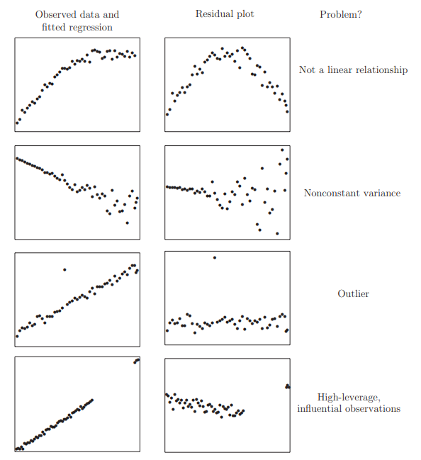

```{r setup, include=FALSE, echo = FALSE,message = FALSE, error = FALSE, warning = FALSE}
knitr::opts_chunk$set(echo = TRUE)

# <!-- ---------------------------------------------------------------------- -->
# <!--                    1. load the required packages                       -->
# <!-- ---------------------------------------------------------------------- --> 

## if(!require(psych)){install.packages("psych")}

# devtools::install_github("rvlenth/lsmeans", dependencies = TRUE)

packages<-c("tidyverse", "knitr")
ipak <- function(pkg){
  new.pkg <- pkg[!(pkg %in% installed.packages()[, "Package"])]
  if (length(new.pkg)) 
    install.packages(new.pkg, dependencies = TRUE)
  sapply(pkg, require, character.only = TRUE)
}
ipak(packages)
# <!-- ---------------------------------------------------------------------- --> 


# <!-- ---------------------------------------------------------------------- -->
# <!--                        2. Basic system settings                        -->
# <!-- ---------------------------------------------------------------------- -->
setwd(dirname(rstudioapi::getSourceEditorContext()$path))
getwd()
Sys.setlocale("LC_ALL","English")

## convert backslash to forward slash in R
# gsub('"', "", gsub("\\\\", "/", readClipboard()))

### get the path
# rstudioapi::getSourceEditorContext()$path
# dirname(rstudioapi::getSourceEditorContext()$path)

### set working directory
# getwd()
# setwd("c:/Users/zbai/Desktop")
# Sys.setlocale("LC_ALL","English")

### get the R Version
# paste(R.Version()[c("major", "minor")], collapse = ".")

### convert backslash to forward slash 
# scan("clipboard",what="string")
# gsub('"', "", gsub("\\\\", "/", readClipboard()))
# <!-- ---------------------------------------------------------------------- --> 


# <!-- ---------------------------------------------------------------------- -->
# <!--     3. Load the SASmarkdown package if the SAS output is required      -->
# <!-- ---------------------------------------------------------------------- -->
# library(SASmarkdown)
# ### Set SAS output
# ### Reset engine to R
# saspath <- "C:/SASHome/SASFoundation/9.4/sas.exe"
# sasopts <- "-nosplash -linesize 75"
# knitr::opts_chunk$set(engine="sashtml", engine.path=saspath,
#         engine.opts=sasopts, comment=NA)
# 
# # run these commands to convince yourself that
# # within this knitr session the engine changed.
# knitr::opts_chunk$get()$engine
# knitr::opts_chunk$get()$engine.path
# knitr::opts_chunk$get()$engine.opts
# <!-- ---------------------------------------------------------------------- -->


# <!-- ---------------------------------------------------------------------- -->
# <!--                         4. Import the datasets                         -->
# <!-- ---------------------------------------------------------------------- -->
### Import csv data
# pfad <- "~/Desktop/SASUniversityEdition/myfolders/Daten"
# mydata1 <- read.csv(file.path(pfad, "yourcsv_data.csv"), 
#                     sep=";", 
#                     header=TRUE)   

### Import xlsx data
# library(readxl)
# mydata2 <- read_excel("C:/Users/zbai/Documents/GitHub/R-Projects/SAS/Yimeng/results-text.xlsx")

### Import sas data
# library(sas7bdat)
# mydata3 <- read.sas7bdat("~/Desktop/SASUniversityEdition/myfolders/Daten/uis.sas7bdat")

### Import from copyboard
# copdat <- read.delim("clipboard")
# Data_D01 <- copdat

# <!-- ---------------------------------------------------------------------- -->
# <!--                           5. Some Tools                                -->
# <!-- ---------------------------------------------------------------------- -->

## To check out vignettes for one specific package
# browseVignettes("ggplot2")


# <!-- ---------------------------------------------------------------------- -->
```

 

```{r,echo = F,message = FALSE, error = FALSE, warning = FALSE}
library('mindr')
# input <- rstudioapi::getSourceEditorContext()$path
# mm(from = input, type = 'file', widget_name = '04_ggplot2.html', root = "")

input <- rstudioapi::getSourceEditorContext()$path 
## file.show(input) # Open the input file with the default program, if any
input_txt <- readLines(input, encoding = "UTF-8")
## Convert to mind map text, markdown outline, R script, and HTML widget ####
mm_output <- mm(input_txt, 
                output_type = c("widget"),
                root = "")
mm_output$widget
```

## Correlation

The correlation measures the strength of a linear relationship. 

### Pearson correlation coefficient 

用于量度两个变量X和Y之间的线性相关。它具有+1和-1之间的值，其中1是总正线性相关性，0是非线性相关性，并且-1是总负线性相关性。 Pearson相关系数的一个关键数学特性是它在两个变量的位置和尺度的单独变化下是不变的。也就是说，我们可以将X变换为a+bX并将Y变换为c+dY，而不改变相关系数,其中a，b，c和d是常数，b，d >0。 请注意，更一般的线性变换确实会改变相关性。

$${\displaystyle \rho _{X,Y}=\operatorname {corr} (X,Y)={\operatorname {cov} (X,Y) \over \sigma _{X}\sigma _{Y}}={\operatorname {E} [(X-\mu _{X})(Y-\mu _{Y})] \over \sigma _{X}\sigma _{Y}}}$$

$${\displaystyle \rho _{X,Y}={\operatorname {E} (XY)-\operatorname {E} (X)\operatorname {E} (Y) \over {\sqrt {\operatorname {E} (X^{2})-\operatorname {E} (X)^{2}}}\cdot {\sqrt {\operatorname {E} (Y^{2})-\operatorname {E} (Y)^{2}}}}}$$


积差相关系数的适用条件： 在相关分析中首先要考虑的问题就是两个变量是否可能存在相关关系，如果得到了肯定的结论，那才有必要进行下一步定量的分析。另外还必须注意以下几个问题 (前两者的要求最严，第三条比较宽松，违反时系数的结果也是比较稳健的)：

1. 积差相关系数适用于线性相关的情形，对于曲线相关等更为复杂的情形，积差相关系数的大小并不能代表相关性的强弱
2. 样本中存在的极端值对Pearson积差相关系数的影响极大，因此要慎重考虑和处理，必要时可以对其进行剔出，或者加以变量变换，以避免因为一两个数值导致出现错误的结论。 
3. Parson积差相关系数要求相应的变量呈双变量正态分布，注意双变量正态分布并非简单的要求x变量和y变量各自服从正态分布，而是要求服从一个联合的双变量正态分布。
4. Pearson相关系数是在原始数据的方差和协方差基础上计算得到，所以对离群值比较敏感，它度量的是线性相关。因此，即使pearson相关系数为0，也只能说明变量之间不存在线性相关，但仍有可能存在曲线相关。


### Spearman's rank correlation coefficient 

Spearman相关系数和kendall相关系数都是建立在秩和观测值的相对大小的基础上得到，是一种更为一般性的非参数方法，对离群值的敏感度较低，因而也更具有耐受性，度量的主要是变量之间的联系。

Spearman's rank correlation利用两变量的秩次大小作线性相关分析，对原始变量的分布不做要求，属于非参数统计方法。 因此它的适用范围比Pearson相关系数要广的多。即使原始数据是等级资料也可以计算Spearman相关系数。对于服从Pearson相关系数的数据也可以计算Spearman相关系数，但统计效能比Pearson相关系数要低一些（不容易检测出两者事实上存在的相关关系）。

如果数据中没有重复值， 并且当两个变量完全单调相关时，斯皮尔曼相关系数则为+1或−1。Spearman相关系数即使出现异常值，由于异常值的秩次通常不会有明显的变化（比如过大或者过小，那要么排第一，要么排最后），所以对Spearman相关性系数的影响也非常小。

$${\displaystyle r_{s}=\rho _{\operatorname {rg} _{X},\operatorname {rg} _{Y}}={\frac {\operatorname {cov} (\operatorname {rg} _{X},\operatorname {rg} _{Y})}{\sigma _{\operatorname {rg} _{X}}\sigma _{\operatorname {rg} _{Y}}}}}$$


### Kendall rank correlation coefficient

Kendall秩相关系数: 是一种秩相关系数，用于反映分类变量相关性的指标，适用于两个变量均为有序分类的情况.
用希腊字母$\tau$表示其值.Kendall相关系数的取值范围在-1到1之间，当$\tau$为1时，表示两个随机变量拥有一致
的等级相关性；当$\tau$为-1时，表示两个随机变量拥有完全相反的等级相关性；当$\tau$为0时，表示两个随机变量
是相互独立的。

计算公式：Kendall系数是基于协同的思想。对于X,Y的两对观察值$Xi$,$Yi$和$X_j$,$Y_j$,如果$X_j>Y_j$,则称这
两对观察值是和谐的,否则就是不和谐。(和谐的观察值对减去不和谐的观察值对的数量,除以总的观察值对数.), kendall相关系数的计算公式如下:

$${\displaystyle \tau ={\frac {({\text{number of concordant pairs}})-({\text{number of discordant pairs}})}{n \choose 2}}}$$

${\displaystyle {n \choose 2}={n(n-1) \over 2}}$ is the binomial coefficient for the number of ways to 
choose two items from n items.


### Intraclass correlation

当对组织成组的单元进行定量测量时，可以使用该描述性统计。 它描述了同一组中的单元彼此相似的程度。 尽管它被视为一种相关类型，但与大多数其他相关度量不同的是，它对以组为结构的数据进行操作，而不是对以
成对观测值进行结构化的数据。组内相关系数(Intraclass correlation coefficient,ICC) 常用于评价具有某种确定亲属关系的个体间某定量属性的相似程度，另一方面主要应用于评价不同测定方法或
评定者对同一定量测量结果的一致性或可靠性。
 
就其代数形式而言，费舍尔最初的ICC是最类似于Pearson相关系数的ICC。两种统计数据之间的主要区别在于，
在ICC中，数据使用合并的平均值和标准偏差进行居中和缩放。
对于ICC来说，这种合并缩放是有意义的，因为所有测量的数量都是相同的（尽管在不同组中的单位上）。

$${\displaystyle r={\frac {1}{Ns^{2}}}\sum _{n=1}^{N}(x_{n,1}-{\bar {x}})(x_{n,2}-{\bar {x}}),}$$
$${\displaystyle {\bar {x}}={\frac {1}{2N}}\sum _{n=1}^{N}(x_{n,1}+x_{n,2}),}$$
$${\displaystyle s^{2}={\frac {1}{2N}}\left\{\sum _{n=1}^{N}(x_{n,1}-{\bar {x}})^{2}+\sum _{n=1}^{N}(x_{n,2}-{\bar {x}})^{2}\right\}.}$$
在Pearson相关中，每个变量均通过其自身的平均值和标准偏差来居中和缩放。
$$r_{x y}=\frac{\sum_{i=1}^{n}\left(x_{i}-\bar{x}\right)\left(y_{i}-\bar{y}\right)}{\sqrt{\sum_{i=1}^{n}\left(x_{i}-\bar{x}\right)^{2}} \sqrt{\sum_{i=1}^{n}\left(y_{i}-\bar{y}\right)^{2}}}$$


### Visualize the correlation in R

```{r Corrplot,echo = T,message = FALSE, error = FALSE, warning = FALSE}
bank<- data.frame(
  y=c(1018.4,1258.9,1359.4,1545.6,1761.6,1960.8),
  x1=c(159,42,95,102,104,108),
  x2=c(223.1,269.4,297.1,330.1,337.9,400.5),
  x3=c(500,370,430,390,330,310),
  x4=c(112.3,146.4,119.9,117.8,122.3,167.0),
  w=c(5,6,8,3,6,8)
)
cor(bank[,c(2,3,4,5)],method = "pearson")

## Visualize the correlation matrix
library(corrplot)
bank.cor <- cor(bank)
corrplot(bank.cor, method = "ellipse")


## devtools::install_github("kassambara/ggcorrplot")
library(ggplot2)
library(ggcorrplot)

## Correlation matrix
data(mtcars)
corr <- round(cor(mtcars), 1)

## Plot
ggcorrplot(corr, hc.order = TRUE, 
           type = "lower", 
           lab = TRUE, 
           lab_size = 3, 
           method="circle", 
           colors = c("tomato2", "white", "springgreen3"), 
           title="Correlogram of mtcars", 
           ggtheme=theme_bw)
```


## Ordinary least squares (OLS) 

### Assumpions

$${\displaystyle \mathbf {y} =\mathbf {X} {\boldsymbol {\beta }}+{\boldsymbol {\varepsilon }}\;}  \ \ \ \ {\displaystyle \;{\boldsymbol {\varepsilon }}\sim {\mathcal {N}}(\mathbf {0} ,\sigma ^{2}\mathbf {I} _{T})}.$$

1. $y_{i}=\alpha+\beta x_{i}+\varepsilon_{i}$
2. $\mathrm{E}\left(\varepsilon_{i}\right)=0$
3. $\operatorname{var}\left(\varepsilon_{i}\right)=\sigma^{2}$
4. $\operatorname{cov}\left(\varepsilon_{i}, \varepsilon_{j}\right)=0$
5. $\varepsilon_{i} \sim$ Normal Distribution

### Interpretation

* Linearity: The relationship between the predictor variable and the response variable is linear. If the linear relationship cannot be clearly presented, **data conversion** (logarithmic conversion, polynomial conversion, exponential conversion, etc.) can be performed on the variable X or Y
* Residuals are uncorrelated
* Homoscedasticity: The errors are normally distributed and have the same variance. This means that for different input values, the variance of the error is a fixed value. If this hypothesis is violated, the parameter estimation may be biased, leading to the statistical test result of significance is too high or too low, and thus get wrong conclusions. This situation is called heteroscedasticity.
    * 同方差性:误差是正态分布的，并具有相同的方差。这意味着对于不同的输入值，误差 的方差是个固定值。如果违背了这个假设，参数估计就有可能产生偏差，导致对显著性 的统计检验结果过高或者过低，从而得到错误的结论。这种情况就称为异方差性。 
* on-collinearity: There is no linear relationship between the two predictors, that is, there should be no correlation between the features. Similarly, collinearity can also cause estimation bias.
* Outliers: outliers will seriously affect parameter estimation. Ideally, outliers must be removed before using linear regression to fit the model.


### Matrix Solution

Least squares method minimum $J\left(\theta_{0}, \theta_{1}\right)$ and find out the smallest $\theta_{0}$ and $\theta_{1}$

$$J(\theta_0, \theta_1) = \sum\limits_{i=1}^{m}(y^{(i)} - h_\theta(x^{(i)})^2 = \sum\limits_{i=1}^{m}(y^{(i)} -  \theta_0 - \theta_1 x^{(i)})^2$$

Assume $$h_\theta(x_1, x_2, ...x_n) = \theta_0 + \theta_{1}x_1 + ... + \theta_{n}x_{n}$$ as $$h_\mathbf{\theta}(\mathbf{x}) = \mathbf{X\theta}$$

$$J(\mathbf\theta) = \frac{1}{2}(\mathbf{X\theta} - \mathbf{Y})^T(\mathbf{X\theta} - \mathbf{Y})$$

Take the derivative of the θ vector for this loss function to 0

$$\frac{\partial}{\partial\mathbf\theta}J(\mathbf\theta) = \mathbf{X}^T(\mathbf{X\theta} - \mathbf{Y}) = 0$$
$$\mathbf{X^{T}X\theta} = \mathbf{X^{T}Y}$$
$$\mathbf{\theta} = (\mathbf{X^{T}X})^{-1}\mathbf{X^{T}Y}$$


### Gauss-Markov Theorem

高斯马尔科夫定理（Gauss-Markov Theorem）证明了最小二乘法线性有特别好的性质，具体来说，当误差项均值为 0 时，OLS 得到的无偏$\hat \beta$（unbiased），如果各误差项方差相同，OLS 得到的是最佳无偏线性估计（BLUE, best linear unbiased estimator）。如果线性回归模型中的误差不相关，则普通最小二乘（OLS）估计量在线性无偏估计量类别中的抽样方差最低. $\hat \beta$是一个合理的估计量，但也有其他选择。 但是，使用最小二乘有三个良好的理由：

1. It results from an orthogonal projection onto the model space. It makes sense geometrically.
2. If the errors are independent and identically normally distributed, it is the maximum likelihood estimator. Loosely put, the maximum likelihood estimate is the value of $\hat \beta$ that maximizes the probability of the data that was observed. (如果误差是独立的并且正态分布相同，则它是最大似然估计量。 松散地说，最大似然估计值为 这样可以最大程度地提高观察到数据的可能性。)
3. The Gauss-Markov theorem states that is the best linear unbiased estimate (BLUE).


### limitation

1. 首先, 最小二乘法需要计算 $\left(\mathbf{X}^{\mathrm{T}} \mathbf{X}\right)$ 的逆矩阵, 有可能它的逆 矩阵 $\left(\mathbf{X}^{\mathrm{T}} \mathbf{X}\right)^{-1}$ 不存在, 这样就没有办法直接用最小二王法 了，此时梯度下降法仍然可以使用。当然，我们可以通过对样 本数据进行整理, 去掉几余特征。让 $\left(\mathbf{X}^{\mathrm{T}} \mathbf{X}\right)$ 的行列式不为 0, 然后继续使用最小二乘法。
2. 第二，当样本特征n非常的大的时候, 计算 $\left(\mathbf{X}^{\mathrm{T}} \mathbf{X}\right)$ 的逆矩阵 是一个非常耗时的工作 (nxn的矩阵求逆)， 甚至不可行。此时 以梯度下降为代表的迭代法仍然可以使用。那这个n到底多大就 不适合最小二乘法呢? 如果你没有很多的分布式大数据计算资 源, 建议超过10000个特征就用迭代法吧。或者通过主成分分 析降低特征的维度后再用最小二乘法。
3. 第三，如果拟合函数不是线性的，这时无法使用最小二乘法,需要通过一些技巧转化为线性才能使用，此时梯度下降仍然可以用。
4. 第四, 特死情况。当样本量m很少，小于特征数n的时候，这时 拟合方程是欠定的，常用的优化方法都无法去拟合数据。当样 本量m等于特征数n的时候, 用方程组求解就可以了。当m大于 n时，拟合方程是超定的, 也就是我们常用与最小二乘法的场景。


## Model Statistics

### Residuals Standard Error

```
## Build Model
y <- c(8.04,6.95,7.58,8.81,8.33,9.96,7.24,4.26,10.84,4.82,5.68)
x1 <- c(10,8,13,9,11,14,6,4,12,7,5)
set.seed(15)
x2 <- sqrt(y)+rnorm(length(y))
model <- lm(y~x1+x2)

## Residual Standard error (Like Standard Deviation)
k <- length(model$coefficients)-1  # Subtract one to ignore intercept
SSE <- sum(model$residuals**2)
n <- length(model$residuals)
Residual_Standard_Error <- sqrt(SSE/(n-(1+k)))
```

### R-Squared and Adjusted R-Squared

**R-Squared Calculation**

R^2^ is a statistic that will give some information about the goodness of fit of a model. In regression, the R^2^ coefficient of determination is a statistical measure of how well the regression predictions approximate the real data points. An R^2^ of 1 indicates that the regression predictions perfectly fit the data.

The total sum of squares
$${\displaystyle SS_{\text{tot}}=\sum _{i}(y_{i}-{\bar {y}})^{2}}$$
The sum of squares of residuals
$${\displaystyle SS_{\text{res}}=\sum _{i}(y_{i}-f_{i})^{2}=\sum _{i}e_{i}^{2}\,}$$
$${\displaystyle R^{2}=1-{SS_{\rm {res}} \over SS_{\rm {tot}}}\,}$$

```
## Build Model
y <- c(8.04,6.95,7.58,8.81,8.33,9.96,7.24,4.26,10.84,4.82,5.68)
x1 <- c(10,8,13,9,11,14,6,4,12,7,5)
set.seed(15)
x2 <- sqrt(y)+rnorm(length(y))
model <- lm(y~x1+x2)

## Multiple R-Squared
SSyy <- sum((y-mean(y))**2)
SSE <- sum(model$residuals**2)

(SSyy-SSE)/SSyy
 
# Alternatively
1-SSE/SSyy
```

**Adjusted R-Squared**

Adjusted R-Squared normalizes Multiple R-Squared by taking into account how many samples you have and how many variables you’re using. 

$${\displaystyle {\bar {R}}^{2}=1-(1-R^{2}){n-1 \over n-p-1}}$$
```
## Adjusted R-Squared
n <- length(y)
k <- length(model$coefficients)-1  # Subtract one to ignore intercept
SSE <- sum(model$residuals**2)
SSyy <- sum((y-mean(y))**2)
1-(SSE/SSyy)*(n-1)/(n-(k+1))
```

### T Statistic  

Null Hypothesis is that the coefficients associated with the variables is equal to zero. The alternate hypothesis is that the coefficients are not equal to zero (i.e. there exists a relationship between the independent variable in question and the dependent variable).

We can interpret the t-value something like this. A larger t-value indicates that it is less likely that the coefficient is not equal to zero purely by chance. So, higher the t-value, the better.

Pr(>|t|) or p-value is the probability that you get a t-value as high or higher than the observed value when the Null Hypothesis (the β coefficient is equal to zero or that there is no relationship) is true. So if the Pr(>|t|) is low, the coefficients are significant (significantly different from zero). If the Pr(>|t|) is high, the coefficients are not significant.

$$t−Statistic = {β−coefficient \over Std.Error}$$

### F Statistic

$\mathrm{H}_{0}: \beta_{1}=\ldots \beta_{\mathrm{p}-1}=0$

$$Std. Error = \sqrt{MSE} = \sqrt{\frac{SSE}{n-q}}$$
$$MSR=\frac{\sum_{i}^{n}\left( \hat{y_{i} - \bar{y}}\right)}{q-1} = \frac{SST - SSE}{q - 1}$$
$$F-statistic = \frac{MSR}{MSE}$$
```
linearMod <- lm(dist ~ speed, data=cars)
modelSummary <- summary(linearMod)  # capture model summary as an object
modelCoeffs <- modelSummary$coefficients  # model coefficients
beta.estimate <- modelCoeffs["speed", "Estimate"]  # get beta estimate for speed
std.error <- modelCoeffs["speed", "Std. Error"]  # get std.error for speed

t_value <- beta.estimate/std.error  # calc t statistic

p_value <- 2*pt(-abs(t_value), df=nrow(cars)-ncol(cars))  # calc p Value

f_statistic <- modelSummary$fstatistic[1]  # fstatistic

f <- summary(linearMod)$fstatistic  # parameters for model p-value calc
model_p <- pf(f[1], f[2], f[3], lower=FALSE)


## For Calculation
data(savings)
g < - 1m (sr ˜ pop15 + pop75 + dpi + ddpi, savings)
summary (g)

## Test Beta1 = Beta2 = Beta3 = Beta4 = 0
(tss < - sum((savings$sr-mean (savings$sr))^2))
(rss < - deviance(g))
(fstat < - ((tss-rss)/4)/(rss/df.residual(g)))
## F Test
1-pf (fstat, 4, df.residual (g)) 
```

**Model Comparasion**

```
g2 < - 1m (sr ˜ pop75 + dpi + ddpi, savings)

## d compute the RSS and the F-statistic:
(rss2 < - deviance (g2))
(fstat < - (deviance (g2)-deviance (g))/(deviance (g)/df.residual(g)))
## P value
1-pf (fstat, l, df.residual(g))

## relate this to the t-based test and p-value by:
sqrt (fstat) 
(tstat < - summary(g)$coef[2, 3])
2 * (l-pt (sqrt (fstat), 45))

## more convenient way to compare two nested models is:
anova (g2, g)

## Analysis of Variance Table
## Model 1: sr ˜ pop75 + dpi + ddpi
## Model 2: sr ˜ pop15 + pop75 + dpi + ddpi
```


### Confidence Intervals 

**Confidence Intervals for $\beta$**

$$\hat{\beta}_{i} \pm t_{n-p}^{(\alpha / 2)} \hat{\sigma} \sqrt{\left(X^{T} X\right)_{i i}^{-1}}$$

Alternatively, a $100(1-\alpha) \%$ confidence region for $\beta$ satisfies:

$$(\hat{\beta}-\beta)^{T} X^{T} X(\hat{\beta}-\beta) \leq p \hat{\sigma}^{2} F_{p, n-p}^{(\alpha)}$$

**Confidence Intervals for Predictions**

必须区分对未来均值响应的预测和对未来观测值的预测。

1. Suppose a specific house comes on the market with characteristics $x_{0}$. Its selling price will be $x_{0}^{T} \beta+\varepsilon$ since $\mathrm{E} \varepsilon=0$, the predicted price is $x_{0}^{T} \hat{\beta}$ but in assessing the variance of this
prediction, we must include the variance of $\varepsilon .$ (评估此预测的方差时，我们必须包括 $\varepsilon$ 的方差 $_{\circ}$ )
2. Suppose we ask the question - What would a house with characteristics $x_{0}$ sell for on average?" This selling price is $x_{0}^{T} \beta$ and is again predicted by $x_{0}^{T} \hat{\beta}$ but now only the variance in $\hat{\beta}$ needs to be taken into account.(平均售价只需要考虑 $\hat{\beta}$ 的方差)


A 100(1–%) % CI for a single future response is:$$\hat{y}_{0} \pm t_{n-p}^{(\alpha / 2)} \hat{\sigma} \sqrt{1+x_{0}^{T}\left(X^{T} X\right)^{-1} x_{0}}$$


A CI for the mean response for given $x_0$ is $$\hat{y}_{0} \pm t_{n-p}^{(\alpha / 2)} \hat{\sigma} \sqrt{x_{0}^{T}\left(X^{T} X\right)^{-1} x_{0}}$$


### Likelihood-ratio test

likelihood-ratio test assesses the goodness of fit of two competing statistical models based on the ratio of their likelihoods, specifically one found by maximization over the entire parameter space and another found after imposing some constraint. If the constraint (i.e., the null hypothesis) is supported by the observed data, the two likelihoods should not differ by more than sampling error.

Suppose that we have a statistical model with parameter space ${\displaystyle \Theta }$. 

* A null hypothesis is often stated by saying that the parameter ${\displaystyle \theta }$ is in a specified subset ${\displaystyle \Theta _{0}}$ of ${\displaystyle \Theta }$. 
* The alternative hypothesis is thus that ${\displaystyle \theta }$ is in the complement of ${\displaystyle \Theta _{0}}$

$${\displaystyle \lambda _{\text{LR}}=-2\ln \left[{\frac {~\sup _{\theta \in \Theta _{0}}{\mathcal {L}}(\theta )~}{~\sup _{\theta \in \Theta }{\mathcal {L}}(\theta )~}}\right]}$$

Often the likelihood-ratio test statistic is expressed as a difference between the log-likelihoods
$${\displaystyle \lambda _{\text{LR}}=-2\left[~\ell (\theta _{0})-\ell ({\hat {\theta }})~\right]}$$
$${\displaystyle \ell ({\hat {\theta }})\equiv \ln \left[~\sup _{\theta \in \Theta }{\mathcal {L}}(\theta )~\right]~}$$


### Accuracy

**Accuracy**: A simple correlation between the actuals and predicted values can be used as a form of accuracy measure. A higher correlation accuracy implies that the actuals and predicted values have similar directional movement, i.e. when the actuals values increase the predicteds also increase and vice-versa.
$$\text{Min Max Accuracy} = mean \left( \frac{min\left(actuals, predicteds\right)}{max\left(actuals, predicteds \right)} \right)$$
$$\text{Mean Absolute Percentage Error \ (MAPE)} = mean\left( \frac{abs\left(predicteds−actuals\right)}{actuals}\right)$$

```
Step 1: Create the training (development) and test (validation) data samples from original data.
Step 2: Develop the model on the training data and use it to predict the distance on test data
Step 3: Review diagnostic measures.
Step 4: Calculate prediction accuracy and error rates

# Create Training and Test data -
set.seed(100)  # setting seed to reproduce results of random sampling
trainingRowIndex <- sample(1:nrow(cars), 0.8*nrow(cars))  # row indices for training data
trainingData <- cars[trainingRowIndex, ]  # model training data
testData  <- cars[-trainingRowIndex, ]   # test data

# Build the model on training data -
lmMod <- lm(dist ~ speed, data=trainingData)  # build the model
distPred <- predict(lmMod, testData)  # predict distance

# Review diagnostic measures.
summary (lmMod)  # model summary
AIC (lmMod)  # Calculate akaike information criterion

# Calculate prediction accuracy and error rates
actuals_preds <- data.frame(cbind(actuals=testData$dist, predicteds=distPred))  # make actuals_predicteds dataframe.
correlation_accuracy <- cor(actuals_preds)  
correlation_accuracy

# Now lets calculate the Min Max accuracy and MAPE:
# 计算最小最大精度和MAPE：
min_max_accuracy <- mean(apply(actuals_preds, 1, min) / apply(actuals_preds, 1, max))  
min_max_accuracy

# Mean Absolute Percentage Error 
mape <- mean(abs((actuals_preds$predicteds - actuals_preds$actuals))/actuals_preds$actuals)  
mape
```


## Model Diagnostics

The estimation and inference of the regression model depend on several assumptions. These assumptions need to be checked using regression diagnostics. We divide potential problems into three categories:

1. Error We have assumed that $\varepsilon \sim \mathrm{N}\left(0, \sigma^{2} I\right)$ or in words, that the errors are independent, have equal variance and are normally distributed.
2. Model We have assumed that the structural part of the model $E y=X \beta$ is correct.
3. Unusual observations Sometimes just a few observations do
not fit the model. These few observations might change the
choice and fit of the model.

### Checking Error Assumptions

**1. Constant Variance (Residuals vs. fitted plots)**

There are two approaches to dealing with nonconstant variance. Use of **weighted least squares** is appropriate when the form of the **nonconstant variance** is either known exactly or there is some known parametric form. Alternatively, one can transform the variables.


**Assumptions Checks using Residual Plots**


In order for the model to accurately explain the data and for your p-value to represent a meaningful test of the null hypothesis, we need to make some assumptions about the data. Many diagnostics about the regression model can be derived using plots of the residuals of the fitted model. The residuals can easily be obtained and examined, but the crucial concept is that these are sampled from a larger, unobservable population

> 为了使模型准确地解释数据并让您的p值代表对原假设的有意义的检验，我们需要对数据进行一些假设。 可以使用拟合模型的残差图得出有关回归模型的许多诊断信息。 残差可以很容易地获得和检查，但是关键的概念是，这些残差是从一个较大的，不可观察的人群中取样的

**The model assumptions are expressed in terms of the error distribution.**

1. Errors are independent
2. Errors have constant variance
3. Errors have mean zero
4. Errors follow a normal distribution

```{r Residums Plot, echo=FALSE, fig.align="center", out.width = '100%',fig.cap="Figure: Residums Plots"}

```


Hier some plots can be used:

* Scatter plot: 可视化预测变量和响应之间的线性关系
* Box plot: 在变量中发现任何异常值。在预测变量中包含异常值会极大地影响预测，因为它们很容易影响最佳拟合线的方向/斜率。
* Density plot: 查看预测变量的分布。理想情况下，接近正态分布（钟形曲线）且不偏向左侧或右侧是首选。
* Bubble plot: 气泡图是散点图的变体，其中 数据点 替换为气泡，数据的其他维度以气泡大小表示。 与散点图一样，气泡图不使用分类轴 - 水平坐标轴和垂直坐标轴都是数值轴。 除了绘制在散点图中的 x 值和 y 值之外，气泡图还绘制 x 值、y 值和 z (大小) 值。

**Scatter plots**

Scatter plots can help visualize any linear relationships between the dependent (response) variable and independent (predictor) variables. Ideally, if you are having multiple predictor variables, a scatter plot is drawn for each one of them against the response, along with the line of best as seen below. [Residuals](https://drsimonj.svbtle.com/visualising-residuals)

```
scatter.smooth(x=cars$speed, y=cars$dist, main="Dist ~ Speed")
```

**Box Plot**

Check for outliers. Generally, any data point outside the 1.5 quartile range (1.5 IQR) is considered an outlier, where IQR is calculated as the 25th percentile and 75th percentile of the variable the distance between.

```
par(mfrow=c(1, 2))  # divide graph area in 2 columns
boxplot(cars$speed, main="Speed", sub=paste("Outlier rows: ", boxplot.stats(cars$speed)$out))  # box plot for 'speed'
boxplot(cars$dist, main="Distance", sub=paste("Outlier rows: ", boxplot.stats(cars$dist)$out))  # box plot for 'distance'
```


**Density plot**


Check if the response variable is close to normality

```
library(e1071)
par(mfrow=c(1, 2))  # divide graph area in 2 columns
plot(density(cars$speed), main="Density Plot: Speed", ylab="Frequency", sub=paste("Skewness:", round(e1071::skewness(cars$speed), 2)))  # density plot for 'speed'
polygon(density(cars$speed), col="red")
plot(density(cars$dist), main="Density Plot: Distance", ylab="Frequency", sub=paste("Skewness:", round(e1071::skewness(cars$dist), 2)))  # density plot for 'dist'
polygon(density(cars$dist), col="red")
```
 
 
**2. Normality**

The residuals can be assessed for normality using a Q–Q plot

When the errors are not normal, least squares estimates may not be optimal. They will still be best linear unbiased estimates, but other robust estimators may be more effective. Also tests and confidence intervals are not exact. However, only long-tailed distributions cause large inaccuracies. Mild nonnormality can safely be ignored and the larger the sample size the less troublesome the nonnormality. For short-tailed distributions, the consequences of nonnormality are not serious and can reasonably 

<!-- 当误差不正常时，最小二乘估计可能不是最佳的。 它们仍将是最佳的线性无偏估计，但其他稳健的估计量可能更有效。 同样，测试和置信区间也不精确。 但是，只有长尾分布会导致较大的误差。 轻度的非正常现象可以安全地忽略，样本量越大，非正常现象的麻烦就越小。对于短尾分布，非正态性的后果并不严重，并且可以合理地进行。 -->

The Shapiro-Wilk test is a formal test for normality, The null hypothesis is that the the residuals are normal.: 

```
shapiro.test (residuals (g))
```

**3. Correlated Errors**

Graphical checks include plots of $\hat{\varepsilon}$ against time and
$\hat{\varepsilon}_{i}$ against $\hat{\varepsilon}_{i-1}$ while the Durbin Watson test uses the statistic (The null distribution based on the assumption of uncorrelated errors follows a linear combination of $\chi^{2}$
distributions.):
$$
D W=\frac{\sum_{i=2}^{n}\left(\hat{\varepsilon}_{i}-\hat{\varepsilon}_{i-1}\right)^{2}}{\sum_{i=1}^{n} \hat{\varepsilon}_{i}^{2}}
$$


### Finding Unusual Observations

**Studentized residuals**

$$r_{i}=\frac{\hat{\varepsilon}_{i}}{\hat{\sigma} \sqrt{1-h_{i}}}$$

如果模型假设正确, 则var $\mathrm{r}_{i}=1$ 
and $\operatorname{corr}\left(r_{i,}, r_{j}\right)$ 倾向于很小。
在残差图中,有时首选学生化残差, 因为它们已经标准化为具有相等的方差。
当误差具有恒定方差时，学生化只能校正残差的自然非恒定方差。 
如果错误中存在一些潜在的异方差，则学生化无法对其进行校正。

**Outlier**

An outlier is a point that does not fit the current model. We need to be aware of such exceptions. An outlier test is useful because it enables us to distinguish between truly unusual observations and residuals that are large, but not exceptional

In linear regression, an outlier is an observation with a large residual. In other words, it is an observation whose dependent-variable value is unusual given its value on the predictor variables. An outlier may indicate a sample peculiarity or may indicate a data entry error or other problem.

$$
\hat{y}_{(i)}=x_{i}^{T} \hat{\beta}_{(i)}
$$
If $\hat{y}_{(i)}-y_{i}$ is large, then case $i$ is an outlier. To judge the size of potential outliers, we need to scale appropriately. we discover:
$$
\text { vâr } \left.\left(y_{i}-\hat{y}_{(i)}\right)=\hat{\sigma}_{(i)}^{2}\left(1+x_{i}^{T}\left(X_{(i)}^{T} X_{(i)}\right)\right)^{-1} x_{i}\right)
$$
Therefore, we take the residuals of the jackknife (or externally learned or cross-validated)
$$
t_{i}=\frac{y_{i}-\hat{y}_{(i)}}{\left.\hat{\sigma}_{(i)}\left(1+x_{i}^{T}\left(X_{(i)}^{T} X_{(i)}\right)\right)^{-1} x_{i}\right)^{1 / 2}}
$$
which are distributed $t n-p-1$ if the model is correct and $\varepsilon \sim \mathrm{N}\left(0, \sigma^{2} I\right)$. Fortunately, there is an easier way to compute $t i$
$$
t_{i}=\frac{\hat{\varepsilon}_{i}}{\hat{\sigma}_{(i)} \sqrt{1-h_{i}}}=r_{i}\left(\frac{n-p-1}{n-p-r_{i}^{2}}\right)^{1 / 2}
$$
避免进行n回归。由于 $t_{i} \sim t_{n-p-1}$, 我们可以计算一个值来测试 情况i是否是异常值。


**Leverage**

An observation with an extreme value on a predictor variable is a point with high leverage. Leverage is a measure of how far an independent variable deviates from its mean. High leverage points can have a great amount of effect on the estimate of regression coefficients. 
$h_{i}=H_{i i}$ are called leverages and are useful diagnostics. Since
var $\hat{\varepsilon}_{i}=\sigma^{2}\left(1-h_{i}\right)$, a large leverage, $h_{i}$, will make var $\hat{\varepsilon}_{i}$
small.

**Influence**

An observation is said to be influential if removing the observation substantially changes the estimate of the regression coefficients. Influence can be thought of as the product of leverage and outlierness.

Consider the change in the fit $X^{T}\left(\hat{\boldsymbol{\beta}}-\hat{\boldsymbol{\beta}}_{(i)}\right)=\hat{y}-\hat{y}_{(i)}$ The
Cook statistics are a popular influence diagnostic because they reduce the information to a single value for each case. They are defined as:
$$
\begin{aligned}
D_{i} &=\frac{\left(\hat{y}-\hat{y}_{(i)}\right)^{T}\left(\hat{y}-\hat{y}_{(i)}\right)}{p \hat{\sigma}^{2}} \\
&=\frac{1}{p} r_{i}^{2} \frac{h_{i}}{1-h_{i}}
\end{aligned}
$$

### Checking the Structure of the Model

We can look at plots of $\hat{\varepsilon}$ against $\hat{y}$ and $x_{i}$ to reveal problems
or just simply look at plots of $y$ against each $x_{i} .$ 

The disadvantage of these graphs is that other predictor variables affect the relationship. Partial regression or increased variable graph can help isolate the effect of $x_{i}$
Look at the response that removes the expected effect of other $X_s$:
**Partial regression (left) and partial residual (right) plots**

$$
y-\sum_{j \neq i} x_{j} \hat{\beta}_{j}=\hat{y}+\hat{\varepsilon}-\sum_{j \neq i} x_{j} \hat{\beta}_{j}=x_{i} \hat{\beta}_{i}+\hat{\varepsilon}
$$


## SAS implementation Proc Reg

### Options

|  Options         |  Descriptation       |
|------------------|-----------------------------------------------------------------------------------|
| STB              | 输出标准化偏回归系数矩阵     |
| CORRB            | 输出参数估计矩阵        |
| COLLINOINT       | 自变量进行共线性分析       |
| P                | 输出个体观测值、预测值及残差        |
| R                | 输出每个个体观测值、残差及标准误差         |
| CLM              | 输出因变量均值95％的置信界限的上下限      |
| CLI              | 对各预测值输出95％的置信界限的上下限     |
| MSE              | 要求输出随机扰动项方差           |
| VIF              | 输出变量间相关性的方差膨胀系数，VIF越大，说明由于共线性存在，使方差变大  |
| TOL              | 表示共线性水平的容许值，TOL越小说明其可用别的自变量解释的部分多，
                            自然可能与别的自变量存在共线性关系； |
| DW               | 输出Durbin-Watson统计量|
| influence        | 对异常点进行诊断，对每一观测点输出统计量(Cook's D > 50％, 
                            defits/debetas > 2说明该点影响较大） |
| Plot Options     |                                              |
| FITPLOT          | 带回归线、置信预测带的散点图       |
| RESIDUALS        | 自变量的残差                       |
| DIAGNOSTICS      | 诊断图（包括下面各图）             |
| COOKSD           | CookIs D统计量图                   |
| OBSERVEDBYPREDICTED     | 根据预测值的因变量图        |
| QQPLOT           | 检验残差正态性的图                 |
| RESIDUALBYPREDICTED     | 根据预测值的残差图          |
| RESIDUALHISTOGRAM       | 残差的直方图                |
| RFPLOT                  | 残差拟合图                  |
| RSTUDENTBYLEVERAGE      | 杠杆比率的学生化残差图      |
| RSTUDENTBYPREDICTED     | 预测值的学生化残差图        |


### Diagnose

**Hat matrix diagonal SAS**

The hat matrix diagonal measure is used to identify unusual values of the explanatory variables. The hat matrix depends only on the explanatory values and not on the dependent y values. The interpretation, then, is that the hat matrix is a measure of leverage among the independent, explanatory variables only. In contrast, a plot of residuals identifies observations that are unusual in terms of their Y values that we wish to explain. The hat matrix diagonal measure is used to identify unusual values of the explanatory variables.

The "U" shape is a shape common to most hat matrix diagrams. We can think that the highest and lowest observed values of the explanatory variables are also the furthest away from the data center and will have the greatest impact. Observations close to the data center should have the least influence.

<!-- 
帽子矩阵仅取决于解释性值，而不取决于相关的y值。 因此，解释是帽子矩阵仅是独立，解释性变量之间杠杆作用的量度。 相比之下，残差图可标识出我们希望解释的，在Y值方面不寻常的观察结果。

“ U”形是大多数帽子矩阵图所共有的形状。我们可以认为，解释变量的最高和
最低观测值也离数据中心最远，并且将产生最大的影响。靠近数据中心的观测
值应具有最小的影响力。
-->


```
proc reg data=cold;
    model maxt = lat long alt / p r influence ;
    output out=inf h=h p=p r=r;
    run;
proc gplot data=inf;
    plot h * p;
run;
```

**Jackknife Diagnostics SAS**

The jackknife measures how much the fitted model changes when one observation is deleted and the model is refitted. If an observation is deleted from the data set, and the new fit is very different from the original model based on the complete data set, the observation is considered to have an impact on the fit

```
proc reg data=cold;
title2 ’Explain max Jan temperature’;
model maxt = lat long alt / p influence partial;
ods output OutputStatistics = diag;
run;
title2 ’Examine diagnostic data set’;
proc print data=diag;
run;
```

**Partial Regression Plots SAS**

One way to solve the problem of the individual contribution of each explanatory variable is to use partial correlation and partial regression plots. These are obtained using the /partial option in proc reg.

```
proc reg data=lowbw;
    model birthwt = headcirc length gestage momage toxemia
    / partial influence p r pcorr1 pcorr2;
    ods output OutputStatistics = diag;
run;
```


## R implementation 


|  Title             | Function                               |
|--------------------|----------------------------------------|
| 预测值             | fitted(bank.lm)                        |
| 求模型系数         | coef(bank.lm)                          |
| 计算残差平方和     | deviance(bank.lm)                      |
| 计算残差           | residuals(bank.lm)                     |
| 方差分析表         | anova(bank.lm)                         |
| Konfidenzintervall | confint(bank.lm, level=0.95)           |
|                    |                                        |
| 异方差检验         |library(car)                            |
|                    |ncvTest(bank.lm)                        |
| 共线性检验：VIF>10 |vif(bank.lm)                            |
| 自相关性检验       |durbinWatsonTest(bank.lm)               |
| 高杠杆点: 大于均值的2~3倍  | hatvalues(bank.lm)             |
| 强影响点           |cooks.distance(bank.lm)                 |
| 离群点、高杠杆点、强影响点 | influence.measures(bank.lm)    |
|                    | influencePlot(bank.lm)                 |


