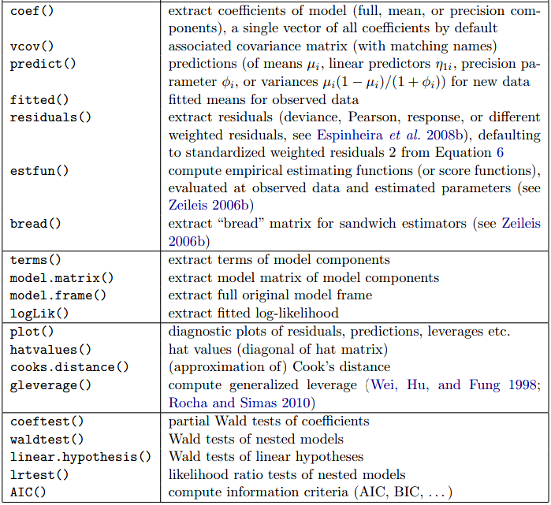

# Proportion Response Regression

```{r,echo = F,message = FALSE, error = FALSE, warning = FALSE}
library('mindr')
input <- rstudioapi::getSourceEditorContext()$path
mm(from = input, type = 'file', widget_name = '16_Proportion Response Regression.html', root = "")
```


Assume that the response variable y takes a continuous value in the interval (0,1), which may or may not include the endpoint. There are 4 different model avaliable

* beta regression, 
* zero-inflated beta regression (if zero is included in the range), 
* one-inflated beta regression (if one is a possible observation), and 
* zero-one-inflated beta regression (where both zero and one may be observed).


## Beta Regression

Beta regression is a technique that has been proposed for modelling of data for which the observations are limited to the open interval (0, 1)

> While proportional data are generated from continuous measurements (eg, percentage of vegetation cover, percentage of animal behavior time, percentage of biomass allocation), there is currently no well-established method. A common solution is to transform the data, mapping the data from 0 to an interval to an entire row of real numbers. After this transformation, the data can be processed using a series of statistical models that incorporate the assumption of normality. The arcsine transformation is usually used more, but the analysis by David Warton and Francis Hui shows that the logit transformation works better.

> As an alternative to logit transformation, using beta and Dirichlet regression, proportional data can be modeled using continuous or categorical variables on their original scale. Beta regression works on a single proportion, while Dirichlet regression works on more than two proportions. If you are familiar with generalized linear models (GLMs), beta and Dirichlet regression models are also well understood. In this type of model, the relationship between the predictors and the parameters of the response distribution is defined by a link function, which ensures that all predicted values are meaningful.

### Model

Assume that the assumed value of y is continuously between 0 and 1 (not including endpoints). The Beta regression model stipulates that y follows a beta distribution with a probability density function


Definitions of the beta distribution usually employ a parameterization using the symbols a and $\beta$ such that the probability density function for a beta-distributed response variable $y$ is given by the following:
$$
f(y \mid \alpha, \beta)=\frac{y^{\alpha-1}(1-y)^{\beta-1}}{B(\alpha, \beta)}
$$
where
$$
B(\alpha, \beta)=\frac{\Gamma(\alpha) \Gamma(\beta)}{\Gamma(\alpha+\beta)}
$$
And $\Gamma(.)$ is the gamma function.
The corresponding expectation and variance of the distribution are given by the following:
$$
\begin{array}{c}
E[y]=\frac{\alpha}{\alpha+\beta} \\
\operatorname{var}[y]=\frac{\alpha \beta}{(\alpha+\beta)^{2}(\alpha+\beta+1)}
\end{array}
$$
When using the beta distribution for modelling data, it is usually more convenient to use an alternative parameterization with $\mu$ and $\phi$


$$
f(y)=\frac{y^{\mu \phi-1}(1-y)^{(1-\mu) \phi-1}}{B(\mu \phi,(1-\mu) \phi)}, \quad 0<y<1,
$$
where the location parameter
$$
\mu=\frac{\exp \left\{\beta_{0}+\beta_{1} x_{1}+\cdots+\beta_{k} x_{k}\right\}}{1+\exp \left\{\beta_{0}+\beta_{1} x_{1}+\cdots+\beta_{k} x_{k}\right\}},
$$
and the dispersion (or scale) parameter $\phi$ is a positive real number. 


Beta regression begins with the assumption that the data-generating process can reasonably be modelled by a beta probability distribution (Balakrishnan & Nevzorov, 2003). The beta distribution is a member of the exponential family (Kieschnick & McCullough, 2003), and is defined by two parameters for values on the open interval (0, 1). Two parameterizations for the beta distribution are available, but the mean-precision parameterization, with $\mu$ 
(for the expected value) and $\phi$ (as a measure of ‘precision’, or the inverse of dispersion), is most commonly used in the context of beta regression

It can be shown that $y$ has mean
$$
\mathbb{E}(y)=\mu
$$
and variance
$$
\operatorname{Var}(y)=\frac{\mu(1-\mu)}{1+\phi}
$$
and is therefore proportional to the variance of the binomial distribution for one trial, $\mu(1-\mu)$, by a factor of $\frac{1}{1+\phi}$

Depending on the choice of values for the two parameters a large range of shapes can be obtained including symmetrical, skewed, uniform, roughly bell-shaped and bimodal. This flexibility, combined with the limitation to values between 0 and 1, make the beta distribution a particularly useful model for continuous proportional data. In addition, fitting a beta distribution gives increasingly less biased estimates of the mean compared to transformation-based approaches when observations get closer to zero and one and/or their variance is large

Beta regression consists of the same three components as generalized linear models (GLMs)

* the random component (the beta distribution and its implied mean–variance relationship), 
* the systematic component (the linear predictor) 
* the link function (specifying the link between the random and systematic component). 

In beta regression, the conditional model for the mean $\mu$ of the response given covariates $X$ is usually assumed to be linear on the logit transformed scale:
$$
\begin{array}{c}
y \sim \operatorname{Beta}(\mu, \phi) \\
\operatorname{logit}(\mu)=\log \left(\frac{\mu}{1-\mu}\right)=\eta=X \beta
\end{array}
$$
where $\eta$ is known as the linear predictor, $\beta$ is a vector of parameters to be estimated and $X$ is the design matrix of covariate values. To obtain estimates from a beta regression fit that are interpretable on the scale of observations $(0,1)$ the values from the linear predictor therefore need to be backtransformed with the inverse logit function:
$$
\operatorname{logit}^{-1}(\eta)=\frac{e^{\eta}}{1+e^{\eta}}
$$
As discussed in the text, $\phi$ can either be estimated as a single value for all observations, on modelled as a function of covariates with design matrix $Z$, corresponding regression parameters $y$, and linear predictor $\zeta$ - in which case a log link is appropriate:
$$
\log (\phi)=\zeta=Z \gamma
$$

### SAS Implementation

In SAS, a beta regression is estimated via the glimmix procedure (which stands for “generalized linear mixed” modeling) from proc glimmix specifying /dist=beta link=logit

```
data libraries;
input nbooks ncardholders location$ propontime @@;
cards;
9.8 0.7 rural 0.39 25.4 7.8 urban 0.81
14.7 1.7 urban 0.71 38.2 9.5 urban 0.85
35.5 5.8 urban 0.74 14.1 2.6 rural 0.47
16.3 2.9 rural 0.72 33.3 7.7 urban 0.83
19.9 3.1 rural 0.69 38.0 4.6 urban 0.76
44.1 8.3 urban 0.85 34.2 5.4 urban 0.86
12.7 2.7 rural 0.53 28.7 3.4 urban 0.78
9.5 1.0 rural 0.55 31.8 8.7 urban 0.78
21.1 6.2 urban 0.82 12.1 2.3 rural 0.42
26.3 0.9 rural 0.88 16.4 8.4 urban 0.88
11.8 1.6 rural 0.45 31.6 8.8 rural 0.64
24.6 4.5 rural 0.81 25.3 1.8 urban 0.73
12.4 1.9 rural 0.38 16.2 7.3 rural 0.66
13.7 6.2 urban 0.84 29.4 6.3 urban 0.72
;

proc glimmix;
  class location(ref='rural');
  model propontime=nbooks ncardholders location\dist=beta link=logit solution;
run;

## Check the Model Fit 
proc glimmix;
model propontime=/dist=beta link=logit;
run;
data deviance_test;
deviance = -30.66-(-53.40);
pvalue=1-probchi(deviance,3);
run;
```

### R Implementation “betareg”

```{r betareg, echo=FALSE, fig.align="center", out.width = '100%',fig.cap=" Functions and methods for objects of class “betareg”"}

```

```{r ,echo = T,message = FALSE, error = FALSE, warning = FALSE}
library(betareg)
data("GasolineYield", package = "betareg")
## fitting beta regression model
summary( gy_logit <- betareg(yield ~ batch + temp, data = GasolineYield, link="logit"))
summary( gy_loglog <- betareg(yield ~ batch + temp, data = GasolineYield, link="loglog"))

suppressWarnings(RNGversion("3.5.0"))
op <- par()
par(mfrow = c(3, 2))
set.seed(123)
plot(gy_logit, which = 1:4, type = "pearson")
plot(gy_logit, which = 5, type = "deviance", sub.caption = "")
plot(gy_logit, which = 1, type = "deviance", sub.caption = "")
op

## models can also be compared by means of a likelihood-ratio test
## this can also be interpreted as testing the null hypothesis of equidispersion against a specific alternative of variable dispersion.
gy_logit2 <- betareg(yield ~ batch + temp | temp, data = GasolineYield)
lmtest::lrtest(gy_logit, gy_logit2)

AIC(gy_logit, gy_logit2, gy_loglog)
```

## Zero-inflated Beta Regression

If the conventional observation of the model scale is zero, then a zero-inflated beta regression can be used. In this model, the response variable y has a mixture of beta distribution and zero mass. In other words, model the distribution function as

$$
f(y)=\left\{\begin{array}{ll}
\pi_{0}, & \text { if } y=0 \\
\left(1-\pi_{0}\right) \frac{y^{\mu \phi-1}(1-y)^{(1-\mu) \phi-1}}{B(\mu \phi,(1-\mu) \phi)}, & \text { if } 0<y<1
\end{array}\right.
$$
where the probability of zero
$$
\pi_{0}=\frac{\exp \left\{\beta_{0}+\beta_{1} x_{1}+\cdots+\beta_{m} x_{m}\right\}}{1+\exp \left\{\beta_{0}+\beta_{1} x_{1}+\cdots+\beta_{m} x_{m}\right\}}
$$
the location parameter
$$
\mu=\frac{\exp \left\{\gamma_{0}+\gamma_{1} x_{m+1}+\cdots+\gamma_{k-m} x_{k}\right\}}{1+\exp \left\{\gamma_{0}+\gamma_{1} x_{m+1}+\cdots+\gamma_{k-m} x_{k}\right\}}
$$
and the dispersion parameter $\phi$ is a positive real number. Being a mixture of beta distribution and a degenerate distribution at zero, this distribution doesn't belong to the exponential family, and thus the model is not a generalized linear model.


## One-inflated Beta Regression

Assuming that the value range of the y variable is (0,1], that is, 1 is a possible observation value, the data can be modeled by an expanded beta regression. The point quality is 1, that is, the distribution function of y is
$$
f(y)=\left\{\begin{array}{ll}
\left(1-\pi_{1}\right) \frac{y^{\mu \Phi-1}(1-y)^{(1-\mu) \phi-1}}{B(\mu \phi,(1-\mu) \phi)}, & \text { if } 0<y<1 \\
\pi_{1}, & \text { if } y=1
\end{array}\right.
$$
Here the probability of one
$$
\pi_{1}=\frac{\exp \left\{\beta_{0}+\beta_{1} x_{1}+\cdots+\beta_{m} x_{m}\right\}}{1+\exp \left\{\beta_{0}+\beta_{1} x_{1}+\cdots+\beta_{m} x_{m}\right\}}
$$
the location parameter
$$
\mu=\frac{\exp \left\{\gamma_{0}+\gamma_{1} x_{m+1}+\cdots+\gamma_{k-m} x_{k}\right\}}{1+\exp \left\{\gamma_{0}+\gamma_{1} x_{m+1}+\cdots+\gamma_{k-m} x_{k}\right\}}
$$


## Zero-one-inflated Beta Regression

$$
f(y)=\left\{\begin{array}{ll}
\pi_{0}, & \text { if } y=0 \\
\left(1-\pi_{0}-\pi_{1}\right) \frac{y^{\mu \phi-1}(1-y)^{(1-\mu) \phi-1}}{B(\mu \phi,(1-\mu) \phi)}, & \text { if } 0<y<1, \\
\pi_{1}, & \text { if } y=1
\end{array}\right.
$$
Here the parameters depend on predictors $x_{1}, \ldots, x_{k}$ via the following relations:
$$
\begin{aligned}
\mu &=\frac{\exp \left\{\beta_{0}+\beta_{1} x_{1}+\cdots+\beta_{m} x_{m}\right\}}{1+\exp \left\{\beta_{0}+\beta_{1} x_{1}+\cdots+\beta_{m} x_{m}\right\}} \\
\pi_{0} &=\frac{\nu}{1+\nu+\tau}, \quad \text { and } \quad \pi_{1}=\frac{\tau}{1+\nu+\tau}
\end{aligned}
$$
Where
$$
\nu=\exp \left\{\gamma_{0}+\gamma_{1} x_{m+1}+\cdots+\gamma_{l-m} x_{l}\right\} \text { and } \tau=\exp \left\{\zeta_{0}+\zeta_{1} x_{l+1}+\cdots+\zeta_{k-l} x_{k}\right\}
$$
and the dispersion parameter $\phi$ is a positive constant.
