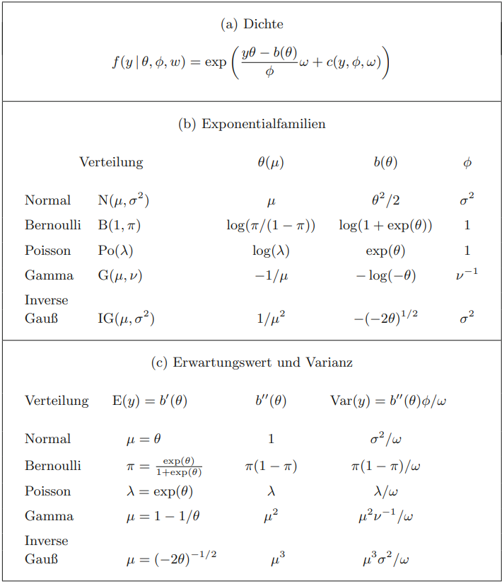

# GLMM and GAM


```{r,echo = F,message = FALSE, error = FALSE, warning = FALSE}
library('mindr')
input <- rstudioapi::getSourceEditorContext()$path
mm(from = input, type = 'file', widget_name = '20_GLMM and GAM.html', root = "")
```


## Genaralised linear model

### Review

Probability distribution for GLM is

$$
f_{Y}(\mathbf{y} \mid \boldsymbol{\theta}, \tau)=h(\mathbf{y}, \tau) \exp \left(\frac{\mathbf{b}(\boldsymbol{\theta})^{\mathrm{T}} \mathbf{T}(\mathbf{y})-A(\boldsymbol{\theta})}{d(\tau)}\right)
$$
Expectation and variance
$$
\begin{aligned}
E(Y) &=\mu=b^{\prime}(\theta) \\
\operatorname{Var}(Y) &=V(\mu) a(\psi)=b^{\prime \prime}(\theta) a(\psi)
\end{aligned}
$$
当假设为某具体指数族分布时， $b(\theta)$ 已知，继而得到 $b^{\prime}(\theta)$, 然后由 $\mu=G(\eta)=b^{\prime}(\theta)$ 解出 $\theta$ 用 $\theta(\mu)$ 表示


There are two assumptions

1. Distribution assumption
$$
\qquad f\left(y{i} \mid \theta{i}\right)=\exp \left(\frac{y{i} \theta{i}-b\left(\theta{i}\right)}{\phi} \omega{i}-c\left(y{i}, \phi, \omega{i}\right)\right)
$$
and for $\mathrm{E}\left(y{i} \mid \boldsymbol{x}{i}\right)=\mu{i}$ and $\operatorname{Var}\left(y{i} \mid \boldsymbol{x}_{i}\right)$ there are
$$
\mathrm{E}\left(y_{i} \mid \boldsymbol{x}_{i}\right)=\mu_{i}=b^{\prime}\left(\theta_{i}\right), \quad \operatorname{Var}\left(y_{i} \mid \boldsymbol{x}_{i}\right)=\sigma_{i}^{2}=\phi b^{\prime \prime}\left(\theta_{i}\right) / \omega_{i}
$$
2. Structural assumption: The (conditional) expected value $\mu i$ is with the linear predictor $\eta i=\boldsymbol{x} i^{\prime} \boldsymbol{\beta }=\beta _{0}+\beta _{1} x_ {i 1}+\ldots+\beta_{k} x_{i k}$ by
$$
\mu_{i}=h\left(\eta_{i}\right)=h\left(\mathbf{x}_{i}^{\prime} \mathbf{\beta}\right) \quad b z w . \quad \eta_{i}=g\left(\mu_{i}\right)
$$
linked, where
- h is a (one-to-one and twice differentiable) response function and
- g is the link function, i.e. the inverse function $g=h^{-1}$ of $h$.

### Exponential Families


```{r , echo=FALSE, fig.align="center", out.width = '100%',fig.cap="Figure:"}

```

### Testing linear Hypotheses

For testing linear hypotheses:
$$
H_{0}: \boldsymbol{C} \boldsymbol{\beta}=\boldsymbol{d} \quad \text { against } \quad H_{1}: \boldsymbol{C} \boldsymbol{\beta } \neq \ boldsymbol{d}
$$
test statistics
1. Likelihood-ratio statistic: $l q=-2 l(\tilde{\mathbf{\beta }})-l(\hat{\mathbf{\beta }})$.
2. Forest statistic: $W=(\boldsymbol{C} \hat{\boldsymbol{\beta}}-\boldsymbol{d})^{\prime}\left[\boldsymbol{C} \boldsymbol{F} ^{-1}(\hat{\boldsymbol{\beta}}) \boldsymbol{C}^{\prime}\right]^{-1}(\boldsymbol{C} \hat{\boldsymbol{\beta } }-\boldsymbol{d})$
3. Score statistics: $u=\mathbf{s}^{\prime}(\tilde{\mathbf{\beta }}) \mathbf{F}^{-1}(\tilde{\mathbf{\beta }} }}) \mathbf{s}(\tilde{\mathbf{\beta}})$.

Here $\tilde{\mathbf{\beta}}$ is the ML estimator under the restriction $H_{0}$. Test decisions For large n under $H_{0}$ approximately:
$$
l q, w, u \stackrel{a}{\sim} \chi_{r}^{2}
$$
where r is the rank of $C \cdot H_{0}$ is rejected if
$$
l q, w, u>\chi_{r}^{2}(1-α)
$$


### Maximum Likelihood Estimation in GLM

The ML estimator $\hat{\beta}$ maximizes the (log) likelihood and is used as the zero
$$
\boldsymbol{s}(\hat{\boldsymbol{\beta }})=\mathbf{0}
$$
for the score function
$$
\boldsymbol{s}(\boldsymbol{\beta})=\sum \boldsymbol{x}_{i} \frac{d_{i}}{\sigma _{i}^{2}}\left(y_{i }-\mu_{i}\right)=\boldsymbol{X}^{\prime} \boldsymbol{D} \boldsymbol{\Sigma }^{-1}(\boldsymbol{y}-\boldsymbol{\mu } )
$$
The Fisher matrix is
$$
\boldsymbol{F}(\boldsymbol{\beta })=\sum \boldsymbol{x}_{i} \boldsymbol{x}_{i}^{\prime} w_{i}=\boldsymbol{X}^ {\prime} \boldsymbol{W} \boldsymbol{X}
$$
with $w{i}=d{i}^{2} / \sigma{i}^{2}$ and the weight matrix $\boldsymbol{W}=\operatorname{diag}\left(w{1}, \ldots, w_{n}\right)$ 

ML-estimator $\hat{\boldsymbol{\beta}}$ is calculated iteratively by Fisher scoring in the form of an iteratively weighted KQ-estimate

$$
\hat{\boldsymbol{\beta}}^{(k+1)}=\left(\boldsymbol{X}^{\prime} \boldsymbol{W}^{(k)} \boldsymbol{X}\right )^{-1} \boldsymbol{X}^{\prime} \boldsymbol{W}^{(k)} \tilde{\boldsymbol{y}}^{(k)}, \quad k=0.1 ,2, \ldots
$$
With the vactor $\tilde{\boldsymbol{y}}^{(k)}=\left(\ldots, \tilde{y}{i}\left(\hat{\boldsymbol{\beta}}^{(k)}\right), \ldots\right)^{\prime}$

$$\tilde{y}{i}\left(\hat{\boldsymbol{\beta}}^{(k)}\right)=\boldsymbol{x}{i}^{\prime} \hat{\boldsymbol{\beta}}^{(k)}+d{i}^{-1}\left(\hat{\boldsymbol{\beta}}^{(k)}\right)\left(y{i}-\hat{\mu}{i}\left(\hat{\boldsymbol{\beta}}^{(k)}\right)\right)$$
and
$$\text{und} \ \ \ \boldsymbol{W}^{(k)}=\boldsymbol{W}\left(\hat{\boldsymbol{\beta}}^{(k)}\right)$$


### IRLS Algorithm for Estimating GLM

When looking at GLMs from a historical context, there are three important data-fitting procedures which are closely connected:

* Newton-Raphson
* Fisher Scoring
* Iteratively Reweighted Least Squares (IRLS) (迭代加权最小二乘)

#### From LS to IRLS

For IRLS:

* Least Squares 
$$
\begin{gathered}
f(\theta)=\frac{1}{2}\|X \theta-Y\|^{2} \\
f(\theta)=\frac{1}{2}\left(\theta^{T} X^{T} X \theta-\theta^{T} X^{T} Y-Y^{T} X \theta+Y^{T} Y\right) \\
\frac{\partial f(\theta))}{\partial \theta}=X^{T} X \theta-X^{T} Y=0 \\
\theta=\left(X^{T} X\right)^{-1} X^{T} Y
\end{gathered}
$$

* Weighted least squares: 加权最小二乘是在普通最小二乘的基础上对每个样本引入权重，调整不同样本误差对损失函数的贡献率. 引入对角矩阵 
$$
W=\left[\begin{array}{cccc}
w_{11} & \ldots & 0 & 0 \\
0 & w_{22} & \ldots & 0 \\
\ldots & \ldots & \ldots & \ldots \\
0 & 0 & \ldots & w_{m m}
\end{array}\right]
$$
损失函数变为: $f(\theta)=\frac{1}{2}\|W(X \theta-Y)\|^{2}$
$$
f(\theta)=\frac{1}{2}\left(W \theta^{T} X^{T} A \theta-W \theta^{T} A^{T} Y-W Y^{T} A \theta+W Y^{T} Y\right)
$$
$$
\frac{\partial f(\theta)}{\partial \theta}=-X^{T} W^{T} W Y+X^{T} W^{T} W X \theta=0
$$
$$
\theta=\left(X^{T} W^{T} W X\right)^{-1} X^{T} W^{T} W Y
$$

* 迭代重加权最小二乘（IRLS）：IRLS用来求解p范数的问题，将p范数问题转化为2范数求解。目标函数: $f(\theta)=\|A X-Y\|_{p}^{p}$ ，这里的 $\|A X-Y\|_{p}$ 是一个 $p$ 范数。计算方式如: $\|X\|_{p}=\sqrt[p]{x_{1}^{p}+x_{2}^{p}+\ldots+x_{m}^{p}}$ 所以 $f(\theta)=\underset{\theta}{a r g} \min \sum_{i=1}^{m}\left(x_{i} \theta-y_{i}\right)^{p}$
$$
f(\theta)=\underset{\theta}{\arg \min } \sum_{i=1}^{m}\left(x_{i} \theta-y_{i}\right)^{p-2}\left(x_{i} \theta-y_{i}\right)^{2}
$$
$$
f(\theta)=\underset{\theta}{\arg \min } \sum_{i=1}^{m} w_{i}^{2}\left(x_{i} \theta-y_{i}\right)^{2}
$$
所以:
$$
w_{i}^{2}=\left|x_{i} \theta-y_{i}\right|^{p-2}
$$
$$
w_{i}=\left|x_{i} \theta-y_{i}\right|^{\frac{p-2}{2}}
$$
写成矩阵形式就是:
$$
f(\theta)=\frac{1}{2}\|W(X \theta-Y)\|^{2}=\frac{1}{2} W^{2}\|X \theta-Y\|^{2}
$$
$$
\theta_{\text {new }}=\left(X^{T} W_{\text {new }}^{T} W_{n e w} X\right)^{-1} X^{T} W_{\text {new }}^{T} W_{n e w} Y
$$
$$
W_{n e w}=\left|X \theta_{\text {old }}-Y\right|^{\frac{p-2}{2}}
$$
 

> IRLS用于查找广义线性模型的最大似然估计，并在robust回归中用于查找估计量，以减轻异常值在正常分布的数据集中的影响。 例如，通过最小化最小绝对误差而不是最小平方误差。随着绝对残差的减少，权重也随之增加，换句话说，具有较大残差的情况往往会被减少加权。
> Burrus C S. Iterative re-weighted least squares[J]. Comm.pure Appl.math, 2009, 44(6):1-9.

Robust regression does not address issues of heterogeneity of variance. This problem can be addressed by using functions in the sandwich package after the lm function.

#### Application

M-estimation with **Huber and bisquare weighting.** These two are very standard. M-estimation defines a weight function such that the estimating equation becomes $\sum_{i=1}^{n} w_{i}\left(y_{i}-x^{\prime} b\right) x_{i}^{\prime}=0$. But the weights depend on the residuals and the residuals on the weights. The equation is solved using Iteratively Reweighted Least Squares (IRLS). For example, the coefficient matrix at iteration $j$ is $B_{j}=\left[X^{\prime} W_{j-1} X\right]^{-1} X^{\prime} W_{j-1} Y$ where the subscripts indicate the matrix at a particular iteration (not rows or columns). The process continues until it converges. In Huber weighting, observations with small residuals get a weight of 1 and the larger the residual, the smaller the weight. This is defined by the weight function
$$
w(e)=\left\{\begin{array}{cc}
1 & \text { for } \quad|e| \leq k \\
\frac{k}{|e|} & \text { for } \quad|e|>k
\end{array}\right.
$$
With bisquare weighting, all cases with a non-zero residual get down-weighted at least a little.


```{r,echo = F,message = FALSE, error = FALSE, warning = FALSE}
### https://stats.oarc.ucla.edu/r/dae/robust-regression/
require(foreign)
require(MASS)
cdata <- read.dta("https://stats.idre.ucla.edu/stat/data/crime.dta")
summary(cdata)

### OLS regression
summary(ols <- lm(crime ~ poverty + single, data = cdata))

### looking at diagnostic plots
opar <- par(mfrow = c(2,2), oma = c(0, 0, 1.1, 0))
plot(ols, las = 1)
par(opar)


# Residual: The difference between the predicted value (based on the regression equation) and the actual, observed value.
#
# Outlier: In linear regression, an outlier is an observation with large residual. In other words, it is an observation whose dependent-variable value is unusual given its value on the predictor variables. An outlier may indicate a sample peculiarity or may indicate a data entry error or other problem.
# 
# Leverage: An observation with an extreme value on a predictor variable is a point with high leverage. Leverage is a measure of how far an independent variable deviates from its mean. High leverage points can have a great amount of effect on the estimate of regression coefficients.
# 
# Influence: An observation is said to be influential if removing the observation substantially changes the estimate of the regression coefficients. Influence can be thought of as the product of leverage and outlierness.
# 
# Cook’s distance (or Cook’s D): A measure that combines the information of leverage and residual of the observation.
#

### display the observations that have relatively large values of Cook’s D
d1 <- cooks.distance(ols)
r <- stdres(ols)
a <- cbind(cdata, d1, r)
a[d1 > 4/51, ]


### command for running robust regression is rlm in the MASS package
summary(rr.huber <- rlm(crime ~ poverty + single, data = cdata))
### Show the weight used
hweights <- data.frame(state = cdata$state, resid = rr.huber$resid, weight = rr.huber$w)
hweights2 <- hweights[order(rr.huber$w), ]
hweights2[1:15, ]


### same rlm model, but using the bisquare weighting function
rr.bisquare <- rlm(crime ~ poverty + single, data=cdata, psi = psi.bisquare)
summary(rr.bisquare)
### Show the weight used
biweights <- data.frame(state = cdata$state, resid = rr.bisquare$resid, weight = rr.bisquare$w)
biweights2 <- biweights[order(rr.bisquare$w), ]
biweights2[1:15, ]
```


## Generalized Linear Mixed Model 

### Backgroud

Generalized linear mixed models (or GLMMs) are an extension of linear mixed models to allow response variables from different distributions, such as binary responses. Alternatively, you could think of GLMMs as an extension of generalized linear models (e.g., logistic regression) to include both fixed and random effects (hence mixed models). The general form of the model (in matrix notation) is:
$$
\mathbf{y}=\boldsymbol{X} \boldsymbol{\beta}+\boldsymbol{Z} \boldsymbol{u}+\varepsilon
$$
Where $\mathbf{y}$ is a $N \times 1$ column vector, the outcome variable; $\mathbf{X}$ is a $N \times p$ matrix of the $p$ predictor variables; $\boldsymbol{\beta}$ is a $\boldsymbol{p} \times 1$ column vector of the fixed-effects regression coefficients (the $\beta$ s); $\mathbf{Z}$ is the $N \times q$ design matrix for the $q$ random effects (the random complement to the fixed $\mathbf{X}$ ); $\boldsymbol{u}$ is a $q \times 1$ vector of the random effects (the random complement to the fixed $\boldsymbol{\beta}$ ); and $\varepsilon$ is a $N \times 1$ column vector of the residuals, that part of $\mathbf{y}$ that is not explained by the model, $\boldsymbol{X} \boldsymbol{\beta}+\boldsymbol{Z} \boldsymbol{u}$. To recap:
  
$$\overbrace{\mathbf{y}}^{\mbox{N x 1}} \quad = \quad
\overbrace{\underbrace{\mathbf{X}}_{\mbox{N x p}} \quad \underbrace{\boldsymbol{\beta}}_{\mbox{p x 1}}}^{\mbox{N x 1}} \quad + \quad
\overbrace{\underbrace{\mathbf{Z}}_{\mbox{N x q}} \quad \underbrace{\boldsymbol{u}}_{\mbox{q x 1}}}^{\mbox{N x 1}} \quad + \quad
\overbrace{\boldsymbol{\varepsilon}}^{\mbox{N x 1}}$$

We nearly always assume that:
$$\boldsymbol{u} \sim \mathcal{N}(\mathbf{0}, \mathbf{G})$$
Which is read: " $\boldsymbol{u}$ is distributed as normal with mean zero and variance $G$ ". Where $\mathbf{G}$ is the variancecovariance matrix of the random effects. Because we directly estimated the fixed effects, including the fixed effect intercept, random effect complements are modeled as deviations from the fixed effect, so they have mean zero. The random effects are just deviations around the value in $\boldsymbol{\beta}$, which is the mean. So what is left to estimate is the variance. Because our example only had a random intercept, $\mathbf{G}$ is just a $1 \times 1$ matrix, the variance of the random intercept. However, it can be larger. For example, suppose that we had a random intercept and a random slope, then
$$
\mathbf{G} =
\begin{bmatrix}
\sigma^{2}_{int} & \sigma^{2}_{int,slope} \\
\sigma^{2}_{int,slope} & \sigma^{2}_{slope}
\end{bmatrix}
$$
simplify the model for example by assuming that the random effects are independent, which would imply the true structure is
$$
\mathbf{G} =
\begin{bmatrix}
\sigma^{2}_{int} & 0 \\
0 & \sigma^{2}_{slope}
\end{bmatrix}
$$
### LMM to GLMM

[Literature](https://stats.oarc.ucla.edu/other/mult-pkg/introduction-to-generalized-linear-mixed-models/)

What is different between LMMs and GLMMs is that the response variables can come from different distributions besides gaussian. In addition, rather than modeling the responses directly, some link function is often applied, such as a log link. 

Let the linear predictor, $\eta$, be the combination of the fixed and random effects excluding the residuals.
$$\boldsymbol{\eta} = \boldsymbol{X\beta} + \boldsymbol{Z\gamma}$$
The generic link function is called $g(\cdot)$. The link function relates the outcome $\mathbf{y}$ to the linear predictor $\eta$. Thus:
$$
\begin{array}{l}
\boldsymbol{\eta} = \boldsymbol{X\beta} + \boldsymbol{Z\gamma} \\
g(\cdot) = \text{link function} \\
h(\cdot) = g^{-1}(\cdot) = \text{inverse link function}
\end{array}
$$
So our model for the conditional expectation of $\mathbf{y}$ (conditional because it is the expected value depending on the level of the predictors) is:
$$
g(E(\mathbf{y}))=\boldsymbol{\eta}
$$
We could also model the expectation of $\mathbf{y}$ :
$$
E(\mathbf{y})=h(\boldsymbol{\eta})=\boldsymbol{\mu}
$$
With $\mathbf{y}$ itself equal to:
$$
\mathbf{y}=h(\boldsymbol{\eta})+\boldsymbol{\varepsilon}
$$

### Link Functions and Families

#### Binary Outcome

We use a logistic link function and the probability density function, or PDF, for the logistic. These are:

$$
\begin{array}{l}
g(\cdot) = log_{e}(\frac{p}{1 – p}) \\
h(\cdot) = \frac{e^{(\cdot)}}{1 + e^{(\cdot)}} \\
PDF = \frac{e^{-\left(\frac{x – \mu}{s}\right)}}{s \left(1 + e^{-\left(\frac{x – \mu}{s}\right)}\right)^{2}} \\
\text{where } s = 1 \text{ which is the most common default (scale fixed at 1)} \\
PDF = \frac{e^{-(x – \mu)}}{\left(1 + e^{-(x – \mu)}\right)^{2}} \\
E(X) = \mu \\
Var(X) = \frac{\pi^{2}}{3} \\
\end{array}
$$

#### Count Outcomes

For a count outcome, we use a log link function and the probability mass function, or PMF, for the poisson.

$$
\begin{array}{l}
g(\cdot) = log_{e}(\cdot) \\
h(\cdot) = e^{(\cdot)} \\
PMF = Pr(X = k) = \frac{\lambda^{k}e^{-\lambda}}{k!} \\
E(X) = \lambda \\
Var(X) = \lambda \\
\end{array}
$$


#### Continuous Outcomes

$$
\begin{array}{l}
g(\cdot) = \cdot \\
h(\cdot) = \cdot \\
g(\cdot) = h(\cdot) \\
g(E(X)) = E(X) = \mu \\
g(Var(X)) = Var(X) = \Sigma^2 \\
PDF(X) = \left( \frac{1}{\Sigma \sqrt{2 \pi}}\right) e^{\frac{-(x – \mu)^{2}}{2 \Sigma^{2}}}
\end{array}
$$

### Parameter estimation

For parameter estimation, because there are not closed form solutions for GLMMs, you must use some approximation. Three are fairly common.
> 由于 GLMM 没有封闭形式的解决方案，因此您必须使用一些近似值


**Quasi-likelihood approaches** use a Taylor series expansion to approximate the likelihood. Thus parameters are estimated to maximize the quasi-likelihood. that is, they are not true maximum likelihood estimates. A Taylor series uses a finite set of differentiations of a function to approximate the function, and power rule integration can be performed with Taylor series. With each additional term used, the approximation error decreases (at the limit, the Taylor series will equal the function), but the complexity of the Taylor polynomial also increases. Early quasi-likelihood methods tended to use a first order expansion, more recently a second order expansion is more common. In general, quasi-likelihood approaches are the fastest (although they can still be quite complex), which makes them useful for exploratory purposes and for large datasets. Because of the bias associated with them, quasi-likelihoods are not preferred for final models or statistical inference.

> 准似然方法使用泰勒级数展开来近似似然。因此，估计参数以最大化准似然。也就是说，它们不是真正的最大似然估计。泰勒级数使用函数的有限微分集来逼近该函数，并且可以使用泰勒级数执行幂规则积分。每使用一个附加项，逼近误差就会减小（在极限处，泰勒级数将等于函数），但泰勒多项式的复杂性也会增加。早期的准似然方法倾向于使用一阶展开，最近二阶展开更为常见。一般来说，准似然方法是最快的（尽管它们仍然可能相当复杂），这使得它们对于探索性目的和大型数据集很有用。由于与它们相关的偏差，准似然不是最终模型或统计推断的首选。

The true likelihood can also be approximated using **numerical integration**. quadrature methods are common, and perhaps most common among these use the Gaussian quadrature rule, frequently with the Gauss-Hermite weighting function. It is also common to incorporate adaptive algorithms that adaptively vary the step size near points with high error. The accuracy increases as the number of integration points increases. Using a single integration point is equivalent to the so-called Laplace approximation. Each additional integration point will increase the number of computations and thus the speed to convergence, although it increases the accuracy. Adaptive Gauss-Hermite quadrature might sound very appealing and is in many ways. However, the number of function evaluations required grows exponentially as the number of dimensions increases. A random intercept is one dimension, adding a random slope would be two. For three level models with random intercepts and slopes, it is easy to create problems that are intractable with Gaussian quadrature. Consequently, it is a useful method when a high degree of accuracy is desired but performs poorly in high dimensional spaces, for large datasets, or if speed is a concern.

> 真实的可能性也可以使用数值积分来近似。求积方法很常见，其中最常见的可能是使用高斯求积法则，通常使用 Gauss-Hermite 加权函数。结合自适应算法也很常见，这些算法自适应地改变具有高误差的点附近的步长。精度随着积分点数量的增加而增加。使用单个积分点相当于所谓的拉普拉斯近似。每个额外的积分点都会增加计算次数，从而提高收敛速度，尽管它会提高准确性。自适应 Gauss-Hermite 正交可能听起来很吸引人，而且在很多方面。然而，随着维度数量的增加，所需的函数评估数量呈指数增长。随机截距是一维，添加随机斜率是二。对于具有随机截距和斜率的三级模型，很容易产生高斯求积难以解决的问题。因此，当需要高精度但在高维空间中表现不佳时，对于大型数据集，或者如果速度是一个问题，这是一种有用的方法。

A final set of methods particularly useful for multidimensional integrals are **Monte Carlo** methods including the famous Metropolis-Hastings algorithm and Gibbs sampling which are types of Markov chain Monte Carlo (MCMC) algorithms. Although Monte Carlo integration can be used in classical statistics, it is more common to see this approach used in Bayesian statistics.

> 最后一组对多维积分特别有用的方法是蒙特卡罗方法，包括著名的 Metropolis-Hastings 算法和吉布斯采样，它们是马尔可夫链蒙特卡罗 (MCMC) 算法的类型。 尽管蒙特卡洛积分可用于经典统计，但在贝叶斯统计中使用这种方法更为常见。

### logistic model with fixed and random effectss
 
A plain ANOVA is inappropriate with a categorical response variable. The model assumptions are violated (variance is heteroscedastic, whereas ANOVA assumes homoscedasticity). This leads to invalid results (spurious null results and significances).

An ANOVA can perform poorly even if transformations of the response are performed. At any rate, there is no reason to use this technique: cheap computing makes use of a transformed ANOVA unnecessary.

> 普通 ANOVA 不适用于分类响应变量。违反了模型假设（方差是异方差的，而 ANOVA 假设同方差）。这会导致无效结果（虚假的空结果和意义）。即使执行了响应的转换，ANOVA 的性能也会很差。无论如何，没有理由使用这种技术：廉价的计算使得使用变换的 ANOVA 变得不必要。

 

```{r,echo = F,message = FALSE, error = FALSE, warning = FALSE}
library(languageR)
data(dative)
summary(dative)

library(tidyverse)
library(ggmosaic)
## For 2 variables using mosaic plot.
## Mosaic plot. Most data instances are animate recipient, inanimate theme, realized as an NP recipient.
## https://cran.r-project.org/web/packages/ggmosaic/vignettes/ggmosaic.html
ggplot(data = dative) +
  geom_mosaic(aes(x = product(RealizationOfRecipient, AnimacyOfTheme), fill = RealizationOfRecipient)) +   
  labs(y="AnimacyOfRec", x="RealizationOfRecipient", title = "Mosaic Plot (2 variables)") 

## For more than 2 variables
## Doing exploratory data analysis of categorical variables is harder than for numeric variables. But it’s certainly useful to look at crosstabs 
spdative.xtabs <- xtabs(~ RealizationOfRecipient + AnimacyOfRec + AnimacyOfTheme,data =dative)
spdative.xtabs
mosaicplot(spdative.xtabs, color=T)
```


 


## Generalized Additive Models

### Concept

In essence, a GAM is a GLM. What distinguishes it from the ones you know is that, unlike a standard GLM, it is composed of a sum of smooth functions of covariates instead of or in addition to the standard linear covariate effects. For the GAM, we can specify it generally as follows:
$$y = f(x) + \epsilon$$
$$y = f(x) + \epsilon = \sum_{j=1}^{d}B_j(x)\gamma_j + \epsilon$$
Above, each  $B_j$ is a basis function that is the transformed $x$ depending on the type of basis considered, and the $y$ are the corresponding regression coefficients. 


```{r mind map,echo = F,message = FALSE, error = FALSE, warning = FALSE}
pisa <-  read.csv('./01_Datasets/pisasci2006.csv')
library(dplyr)
library(mgcv)

### Normal Regression
mod_lm <- gam(Overall ~ Income, data=pisa)
### summary(mod_lm)

### bs = cr，表示三次回归样条
mod_gam1 <- gam(Overall ~ s(Income, bs="cr"), data=pisa)
### 首先看到假设的分布，以及使用的链接函数，在这种情况下，分别是正态和恒等，如果我们没有平滑，将导致 SLiM。之后我们看到输出分为参数和平滑或非参数部分。
summary(mod_gam1)

source('./03_Functions/better_smooth.R')
source('./03_Functions/better_corr.R')

library(ggplot2)
library(GGally)

p = ggpairs(pisa[,-c(1,3:5)], 
        lower=list(continuous=GGally::wrap(better_smooth,  ptalpha=.25, ptcol='#ff5500', ptsize=1,
        linecol='#03b3ff', method='loess', se=F, lwd=.5)),
        diag = list(continuous=GGally::wrap('densityDiag', color='gray50', lwd=.5)),
        # upper=list(continuous=GGally::wrap(better_corr)),
        axisLabels="none") + 
  theme(axis.text.x=element_text(color='gray50')) +
  theme(legend.position = "none", 
        panel.grid.major = element_blank(), 
        axis.ticks = element_blank())
p
```
