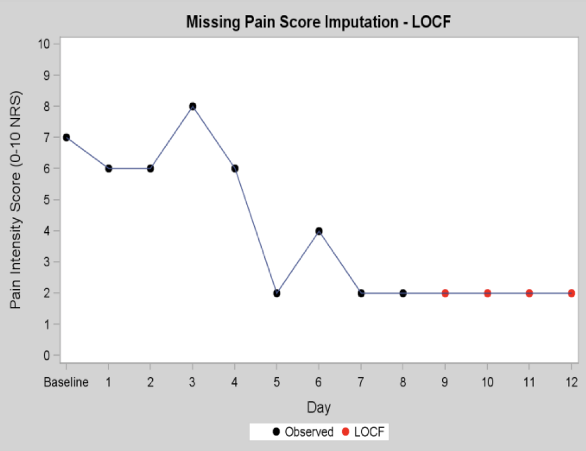
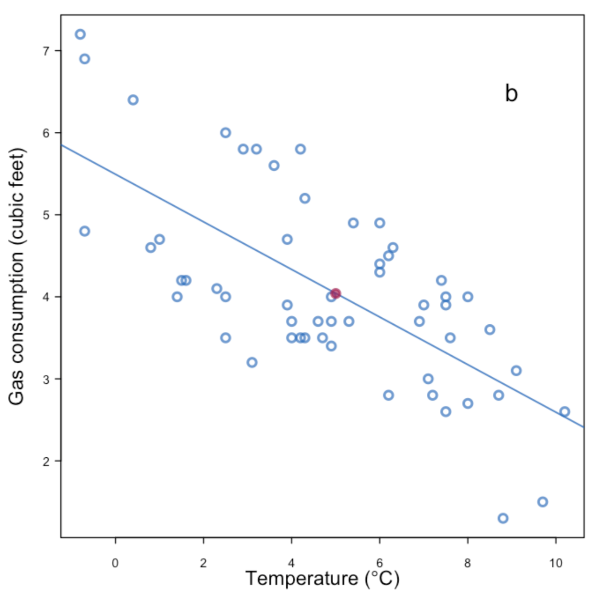

# Missing Data

```{r,echo = F,message = FALSE, error = FALSE, warning = FALSE}
library('mindr')
input <- rstudioapi::getSourceEditorContext()$path
mm(from = input, type = 'file', widget_name = '21_Missing Data.html', root = "")
```

##  Missing mechanisms


Rubin (1976) defined three types of missing mechanisms, which describe the relationship between variables and the missing probability of data:

* Missing completely at random (MCAR) 
* Missing at random (MAR)
* Missing not at random (MNAR)

To better understand the three missing mechanisms, we can define:

* $\mathrm{X} = (X_0, X_1, ..., X_T)$ are observations of independent variables $\mathrm{X}$ (in this thesis, the dependent variable "waist" was fully observed, but the missingness of dependent variables also applies to the following mechanism),
* $\mathrm{X_{\text{obs}}}, \mathrm{X_{\text{miss}}}$ are observed and missing part of $\mathrm{X}$,
* $\mathrm{R} = (R_0, R_1, ..., R_T)$ is a vector of missingness indicators, where $R_t = 1$ if $X_t$ is observed and $R_t = 0$ otherwise, $t=1,...,T$.


Data are considered MCAR when the missing of observation is completely independent of the observed and the missing data, e.g., data missing due to measurement equipment failure. Under MCAR, for all missing patterns $\mathrm{r}$,
$$\mathbb{P} (\mathrm{R} = \mathrm{r} | \mathrm{X}) = \mathbb{P} (\mathrm{R} = \mathrm{r}).$$
The observed and missing data distribution is identical, data missing is completely unsystematic, and the observed (or missing) data are random sub-samples of complete data. Theoretically, estimation ignoring the missing values can provide unbiased results but maybe less precise (loss of power). However, MCAR is a strict assumption and is unlikely to be satisfied in practice, so this study did not assume MCAR.

This study assumed that the data missing were MAR. Compared with MCAR, MAR requires less strict assumptions about missing reasons. Under MAR, there is a connection between the probability of missingness and observed data. E.g., poor health of the patient at the study start may increase the possibility of research discontinuation. Formally, 
$$\mathbb{P} (\mathrm{R} = \mathrm{r} | \mathrm{X}) = \mathbb{P} (\mathrm{R} = \mathrm{r}|\mathrm{X_{\text{obs}}}).$$
Given the observed data, the probability of missing is independent of the missing value, the missing values can be predicted from the observed values. Although imputing predicted values without accounting for the uncertainty may lead to over-optimistic prediction (Roderick et al., 2002), multiple imputation can compensate for this. 

When the data is neither MCAR nor MAR, the probability of missing is systematically related to the missing observations, the data are MNAR, i.e., the probability of data being missing depends not only on observed but also on unobserved values. 
$$\mathbb{P} (\mathrm{R} = \mathrm{r} | \mathrm{X}) \neq \mathbb{P} (\mathrm{R} = \mathrm{r}|\mathrm{X_{\text{obs}}}).$$
E.g., patients with depression often do not provide information about their emotional state. However, the multiple imputation only applicable to MAR and MCAR, when the data contains MNAR, the parameter estimation using multiple imputation may be biased. 


## Compatibility and Congeniality

The concepts of compatibility and congeniality introduced in this section refer to the connection between the imputation model and the analysis model (substantive model), they may be beneficial for unbiased estimation in the substantive model (White et al., 2009; Burgess et al., 2013).

The imputation model and substantive model are considered compatible, if

>1. there exists a joint model (e.g. multivariate normal distribution) for a set of density functions ($f_1, f_2, ..., f_n$), and from the joint model the imputations could be drawn,
>2. the imputation model and the substantive model can be expressed as conditional models of the joint model (Liu et al., 2013).

For example, if a joint bivariate normal model $g(x,y|\theta), \theta \in \Theta$ exists, the imputation model to impute $X$ is $f(x|y,\omega),\omega \in \Omega$, and the substantive model is $f(y|x,\phi),\phi \in \Phi$, with the surjective function $f_1:\Theta \rightarrow \Omega$ and $f_2:\Theta \rightarrow \Phi$. The imputation model is compatible with the substantive models, if the two conditional densities $f(x|y,\omega)$ and $f(y|x,\phi)$ use the given densities from the joint model as its conditional density, which means $f(x|y,\omega) = g(x|y,\theta)$ and $f(y|x,\phi) = g(y|x,\theta)$ (Morris et al., 2015).

Compatibility affects the FCS effectiveness (Fully Conditional Specification is also called MICE, detailed introduction in Section 3.5), and it may benefit unbiased parameter estimation. However, the conditional normality of dependent variables $X$ with homoscedasticity is insufficient to justify the linear imputation model for the predictor variable $y$, when only $y$ has missing observations (Morris et al., 2015). The imputation model and the real substantive model may be incompatible when the linear imputation model is assumed for $y$, as a consequence, the imputation model may be misspecified. Furthermore, the compatibility in MICE is easily broken by the categorical variables, interactions, or non-linear terms in the imputation model, which results in the implicitly joint distribution or even not exist. Although parameter estimation may be biased in the substantive model under incompatibility, incompatibility between the analysis model and the imputation model only slightly impacted the final inferences if the imputation model is well specified (Van Buuren, 2012).

In addition to compatibility, there is another important consideration "Congeniality" in multiple imputation presented by Meng (1994), which appoints the required relationship between the analysis model and the imputation model. Congeniality is, essentially, a special case of compatibility, the joint model is the Bayesian joint model $f$. The analysis model and the imputation congenial is congenial if

>1. for incomplete data, mean estimates using the imputation model are asymptotically equal to the posterior predictive mean using the joint model $f$ given missing data, and the associated variance estimates using the imputation model are asymptotically equal to the posterior predictive variance using the joint model $f$ given missing data; 
>2. for observed data, mean estimates using the analysis model are asymptotically equal to the posterior mean from the joint model $f$, and the associated variance estimates using the analysis model are asymptotically equal to the posterior variance from the joint model $f$ (Burgess et al., 2013). 


<!-- An important consideration for a multiple imputation analysis is the congeniality of the models used in imputation and analysis of data. Imputation and analysis models are compatible if a joint model exists under which both models are conditionals [18]. The concept of congeniality, introduced by Meng [13] in the context of multiple imputation, states that as follows: (i) given complete data, the analysis model asymptotically gives the same mean and variance estimates as the posterior mean and variance from a Bayesian joint model, and (ii) given incomplete data, the imputation model gives the same posterior predictive distribution for missing values as the Bayesian joint model. Congeniality is similar to compatibility in a non-Bayesian context with the regularity condition that the priors in the Bayesian model are nonzero over the entire parameter space. -->


If the interaction terms and non-linear relationships do not exist in the imputation model, and the variables are continuous, each univariate imputation model specified as Bayesian linear regression is congenital to the substantive model. Under these circumstances, imputations for variables with missingness are derived independently from the conditional posterior predictive distribution given other variables, and the multiple imputation variance estimates are consistent (Murray, 2018). However, when categorical variables are also included in the imputation model, the analysis model and the imputation model are not congenial, because the relationship between categorical variables and outcome given other variables cannot be linear or log-linear.

Alternatively, there are two ways to deal with categorical variables. By default, logistic regression is specified as the imputation model in $R$ package $mice$ for binary variables and proportional odds model for ordered categorical variables. Notwithstanding, the imputation model using the logistic regression model or proportional odds model is not congenital to the analysis models. As another option, predictive mean matching (PMM) may be an option for the imputation model. Although PMM is not congenital, the first step of PMM is based on a congenital Bayesian linear model, and the missing data are imputed using the observed donors, which also avoids meaningless imputed values. PMM is a compromise method, because the Bayesian linear regression is actually used first, and then in the next step it adjusts the imputed values from the observed values instead of directly drawing from the linear regression.


## Single imputation

  * Last-observation-carry-forward (LOCF)
  * Baseline-observation-carry-forward (BOCF)
  * Mean imputation
  * Regression imputation
  * Hoc deck imputation

**Last-observation-carry-forward (LOCF)**

```{r LOCF, echo=FALSE, fig.align="center", out.width = '60%',fig.cap="Figure: LOCF"}

```


**Baseline-observation-carry-forward (BOCF)**

```{r BOCF, echo=FALSE, fig.align="center", out.width = '60%',fig.cap="Figure: BOCF"}
knitr::include_graphics("./02_Plots/BOCF.png")
```


**Mean imputation**

```{r Mean-imputation, echo=FALSE, fig.align="center", out.width = '60%',fig.cap="Figure: Mean imputation"}

```


**Regression imputation**

* $\dot y=\hat\beta_0+X_\mathrm{mis}\hat\beta_1$
* where $\hat\beta_0$ and $\hat\beta_1$ are least squares estimates calculated from the observed data.

```{r Regression-imputation, echo=FALSE, fig.align="center", out.width = '60%',fig.cap="Figure: Regression imputation"}

```


**Stochastic regression imputation**

* $\dot y=\hat\beta_0+X_\mathrm{mis}\hat\beta_1+\dot\epsilon$
* where $\dot\epsilon$ is randomly drawn from the normal distribution as $\dot\epsilon \sim N(0,\hat\sigma^2)$.
    
```{r Stochastic-regression-imputation, echo=FALSE, fig.align="center", out.width = '60%',fig.cap="Figure: Stochastic regression imputation"}
knitr::include_graphics("./02_Plots/regression2.png")
```


    
    
**Hoc deck imputation**

* Find an object that is most similar to it in the database, and then impute it with the value of this similar object (different criteria to judge similarity).

```{r Hoc-deck-imputation, echo=FALSE, fig.align="center", out.width = '40%',fig.cap="Figure: Hoc deck imputation"}
knitr::include_graphics("./02_Plots/PMM1.png")
```


## Multiple imputation


Multiple imputation (MI) was proposed by Rubin (1986). MI models the missing values by using the observed data distribution, each missing value is imputed with a set of reasonable values. At length, several complete imputed datasets are generated. Compared with single imputation, the main advantage of multiple imputation is that MI can reflect estimation variability under the same model using more imputed datasets. The following Figure 3 displays the multiple imputation process, and the algorithm is detailed in Table 4.

```{r multiple imputation process, echo=FALSE, fig.align="center", out.width = '100%',fig.cap="Figure: The multiple imputation process by Rubin (1986)"}
knitr::include_graphics("./02_Plots/MICE-process.png")
```
 
```{r imputed datasets, echo=FALSE, fig.align="center", out.width = '100%',fig.cap="Figure: The imputed datasets"}
knitr::include_graphics("./02_Plots/MI.png")
```

| |                       Algorithm: Multiple imputation                                  |
|-|---------------------------------------------------------------------------------------|
|1.|**Imputation**: The missing data are imputed with random values generated from an explicit or implicit imputation model, and a completed dataset is created. This process repeats $m$ times ($m>1$).|
|2.|**Analysis**: These $m$ imputed datasets are analyzed using a statistical method of interest (linear regression and conditional independence test are applied separately in this thesis).|
|3.|**Pooling**: The final step combines the $m$ results from each imputed dataset. Take linear regression as an example, the parameter estimators $\theta_1,...,\theta_i,...,\theta_m$ drawn from the $m$ datasets are averaged: $\bar{\theta} = \frac{1}{m}\left (\sum_{i=1}^m{\theta_i}\right )$. The total variance $V_{\text{total}}$ is calculated by combining the within imputation variance and between imputation variance using Rubin (1987) formula $V_{\text{total}} = V_W + V_B + \frac{V_B}{m}$, where the within imputation variance $V_W$ is defined as $V_W = \frac{1}{m}\left (\sum_{i=1}^m{SE_i^2}\right)$, $SE_i^2$ is the sum of the squared Standard Error which is estimated in the imputed dataset; the between imputation variance $V_B$ is defined as $V_B=\sqrt{\frac{\sum_{i=1}^m (\theta_i - \overline{\theta})^2}{N-1}}.$|
 

 
### Joint Modeling (JM)

Joint Modeling (JM) specifies a multivariate distribution for variables with missing conditional on the observed data (Salfrán Vaquero, 2018),  and imputations are randomly drawn from the conditional multivariate distribution by Markov chain Monte Carlo (Schafer, 1997). The joint multivariate normal distribution (Kropko et al., 2017) is the most commonly used assumption. For instance, the multivariate normal distribution for k-dimensional random vector ${\displaystyle \mathbf {X} =(X_{1},\ldots ,X_{k})^{\mathrm {T} }}$ is denoted as
$${\displaystyle \mathbf {X} \ \sim \ {\mathcal {N}}({\boldsymbol {\mu }},\,{\boldsymbol {\Sigma }}).}$$ 

In the multiple imputation, the imputation model and the analysis model are compatible if the two models are conditionally drawn from a joint multivariate normal distribution. When the sample size is relatively large, even for non-normal data the inferences generated under the multivariate normal model are robust (Schafer, 1997). However, JM lacks flexibility in complex data sets in practical applications. For example, when there are outliers or skews in the data, the normality assumption can not be satisfied (He et al., 2009). Secondly, when there are interactions and nonlinear relationships in the analysis model, the imputation model of incomplete variable conditional on the other variables from the analysis model has no conditional normal distribution, the joint multivariate normal distribution does not exist (Katherine et al., 2010). When the data do not conform to the multivariate normal distribution, the estimation is biased. Although interaction terms or nonlinear terms can be regarded as just another variable (JAV) so that the missing data could be imputed under the joint multivariate normal distribution, only under MCAR and using linear regression as the analysis model could the consistent estimation be obtained, inferences under the MAR were biased (Seaman et al., 2012).

### Multiple Imputation by Fully Conditional Specification (MICE)
 
Multiple imputation by Fully Conditional Specification (FCS) is an iterative procedure, it also called Multiple Imputation by Chained Equations (MICE) (Van Buuren et al., 2006). FCS specifies an imputation model for each incomplete variable given other variables and formulates the posterior parameter distribution for the given model. Finally, imputed values for each variable are iteratively created until the imputation converges. Algorithm 2 (Table 5) introduces the MICE process (taking imputation of the variable "age" using Bayesian linear regression as an example).

 
| |                       Algorithm: MICE (FCS)                                           |
|-|---------------------------------------------------------------------------------------|
|1.|The missing data $Y_{\text{mis}}(\text{age})$ is filled using values randomly drawn from the observed $Y_{\text{obs}}(\text{age})$|
|2.|For $i=1,...,p$ in $Y_{\text{mis}}(\text{isced})$, parameter $\Theta_i^* (\beta_{0i}^*,\beta_{1i}^*,\beta_{2i}^*,\beta_{3i}^*,\beta_{4i}^*)$ is randomly drawn from the posterior distribution.|
|3.|$Y_i^*(\text{age})$ is imputed from the conditional imputation model given other variables $f_i(Y_i |Y_{i^-}, \Theta_i^*)$, where $Y_i^*(\text{age}) = \beta_{0i}^* + \beta_{1i}^*X_i(\text{isced}) + \beta_{2i}^*X_i(\text{bmi}) + \beta_{3i}^*X_i(\text{sex}) + \beta_{4i}^*X_i(\text{log.waist}) + \epsilon.$|
|4.|Steps 2-3 are Repeated $m$ times to allow the Markov chain to reach convergence and finally $m$ imputed datasets are generated.|
 
Compared with JM, FCS is more flexible. FCS directly specifies the conditional distribution for each variable and it avoids specifying a multivariate model for the entire data like JM. As another advantage, FCS can deal with different variable types, because each variable can be imputed using a customized imputation model (Bartlett et al., 2015). For instance, linear regression could be used for continuous variables; binary variables can be modeled by logistic regression; predictive mean matching (PMM) applies to any variable type, which was specified as the parametric MICE method in this thesis. However, it is important to correctly specify the imputation model to get the unbiased estimation (Van Buuren, 2012). In this thesis, two different MICE methods were explored: the parametric MICE using Predictive Mean Matching (MICE PMM) compared to the non-parametric approach of random forest MICE (MICE RF) under FCS frameworks, MICE PMM was realized by specifying method "pmm" in R package mice written by Van Buuren (2012), and MICE RF was conducted by calling the R package $\text{CALIBERrfimpute}$ written by Shah et al. (2014).

## Bayesian linear regression

Imputation using linear regression is a simple imputation mothod, the regression model $y_{\text{obs}}=\hat\beta_0+X_{\text{obs}}\hat\beta_1$ is calculated from the complete dataset ($X_{\text{obs}}, y_{\text{obs}}$), and the missing value $y_{\text{mis}}$ is estimated from the regression model $\dot y=\hat\beta_0+X_{\text{mis}}\hat\beta_1$. Where 

* $y$ is assigned as the $n \times1$ vector of the incomplete variable y,
* $y_{\text{obs}}$ is $n_1 \times 1$ vector of observed data,
* $y_{\text{mis}}$ is $n_0 \times 1$ vector of data with missingness,
* $X_{\text{obs}}$ is $n_1 \times q$ matrix of predictors for rows with observed data in $y$,
* $X_{\text{mis}}$ is $n_0 \times q$ matrix of predictors for rows with mising data in $y$. 

However, this imputation method can not be used in multiple imputation, beacuse each imputed dataset produces same estimated values, and the imputed value $\dot y$ cannot reflect the uncertainty of imputation. As an improvement to achieve multiple imputation using linear regression, an appropriate random noise can be added in the regression model $\dot y=\hat\beta_0+X_{\text{mis}}\hat\beta_1+\dot\epsilon$ (Van Buuren, 2012), where the random noise $\dot\epsilon$ is randomly drawn from the normal distribution $N(0,\hat\sigma^2)$, but this method is more suitable for large samples and has limitations in application. 

Bayesian linear regression is more widely applicable in multiple imputation, where the statistical analysis is conducted within the Bayesian inference. We denote the existing sample (such as IDEFICS data) as D, and the real sample as X, and sample D is randomly drawn from sample X. Bayesian inference considers the entire data X distribution with a fixed but unknown probability density function $\mathrm P(X)$ (**Prior**). And core problem of Bayesian inference is to estimate the probability distribution of D based on prior information X, denoted as $\mathrm P(D\mid X)$ (**Posterior**). Bayesian inference is a big topic beyond the scope of this thesis and will not be further expanded here, for more information see "Bayesian Methods for Data Analysis" (Carlin et al., 2008). 


```{r Bayesian multiple imputation, echo=FALSE, fig.align="center", out.width = '100%',fig.cap="Figure: Bayesian multiple imputation"}
knitr::include_graphics("./02_Plots/regression3.png")
```

Compared with the general linear regression, which calculates the parameter estimates of existing data set D (e.g., $\hat\beta_0,\hat\beta_1,\hat\sigma$), Bayesian linear regression supplements additional information on the basis of standard linear regression ${\displaystyle Y=\mathbf {X}^{\rm {T}}{\boldsymbol {\beta}}+\varepsilon}$ (e.g., $\boldsymbol {\beta}=(\hat\beta_0,\hat\beta_1)$), it assumes that the data has a specific prior distribution (${\displaystyle \mathrm P ({\boldsymbol {\beta }},\sigma ^{2})}$). The posterior probability distribution of parameters ${\boldsymbol {\beta }}$ and $\sigma$ ($\mathrm P({\boldsymbol {\beta }},\sigma ^{2}\mid \mathbf {y} ,\mathbf {X} )$) is obtained by combining prior beliefs about parameters with the likelihood function of the data ($\mathrm P (\mathbf {y} \mid \mathbf {X} ,{\boldsymbol {\beta}},\sigma ^{2})$) according Bayesian inference, it can be parametrized as
$$\mathrm P({\boldsymbol {\beta }},\sigma ^{2}\mid \mathbf {y} ,\mathbf {X} ) \propto \mathrm P (\mathbf {y} \mid \mathbf {X} ,{\boldsymbol {\beta }},\sigma ^{2}) {\displaystyle \mathrm P ({\boldsymbol {\beta }},\sigma ^{2})}.$$ Bayesian linear regression can incorporate parameter uncertainties, for predictive models $\dot y =\dot\beta_0 + X_{\text{mis}}\dot\beta_1+\dot\epsilon$ ($\dot\epsilon \sim N(0,\dot\sigma^2)$) given the data D, parameters $\dot\beta_0,\dot\beta_1,\dot\sigma$ are randomly obtained from their posterior distribution e.g. $N(\beta_0,\sigma_{\beta_0}^2)$ (Van Buuren, 2012).


## Predictive Mean Matching

The predictive mean matching (PMM), proposed by Rubin (1986) and Little (1988), is a hot deck imputation method, where the missing value is imputed with a similarly observed observation. Compared with the standard imputation method linear regression, the imputed values produced by PMM is more real. PMM can avoid strong parametric assumptions and can be easily applied to various variable types. If the variable is categorical, the imputed values are also categorical. If the variable is continuous, the imputed values are also continuous. They do not exceed the boundary of the original variable, and the distribution of imputed values is consistent with the original variable. Table 6 details the PMM MICE algorithm in this thesis (take the example of imputing variable "ISCED"):

| |                       Algorithm: MICE PMM                                           |
|-|---------------------------------------------------------------------------------------|
|1.|Coefficient $\mathbf{\hat\beta}$ is estimated using Bayesian linear regression given other variables ${\displaystyle Y_{\text{isced}}=\beta_0 + {\beta_{\text{1}}}\mathbf{x_{\text{age}}}+ {\beta_{\text{2}}} \mathbf{x_{\text{sex}}}+ {\beta_{\text{3}}}\mathbf{x_{\text{bmi}}}+ {\beta_{\text{4}}}\mathbf{x_{\text{log.waist}}}+ \varepsilon}$, expressed as ${\displaystyle Y_{\text{isced}}=\mathbf{x}{\mathbf{\beta}}+\varepsilon}$.|
|2.|Parameter $\mathbf{\dot\beta}$ is randomly drawn from its posterior multivariate normal distribution $N(\hat\beta,\text{Var}(\hat\beta))$.|
|3.|For each missing data of variable, calculate the distance $\dot d(i,j)=|X_i^\mathrm{obs}\hat\beta-X_j^\mathrm{mis}\dot\beta|$, where $i=1,\dots,n_1$ and $j=1,\dots,n_0$|
|4.|For each missing data $Y_j^\mathrm{mis}$, from $\dot d(i,j)$ create a set of $d$ donors, from $Y_\mathrm{obs}$ such that $\sum_d\dot\eta(i,j)$ is minimum.|
|5.|Sort $d_{\text{PMM}}$ and create a set of $k$ donors with smallest distances from the observed data for each missing case, which means the predicted values with observed data are close to predicted value with missing data.|
|6.|From those $k$ donors, randomly select one and assign its observation value $\displaystyle \dot y_{i'}$ to impute the missing value, where $\displaystyle \dot y_{i}=\displaystyle \dot y_{i'}$.|
|7.|Repeat steps 2 to 6 $m$ times for multiple imputations to generate $m$ imputed datasets.|
 

```{r MICE PMM, echo=FALSE, fig.align="center", out.width = '100%',fig.cap="Figure: MICE PMM"}

```

 
## MICE using random forest

 
The decision tree model is a tree structure used for classification and regression. It has two types, classification and regression tree (CART). As the most intuitive difference, regression trees are applied to predict continuous variables, while classification trees are suitable for categorical variables. Generally, a decision tree comprises a root, several internal decision nodes (logical operations), and some leaves (results). The decision process starts from the root, after comparing the data to be tested with the characteristic decision nodes, then selects the next comparison branch according to the comparison result until the leaf is used as the final decision result. Figure 4 demonstrated a simplified example of the decision tree structure for continuous variables.

```{r decision-tree, echo=FALSE, fig.align="center", out.width = '100%',fig.cap="Figure: Decision tree"}
knitr::include_graphics("./02_Plots/decision-tree.png")
```

 

Classification and regression trees (CART) could be implemented in MICE (Burgette et al., 2010), and it is shown in Algorithm 4 (denoted as MICE CART, Table 7). $y$ is assigned as the incomplete variable, $y_{\text{obs}}$ is the observed data and $y_{\text{mis}}$ is missing. $X_{\text{obs}}$ the predictor variables $x_1,...,x_k$ for rows with observed data in $y$,  $X_{\text{mis}}$ is for rows with mising data in $y$. 


| |                       Algorithm: MICE CART                                            |
|-|---------------------------------------------------------------------------------------|
|1.|The bootstrap sample {$\dot y_{\text{obs}},\dot X_{\text{obs}}$} with sample size $n_{\text{obs}}$ is drawn from {$y_{\text{obs}},X_{\text{obs}}$}.|
|2.|$\dot y_{\text{obs}}$ is fitted by the decision tree $T(X)$ restricted to $\dot X_{\text{obs}}$.|
|3.|Each missing data $y_j^{\text{mis}}$, $j=1,...,n_{\text{mis}}$ in $y_{\text{mis}}$ is predicted using the tree model $T(X_j)$, a series of donors $D_j$ are generated, where $D_j=\{ y^{\text{obs}}_{ij} \mid T(X^{\text{obs}}_{ij})= T(y_j^{\text{mis}}) , i=1,...,n_{\text{obs}} \}$.|
|4.|The missing data $y_j^{\text{mis}}$ is imputed by $\hat y_j^{\text{mis}}$, where $\hat y_j^{\text{mis}}$ is randomly drawn from the donors $D_j$.|
|5.|The steps 1-4 are repeated $m$ times to generate $m$ imputed datasets.|
 


The MICE CART algorithm is similar to MICE PMM, the difference is that the tree model calculates the predictive mean using CART while using PMM is calculated by the regression model. However, MICE CART may overreact to small changes in the data and tend to overfit the model. And using only one decision tree does not consider the uncertainty of decision tree node construction (Bartlett, 2014). Although the bias in the estimation using MICE CART is smaller than the standard MICE based on the linear model, it may result in poor confidence interval coverage (Burgette et al., 2010). In order to improve the predictive ability of the tree model, random forest (RF) can be used to build multiple trees and averages the results of many decision trees to reduce the variance and recurrence of unstable trees (Doove et al., 2014).

Random forest is a classifier that uses multiple decision trees to train and predict; it can handle either discrete or continuous variables. Random forest uses a random way to build a forest, each tree is created using a different sample (bootstrap) and there is no dependence between each decision tree. After building a forest, when the new input sample enters, for categorical variables, each classification tree in the forest makes a decision which category this sample should belong to, and then which category is the most selected is predicted as the category of the sample; For continuous variables, each regression tree splits the input sample at nodes and predicts the results individually (See Figure 4), then the results from regression trees in the random forest are averaged to a final prediction. Figure 5 showed a simplified example of the random forest for categorical variables, and the final class was predicted to be "Class B".

```{r random-forest, echo=FALSE, fig.align="center", out.width = '100%',fig.cap="Figure: Random forest"}
knitr::include_graphics("./02_Plots/random-forest.png")
```


 

Random forest uses two methods in the model building process to improve the model's predictive ability. The first method is bootstrap aggregating or bagging (James et al., 2014), which means that random sampling of the data set with a sample size of 2/3 for all observations is used to establish an independent tree. And the remaining 1/3 is called out-of-bag data. This process is repeated dozens or hundreds of times to construct a random forest, where each tree makes independent predictions. Each tree in the random forest is allowed to grow without any pruning, which means that an individual tree's variance may be large. But in the end, by averaging all trees' prediction results, the variance can be reduced without increasing the bias. Secondly, not all $m$ predictors are considered for splitting at each node, the number of input features $p$ is less than the total features of the model $p \le m$. The advantage is to reduce the impact of highly correlated predictive features on the model (Bartlett, 2014), decrease the correlation between bootstrapped trees.

Same to CART, random forest can also perform multiple imputation under the FCS framework. Following algorithm introduces the Random Forest MICE algorithm proposed by Doove et al. (2014). Compared to MICE CART, Random Forest MICE used $B$ bootstrapped datasets and builts $B$ trees in a random forest. However, the final predictive result from the random forest is not based on the average tree. It is randomly selected from the predictions in the random forest (donors). For continuous variables, the donors are fitted using regression trees; for categorical variables, the donors are estimated using classification trees.


| |                            Algorithm:   Random Forest MIC (Doove et al.)              |
|-|---------------------------------------------------------------------------------------|
|1.|The $B$ bootstrap datasets {$\dot y_b^{\text{obs}},\dot X_b^{\text{obs}}$}, $\mathrm{b}=1,...,B$ with sample size $n_{\text{obs}}$ is drawn from {$y_{\text{obs}},X_{\text{obs}}$}, and $m_{\text{total}}$ is used to denote the number of total features in model.|
|2.|$\dot y_b^{\text{obs}}$ is fitted by the decision tree $T_b(X)$ restricted to $\dot X_b^{\text{obs}}$, the number of input features $m_b$ in each tree is used to build the decision tree, where $m_b$ is smaller than $m_{\text{total}}$.|
|3.|Like the CART algorithm, the decision tree model $T_b(X)$ is used to predict the missing data $y^{\text{mis}}$ as the imputations, and the final prediction using random forest ${\displaystyle {\hat {T({y_\text{mis}})}}}$ is randomly chosen from a set of $B$ donors $T_b(y_b^{\text{mis}})$, out-of-bag error ${\displaystyle \sigma ={\sqrt {\frac {\sum _{b=1}^{B}(T_b(y_b^{\text{mis}})-\hat {T({y_\text{mis}})})^{2}}{B-1}}}}$ is calculated for imputations.|
|4.|The steps 1-3 are repeated $m$ times to generate $m$ imputed datasets.|
 

 
Random forest MICE can be also implemented using the approach proposed by Shah et al. (2014), which was carried out in the $R$ package $\text{CALIBERrfimpute}$.  For categorical variables, MICE RF uses the same method as Random Forest MICE; each imputed value is randomly selected from the predictions using classification trees in the random forest. For continuous variables, MICE RF assumes that the predictions using random forest meet the conditional normality and constant variance. Each imputed value is randomly selected from a normal distribution given the conditional mean of predictions using random forest. The algorithm has been tested using survival analysis on simulated data and real data under MCAR and MAR. Compared with the polytomous regression, the hazard ratios were slightly bias, but the confidence interval coverage was correct (Shah et al., 2014).


| |                            Algorithm:   Random Forest MIC (Shah et al.)               |
|-|---------------------------------------------------------------------------------------|
|1.|The $B$ bootstrap datasets {$\dot y_b^{\text{obs}},\dot X_b^{\text{obs}}$}, $\mathrm{b}=1,...,B$ with sample size $n_{\text{obs}}$ is drawn from {$y_{\text{obs}},X_{\text{obs}}$}, and $m_{\text{total}}$ is used to denote the number of total features in model.|
|2.|$\dot y_b^{\text{obs}}$ is fitted by the decision tree $T_b(X)$ restricted to $\dot X_b^{\text{obs}}$, the number of input features $m_b$ in each tree is used to build the decision tree, where $m_b$ is smaller than $m_{\text{total}}$.|
|3.|The decision tree model $T_b(X)$ is used to predict the missing data $y^{\text{mis}}$, the imputed value is randomly drawn from the the normal distribution $N(\mu_{T}, \sigma_T)$, where the mean $\mu_t={\frac{1}{B}} \sum_{b=1}^{B} T_b(y_b^{\text{mis}})$, the variance $\sigma_T$ is out-of-bag error $\sigma_T ={\sqrt {\frac {\sum_{b=1}^{B}(T_b(y_b^{\text{mis}})-\hat {T({y_\text{mis}})})^{2}}{B-1}}}$.|
|4.|The steps 1-3 are repeated $m$ times to generate $m$ imputed datasets.|
 


