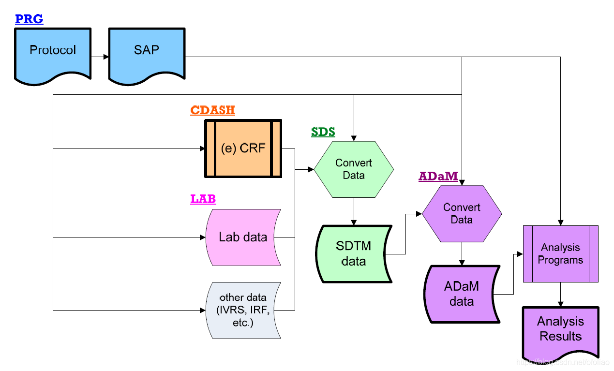

# CDISC

```
{r,echo = F,message = FALSE, error = FALSE, warning = FALSE}
library('mindr')
input <- rstudioapi::getSourceEditorContext()$path
mm(from = input, type = 'file', widget_name = '28_CDISC.html', root = "")
```


The Clinical Data Interchange Standards Consortium (CDISC) is an open, non-profit organization covering a variety of disciplines. The Association is committed to developing industry data standards that provide electronic means for the acquisition, exchange, submission, and archiving of clinical trial data and metadata for the development of medical and biopharmaceutical products.

  

## Study Data Tabulation Model (SDTM)


### Introduction

Study Data Tabulation Model (SDTM), which defines a standard structure for study data tabulations that are to be submitted as part of a product application to a regulatory authority such as the United States Food and Drug Administration (FDA).

> 本文档介绍了研究数据列表模型（SDTM），该模型定义了研究数据列表的标准结构，这些数据将作为产品应用的一部分提交给监管机构，例如美国食品和药物管理局（FDA）。

Data tabulation datasets are one of four ways to represent the human subject Case Report Tabulation (CRT) and equivalent animal data submitted to the FDA. CRTs are also submitted in the format of subject profiles, data listings, and analysis datasets. One benefit to the industry of submitting data tabulation datasets that conform to the standard structure is that it minimizes the need to submit the same data in multiple formats.

> 数据列表数据集是代表人类受试者病例报告列表（CRT）和提交给FDA的等效动物数据的四种方法之一。 CRT也以主题资料，数据列表和分析数据集的格式提交。提交符合标准结构的数据列表数据集的行业的一个好处是，它最大程度地减少了以多种格式提交相同数据的需求。

The availability of standard submission data may provide many benefits to regulatory reviewers. Reviewers can now be trained in the principles of standardized datasets and the use of standard software tools, and thus be able to work with the data more effectively with less preparation time. Another benefit of the standardized datasets is that they can provide support for the FDA's efforts to develop a repository for all submitted studies and a suite of standard review tools to access, manipulate, and view the study data.

> 标准提交数据的可用性可能为监管审查者带来许多好处。现在可以对审阅者进行标准化数据集原理和标准软件工具的使用方面的培训，从而能够以更少的准备时间更有效地使用数据。标准化数据集的另一个好处是，它们可以为FDA为所有提交的研究开发资料库的努力提供支持，并为访问，操作和查看研究数据的一套标准审查工具提供支持。


### Model Concepts and Terms

#### The concept of observations

DTM提供了一个总体框架，用于描述在人类和动物研究期间收集并提交给监管机构的信息的组织。该模型是围绕观察的概念构建的，观察的概念由研究期间收集的离散信息组成。观察值通常对应于数据集中的行。关于特定主题的意见的集合被视为一个领域。例如，“受试者101在研究第6天开始出现轻度恶心”是一项临床试验中属于不良事件领域的观察结果。
每个观察结果可以通过一系列命名变量来描述。每个变量通常对应于数据集中的一列，可以根据其角色进行分类。角色描述了变量传达的有关每个不同观察值的信息类型以及如何使用它。 SDTM变量可分为五个主要角色：

* Identifier variables, such as those that identify the study, the subject (individual human or animal or group of individuals) involved in the study, the domain, and the sequence number of the record.
* Topic variables, which specify the focus of the observation (such as the name of a lab test). 
* Timing variables, which describe the timing of observation (such as start date and end date). 
* Qualifier variables, which include additional illustrative text, or numeric values that describe the results or additional traits of the observation (such as units or descriptive adjectives). 
* Rule variables, which express an algorithm or executable method to define start, end, or looping conditions in the Trial Design model.


#### Domain-specific variables

limited number of designated domains and will be identified in the appropriate implementation guide. The variable names include the specific domain prefix. 

> 特定于域的变量是SDTM v1.5中引入的概念，仅在有限的指定域中使用，并将在适当的实施指南中进行标识。变量名称包括特定的域前缀

All datasets are structured as flat files with rows representing observations and columns representing variables. Each dataset is described by metadata definitions that provide information about the variables used in the dataset. The metadata are described in a data definition document named "define" that is submitted with the data to regulatory authorities. Define-XML specifies variable metadata attributes such as: name, label, data type, etc. The SDTM describes the name, label, role, and type for the standard variables.

> 所有数据集均被构造为平面文件，其中行表示观测值，而列表示变量。每个数据集由元数据定义描述，元数据定义提供有关数据集中使用的变量的信息。元数据在名为“ define”的数据定义文档中进行了描述，该文档随数据一起提交给监管机构。 Define-XML指定可变元数据属性，例如：名称，标签，数据类型等。SDTM描述了标准变量的名称，标签，角色和类型。

### SDTM Domains

**SDTM定义domains如下图所示**

```{r SDTM-domains, echo=FALSE, fig.align="center", out.width = '100%',fig.cap="Figure: SDTM domains"}

```

大多数在试验过程中采集到的受试者级别的观测数据，都可以被归为干预(Interventions)，事件(Events)和发现(Findings)三大类中的某一类。SDTM描述了每一观测数据类中被允许使用的变量列表。

特殊目的域:

* 备注 (CO)
* 人口学 (DM)
* 受试者元素 (SE)
* 受试者访视 (SV) 

干预类：

* 既往与合并用药 (CM)
* 暴露采集 (EC)
* 暴露 (EX)
* 嗜好品使用 (SU)
* 操作 (PR) 

事件类：

* 不良事件 (AE)
* 临床事件(CE)
* 分布情况 (DS)
* 方案偏离(DV)
* 就诊事件 (HO)
* 既往病史(MH) 

发现类：

* 药物收发记录 (DA)
* 死亡详情 (DD)
* 心电图 (EG)
* 不满足的入选/排除标准 (IE)
* 免疫原性检验 (IS)
* 实验室检查 (LB)
* 微生物检测 (MB)
* 微观发现 (MI)
* 形态学发现 (MO)
* 药敏试验 (MS)
* 药代动力学浓度 (PC)
* 药代动力学参数 (PP)
* 体格检查 (PE)
* 问卷与量表 (QS)
* 生殖系统检查(RP)
* 疾病效应/状态评估 (RS)
* 受试者特征 (SC)
* 受试者状态 (SS)
* 肿瘤鉴定 (TU)
* 肿瘤/病灶测量 (TR)
* 生命体征 (VS)

相关发现：

* 相关观测发现 (FA)
* 皮试 (SR) 

试验设计域：

* 试验分组 (TA)
* 试验疾病评估(TD)
* 试验元素 (TE)
* 试验访视(TV)
* 试验入排标准(TI)
* 试验概要(TS) 

关联数据：

* 补充修饰语数据集 (SUPP–数据集)
* 关联记录数据集 (RELREC)

#### AE (Adverse Events)

AE数据集包括的临床数据描述了"任何发生于病人或者临床研究病例的不良的医疗事件使用了研究药物, 其不必须与此次治疗有关"(ICH E2A). 通过咨询法规机构,sponsor可以扩展或限制AE的收集范围(如收集治疗前发生的与试验处置有关的时间, 不收集被评估为有效性终点的事件). AE数据集中包含的时间应与protocol要求一致. AE可以以自由文本的形式或者预先定义的项目表收集.

``` 
AETERM(Reported Term for the Adverse Event): 报告不良事件的本名
AEMODIFY(Modified Reported Term): 如果AETERM被修改以适用于编码, 则该变量为修改后的名
AEDECOD(Dictionary-Derived Term): 字典导出文本, 用来描述AETERM或AEMODIFY. 等价于Preferred Term（PT in MedDRA）.
AEPTCD(Preferred Term Code): AEDECOD对应编码
AEHLT(High Level Term): 关于System Organ Class的High Level Term的字典导出文本
AEHLTCD(High Level Term Code): AEHLT对应编码
AEHLGT(High Level Group Term):关于System Organ Class的High Level Group Term的字典导出文本
AEHLGTCD(High Level Group Term Code): AEHLGT对应编码

AECAT(Category for Adverse Event): 用来定义相关记录的类别. 如BLEEDING(出血), NEUROPSYCHIATRIC(神经精神病学)
AESCAT(Subcategory for Adverse Event): 关于AE的进一步分类, 如 NEUROLOGIC(神经病学)

AELOC(Location of Event)L 描述关于Event的解剖学位置, 如红疹(skin rash)发生于手臂(ARM)上
AESEV(Severity/Intensity): 描述Event的严重程度或强度, 如MILD, MODERATE, SEVERE
AESER(Serious Event): 是否为严重Even
AEREL(Causality): 记录研究者对于试验治疗关于事件因果关系的观点. ICH E2A和E2B包括NOT RELATED, UNLIKELY RELATED, POSSIBLY RELATED, RELATED. 未来可能会定义控制术语表.
AEOUT(Outcome of Adverse Event): 描述事件结局
AESCAN(Involves Cancer): SAE是否与癌症发展有关
AESCONG(Congenital Anomaly or Birth Defect): SAE是否与先天缺陷有关
AESDISAB(Persist or Signif Disability/Incapacity): SAE是否导致永久性或显著性残疾
AESDTH(Results in Death): SAE是否导致死亡
AESHOSP(Requires or Prolongs Hospitalization): SAE是否导致或延长住院
AESLIFE(Is Life Threatening): SAE是否威胁生命
AECONTRT(Concomitant or Additional Trtmnt Given): 在时间发生的情况下, 是否使用了其他治
AESTDTC/AEENDTC (Start/End Date Time of Adverse Event)
AESTDY/AEENDY (Study Day of Start/End of Adverse Event)
AEDUR(Duration of Adverse Event): 收集AE的持续时间及单位. 仅当CRF中收集时使用, 非导出. 如, P1DT2H(1 day, 2 hours)
```   

#### CE (Clinical Events)

收集感兴趣的但不能归为AE类别的临床事件
CE的目的是收集没有归为AE类别的感兴趣的临床事件. 数据可能是研究中疾病症状的插曲(常被视为迹象或者症状), 或者关于不能构成AE的事件, 尽管它们可能导致AE的识别. 例如, 研究中偏头痛的用药, 偏头痛根据Protocol可能不会被视为AE. 偏头痛以及相关症状可以报告在CE中. 其他研究可能跟踪作为有效性终点的特殊事件的发生. 例如, 对于缺血性中风预防的研究, TIA, 中风和死亡的所有发生情况都收集为临床事件, 并用来评估是否达到终点

```
CETERM(Reported Term for the Clinical Event): 关于用药条件或事件的项目. 很可能预先打印在CRF中
CEDECOD(Dictionary-Derived Term): 临床事件名称的控制术语.
CECAT(Category for Clinical Event): 定义相关记录的类别
CEPRESP(Clinical Event Occurrence): 用来表明CETERM中的事件是否被预先设定. 如预先设定，则值为Y;  对于自发报告的事件, 该变量值为空
CEOCCUR(Clinical Event Occurrence): 为了表明是否有临床事件发生，当特定事件被询问是否发生时使用. 对于自发报告的事件, 该变量值为空
CESTAT(Completion Status): 表明预设表单中的问题没有被回答
CEREASND(Reason Clinical Event Not Collected): 临床事件数据未收集的原因. 当CESTAT=NOT DONE时使用
CESEV(Severity/Intensity): 事件的严重程度. 如MILD, MODERATE, SEVERE.
CEDTC(Date/Time of Event Collection)
CESTDTC/CEENDTC(Start/End Date/Time of Clinical Event)
CEDY(Study Day of Event Collection): 1. 临床事件收集的study day, 整数形式. 2. 计算方法必须相对于sponsor定义的RFSTDTC. 公式必须在整个提交中保持一致.
CESTRF/CEENRF(Start/End Relative to Reference Period): 描述临床事件相对于sponsor定义参考时期的开始/结束时间. sponsor定义的参考时期是一个连续的时间段, 该连续时间段由离散的开始时间点和结束时间点限定(由RFSTDTC和RFENDTC表示).
CESTRTPT(Start Relative to Reference Time Point): 识别观测的开始时间在参考时间点(CESTTPT)之前或之后
```

#### CM (Concomitant and Prior Medications, Interventions)

收集伴随用药和既往用药. CM的结构是 每个subject, 每个用药干涉事件, 持续用药区间 或者 预先设定的用药评估 记为一条. 干涉事件需要由sponsor定义. 这一定义基于sponsor的回顾和分析需求可能会有所变化. 提交的数据结构可以与收集的结构不同. 当用药的规则发生变化时, 一个通常的方法是提交一个新的记录.

```
CMGRPID(Group ID):  用于联系一个subject在单个domain中的相关records
CMTRT(Reported Name of Drug, Med, or Therapy, TOPIC): 药物全称, 打印或收集于CRF.
CMMODIFY(Modified Reported Name, Synonym Qualifier): 如果CMTRT为了编码方便而进行了修饰, 则CMMODIFY需要包含修饰过的文本
CMDECOD(Standardized Medication Name, Synonym Qualifier): 标准化或字典导出的文本, 用来描述CMTRT或CMMODIFY. 等价于generic medication name in WHO Drug.
CMCAT(Category for Medication, Grouping Qual): 定义用药或治疗的类别， 如PRIOR, CONCOMITANT, ANTI-CANCER MEDICAITON, GENERAL CONMED
CMSCAT(Subcateory for Medication, Grouping Qual): 进一步分类, 如CHEMOTHERAPY, HORMONAL THERAPY, ALTERNATIVE THERAPY
CMREASND(Reason Medication Not Collected): 描述伴随用药没有收集的原因. 当CMSTAT="NOT DONE"时，与CMSTAT一起使用
CMDOSTXT(Dose Description): 以文本形式收集的药物使用量或范围的信息. 单位可能储存于CMDOSU中, 如200-400, 15-20. 如果CMDOSE已导出, 则不需要导出CMDOSTXT
CMDOSU（Dose Units）: CMDOSE， CMDOSTOT, CMDOSTXT的单位.
CMDOSFRM(Dose Form): CMTRT的剂型, 如药片(TABLET)， 洗液(LOTION)
CMDOSFRQ(Dosing Frequency per Interval): 用来表示在一个特定时间内, CMDOSE(用药管理)的重复次数. 如BID(一天两次), Q12H(每12小时)
CMROUTE(Route of Administration): CMTRT的管理途径, 如口服(ORAL), 静脉注射(INTRAVENNOUS)
CMSTDEC/CMENDTC(Start/End Date/Time of Medication
CMDUR(Duration of Medication): 收集一段治疗事件的持续时间. 仅当CRF有收集时使用, 不能由开始和结束时间导出
```

#### DM (Demographics)

```
RFSTDTC (Subject Reference Start Date/Time): 通常等于subject首次用药时间. 对于所有rand pop是必要的, 对于未达到里程碑事件的subject(如Screen failure或unassigned)赋值为空.
RFENDTC (Subject Reference End Date/TIme): 通常等于subject结束试验的日期, 或者最后一次用药时间, 对于所有rand pop是必要的, 对于未达到里程碑事件的subject(如Screen failure或unassigned)赋值为空.
RFXSTDTC (Date/Time of First Study Treatment): 首次暴露于任何protocol-specified治疗的时间, 等于最早的EXSTDTC.
RFXENDTC (Date/Time of Last Study Treatment): 末次暴露于任何protocol-specified治疗的时间, 等于最晚的EXSTDTC.(如果EXENDTC没有收集或缺失, 则等于最晚的EXSTDTC).
RFICDTC (Date/Time of Informed Consent): 知情同意书时间, 即DS domain中的知情同意书时间.
RFPENDTC (Date/Time of End of Participation): Subject停止参与试验或follow-up时间, 定义于Protocol中. 对于一个subject应等于其在整个试验中最完被记录的时间, 可以是完成试验日期, 退出日期, 最后一次follow-up, 失访日期 或者 死亡日期.
```

#### LB (Laboratory Test Results)

包括但不限于hematology, clinical chemistry, urinalysis数据. 该domain不包含microbiology和pharmacokinetic数据, 二者储存于其他独立的domain中

```
LBTESTCD/LBTEST
LBCAT/LBSCAT
LBSTNRLO(Reference Range Lower Limit-Std Units): 标准单位表示参照范围的下限
LBSTNRHI(Upper)
LBSTNRC(Reference Range for Char Rslt-Std Units): 正常范围值， 有序范围("-1 to +1")或是分类范围("NEGATIVE TO TRACE").
LBNRIND(Reference Range Indicator): 表明测量值是否落入参考范围中(LBORNRLO/HI, LBSTNRLO/HI, LBSTNRC)
LBSPEC(Specimen Type):  定义样本类型， 如 SERUM(血清) PLASMA(血浆) URINE(尿液)
LBSPCCND(Specimen Condition): 自由文本或标准文本, 描述样本的条件 ， 如HEMOLYZED（溶血）, ICTERIC（黄疸）
LBMETHOD(Method of Test or Examination): 测试或检查方法. 如EIA(Enzyme Immunoassay), ELECTROPHORESIS, DIPSTICK
```

#### MH (Medical History)

包括subject在试验开始前的用药历史. MH的信息可以包括general medical history, gynecological history, primary diagnosis. 注意既往和伴随用药应当提交到干涉组的合理的数据集中

```
MHTERM: 收集事件的本名, 是MH数据集的topic变量
MHMODIFY是容许变量, 如果sponsor流程允许对本名进行修改, 则需要包含进数据集中. 允许有空值.
MHDECOD: 如果sponsor用标准字典来编码MHTERM, 则MHDECOD需要被导出.
MHBODSYS: 来自于与AE有关的编码字典的system organ class
MHCAT & MHSCAT: 可以根据sponsor预定义的用药历史事件类别导出, 通常是预设在CRF中. 注意即使sponsor使用标准字典的body system术语表
MHCAT可以是'General Medical History', 'Allergy Medical History', 'Reproductive Medical History'.
MHOCCUR用来表示预设的用药条件是否发生. Y表示发生， N表示未发生

```
#### VS (Vital Signs)

```

对于已定义时间点（VSTPT）的每条记录，经过时间（VSELTM）已用于显示剂量之前或之后以ISO8601格式显示的时间量。
VSTPT: 每条记录已定义时间点
VSELTM: 经过时间, 显示剂量之前或之后以ISO8601格式显示的时间量
VSPTPREF: 时间点参考
VSRFTDTC: 用于存储的实际日期/时间
```

### SDTM Define.xml

XML是Extensible Markup Language的简bai写，一种扩展性du标识语言,用于标记zhi电子文件使其具dao有结构性的zhuan标记语言，可以用来标记数据shu、定义数据类型，是一种允许用户对自己的标记语言进行定义的源语言

使用元数据文件来驱动SDTM域创建的一个重要好处是，您具有构建define.xml的基本要素。每个电子表格代表元数据文件的各个部分：

* Table of Contents metadata file 
* Variable-level metadata file 
* Codelist metadata file 
* Value-level metadata file 
* Where clause metadata file 
* Computational method metadata file 
* Comments metadata file
* External links metadata file


**Table of Contents Metadata**

The Table of Contents metadata is called that because it represents the metadata required to produce the Table of Contents section of the define.xml file. The Table of Contents in the define.xml file is just what it sounds like, a list of the domain datasets, what they are for, and where they can be found.

> 目录元数据之所以被称为是因为它表示生成define.xml文件的目录部分所需的元数据。 define.xml文件中的目录听起来像是域数据集的列表，它们的用途以及在何处可以找到它们。


**Variable-Level Metadata**

> 域级别或数据集级别的元数据是有关SDTM域本身的描述性信息。 此元数据用于定义域或数据集变量内容，该内容是define.xml文件的ItemRef组件。该元数据包含每个SDTM域和变量的定义框架，因此是在Base SAS中构建SDTM域的主力军。 此元数据包含诸如SAS标签，SAS变量类型，SAS变量长度，任何代码列表名称以及其他关联的元数据的定义。 此元数据中的每一行代表SDTM域数据集中的变量。

|  Title            |  Title                                                                                                                                                                                                                                                                                                       |
|-------------------|--------------------------------------------------------------------------------------------------------------------------------------------------------------------------------------------------------------------------------------------------------------------------------------------------------------|
| DOMAIN            |  Content                                                                                                                                                                                                                                                                                                     |
| VARNUM            | The order of the variable                                                                                                                                                                                                                                                                                    |
| TYPE              | text, integer, float, datetime, date, or time,...                                                                                                                                                                                                                                                            |
| LENGTH            |  Content                                                                                                                                                                                                                                                                                                     |
| LABEL             |  Content                                                                                                                                                                                                                                                                                                     |
| SIGNIFICANTDIGITS | 如果type = float，则应使用代表该变量小数位数的整数填充                                                                                                                                                                                                                                                       |
| ORIGIN            | Valid values are: CRF, Derived, Assigned, Protocol, eDT, and Predecessor. “CRF” may be followed by “Page” or “Pages” and the corresponding annotated CRF page numbers (for example, “CRF Page 1”). If Derived, then a COMPUTATIONMETHODOID should be provided. Predecessor is typically used for ADaM data.  |


### Extract-Transform-Load (ETL)

用于SDTM转换的基本SAS宏和工具将临床源数据转换为CDISC SDTM涉及的许多任务本质上都是重复的。 SAS宏语言是用于自动化这些重复任务的出色工具。

SDTM创建过程的基本流程将遵循数据仓库的提取-转换-加载（ETL）范例。您首先需要获取数据，然后对其进行处理以满足您的需求。最后，将数据存储在需要的地方。下表按时间顺序汇总了有助于数据转换过程的SAS宏

| Title                 |  Title                                                                                                                                                                                        |
|-----------------------|-----------------------------------------------------------------------------------------------------------------------------------------------------------------------------------------------|
| make_codelist_formats | 该程序从SDTM元数据中获取受控的术语和代码列表信息，并从中创建一个永久的SAS格式库。 当在DATA步骤中使用PUT语句将源数据值映射到目标SDTM数据值时，该格式库将在数据转换过程中稍后使用。             |
| make_empty_dataset    | 该宏根据SDTM元数据创建一个空的数据集外壳。使用元数据来定义哪些变量属于给定SDTM域，这是转换步骤的开始。 该宏还创建了一个宏变量，可以在加载步骤中使用该变量，以仅保留每个元数据需求所需的变量。 |
| make_dtc_date         | 根据SAS日期或日期时间组件变量创建ISO8601日期字符串。 在DATA步骤转换过程中使用它。                                                                                                             |
| make_sdtm_dy          | 给定两个SDTM * DTC日期时，此宏会创建一个SDTM study day （DY）变量。 在DATA步骤转换过程中使用它。                                                                                              |
| make_sort_order       | 此宏创建一个宏变量，该变量可以在排序过程中用于最终数据加载。                                                                                                                                  |


### Example Building DM SDTM Datasets 

有了元数据存储和SAS宏库，您可以在Base SAS中构建SDTM域。 

1. 首先，创建专用的DM域 (special-purpose DM domain)，因为在域数据集中创建学习日（--DY）变量是必需的
2. 然后，创建一个补充性限定词，发现，事件和干预措施 (supplemental qualifier, findings, events, and interventions)

#### Special-Purpose DM

1. Create empty DM dataset; %make_empty_dataset(metadatafile=SDTM_METADATA.xIs,dataset=DM)
2. Get the first and last dose date of RFSTDTC and RFENDTC;
3. Get demographic data;
4. Merge first and last dose date with demographic
5. Derive majority of the SDTM DM variables;
6. 根据元数据排序DM并保存永久数据集;  %make_sort_order(metadatafile=SDTM_METADATA.xIs,dataset=DM)

```
**** DERIVE THE MAJORITY OF SDTM DM VARIABLES;
options missing = ' ';
data dm;
  set EMPTY_DM
    demog_dose(rename=(race=_race));

    studyid = 'XYZ123';
    domain = 'DM';
    usubjid = left(uniqueid);
    subjid = put(subject,3.); 
    rfstdtc = put(firstdose,yymmdd10.);  
    rfendtc = put(lastdose,yymmdd10.); 
    siteid = substr(subjid,1,1) || "00";
    brthdtc = put(dob,yymmdd10.);
    age = floor ((intck('month',dob,firstdose) - 
          (day(firstdose) < day(dob))) / 12);
    if age ne . then
        ageu = 'YEARS';
    sex = put(gender,sex_demographic_gender.);
    race = put(_race,race_demographic_race.);
    armcd = put(trt,armcd_demographic_trt.);
    arm = put(trt,arm_demographic_trt.);
    country = "USA"; 
run; 

**** SORT DM ACCORDING TO METADATA AND SAVE PERMANENT DATASET; 
%make_sort_order(metadatafile=SDTM_METADATA.xls,dataset=DM)
proc sort
 data=dm(keep = &DMKEEPSTRING)
 out=target.dm;
 by &DMSORTSTRING;
run; 
```

#### SUPPDM Domains

Define SUPPDM for other race;  
 CREATE EMPTY SUPPDM DATASET CALLED EMPTY_SUPPDM;
%make_empty_dataset(metadatafile=SDTM_METADATA.xls,dataset=SUPPDM)

```
data suppdm;
 set EMPTY_SUPPDM
 dm;
 keep &SUPPDMKEEPSTRING; 
 **** OUTPUT OTHER RACE AS A SUPPDM VALUE; 
 if orace ne '' then
 do;
 rd1omain = 'DM';
 qnam = 'RACEOTH';
 qlabel = 'Race, Other';
 qval = left(orace);
 qorig = 'CRF Page 1';
 output;
 end;
 **** OUTPUT RANDOMIZATION DATE AS SUPPDM VALUE;
 if randdt ne . then
 do;
 rdomain = 'DM';
 qnam = 'RANDDTC';
 qlabel = 'Randomization Date';
 qval = left(put(randdt,yymmdd10.));
 qorig = 'CRF Page 1';
 output;
 end;
run; 

**** SORT SUPPDM ACCORDING TO METADATA AND SAVE PERMANENT DATASET;
%make_sort_order(metadatafile=SDTM_METADATA.xls,dataset=SUPPDM)
proc sort
 data=suppdm
 out=target.suppdm;
 by &SUPPDMSORTSTRING;
run;
```

#### Building AE SDTM Datasets 

* CREATE EMPTY DM DATASET CALLED EMPTY_AE;
* DERIVE THE MAJORITY OF SDTM AE VARIABLES;
* CREATE SDTM STUDYDAY VARIABLES;
* CREATE SEQ VARIABLE;"Sequence Number
* SORT AE ACCORDING TO METADATA AND SAVE PERMANENT DATASET;

```
**** CREATE EMPTY DM DATASET CALLED EMPTY_AE;
%make_empty_dataset(metadatafile=C:\path\SDTM_METADATA.xlsx,dataset=AE)
 

**** DERIVE THE MAJORITY OF SDTM AE VARIABLES;
options missing = ' ';
data ae;
  set EMPTY_AE
  source.adverse(rename=(aerel=_aerel aesev=_aesev));

    studyid = 'XYZ123';
    domain = 'AE';
    usubjid = left(uniqueid);
    aeterm = left(aetext);
    aedecod = left(prefterm);
    aebodsys = left(bodysys);
    aesev = put(_aesev,aesev_adverse_aesev.);
    aeacn = put(aeaction,acn_adverse_aeaction.);
    aerel = put(_aerel,aerel_adverse_aerel.);
    aeser = put(serious,$ny_adverse_serious.);
    aestdtc = put(aestart,yymmdd10.);
    aeendtc = put(aeend,yymmdd10.);
run;

 
proc sort
  data=ae;
    by usubjid;
run;

**** CREATE SDTM STUDYDAY VARIABLES;
data ae;
  merge ae(in=inae) target.dm(keep=usubjid rfstdtc);
    by usubjid;

    if inae;

    %make_sdtm_dy(date=aestdtc); 
    %make_sdtm_dy(date=aeendtc); 
run;


**** CREATE SEQ VARIABLE;
proc sort
  data=ae;
    by studyid usubjid aedecod aestdtc aeendtc;
run;

data ae;
  retain &AEKEEPSTRING;
  set ae(drop=aeseq);
    by studyid usubjid aedecod aestdtc aeendtc;

    if not (first.aeendtc and last.aeendtc) then
      put "WARN" "ING: key variables do not define an unique record. " usubjid=;

    retain aeseq;
    if first.usubjid then
      aeseq = 1;
    else
      aeseq = aeseq + 1;
		
    label aeseq = "Sequence Number";
run;


**** SORT AE ACCORDING TO METADATA AND SAVE PERMANENT DATASET;
%make_sort_order(metadatafile=C:\path\SDTM_METADATA.xlsx,dataset=AE)


proc sort
  data=ae(keep = &AEKEEPSTRING)
  out=target.ae;
    by &AESORTSTRING;
run;
```


## SDTM SAS Macro

### ％make_define

％make_define为SDTM和ADaM创建define.xml文件。它基于在Excel电子表格中找到的一组元数据选项卡的内容创建define.xml。


```
*---------------------------------------------------------------*;
* %make_define creates the define.xml file for the SDTM and ADaM.  
* It creates define.xml based on the contents of a set of metadata
* tabs found in an Excel spreadsheet.
*
* PARAMETERS:
*            path = System path to where the SDTM or ADaM metadata
*                   file exists as well as where the define.xml
*                   file will be stored.
*        metadata = The name of the metadata spreadsheet.
*
* It requires that the following tabs exist in the metadata file:
* DEFINE_HEADER_METADATA = define file header metadata
* TOC_METADATA = "table of contents" dataset metadata
* VARIABLE_METADATA = variable/column level metadata
* VALUELEVEL_METADATA = value/parameter level metadata
* COMPUTATIONAL_MKETHOD = computational methods
* CODELISTS = controlled terminology metadata
* ANALYSIS_RESULTS = ADaM analysis metadata. [Only for ADaM define]
* EXTERNAL_LINKS = ADaM results file pointers. [Only for ADaM define]
*---------------------------------------------------------------*;

%macro make_define(path=,metadata=);

**** GET DEFINE FILE HEADER INFORMATION METADATA;
proc import 
    out = define_header
    datafile = "&path\&metadata" 
    dbms=excelcs 
    replace;
    sheet="DEFINE_HEADER_METADATA";
run;

**** DETERMINE IF THIS IS A SDTM DEFINE FILE OR AN ADAM DEFINE FILE
**** AND SET THE STANDARD MACRO VARIABLE FOR THE REST OF THE PROGRAM;
data _null_;
	set define_header;

    if upcase(standard) = 'ADAM' then
        call symput('standard','ADAM');
    else if upcase(standard) = 'SDTM' then
        call symput('standard','SDTM');
    else
        put "ERR" "OR: CDISC standard undefined in define_header_metadata";
run;

**** GET "TABLE OF CONTENTS" LEVEL DATASET METADATA;
proc import 
    out = toc_metadata
    datafile = "&path\&metadata" 
    dbms=excelcs 
    replace;
    sheet = "TOC_METADATA" ;
run;

**** GET THE VARIABLE METADATA;
proc import 
    out = VARIABLE_METADATA
    datafile = "&path\&metadata"
    dbms=excelcs
    replace;
    sheet = "VARIABLE_METADATA";
run;

**** GET THE CODELIST METADATA;
proc import 
    out = codelists
    datafile = "&path\&metadata" 
    dbms=excelcs
    replace;
    sheet = "CODELISTS" ;
run; 

**** GET THE COMPUTATIONAL METHOD METADATA;
proc import 
    out = compmethod
    datafile = "&path\&metadata" 
    dbms=excelcs
    replace;
    sheet = "COMPUTATION_METHOD" ;
run; 

**** GET THE VALUE LEVEL METADATA;
proc import 
    out = valuelevel
    datafile = "&path\&metadata" 
    dbms=excelcs
    replace;
    sheet = "VALUELEVEL_METADATA" ;
run; 

%if "&standard" = "ADAM" %then
  %do;
    **** GET THE ANALYSIS RESULTS METADATA;
    proc import 
        out = analysisresults
        datafile = "&path\&metadata" 
        dbms=excelcs
        replace;
        sheet = "ANALYSIS_RESULTS" ;
    run; 

    **** GET THE ANALYSIS RESULTS METADATA;
    proc import 
        out = externallinks
        datafile = "&path\&metadata" 
        dbms=excelcs
        replace;
        sheet = "EXTERNAL_LINKS" ;
    run; 
  %end;

**** USE HTMLENCODE ON SOURCE TEXT THAT NEEDS ENCODING FOR PROPER BROWSER REPRESENTATIION;
%if &standard=ADAM %then
  %do;
  
    data toc_metadata;
      	length documentation $ 800;
            set toc_metadata;
      
          documentation = htmlencode(documentation);
          ** convert single quotes to double quotes;
          documentation = tranwrd(documentation, "'", '"');
          ** convert double quotes to html quote;
          documentation = tranwrd(trim(documentation), '"', '&quot;');
          format documentation $800.;
    run;
  
  %end;
  
        
data variable_metadata;
	length comment $ 2000;
	set variable_metadata;

	format comment;
	informat comment;	
    origin = htmlencode(origin); 
	label = htmlencode(label); 
	comment = htmlencode(comment); 

    **** FOR ADAM, JOIN ORIGIN/"SOURCE" AND COMMENT
	**** TO FORM "SOURCE/DERIVATION" METADATA;
	if "&standard" = "ADAM" and origin ne '' and 
        comment ne '' then 
      comment = "SOURCE: " || left(trim(origin)) ||
                " DERIVATION: " || left(trim(comment)); 
	else if "&standard" = "ADAM" and origin ne '' and 
        comment = '' then 
      comment = "SOURCE: " || left(trim(origin)); 
	if "&standard" = "ADAM" and origin = '' and 
        comment ne '' then 
      comment = "DERIVATION: " || left(trim(comment)); 
run;

data codelists;
	set codelists;

	codedvalue = htmlencode(codedvalue);
	translated = htmlencode(translated);
run;

data compmethod;
	set compmethod;

	computationmethod = htmlencode(computationmethod); 
run;

data valuelevel;
	length comment $ 2000;
	set valuelevel;

	format comment;
	informat comment;	
    origin = htmlencode(origin); 
	label = htmlencode(label); 
	comment = htmlencode(comment); 

    **** FOR ADAM, JOIN ORIGIN/"SOURCE" AND COMMENT
	**** TO FORM "SOURCE/DERIVATION" METADATA;
	if "&standard" = "ADAM" and origin ne '' and 
        comment ne '' then 
      comment = "SOURCE: " || left(trim(origin)) ||
                " DERIVATION: " || left(trim(comment)); 
	else if "&standard" = "ADAM" and origin ne '' and 
        comment = '' then 
      comment = "SOURCE: " || left(trim(origin)); 
	if "&standard" = "ADAM" and origin = '' and 
        comment ne '' then 
      comment = "DERIVATION: " || left(trim(comment)); 
run;


%if "&standard" = "ADAM" %then
  %do;
    data analysisresults;
         length programmingcode $800. docleafid $40.;
	  set analysisresults;
      where displayid ne '';
          
      arrow + 1;
      selectioncriteria = htmlencode(selectioncriteria); 
      paramlist = htmlencode(paramlist);
      reason = htmlencode(reason); 
      documentation = htmlencode(documentation);
      if index(documentation, '[r]')>0 then
        docleafid = substr(documentation, index(documentation,'[r]')+3, index(documentation,'[\r]')-index(documentation,'[r]')-3);
      else
        docleafid = '.';
          
      programmingcode = htmlencode(programmingcode); 
      ** convert single quotes to double quotes;
      programmingcode = tranwrd(programmingcode, "'", '"');
      ** convert double quotes to html quote;
      programmingcode = tranwrd(programmingcode, '"', '&quot;');
      format programmingcode $800.;
    run;

    ** ENSURE UNIQUENESS ON DISPLAYID AND RESULTID AND CREATE A COMBO ID;
    data analysisresults;
      set analysisresults;
      by displayid notsorted;
    
      drop resultnum;
      retain resultnum;
      if first.displayid then
          resultnum = 0;
      resultnum + 1;
      if not(first.displayid and last.displayid) then
          arid = trim(displayid) || ".R." || put(resultnum,z2.);
      else
          arid = displayid;
    run;          
            
    ** IF DOCLEAFID IS NON-MISSING, MERGE IN THE TITLE FROM EXTERNAL_LINKS;
    proc sort
      data = analysisresults;
      by docleafid;
    run;
 
    proc sort
      data = externallinks (keep = leafid title rename=(leafid=docleafid title=doctitle))
      out  = doc_links;
      by docleafid;
    run;
 
    data analysisresults;
      merge analysisresults (in = inar) doc_links (in = indoc_links);
      by docleafid;
    
      if inar;
      ** if the leaf ID exists, then the title of the leaf ID will be printed and can be removed from DOCUMENTIATION;
      if indoc_links then
        documentation = tranwrd(documentation, '[r]' || trim(docleafid) || '[\r]', " ");
    run;

    proc sort
      data = analysisresults;
      by arrow;
    run;
  %end;
    
**** CREATE DEFINE FILE HEADER SECTION;
filename dheader "&path\define_header.txt";
data define_header;
    set define_header;

    file dheader notitles;

	creationdate = compress(put(datetime(), IS8601DT.));

    put @1 '<?xml version="1.0" encoding="ISO-8859-1" ?>' /
        @1 '<?xml-stylesheet type="text/xsl" href="' stylesheet +(-1) '"?>' /
        @1 '<!-- ******************************************************************************* -->' /
        @1 '<!-- File: define.xml                                                                -->' /
        @1 "<!-- Date: &sysdate9.                                                                -->" /
        @1 '<!-- Description: Define.xml file for '   studyname +(-1) '                          -->' /
        @1 '<!-- ******************************************************************************* -->' /
        @1 '<ODM' /
        @3 'xmlns="http://www.cdisc.org/ns/odm/v1.2"' /
        @3 'xmlns:xsi="http://www.w3.org/2001/XMLSchema-instance"' /
        @3 'xmlns:xlink="http://www.w3.org/1999/xlink"' /
        @3 'xmlns:def="http://www.cdisc.org/ns/def/v1.0"' /
        %if "&standard" = "ADAM" %then
          @3 'xmlns:adamref="http://www.cdisc.org/ns/ADaMRes/DRAFT"' /
        ;
        @3 'xsi:schemaLocation="' schemalocation +(-1) '"' /
        @3 'FileOID="' fileoid +(-1) '"' /
        @3 'ODMVersion="1.2"' /
        @3 'FileType="Snapshot"' /
        @3 'CreationDateTime="' creationdate +(-1) '">' /
        @1 '<Study OID="' studyoid +(-1) '">' /
        @3 '<GlobalVariables>' /
        @5 '<StudyName>' studyname +(-1) '</StudyName>' /
        @5 '<StudyDescription>' studydescription +(-1) '</StudyDescription>' /
        @5 '<ProtocolName>' protocolname +(-1) '</ProtocolName>' /
        @3 '</GlobalVariables>' /
        @3 '<MetaDataVersion OID="CDISC.' standard +(-1) '.' version +(-1) '"' /
        @5 'Name="' studyname +(-1) ',Data Definitions"' /
        @5 'Description="' studyname +(-1) ',Data Definitions"' /
        @5 'def:DefineVersion="1.0.0"' /
        @5 'def:StandardName="CDISC ' standard +(-1) '"' /
        @5 'def:StandardVersion="' version +(-1) '">' /
        %if "&standard" = "ADAM" %then
          %do;
            @5 '<def:SupplementalDoc>' /
            @7 '<def:DocumentRef leafID="Suppdoc"/>' /
            @5 '</def:SupplementalDoc>' /
            @5 '<def:leaf ID="Suppdoc" xlink:href="dataguide.pdf">' /
            @7 '<def:title>Data Guide</def:title>' /
          %end;
        %else %if "&standard" = "SDTM" %then
          %do;
            @5 '<def:AnnotatedCRF>' /
            @7 '<def:DocumentRef leafID="blankcrf"/>' /
            @5 '</def:AnnotatedCRF>' /
            @5 '<def:leaf ID="blankcrf" xlink:href="blankcrf.pdf">' /
            @7 '<def:title>Annotated Case Report Form</def:title>' /
          %end;
        @5 '</def:leaf>';
run;

**** ADD OTHER ADAM EXTERNAL LINKS;
%if "&standard" = "ADAM" %then
  %do;
    filename leaves "&path\leaves.txt";
    data _null_;
      set externallinks;
  
      file leaves notitles;

      put @5 '<def:leaf ID="' leafid +(-1) '"'     /
          @7 'xlink:href="' leafrelpath +(-1) '">' /
          @7 '<def:title>' title '</def:title>'    /
          @5 '</def:leaf>'
          ;
    run;            
  %end;


**** ADD ITEMOID TO VARIABLE METADATA;
data variable_metadata;
    set variable_metadata(rename=(domain = oid));

    length itemoid $ 40;
    if variable in ("STUDYID","DOMAIN","USUBJID","SUBJID") then
      itemoid = variable;
    else
      itemoid = compress(oid || "." || variable);
run;

**** ADD ITEMOID TO VALUE LEVEL METADATA;
data valuelevel;
    set valuelevel;

    length itemoid $ 200;
    itemoid = compress(valuelistoid || "." || valuename);
run;

**** CREATE COMPUTATION METHOD SECTION;
filename comp "&path\compmethod.txt";
data compmethods;
    set compmethod;

    file comp notitles;

    if _n_ = 1 then
    put @5 "<!-- ******************************************* -->" /
        @5 "<!-- COMPUTATIONAL METHOD INFORMATION        *** -->" /    
        @5 "<!-- ******************************************* -->";
    put @5 '<def:ComputationMethod OID="' computationmethodoid +(-1) '">' computationmethod +(-1) '</def:ComputationMethod>';   
run;


**** CREATE VALUE LEVEL LIST DEFINITION SECTION;
proc sort
    data=valuelevel;
    where valuelistoid ne '';
    by valuelistoid;
run;

filename vallist "&path\valuelist.txt";
data valuelevel;
  set valuelevel;
    by valuelistoid;

    file vallist notitles;

    if _n_ = 1 then
      put @5 "<!-- ******************************************* -->" /
          @5 "<!-- VALUE LEVEL LIST DEFINITION INFORMATION  ** -->" /    
          @5 "<!-- ******************************************* -->";

    if first.valuelistoid then
      put @5 '<def:ValueListDef OID="' valuelistoid +(-1) '">';

    put @7 '<ItemRef ItemOID="' itemoid /*valuename*/ +(-1) '"' /
        @9 'Mandatory="' mandatory +(-1) '"/>';

    if last.valuelistoid then
      put @5 '</def:ValueListDef>';
run;


**** CREATE "ITEMGROUPDEF" SECTION;
proc sort
    data=VARIABLE_METADATA;
    where oid ne '';
    by oid varnum;
run;

proc sort
    data=toc_metadata;
    where oid ne '';
    by oid;
run;

filename igdef "&path\itemgroupdef.txt";
data itemgroupdef;
    length label $ 40;
    merge toc_metadata VARIABLE_METADATA(drop=label);
    by oid;

    file igdef notitles; 

    if first.oid then
      do;
        put @5 "<!-- ******************************************* -->" /
            @5 "<!-- " oid   @25   "ItemGroupDef INFORMATION *** -->" /    
            @5 "<!-- ******************************************* -->" /
            @5 '<ItemGroupDef OID="' oid +(-1) '"' /
            @7 'Name="' name +(-1) '"' /
            @7 'Repeating="' repeating +(-1) '"' /
            @7 'Purpose="' purpose +(-1) '"' /
            @7 'IsReferenceData="' isreferencedata +(-1) '"' /
            @7 'def:Label="' label +(-1) '"' /
            @7 'def:Structure="' structure +(-1) '"' /
            @7 'def:DomainKeys="' domainkeys +(-1) '"' /
            @7 'def:Class="' class +(-1) '"' ;
        %if &standard=ADAM %then
          put @7 'def:ArchiveLocationID="Location.' archivelocationid +(-1) '"' /
              @7 'Comment="' documentation +(-1) '">' 
              ;
        %else 
          put @7 'def:ArchiveLocationID="Location.' archivelocationid +(-1) '">';        
        ;
      end;

    put @7 '<ItemRef ItemOID="' itemoid +(-1) '"' /
        @9 'OrderNumber="' varnum +(-1) '"' /
        @9 'Mandatory="' mandatory +(-1) @;
		
    if role ne '' and "&standard" = "SDTM" then
      put '"' /
      @9 'Role="' role +(-1) '"' /
      @9 'RoleCodeListOID="CodeList.' rolecodelist +(-1) '"/>';
    else
      put '"/>';


    if last.oid then
      put @7 "<!-- **************************************************** -->" /
          @7 "<!-- def:leaf details for hypertext linking the dataset   -->" /
          @7 "<!-- **************************************************** -->" /
          @7 '<def:leaf ID="Location.' oid +(-1) '" xlink:href="' archivelocationid +(-1) '.xpt">' /
          @9 '<def:title>' archivelocationid +(-1) '.xpt </def:title>' /
          @7 '</def:leaf>' /
          @5 '</ItemGroupDef>';
run;
  

**** CREATE "ITEMDEF" SECTION;
filename idef "&path\itemdef.txt";
 
data itemdef;
    set VARIABLE_METADATA end=eof;
    by oid;

    file idef notitles; 

    if _n_ = 1 then
      put @5 "<!-- ************************************************************ -->" /
          @5 "<!-- The details of each variable is here for all domains         -->" /
          @5 "<!-- ************************************************************ -->" ;

    put @5 '<ItemDef OID="' itemoid +(-1) '"' /
        @7 'Name="' variable +(-1) '"' /
        @7 'DataType="' type +(-1) '"' /
        @7 'Length="' length +(-1) '"';
    if significantdigits ne '' then
      put @7 'SignificantDigitis="' significantdigits +(-1) '"';
    if displayformat ne '' then
      put @7 'def:DisplayFormat="' displayformat +(-1) '"';
    if computationmethodoid ne '' then
      put @7 'def:ComputationMethodOID="' computationmethodoid +(-1) '"';
    put %if "&standard" = "SDTM" %then 
        @7 'Origin="' origin +(-1) '"' / ;
	    @7 'Comment="' comment +(-1) '"' / 			
        @7 'def:Label="' label +(-1) '">';

    if codelistname ne '' then
      put @7 '<CodeListRef CodeListOID="CodeList.' codelistname +(-1) '"/>';

    if valuelistoid ne '' then
      put @7 '<def:ValueListRef ValueListOID="' valuelistoid +(-1) '"/>';

    put @5 '</ItemDef>';
run;
 

**** ADD ITEMDEFS FOR VALUE LEVEL ITEMS TO "ITEMDEF" SECTION;
filename idefvl "&path\itemdef_value.txt";
 
data itemdefvalue;
    set valuelevel end=eof;
    by valuelistoid;

    file idefvl notitles; 

    if _n_ = 1 then
      put @5 "<!-- ************************************************************ -->" /
          @5 "<!-- The details of value level items are here                    -->" /
          @5 "<!-- ************************************************************ -->" ;

    put @5 '<ItemDef OID="' itemoid /*valuename*/ +(-1) '"' /
        @7 'Name="' valuename +(-1) '"' /
        @7 'DataType="' type +(-1) '"' /
        @7 'Length="' length +(-1) '"';
    if significantdigits ne '' then
      put @7 'SignificantDigitis="' significantdigits +(-1) '"';
    if displayformat ne '' then
      put @7 'def:DisplayFormat="' displayformat +(-1) '"';
    if computationmethodoid ne '' then
      put @7 'def:ComputationMethodOID="' computationmethodoid +(-1) '"';
    put %if "&standard" = "SDTM" %then 
        @7 'Origin="' origin +(-1) '"' / ;
        @7 'Comment="' comment +(-1) '"' / 			
        @7 'def:Label="' label +(-1) '">';

    if codelistname ne '' then
      put @7 '<CodeListRef CodeListOID="CodeList.' codelistname +(-1) '"/>';

    put @5 '</ItemDef>';
run;
 

**** ADD ANALYSIS RESULTS METADATA SECTION FOR ADAM;
%if "&standard" = "ADAM" %then
  %do;
    filename ar "&path\analysisresults.txt";

    data _null_;
      set analysisresults;
      ** note that it is required that identical display IDs be adjacent to 
	  ** each other in the metadata spreadsheet;
      by displayid notsorted;

      file ar notitles; 
      if _n_ = 1 then
        put @5 "<!-- ************************************************************ -->" /
            @5 "<!-- Analysis Results MetaData are Presented Below                -->" /
            @5 "<!-- ************************************************************ -->" 
            ;
      if first.displayid then
        put @5 '<adamref:AnalysisResultDisplays>' /
            @7 '<adamref:ResultDisplay DisplayIdentifier="' displayid +(-1) 
               '" OID="' displayid +(-1) '" DisplayLabel="' displayname +(-1) 
               '" leafID="' displayid +(-1) '">'  ;
          
      put @9 '<adamref:AnalysisResults ' /
          @9 'OID="' arid +(-1) '"' /
          @9 'ResultIdentifier="' resultid +(-1) '"' /
          @9 'Reason="' reason +(-1) '">' /
          @9 '<!-- List the parameters and parameter codes -->' /
          @9 '<adamref:ParameterList>'
          ;
        
      ** loop through PARAMCD/PARAM sets;
      set = 1;
      do while(scan(paramlist,set,'|') ne '');
        paramset = scan(paramlist,set,'|');
        paramcd  = scan(paramset,1,'/\');
        param    = trim(scan(paramset,2,'/\'));
        put @11 '<adamref:Parameter ParamCD="' paramcd +(-1) 
                '" Param="' param +(-1) '"/>' ;
        set = set + 1;
      end;
      put @9 '</adamref:ParameterList>';
    
      ** loop through the analysis variables;
      set = 1;
      do while(scan(analysisvariables,set,',') ne '');
        analysisvar = scan(analysisvariables,set,',');
        put @11 '<adamref:AnalysisVariable ItemOID="' analysisdataset +(-1) 
                '.' analysisvar +(-1) '"/>';
        set = set + 1;
      end;
      put @9 '<!-- AnalysisDatasets are  pairs of dataset references and selection criteria. Dataset references are ItemGroupRefs.  The label in the xsl is the def:label for the ItemGroup -->';
      put @9 '<adamref:AnalysisDataset>' /
          @11  '<ItemGroupRef ItemGroupOID="' analysisdataset +(-1) '" Mandatory="No"/>' /
          @11  '<adamref:SelectionCriteria>' /
          /* just use the row number of the data set as the unique number for the selection criteria */
          @13    '<def:ComputationMethod OID="SC' _n_ z3. 
                 '" Name="Selection Criteria ' _n_ z3. '"> [' selectioncriteria ' ]</def:ComputationMethod> '/
          @11  '</adamref:SelectionCriteria> ' /
          @9 '</adamref:AnalysisDataset> ' /
          @9 '<adamref:Documentation leafID="' docleafid +(-1) '">' /
          @11  '<TranslatedText xml:lang="en">' Documentation  /
          @11  '</TranslatedText>'        /
          @9  '</adamref:Documentation>'  /
          @9  '<adamref:ProgrammingCode>' /
          @9  '<def:ComputationMethod OID="'  displayid +(-1) '">' /
          @1  ProgrammingCode /
          @9 '</def:ComputationMethod>' /
          @9 '</adamref:ProgrammingCode>' /
          @7 '</adamref:AnalysisResults>' ;
        
      if last.displayid then
        put @5 '</adamref:ResultDisplay>' /
            @5 '</adamref:AnalysisResultDisplays>'
            ;
    run;  
  %end;


**** CREATE CODELIST SECTION;
filename codes "&path\codelist.txt";
 
proc sort
    data=codelists
    nodupkey;
    by codelistname codedvalue translated;
run;

**** MAKE SURE CODELIST IS UNIQUE;
data _null_;	
    set codelists;
    by codelistname codedvalue;

    if not (first.codedvalue and last.codedvalue) then 
      put "ERR" "OR: multiple versions of the same coded value " 
           codelistname= codedvalue=;
run;

proc sort
    data=codelists;
    by codelistname rank;	
run;

data codelists;
    set codelists end=eof;
    by codelistname rank;

    file codes notitles; 

    if _n_ = 1 then
      put @5 "<!-- ************************************************************ -->" /
          @5 "<!-- Codelists are presented below                                -->" /
          @5 "<!-- ************************************************************ -->" ;

    if first.codelistname then
      put @5 '<CodeList OID="CodeList.' codelistname +(-1) '"' /
          @7 'Name="' codelistname +(-1) '"' /
          @7 'DataType="' type +(-1) '">';

    **** output codelists that are not external dictionaries;
    if codelistdictionary = '' then
	  do;
        put @7  '<CodeListItem CodedValue="' codedvalue +(-1) '"' @;
        if rank ne . then
	      put ' def:Rank="' rank +(-1) '">';
	    else 
	      put '>';
        put @9  '<Decode>' /
            @11 '<TranslatedText>' translated +(-1) '</TranslatedText>' /
            @9  '</Decode>' /
            @7  '</CodeListItem>';
      end;
    **** output codelists that are pointers to external codelists;
    if codelistdictionary ne '' then
      put @7 '<ExternalCodeList Dictionary="' codelistdictionary +(-1) 
             '" Version="' codelistversion +(-1) '"/>';

    if last.codelistname then
      put @5 '</CodeList>';

    if eof then
      put @3 '</MetaDataVersion>' /
          @1 '</Study>' /
          @1 '</ODM>';
run;

** create the .BAT file that will put all of the files together to create the define;
filename dotbat "make_define.bat";
data _null_;
    file dotbat notitles;
    drive = substr("&path",1,2); 
    put @1 drive;
    put @1 "cd &path";
    if "&standard" = "ADAM" then
      put @1 "type define_header.txt leaves.txt compmethod.txt valuelist.txt itemgroupdef.txt itemdef.txt itemdef_value.txt analysisresults.txt codelist.txt > define.xml";
    else if "&standard" = "SDTM" then
      put @1 "type define_header.txt leaves.txt compmethod.txt valuelist.txt itemgroupdef.txt itemdef.txt itemdef_value.txt codelist.txt > define.xml";
    put @1 "exit";
run;
x "make_define";    


%mend make_define;
```

### %make_codelist_formats

```
*---------------------------------------------------------------*;
* make_codelist_formats.sas creates a permanent SAS format library
* stored to the libref LIBRARY from the codelist metadata file 
* CODELISTS.xlsx.  The permanent format library that is created
* contains formats that are named like this: 
*   CODELISTNAME_SOURCEDATASET_SOURCEVARIABLE
* where CODELISTNAME is the name of the SDTM codelist, 
* SOURCEDATASET is the name of the source SAS dataset and
* SOURCEVARIABLE is the name of the source SAS variable.
*---------------------------------------------------------------*;
proc import 
    datafile="C:\path\SDTM_METADATA.xlsx"
    out=formatdata 
    dbms=excelcs 
    replace; 
    sheet="CODELISTS";
run;


** make a proc format control dataset out of the SDTM metadata;
data source.formatdata;
    set formatdata(drop=type);

	where sourcedataset ne "" and sourcevalue ne "";

	keep fmtname start end label type;
	length fmtname $ 32 start end $ 16 label $ 200 type $ 1;

	fmtname = compress(codelistname || "_" || sourcedataset 
                  || "_" || sourcevariable);
	start = left(sourcevalue);
	end = left(sourcevalue);
	label = left(codedvalue);
	if upcase(sourcetype) = "NUMBER" then
	    type = "N";
	else if upcase(sourcetype) = "CHARACTER" then
	    type = "C";
run;

** create a SAS format library to be used in SDTM conversions;
proc format
    library=library
    cntlin=source.formatdata
    fmtlib;
run;

```

### %make_empty_dataset

```
*---------------------------------------------------------------*;
* make_empty_dataset.sas creates a zero record dataset based on a 
* dataset metadata spreadsheet.  The dataset created is called
* EMPTY_** where "**" is the name of the dataset.  This macro also
* creates a global macro variable called **KEEPSTRING that holds 
* the dataset variables desired and listed in the order they  
* should appear.  [The variable order is dictated by VARNUM in the 
* metadata spreadsheet.]
*
* MACRO PARAMETERS:
* metadatafile = the MS Excel file containing the dataset metadata
* dataset = the dataset or domain name you want to extract
*---------------------------------------------------------------*;
%macro make_empty_dataset(metadatafile=,dataset=);

    proc import 
        datafile="&metadatafile"
        out=_temp 
        dbms=excelcs
        replace;
        sheet="VARIABLE_METADATA";
    run;

    ** sort the dataset by expected specified variable order;
    proc sort
      data=_temp;
	  where domain = "&dataset";
        by varnum;	  
    run;

    ** create keepstring macro variable and load metadata 
    ** information into macro variables;
    %global &dataset.KEEPSTRING;
    data _null_;
      set _temp nobs=nobs end=eof;

        if _n_=1 then
          call symput("vars", compress(put(nobs,3.)));
    
        call symputx('var'    || compress(put(_n_, 3.)), variable);
        call symputx('label'  || compress(put(_n_, 3.)), label);
        call symputx('length' || compress(put(_n_, 3.)), 
                                          put(length, 3.));

        ** valid ODM types include TEXT, INTEGER, FLOAT, DATETIME, 
        ** DATE, TIME and map to SAS numeric or character;
        if upcase(type) in ("INTEGER", "FLOAT") then
          call symputx('type' || compress(put(_n_, 3.)), "");
        else if upcase(type) in ("TEXT", "DATE", "DATETIME", 
                                 "DATE", "TIME") then
          call symputx('type' || compress(put(_n_, 3.)), "$");
        else 
          put "ERR" "OR: not using a valid ODM type.  " type=;


        ** create **KEEPSTRING macro variable;
        length keepstring $ 32767;	 
        retain keepstring;		
        keepstring = compress(keepstring) || "|" || left(variable); 
        if eof then
          call symputx(upcase(compress("&dataset" || 'KEEPSTRING')), 
                       left(trim(translate(keepstring," ","|"))));
    run;
     

    ** create a 0-observation template data set used for assigning 
    ** variable attributes to the actual data sets;
    data EMPTY_&dataset;
        %do i=1 %to &vars;           
           attrib &&var&i label="&&label&i" length=&&type&i.&&length&i...
           ;
           %if &&type&i=$ %then
             retain &&var&i '';
           %else
             retain &&var&i .;
           ;
        %end;
        if 0;
    run;

%mend make_empty_dataset;

*** Suppose you submit the macro like this for the DM domain;
%make_empty_dataset(metadatafile=SDTM_METADATA.xls,dataset=DM)

proc contents
 data=work.empty_dm;
run; 

```

### %make_dtc_date

```
*---------------------------------------------------------------*;
* make_dtc_date.sas is a SAS macro that creates a SDTM --DTC date
* within a SAS datastep when provided the pieces of the date in 
* separate SAS variables.
*
* NOTE: This macro must have SAS OPTIONS MISSING = ' ' set before 
* it is called to handle missing date parts properly.
*
* MACRO PARAMETERsS:
* dtcdate = SDTM --DTC date variable desired
* year = year variable
* month = month variable 
* day = day variable
* hour = hour variable
* minute = minute variable 
* second = second variable
*---------------------------------------------------------------*; 
%macro make_dtc_date(dtcdate=, year=., month=., day=., 
                     hour=., minute=., second=.); 

    ** in a series of if-then-else statements, determine where the
    ** smallest unit of date and time is present and then construct a DTC
    ** date based on the non-missing date variables.;

    if (&second ne .) then 
        &dtcdate = put(&year,z4.) || "-" || put(&month,z2.) || "-" 
                           || put(&day,z2.) || "T" || put(&hour,z2.) || ":" 
                           || put(&minute,z2.) || ":" || put(&second,z2.); 
    else if (&minute ne .) then 
        &dtcdate = put(&year,z4.) || "-" || put(&month,z2.) || "-" 
                           || put(&day,z2.) || "T" || put(&hour,z2.) || ":" 
                           || put(&minute,z2.); 
    else if (&hour ne .) then 
        &dtcdate = put(&year,z4.) || "-" || put(&month,z2.) || "-" 
                           || put(&day,z2.) || "T" || put(&hour,z2.); 
    else if (&day ne .) then 
        &dtcdate = put(&year,z4.) || "-" || put(&month,z2.) || "-" 
                           || put(&day,z2.); 
    else if (&month ne .) then 
        &dtcdate = put(&year,z4.) || "-" || put(&month,z2.); 
    else if (&year ne .) then 
        &dtcdate = put(&year,z4.); 
    else if (&year = .) then 
        &dtcdate = ""; 

    ** remove duplicate blanks and replace space with a dash;
    if &dtcdate ne "" then
        &dtcdate = translate(trim(compbl(&dtcdate)),'-',' ');

%mend make_dtc_date;

*** sample call of this SAS macro for the EX domain:
data ex;
 %make_dtc_date(dtcdate=exstdtc, year=startyy,
 month=startmm, day=startdd)
 %make_dtc_date(dtcdate=exendtc, year=endyy,
 month=endmm, day=enddd,
 hour=endhh, minute=endmi, second=endss)
run;

*** create the variable EXSTDTC in the resulting EX dataset in the YYYY-MM-DD format;
*** EXENDTC in the YYYY-MM-DDTHH:MM:SS format;
```

### %make_sdtm_dy

```
*---------------------------------------------------------------*;
* make_sdtm_dy.sas is a SAS macro that takes two SDTM --DTC dates
* and calculates a SDTM study day (--DY) variable. It must be used
* in a datastep that has both the REFDATE and DATE variables 
* specified in the macro parameters below.
* MACRO PARAMETERS:
* refdate = --DTC baseline date to calculate the --DY from.  
*           This should be DM.RFSTDTC for SDTM --DY variables.
* date = --DTC date to calculate the --DY to.  The variable
*          associated with the --DY variable.
*---------------------------------------------------------------*;
%macro make_sdtm_dy(refdate=RFSTDTC,date=); 

    if length(&date) >= 10 and length(&refdate) >= 10 then
      do;
        if input(substr(%substr("&date",2,%length(&date)-3)dtc,1,10),yymmdd10.) >= 
           input(substr(%substr("&refdate",2,%length(&refdate)-3)dtc,1,10),yymmdd10.) then
          %upcase(%substr("&date",2,%length(&date)-3))DY = input(substr(%substr("&date",2,%length(&date)-3)dtc,1,10),yymmdd10.) - 
          input(substr(%substr("&refdate",2,%length(&refdate)-3)dtc,1,10),yymmdd10.) + 1;
        else
          %upcase(%substr("&date",2,%length(&date)-3))DY = input(substr(%substr("&date",2,%length(&date)-3)dtc,1,10),yymmdd10.) - 
          input(substr(%substr("&refdate",2,%length(&refdate)-3)dtc,1,10),yymmdd10.);  
      end;

%mend make_sdtm_dy;    

*** A sample call of this SAS macro for the EX domain;
data lb;
 merge lb(in=inlb) target.dm(keep=usubjid rfstdtc);
 by usubjid;
 if inlb;
 %make_sdtm_dy(date=lbdtc)
run; 
```

### %make_sort_order

创建SORTSTRING全局宏变量。

```
*----------------------------------------------------------------*;
* make_sort_order.sas creates a global macro variable called  
* **SORTSTRING where ** is the name of the dataset that contains  
* the metadata specified sort order for a given dataset.
*
* MACRO PARAMETERS:
* metadatafile = the file containing the dataset metadata
* dataset = the dataset or domain name
*----------------------------------------------------------------*;
%macro make_sort_order(metadatafile=,dataset=);

    proc import 
        datafile="&metadatafile"
        out=_temp 
        dbms=excelcs
        replace;
        sheet="TOC_METADATA";
    run;

    ** create **SORTSTRING macro variable;
    %global &dataset.SORTSTRING;
    data _null_;
      set _temp;

        where name = "&dataset";
    
        call symputx(compress("&dataset" || "SORTSTRING"), 
                     translate(domainkeys," ",","));
    run;
     
%mend make_sort_order;
```


### %Create_STDM_Domains

Macro to create an SDTMIG-conform domain dataset Furthermore, the following validation checks are done:

* 1) Correct length of variables in the specification sheet 
* 2) Variables with length > 200 
* 3) Discrepancies in variable type between specification sheet and dataset 
* 4) Discrepancies in variables between specification sheet and dataset

| Macro Variables | Description                                                                                                                                                                                                                                                                                                  |
|-----------------|--------------------------------------------------------------------------------------------------------------------------------------------------------------------------------------------------------------------------------------------------------------------------------------------------------------|
| metadatafile    | Name of specification file (usually imported by init-program)                                                                                                                                                                                                                                                |
| domain          | Input dataset                                                                                                                                                                                                                                                                                                |
| delete          | Indicate whether temporary datasets should be deleted (deletion is done if delete is not empty)                                                                                                                                                                                                              |
|  Content        |  Content                                                                                                                                                                                                                                                                                                     |
| Input           | Domain-dataset with all variables of the SDTM domain and supp-domain (supp-domain variables are only required for consistency checks)  具有SDTM域和supp域的所有变量的域数据集（仅域一致性变量才需要进行一致性检查）                                                                                          |
| Output          |   Main domain with in SAS7BDAT-format (domain_XX_new)    Dataset with results of the validation checks Domain_XX_completeness_chk Domain_XX_length           |


```
*** Create final domain dataset;
	%macro create_sdtm_domain (metadatafile, /* Name of specification file (usually imported by init-program) */
						    domain,		  /* Input dataset */
					        delete		  /* Indicate whether temporary datasets should be deleted (deletion is done if delete is not empty) */
							);

	*** Extract metadata, relevant for creation of the domain,  from the specification sheet 
		从规格表中提取与域创建相关的元数据
		(supp-domain variables are not required here since supp-domains are created by another macro);
		data _domain_&domain._specs;
			length Variable_Name $32.;
			set &metadatafile (where=(strip(upcase(Domain_Prefix)) eq upcase("&domain") and SUPP ne "Y"));
			order = input(Seq__For_Order, best12.);
			keep order Variable_Name Variable_Label	Type Display_Format;
		run;

	*** Extract metadata, relevant for consistency checks, from the specification sheet
        从规格表中提取与一致性检查相关的元数据 
		(consistency checks are also done for supp-domain variables);
		data _domain_&domain._specs_for_chk;
			length Variable_Name $32.;
			set &metadatafile (where=(Domain_Prefix eq "&domain"));
			order = input(Seq__For_Order, best12.);
			keep order Variable_Name Variable_Label	Type Display_Format;
		run;

	*** Sort metadata for consistency checks;
		proc sort data=_domain_&domain._specs_for_chk; 
			by Variable_Name;
		run;

	*** Check whether all SDTM variables defined in the specification sheet are in the SAS dataset with domain data (and vice versa);
        *检查规范表中定义的所有SDTM变量是否都在具有域数据的SAS数据集中;
		*** In case of SDTM domain DM it can be only checked whether all SDTM variables defined in the specification sheet are in the SAS dataset with domain data (but not vice versa)
			(DM variables have no domain abbreviation);
		%if &domain eq DM %then %do;
		*** Get a dataset with a column which lists all variable names in the SAS dataset with domain data;
			proc contents data=domain_&domain out=_domain_&domain._all_var noprint;
			run;

		*** Sort for merge;
			proc sort data=_domain_&domain._all_var(keep=NAME); by NAME; run;
			data _domain_&domain._all_var;
				set _domain_&domain._all_var;
			run;
	
		*** Check for completeness (SAS dataset with domain data only), create a warning (if applicable) and output the entry in a dataset for tracking;
			data domain_&domain._completeness_chk;
				merge   _domain_&domain._specs_for_chk 		 (in=inSPECS  rename=(Type=Type_Specs) 	  where=(Variable_Name not in ("STUDYID" "DOMAIN" "USUBJID" )))
						_domain_&domain._all_var (in=inDOMAIN rename=(Name=Variable_Name));
				by Variable_Name;
				if 		inSPECS  and not inDOMAIN then do;
					put "WARNING: Variable " Variable_Name " is part of the specification but not of the final &domain dataset (user-defined)";
					NOT_IN_DOMAIN = "Y";
					output;
				end;

			run;
		%end;
		%if &domain ne DM %then %do;
		*** Get a dataset with a column which lists all variable names in the SAS dataset with domain data;
			proc contents data=domain_&domain out=_domain_&domain._all_var noprint;
			run;

		*** Keep only entries with variable names starting with the domain abbreviation
			(entries for variables name for which the domain abbreviation is followed by "_" are deleted);
			proc sort data=_domain_&domain._all_var(keep=NAME); by NAME; run;
			data _domain_&domain._all_var;
				set _domain_&domain._all_var;
				if upcase(substr(NAME, 1, 2)) eq "&domain" and upcase(substr(NAME, 1, 3)) ne "&domain._" then output;
				if NAME in ("VISIT" "VISITNUM") then output;
			run;

		*** Check which entries occur either in the specifications or the SAS dataset with domain data but not both
			(a warning is created for such entries and the entry is outputted in a dataset for tracking);
			proc sort data=_domain_&domain._all_var(keep=NAME); by NAME; run;
			data domain_&domain._completeness_chk;
				merge   _domain_&domain._specs_for_chk 		 (in=inSPECS  rename=(Type=Type_Specs) 	  where=(Variable_Name not in ("STUDYID" "DOMAIN" "USUBJID")))
						_domain_&domain._all_var (in=inDOMAIN rename=(Name=Variable_Name));
				by Variable_Name;
				if 		inSPECS  and not inDOMAIN then do;
					put "WARNING: Variable " Variable_Name " is part of the specification but not of the final &domain dataset (user-defined)";
					NOT_IN_DOMAIN = "Y";
					output;
				end;
				else if inDOMAIN and not inSPECS  then do;
					put "WARNING: Variable " Variable_Name " is part of the final &domain dataset but not of the specifications (user-defined)";
					NOT_IN_SPECS = "Y";
					output;
				end;
			run;
		%end;

	*** Sort the variable names according to the order specified in the metadata (required to have the correct order of variables in the lists defined below);
		proc sort data=_domain_&domain._specs; 
			by order;
		run;

	*** Prepare some variable lists and store each variable list in a macro variable (supp-domain variables are not included);
		data _NULL_;
			length domain_var_list			/* List with all SDTM variables required for the final domain dataset (i.e. numeric variables are included) */
				   char_var_list		    /* List with all character SDTM variables required */
				   temp_var_list		    /* List with temporary variables to temporarily store the content of each character SDTM variable (variable name = variables name of character variable + prefix "_") */
				   rename_list				/* List to rename all SDTM variables for the final domain dataset to the name of the temporary variable (format: XXXXX=_XXXXX) */
				   label_list				/* List for assignment of a label to each SDTM variable required  (i.e. numeric variables are included) */
				   length_var_list	$32767.	/* List which stores the names of all character SDTM variables after addition of the suffix "_len" (required for assignment of length) */;
			set _domain_&domain._specs	end=eof;
			retain domain_var_list
				   char_var_list
				   temp_var_list
				   rename_list
				   label_list
				   length_var_list;
		*** Definition of variable lists;
			domain_var_list = strip(domain_var_list) || " "  || strip(Variable_Name); 
			label_list      = strip(label_list)		 || "  " || strip(Variable_Name) || "='"  || strip(Variable_Label) || "'"; 
			if find(upcase(Type), "CHAR") gt 0 then do;
				char_var_list 	= strip(char_var_list)   || "  " || strip(Variable_Name); 
				temp_var_list 	= strip(temp_var_list)   || " _" || strip(Variable_Name); 
				rename_list 	= strip(rename_list)     || "  " || strip(Variable_Name) || "=_"  || strip(Variable_Name);
				length_var_list = strip(length_var_list) || "  " || strip(Variable_Name) || "_len"; 
			end;

		*** Definition of macro variables;
			if eof then do;
				call symput("domain_var_list", strip(domain_var_list));
				call symput("char_var_list",   strip(char_var_list));
				call symput("temp_var_list",   strip(temp_var_list));
				call symput("rename_list",     strip(rename_list));
				call symput("label_list",      strip(label_list));
				call symput("length_var_list", strip(length_var_list));
			end;
		run;

		%put Variable list: 		  &domain_var_list;
		%put Character variable list: &char_var_list;

	*** Store the content of all SDTM variables in their temporary counterpart ("_" || variable name);
		data _domain_&domain;
			set domain_&domain (rename=(&rename_list));
		run;

	*** Prepare a macro variable with the assignment of length for each character SDTM variable in the final dataset
		(the length assigned corresponds to the length of the longest entry for the respective SDTM variables (requirement of SDTM);
		data _NULL_;
			length _lengths $32767.;
			set domain_&domain (rename=(&rename_list))
				end=eof;
			retain  &length_var_list 0;
			array	temp_var {*} &temp_var_list;
			array	var_len {*}  &length_var_list;

			do var1 = 1 to dim(temp_var);
				if length(temp_var[var1]) gt var_len[var1] then var_len[var1] = length(temp_var[var1]);
			end;
			if eof then do;
				_lengths = "length ";
				do var2 = 1 to dim(temp_var);
					_lengths = strip(_lengths) || " " || substr(vname(temp_var[var2]), 2, length(vname(temp_var[var2]))-1) || " $" || strip(put(var_len[var2], best12.));
				end;
				call symput("_&domain._lengths", strip(_lengths));
			end;
		run;
		%put &&_&domain._lengths;			

	*** Create the prefinal SDTM domain dataset 
		(after this data-step only the correct variable order and sorting of entries is outstanding);
		data _domain_&domain._prefin;

		*** Assign correct length to the SDTM variables;
			&&_&domain._lengths;
			set  _domain_&domain;
		*** Transfer the data of the temporary SDTM variables (_XXXX) back to the SDTM variables;
			array	temp_var {*} &temp_var_list;
			array	char_var {*} &char_var_list;
			do var = 1 to dim(temp_var);
				char_var[var] = strip(temp_var[var]);
			end;
		*** Assign labels to all SDTM variables; 
			label &label_list;
			;
		*** Keep only SDTM variables required for the final domain dataset;
			keep &domain_var_list;
		run;

	*** Sort data according to the order given in the specifications;
		data domain_&domain._new;
			retain &domain_var_list;
			set _domain_&domain._prefin;
		run;

	*** Sort final domain dataset by USUBJID and, if applicable, sequence number or an other variable;
		%if		  &domain eq DM %then %do; proc sort data = domain_&domain._new; by USUBJID; 		     run; %end;
		%else %if &domain eq SV %then %do; proc sort data = domain_&domain._new; by USUBJID VISITNUM;    run; %end;
		%else %if &domain ne DM %then %do; proc sort data = domain_&domain._new; by USUBJID &domain.SEQ; run; %end;;

	*** Check whether the variable lengths and the variable types specified in the specifications are consistent with the lengths and types of variables in the final domain dataset and whether any variable exceeds a length of 200 characters;
		*** Prepare a dataset with all variable names occuring in the final dataset in one column and the corresponding length in another column;
		proc contents data=domain_&domain._new out=_domain_&domain._real_var_lengths noprint;
		run;

		*** Check for which SDTM variables the length / type has to be corrected in the specification file / final dataset and for which SDTM variables the maximal length of 200 characters is exceeded
			(a warning is created for such entries and the entry is outputted in a dataset for tracking);
		proc sort data=_domain_&domain._specs; 			  by Variable_Name Display_Format; run;
		proc sort data=_domain_&domain._real_var_lengths; by Name 		  Length; 		   run;
		data domain_&domain._lengths;
			merge _domain_&domain._specs 					(in=inSPECS  rename=(Type=Type_Specs))
				  _domain_&domain._real_var_lengths	(in=inDOMAIN rename=(Name=Variable_Name) keep=NAME TYPE LENGTH LABEL);
			by Variable_Name;
			Variable_Name = strip(Variable_Name);
		*** Prepare warnings;
			if LENGTH gt 200 				  then put "WARNING: Length of variable " Variable_Name " is greater 200 (user-defined)";
			if LENGTH ne Display_Format 	  then put "WARNING: Length of variable " Variable_Name " in final &domain dataset differs from the length specified in the specifications (user-defined)";
			if (TYPE eq 1 and find(upcase(Type_Specs), "NUM") eq 0) or (TYPE eq 2 and find(upcase(Type_Specs), "CHAR") eq 0)
				then put "WARNING: Type of variable " Variable_Name " differs between final &domain dataset and specifications (user-defined)";
		*** Output entries for which adaptions are necessary;
			if LENGTH gt 200 or  LENGTH ne Display_Format  																	 then LENGTH_ERROR = "Y";
			if (TYPE eq 1 and find(upcase(Type_Specs), "NUM") eq 0) or (TYPE eq 2 and find(upcase(Type_Specs), "CHAR") eq 0) then TYPE_ERROR   = "Y";
		run;
		


	*** Delete temporary datasets if requested in the macro call;
		%if &delete ne %then %do;
			proc datasets lib=work nolist;
				delete _domain_&domain._specs_for_chk
					   _domain_&domain._specs
					   _domain_&domain
					   _domain_&domain._prefin
					   _domain_&domain._real_var_lengths
					   _domain_&domain._all_var ;
			quit;
		%end;

	%mend create_sdtm_domain;
```


### %DetectDuplicates

Detection of duplicate variables
 
```
%macro DetectDuplicates (dataset, output_diff);
	proc contents data=&dataset out=var_data (keep=memname name) noprint;
	run;

	proc sort data=var_data; by name; run;

	data _null_;
		length var_names $32767.;
		set var_data;
		retain var_names;
		retain num_vars 0;
		if 		_n_ ne 1 then var_names=strip(var_names) || " " || strip(name);
		else if _n_ eq 1 then var_names=strip(name);
		num_vars = num_vars + 1;
		call symput("var_names", strip(var_names));
		call symput("num_vars", strip(put(num_vars,2.)));
	run;

	%put &var_names.;
    %put &num_vars.;

	proc sort data=&dataset nodupkey dupout=duplicates; by &var_names; run;
%mend DetectDuplicates;

%DetectDuplicates (dataset=,
					   output_diff=);
```
```
%let folder_path1=Z:\CDISC\STUDIES\MEDIWOUND1\SDTM\Domains\20181213\;
%let report_name=Report_Duplicates;


dm log 'clear';
*** To compare the old datasets in a folder with the new datasets in another folder;
%macro DetectDuplicatesFolder (folder_path1, report_name);
	%if %sysfunc(exist(work.&report_name)) %then %do;
		proc datasets library=work nolist;
	 		delete &report_name;
		run;
	%end;
	

	
	filename entry2 pipe "dir &folder_path1 /b";

	*** declare macro variables containing the name of a dataset in the specified folder and their overall number; 
	data m_dataset_list;
		infile entry2 truncover end=last;
		/* edit length as needed */
		length fname $40;
		input fname;
		if upcase(substr(strip(fname), 1, 2)) ne "SU";
		i+1;
		if upcase(substr(fname, 1, 2)) eq "M_" then check_m_ = 1;
		else check_m_ = 0;
		/* the parsing (splitting) of FNAME may need to be changed depending on your OS*/
		call symput('fname'||trim(left(put(i,8.))),scan(trim(fname),1,'.'));
		if last then call symput('total',trim(left(put(i,8.))));
	run;
	%put &total.;

option spool;
	*** import by means of the macro variables defined above ; 
	%do i=1 %to &total;
		libname libdata "&folder_path1";
		libname library (libdata); 	

		data work.&&fname&i; set libdata.&&fname&i;
		run;

		%if %sysfunc(exist(libdata.SUPP&&fname&i)) and &i ne 2 %then %do;
			data work.&&fname&i; set libdata.&&fname&i;
			run;

			data work.supp&&fname&i; set libdata.supp&&fname&i;
				&&fname&i..SEQ=input(IDVARVAL, best12.); 
				drop IDVARVAL;
			run;

						
			proc transpose data=supp&&fname&i out=supp&&fname&i;
				by USUBJID &&fname&i..SEQ;
				var QVAL;
				ID QNAM;
			run;
		
			proc sort data=SUPP&&fname&i; by USUBJID &&fname&i..SEQ; run;
			proc sort data=&&fname&i; by USUBJID &&fname&i..SEQ; run;
			
			data &&fname&i.._supp;
				merge 	&&fname&i
						SUPP&&fname&i;
				by USUBJID &&fname&i..SEQ;
			run;
		%end;
		%else %do;
			data work.&&fname&i.._supp; set libdata.&&fname&i;
			run;
		%end;


		proc contents data=&&fname&i.._supp out=var_data_&i (keep=memname name) noprint;
		run;

		proc sort data=var_data_&i; by name; run;

		data _null_;
			length var_names $32767.;
			set var_data_&i;
			retain var_names;
			retain num_vars 0;
			if strip(name) ne strip(upcase("&&fname&i..SEQ")) and _n_ ne 1 then var_names=strip(var_names) || " " || strip(name);
			else if strip(name) ne strip(upcase("&&fname&i..SEQ")) and _n_ eq 1 then var_names=strip(name);
			num_vars = num_vars + 1;
			call symput("var_names", strip(var_names));
			call symput("num_vars", strip(put(num_vars,2.)));
		run;
%put &var_names;
		proc sort data=&&fname&i.._supp nodupkey dupout=output&i; by &var_names; run;

		data &report_name;
			set %if %sysfunc(exist(work.&report_name)) %then &report_name; output&i (rename=(&&fname&i..SEQ=SEQ));
		run;
	%end;

	proc export data=&report_name
   		outfile="Z:\CDISC\STUDIES\MEDIWOUND1\SDTM\Domains\Validation\&report_name..csv"
   		label dbms=dlm;
   		delimiter=';';
	run;

	proc datasets library=work nolist;
	 	delete 	output1 - output&total
				var_data1 - var_data&total 		   
	run;	
	quit;	
%mend DetectDuplicatesFolder;

%DetectDuplicatesFolder (folder_path1=Z:\CDISC\STUDIES\MEDIWOUND1\SDTM\Domains\20181213\,
					         report_name=Report_Duplicates);
```

### %ChangedVarNum


Compares the occurrence of variables between two datasets. Where the first dataset/folder path corresponds to the old data and the second dataset/folder path corresponds to the new data. 

```
%macro ChangedVarNum (dataset1, dataset2, output);
	proc contents data=&dataset1 out=var_data1 (keep=memname name) noprint;
	run;

	proc sort data=var_data1; by name; run;

	proc contents data=&dataset2 out=var_data2 (rename=(memname=memname2) keep=memname name) noprint;
	run;

	proc sort data=var_data2; by name; run;

	data &output;
	*	length diffflag $2.;
		merge var_data1 (in=a)
			  var_data2 (in=b); 
		by name;
		if (a and not b) or (b and not a);
		label	memname  = "Dataset 1"
			 	name     = "Variable Name"
				memname2 = "Dataset 2";
	run; 
%mend ChangedVarNum;

*	%ChangedVarNum (dataset1=Ae, 
				    dataset2=Ae_old,
				    output=Ae_compare);
```

To compare the old datasets in a folder with the new datasets in another folder;

```
%macro ChangedVarNumFolder (folder_path1, folder_path2, report_name);
	%if %sysfunc(exist(work.&report_name)) %then %do;
		proc datasets library=work nolist;
	 		delete &report_name;
		run;
	%end;
	
	filename entry2 pipe "dir &folder_path1 /b";

	*** declare macro variables containing the name of a dataset in the specified folder and their overall number; 
	data m_dataset_list;
		infile entry2 truncover end=last;
		/* edit length as needed */
		length fname $40;
		input fname;
		i+1;
		if upcase(substr(fname, 1, 2)) eq "M_" then check_m_ = 1;
		else check_m_ = 0;
		/* the parsing (splitting) of FNAME may need to be changed depending on your OS*/
		call symput('fname'||trim(left(put(i,8.))),scan(trim(fname),1,'.'));
		if last then call symput('total',trim(left(put(i,8.))));
	run;

	*** import by means of the macro variables defined above ; 
	%do i=1 %to &total;
		libname libdata "&folder_path1";
		libname library (libdata); 	

		data work.&&fname&i.._old; set libdata.&&fname&i; 
		run;

		libname libdata2 "&folder_path2";
		libname library2 (libdata); 	

		data work.&&fname&i; set libdata2.&&fname&i; 
		run;

		proc contents data=&&fname&i.._old out=var_data1_&i (keep=memname name) noprint;
		run;

		proc sort data=var_data1_&i; by name; run;

		proc contents data=&&fname&i out=var_data2_&i (rename=(memname=memname2) keep=memname name) noprint;
		run;

		proc sort data=var_data2_&i; by name; run;

		data output&i;
		*	length diffflag $2.;
			merge var_data1_&i (in=a)
				  var_data2_&i (in=b); 
			by name;
			if (a and not b) or (b and not a);
			label	memname  = "Dataset 1"
				 	name     = "Variable Name"
					memname2 = "Dataset 2";
		run; 

		data &report_name;
			set %if %sysfunc(exist(work.&report_name)) %then &report_name; output&i;
		run;
	%end;

	proc export data=&report_name
   		outfile="Z:\CDISC\STUDIES\MEDIWOUND1\SDTM\Domains\Validation\&report_name..csv"
   		label dbms=dlm;
   		delimiter=';';
	run;

	proc datasets library=work nolist;
	 	delete 	output1 - output&total
				var_data1_1 - var_data1_&total 
				var_data2_1 - var_data2_&total 		   
	run;	
	quit;	
%mend ChangedVarNumFolder;

%ChangedVarNumFolder (folder_path1=Z:\CDISC\STUDIES\MEDIWOUND1\SDTM\Domains\20181123\,
					      folder_path2=Z:\CDISC\STUDIES\MEDIWOUND1\SDTM\Domains\20191112\, 
					      report_name=Report_VarNum);
```

### %ChangedLabels

Compares the labels of variables between two datasets. Where the first dataset/folder path corresponds to the old data and the second dataset/folder path corresponds to the new data.

```
%macro ChangedLabels (dataset1, dataset2, output);
	proc contents data=&dataset1 out=label_data1 (keep=memname name label) noprint;
	run;

	proc sort data=label_data1 ;by name label; run;

	proc contents data=&dataset2 out=label_data2 (rename=(memname=memname2) keep=memname name label) noprint;
	run;

	proc sort data=label_data2; by name label; run;

	data &output;
		*length diffflag $2.;
		merge label_data1 (in=a)
			  label_data2 (in=b); 
		by name label;
		if (a and not b) or (b and not a);
		label	memname  = "Dataset 1"
				name 	 = "Variable Name"
			 	label    = "Changed Label"
				memname2 = "Dataset 2";
	run; 
%mend ChangedLabels;

%ChangedLabels(dataset1=, 
				   dataset2=,
				   output=);
```


```
*** To compare the old datasets in a folder with the new datasets in another folder;
%macro ChangedLabelsFolder (folder_path1, folder_path2, report_name);
	%if %sysfunc(exist(work.&report_name)) %then %do;
		proc datasets library=work nolist;
	 		delete &report_name;
		run;
	%end;
	
	filename entry2 pipe "dir &folder_path1 /b";

	*** declare macro variables containing the name of a dataset in the specified folder and their overall number; 
	data m_dataset_list;
		infile entry2 truncover end=last;
		/* edit length as needed */
		length fname $40;
		input fname;
		i+1;
		if upcase(substr(fname, 1, 2)) eq "M_" then check_m_ = 1;
		else check_m_ = 0;
		/* the parsing (splitting) of FNAME may need to be changed depending on your OS*/
		call symput('fname'||trim(left(put(i,8.))),scan(trim(fname),1,'.'));
		if last then call symput('total',trim(left(put(i,8.))));
	run;

	*** import by means of the macro variables defined above ; 
	%do i=1 %to &total;
		libname libdata "&folder_path1";
		libname library (libdata); 	

		data work.&&fname&i.._old; set libdata.&&fname&i; 
		run;

		libname libdata2 "&folder_path2";
		libname library2 (libdata); 	

		data work.&&fname&i; set libdata2.&&fname&i; 
		run;

		proc contents data=&&fname&i.._old out=label_data1_&i (keep=memname name label) noprint;
		run;

		proc sort data=label_data1_&i ; by name label; run;

		proc contents data=&&fname&i out=label_data2_&i  (rename=(memname=memname2) keep=memname name label) noprint;
		run;

		proc sort data=label_data2_&i ; by name label; run;

		data output&i;
			*length diffflag $2.;
			merge label_data1_&i (in=a)
				  label_data2_&i (in=b); 
			by name label;
			if (a and not b) or (b and not a);
			label	memname  = "Dataset 1"
					name 	 = "Variable Name"
				 	label    = "Changed Label"
					memname2 = "Dataset 2";
		run; 

			data &report_name;
				set %if %sysfunc(exist(work.&report_name)) %then &report_name; output&i;
			run;
	%end;

	proc export data=&report_name
   		outfile="Z:\CDISC\STUDIES\MEDIWOUND1\SDTM\Domains\Validation\&report_name..csv"
   		label dbms=dlm;
   		delimiter=';';
	run;

	proc datasets library=work nolist;
	 	delete 	output1 - output&total
				label_data1_1 - label_data1_&total 
				label_data2_1 - label_data2_&total 		   
	run;	
	quit;	
%mend ChangedLabelsFolder;
*%ChangedLabelsFolder (folder_path1=Z:\CDISC\STUDIES\MEDIWOUND1\SDTM\Domains\20181123\,
					      folder_path2=Z:\CDISC\STUDIES\MEDIWOUND1\SDTM\Domains\20191112\, 
					      report_name=Report_Labels);
```


## Analysis Data Model (ADaM)

### Compare with SDTM

Study Data Tabulations (SDTM) – datasets containing data collected during the study and organized by clinical domain. 

研究数据列表（SDTM）–包含研究期间收集的数据并按临床领域组织的数据集。
SDTM并非旨在支持统计分析。
SDTM中不易处理的问题示例包括分析窗口，复杂的算法和估算缺失值。

Analysis Datasets (ADaM) – datasets used for statistical analysis and reporting by the sponsor, submitted in addition to the SDTM domains. ADaM datasets are the authoritative source for all data derivations used in statistical analyses. 

分析数据集（ADaM）–除SDTM域外，发起人用于统计分析和报告的数据集。 ADaM数据集是统计分析中使用的所有数据推导的权威来源。
ADaM数据集将派生和收集的数据（来自各种SDTM域，其他ADaM数据集或它们的任意组合）合并到一个数据集中，该数据集无需进行任何附加编程即可进行分析。
由于ADaM元数据说明了如何从SDTM源数据创建ADaM数据集，因此，不应将在ADaM数据集中派生或估算的变量复制回SDTM源数据中。尝试这样做会在数据流中引入循环依赖关系，并且可能使变量之间的重要关系失去关联。


```{r SDTM-ADaM, echo=FALSE, fig.align="center", out.width = '100%',fig.cap="Figure: SDTM and ADaM"}

```


| SDTM                                                                                                                                                                                                       | ADaM                                                                                                                                                                                                                                                                                                                                                                                                                                                                                   |
|------------------------------------------------------------------------------------------------------------------------------------------------------------------------------------------------------------|----------------------------------------------------------------------------------------------------------------------------------------------------------------------------------------------------------------------------------------------------------------------------------------------------------------------------------------------------------------------------------------------------------------------------------------------------------------------------------------|
| Contains the raw source data and limited derived data   包含原始源数据和有限的衍生数据                                                                                                                     | Contains the derived data, both variables and observations, and even entire datasets, that are derived from the raw data. May also contain raw source data to facilitate review and sensitivity analysis.   包含从原始数据派生的派生数据，包括变量和观察值，甚至整个数据集。也可能包含原始数据，以利于审核和敏感性分析。                                                                                                                                                               |
| The variables allowed in each domain are restricted by the SDTM model   SDTM模型限制了每个域中允许的变量                                                                                                   | ADaM specifies core variables to be present in analysis data sets yet additional variables and observations can be added if they are needed for traceability and/or facilitation of analyses, provided that rules about when to derive data as rows and when to derive data as columns are followed.   ADaM指定了要在分析数据集中显示的核心变量，但如果需要它们来实现可追溯性和/或便于分析，则可以添加其他变量和观察值，前提是要制定有关何时将数据导出为行和何时将数据导出为列的规则。 |
| There is no redundancy of variables within SDTM in that a specific variable, such as treatment, is found in only one SDTM domain.   SDTM内的变量没有冗余，因为仅在一个SDTM域中发现了特定变量（例如治疗）。 | There is redundancy of variables across different analysis datasets to support analysis. For instance, treatment variable(s) would be expected to be in every analysis dataset.   不同分析数据集之间存在变量冗余以支持分析。 例如，治疗变量应在每个分析数据集中。                                                                                                                                                                                                                      |
| Generally uses character variables, such as character date strings.  通常使用字符变量，例如字符日期字符串。                                                                                                | Numeric values are included when needed for analysis purposes, such as numeric date values.    出于分析目的需要时包括数字值，例如数字日期值。                                                                                                                                                                                                                                                                                                                                          |
| Each domain has a specific topic and contains only those variables related to that topic.   每个域都有一个特定的主题，并且仅包含与该主题相关的那些变量。                                                   | Contains variables and observations that may be obtained from a variety of domains. For example, a responder analysis may be based on information obtained from laboratory, imaging, and /or questionnaire data.   包含可以从多个领域获得的变量和观察结果。 例如，响应者分析可以基于从实验室，成像和/或问卷数据中获得的信息。                                                                                                                                                          |


### 4 types of ADaM metadata

* analysis dataset metadata: 分析数据集元数据描述每个分析数据集，包括内容的简短描述。所有ADaM数据集都需要这种类型的元数据。
* analysis variable metadata: 分析变量元数据描述了分析数据集中的变量，包括有关分析变量的来源和创建的信息，例如，所涉及算法的详细描述和/或对分析数据集创建程序的引用。所有ADaM数据集都需要这种类型的元数据。
* analysis parameter value-level metadata: 分析参数值级别的元数据描述了分析参数“内”（即，针对分析参数的每个唯一值）的测量或分析端点。当数据结构允许变量包含多种类型的测量或分析端点时（例如在ADaM基本数据结构中），特别需要这种形式的元数据。所有ADaM BDS数据集都需要这种类型的元数据。
* analysis results metadata: 分析结果元数据描述了分析结果（由发起人指定），包括使用了哪个分析数据集以及有关执行的分析的信息。这些元数据提供了从统计显示中使用的结果到分析数据集中的数据的可追溯性。不需要分析结果元数据。但是，最佳实践是通过识别关键分析，提供结果，文档和数据集之间的链接以及记录所执行的分析来提供帮助审核者的方法。


| Abbreviation |  Title                         |
|--------------|--------------------------------|
| ADSL         | Subject-level analysis dataset |
| ADAE         | Adverse event analysis dataset |
| BDS          | Basic Data Structure           |


### Subject-Level Analysis Dataset (ADSL)

The ADSL dataset structure has one record per subject and contains variables such as subject-level population flags, planned and actual treatment variables, demographic information, randomization factors, subgrouping variables, and important dates. ADSL contains required variables (as specified in the ADaMIG) plus other subject-level variables that are important in describing a subject’s experience in the trial. The correct location for key endpoints and data that vary overtime during the course of a study is in a BDS dataset.

> 主题级分析数据集（ADSL）结构包含每个受试者有一条记录，并且包含变量，例如受试者水平的人群标志，计划和实际治疗变量，人口统计学信息，随机因素，分组变量和重要日期。 ADSL包含必需的变量（如ADaMIG中所指定），以及其他对描述受试者在试验中的经历很重要的受试者水平变量。在研究过程中，关键终点和数据随时间变化的正确位置在BDS数据集中。


### The Basic Data Structure (BDS)

A BDS contains one or more records per subject, per analysis parameter, per analysis timepoint. Analysis timepoint is conditionally required, depending on the analysis. In situations where there is no analysis timepoint, the structure is one or more records per subject per analysis parameter. This structure contains a central set of variables that describe the analysis parameter (e.g., PARAM and related variables) and contain the value being analyzed. Other variables in the dataset provide more information about the value being analyzed (e.g., the subject identification) or describe and trace the derivation of it (e.g., DTYPE) or enable the analysis (e.g., treatment variables, covariates). The BDS supports parametric and nonparametric analyses such as ANOVA, ANCOVA, categorical analysis, logistic regression, Cochran-Mantel-Haenszel, Wilcoxon rank-sum, time-to-event analysis, etc. It is often optimal to have more than one BDS analysis dataset. 

> BDS包含每个受试者，每个分析参数，每个分析时间点的一条或多条记录。根据分析，有条件需要分析时间点。在没有分析时间点的情况下，结构是每个受试者每个分析参数一个或多个记录。此结构包含一组描述分析参数的变量（例如PARAM和相关变量），并包含要分析的值。数据集中的其他变量可提供有关正在分析的值的更多信息（例如，对象标识），或描述和跟踪其值的派生（例如，DTYPE）或启用分析（例如，治疗变量，协变量）。 BDS支持参数分析和非参数分析，例如方差分析，ANCOVA，分类分析，逻辑回归，Cochran-Mantel-Haenszel，Wilcoxon秩和，事件发生时间分析等。通常最好具有多个BDS分析数据集。

Though the BDS supports the majority of statistical analyses, it does not support all statistical analyses. For example, it does not support the simultaneous analysis of multiple dependent (response/outcome) variables or correlation analysis across a range of response variables. The BDS was not designed to support analysis of the incidence of adverse events or other occurrence data.

> 尽管BDS支持大多数统计分析，但它并不支持所有统计分析。例如，它不支持同时分析多个因变量（响应/结果）或跨一系列响应变量进行相关性分析。 BDS并非旨在支持不良事件发生率或其他发生数据的分析。


### Example Building ADSL Datasets

ADaM IG中描述的两种数据集结构之一是ADSL，即主体级分析数据集。 （ADSL既是结构的名称，也是该结构之后的数据集的预期名称。）ADSL数据集的存在是提交ADaM的最低要求。在临床试验中，作为每个随机或治疗受试者的关键信息的来源非常重要。它包含关键的人口统计数据，治疗信息和人群标志。它通常可以包含其他信息，例如期末学习安排；安全信息（例如，死亡标志）；有时甚至是关键结果数据（例如，受试者是否是响应者）。如您所见，创建ADSL时，许多数据会合并在一起。如上一节所述，有时这些数据必须来自补充限定词。以下代码演示了ADSL创建程序中的一些常见转换和变量声明。

1. CREATE EMPTY ADSL DATASET CALLED EMPTY_ADSL;
\%make_empty_dataset(metadatafile=\&metadatafile, dataset=ADSL)
2. merge supplemental qualifiers into DM;
\%mergsupp(sourcelib=sdtm, domains=DM);
3. CFB 找到与基线相比的变化, 以便可以标记响应者
4. Merge CFB, EMPTY_ADSL, and DM with SUPP, convert date,
5. SORT ADSL ACCORDING TO METADATA AND SAVE PERMANENT DATASET;

```
*------------------------------------------------------------*;
* ADSL.sas creates the ADaM ADSL data set
* as permanent SAS datasets to the ADaM libref.
*------------------------------------------------------------*;

%include "..\setup.sas";

**** CREATE EMPTY ADSL DATASET CALLED EMPTY_ADSL;

%let metadatafile=&path/data/adam-metadata/adam_metadata.xlsx;
%make_empty_dataset(metadatafile=&metadatafile, dataset=ADSL) 

** merge supplemental qualifiers into DM;
%mergsupp(sourcelib=sdtm, domains=DM); 

** find the change from baseline so that responders can be flagged ;
** (2-point improvement in pain at 6 months);
%cfb(indata=sdtm.xp, outdata=responders, dayvar=xpdy, avalvar= xpstresn, 
     keepvars=usubjid visitnum chg);
data ADSL;
    merge EMPTY_ADSL
          	DM         (in = inDM) 
          	responders (in = inresp where=(visitnum=2))
          	;
      by usubjid;

        * convert RFSTDTC to a numeric SAS date named TRTSDT;
        * ％DTC2DT宏用于将SDTM --DTC日期转换为数字（SAS）日期。;
        * 在此特定位置，宏用于创建TRTSDT（首次治疗的日期）;
        %dtc2dt(RFSTDTC, prefix=TRTS );  

        * create BRTHDT, RANDDT, TRTEDT;
        %dtc2dt(BRTHDTC, prefix=BRTH);        
        %dtc2dt(RANDDTC, prefix=RAND);
        %dtc2dt(RFENDTC, prefix=TRTE);

        * created flags for ITT and safety-evaluable;
        ittfl = put(randdt, popfl.);
        saffl = put(trtsdt, popfl.);

        trt01p = ARM;
        trt01a = trt01p;
        trt01pn = input(put(trt01p, $trt01pn.), best.);
        trt01an = trt01pn;                 
        agegr1n = input(put(age, agegr1n.), best.);
        agegr1  = put(agegr1n, agegr1_.);
        RESPFL = put((.z <= chg <= -2), _0n1y.);         
run;

**** SORT ADSL ACCORDING TO METADATA AND SAVE PERMANENT DATASET;  
%make_sort_order(metadatafile=&metadatafile, dataset=ADSL) 

proc sort
  data=adsl
  (keep = &ADSLKEEPSTRING)
  out=adam.adsl;
    by &ADSLSORTSTRING;
run;

```


### Example Building ADaM Basic Data Structure (BDS) Datasets

ADaM基本数据结构（BDS）是ADaM IG中详细介绍的两个数据结构中的另一个。 与特定于一个预期数据集的ADSL不同，BDS是一种通用结构-足够灵活以用于许多不同的分析数据集。每行，每个测试，每个分析访问，每个受试者包含一个结果。 

考虑表中所示的该数据集的结构。 它包含每个主题每次访问的一个记录。 在这种简化的情况下，每次访问只有一个测试或结果。

$$
\begin{array}{lllllllll}
\hline \text { USUBJID } & \text { XPSEQ } & \text { XPTESTCD } & \text { XPTEST } & \text { XPORRES } & \text { XPSTRESN } & \text { VISIT } & \text { XPDTC } & \text { XPDY } \\
\hline \text { UNI101 } & 1 & \text { XPPAIN } & \text { Pain Score } & \text { Severe } & 3 & \text { Baseline } & 2010-04-02 & 1 \\
\text { UNI101 } & 2 & \text { XPPAIN } & \text { Pain Score } & \text { Moderate } & 2 & 3 \text { Months } & 2010-07-03 & 93 \\
\text { UNI101 } & 3 & \text { XPPAIN } & \text { Pain Score } & \text { Mild } & 1 & 6 \text { Months } & 2010-10-10 & 192 \\
\hline
\end{array}
$$

```
%include "setup.sas";


**** CREATE EMPTY ADEF DATASET CALLED EMPTY_ADEF;
options mprint ;*symbolgen;
%let metadatafile=&path/data/adam-metadata/ADAM_METADATA.xlsx;
%make_empty_dataset(metadatafile=&metadatafile,dataset=ADEF)


** calculate changes from baseline for all post-baseline visits;
** ％CFB宏再次用于创建ADEF。保留了来自所得WORK.ADEF数据集的所有访问;
   *也保留了变量AVAL，BASE，CHG和ABLFL;
%cfb(indata=sdtm.xp, outdata=adef, dayvar=xpdy, avalvar=xpstresn);

proc sort
  data = adam.adsl
  (keep = usubjid siteid country age agegr1 agegr1n sex race randdt trt01p trt01pn ittfl)
  out = adsl;
    by usubjid;
    
data adef;
  merge adef (in = inadef) adsl (in = inadsl);
    by usubjid ;
    
        if not(inadsl and inadef) then
          put 'PROB' 'LEM: Missing subject?-- ' usubjid= inadef= inadsl= ;
        
        rename trt01p    = trtp
               trt01pn   = trtpn
               xptest    = param
               xptestcd  = paramcd
               visit     = avisit
               xporres   = avalc
        ;               
        if inadsl and inadef;
        avisitn = input(put(visitnum, avisitn.), best.);
        
        %dtc2dt(xpdtc, refdt=randdt);
        
        retain crit1 "Pain improvement from baseline of at least 2 points";
        RESPFL = put((.z <= chg <= -2), _0n1y.);         
        if RESPFL='Y' then
          crit1fl = 'Y';
        else
          crit1fl = 'N';          
run;

** assign variable order and labels;
data adef;
  retain &ADEFKEEPSTRING;
  set EMPTY_ADEF adef;
run;

**** SORT ADEF ACCORDING TO METADATA AND SAVE PERMANENT DATASET;
%make_sort_order(metadatafile=&metadatafile,dataset=ADEF)

proc sort
  data=adef(keep = &ADEFKEEPSTRING)
  out=adam.adef;
    by &ADEFSORTSTRING;
run;        
```


### Example Building ADAE – Adverse Event Analysis Datasets Datasets

ADAE的结构与SDTM AE数据集的结构非常相似。 ADAE的优势在于，它包括用于分析的其他变量，例如人口标志，治疗变量以及严重性缺失的情况下的严重性估算。对于AE分析有用的其他变量包括那些标记某个事件池中的事件的变量。

1. CREATE EMPTY ADAE DATASET CALLED EMPTY_ADAE; %make_empty_dataset(metadatafile=&metadatafile,dataset=ADAE)
2. Merge with sdtm.ae and conversion

```
*** 使用变量CQ01NAM来识别与疼痛有关的事件（ 在疼痛研究中很重要）;

*---------------------------------------------------------------*;
* ADAE.sas creates the ADaM ADAE-structured data set
* for AE data (ADAE), saved to the ADaM libref.
*---------------------------------------------------------------*;

%include "setup.sas";


**** CREATE EMPTY ADAE DATASET CALLED EMPTY_ADAE;
options mprint ;*symbolgen;
%let metadatafile=&path/data/adam-metadata/ADAM_METADATA.xlsx;
%make_empty_dataset(metadatafile=&metadatafile,dataset=ADAE)


proc sort
  data = adam.adsl
  (keep = usubjid siteid country age agegr1 agegr1n sex race trtsdt trt01a trt01an saffl)
  out = adsl;
    by usubjid;
    
data adae;
  merge sdtm.ae (in = inae) adsl (in = inadsl);
    by usubjid ;
    
        if inae and not inadsl then
          put 'PROB' 'LEM: Subject missing from ADSL?-- ' usubjid= inae= inadsl= ;
        
        rename trt01a    = trta
               trt01an   = trtan
        ;               
        if inadsl and inae;
        
        %dtc2dt(aestdtc, prefix=ast, refdt=trtsdt);
        %dtc2dt(aeendtc, prefix=aen, refdt=trtsdt);

        *** CQ01NAM用于识别与疼痛发生有关的不良事件;
        if index(AEDECOD, 'PAIN')>0 or AEDECOD='HEADACHE' then
          CQ01NAM = 'PAIN EVENT';
        else
          CQ01NAM = '          ';
          
        aereln = input(put(aerel, $aereln.), best.);
        aesevn = input(put(aesev, $aesevn.), best.);
        relgr1n = (aereln); ** group related events (AERELN>0);
        relgr1  = put(relgr1n, relgr1n.);
        if astdt>=trtsdt then
          trtemfl = 'Y';
        format astdt aendt yymmdd10.;
run;

** assign variable order and labels;
data adae;
  retain &adaeKEEPSTRING;
  set EMPTY_adae adae;
run;

**** SORT adae ACCORDING TO METADATA AND SAVE PERMANENT DATASET;
%make_sort_order(metadatafile=&metadatafile, dataset=ADAE)

proc sort
  data=adae(keep = &adaeKEEPSTRING)
  out=adam.adae;
    by &adaeSORTSTRING;
run;        
```

## ADaM SAS Macro

### %make_define

```
*---------------------------------------------------------------*;
* %make_define creates the define.xml file for the SDTM and ADaM.  
* It creates define.xml based on the contents of a set of metadata
* tabs found in an Excel spreadsheet.
*
* PARAMETERS:
*            path = System path to where the SDTM or ADaM metadata
*                   file exists as well as where the define.xml
*                   file will be stored.
*        metadata = The name of the metadata spreadsheet.
*
* It requires that the following tabs exist in the metadata file:
* DEFINE_HEADER_METADATA = define file header metadata
* TOC_METADATA = "table of contents" dataset metadata
* VARIABLE_METADATA = variable/column level metadata
* VALUELEVEL_METADATA = value/parameter level metadata
* COMPUTATIONAL_MKETHOD = computational methods
* CODELISTS = controlled terminology metadata
* ANALYSIS_RESULTS = ADaM analysis metadata. [Only for ADaM define]
* EXTERNAL_LINKS = ADaM results file pointers. [Only for ADaM define]
*---------------------------------------------------------------*;

%macro make_define(path=,metadata=);

**** GET DEFINE FILE HEADER INFORMATION METADATA;
proc import 
    out = define_header
    datafile = "&path\&metadata" 
    dbms=excelcs 
    replace;
    sheet="DEFINE_HEADER_METADATA";
run;

**** DETERMINE IF THIS IS A SDTM DEFINE FILE OR AN ADAM DEFINE FILE
**** AND SET THE STANDARD MACRO VARIABLE FOR THE REST OF THE PROGRAM;
data _null_;
	set define_header;

    if upcase(standard) = 'ADAM' then
        call symput('standard','ADAM');
    else if upcase(standard) = 'SDTM' then
        call symput('standard','SDTM');
    else
        put "ERR" "OR: CDISC standard undefined in define_header_metadata";
run;

**** GET "TABLE OF CONTENTS" LEVEL DATASET METADATA;
proc import 
    out = toc_metadata
    datafile = "&path\&metadata" 
    dbms=excelcs 
    replace;
    sheet = "TOC_METADATA" ;
run;

**** GET THE VARIABLE METADATA;
proc import 
    out = VARIABLE_METADATA
    datafile = "&path\&metadata"
    dbms=excelcs
    replace;
    sheet = "VARIABLE_METADATA";
run;

**** GET THE CODELIST METADATA;
proc import 
    out = codelists
    datafile = "&path\&metadata" 
    dbms=excelcs
    replace;
    sheet = "CODELISTS" ;
run; 

**** GET THE COMPUTATIONAL METHOD METADATA;
proc import 
    out = compmethod
    datafile = "&path\&metadata" 
    dbms=excelcs
    replace;
    sheet = "COMPUTATION_METHOD" ;
run; 

**** GET THE VALUE LEVEL METADATA;
proc import 
    out = valuelevel
    datafile = "&path\&metadata" 
    dbms=excelcs
    replace;
    sheet = "VALUELEVEL_METADATA" ;
run; 

%if "&standard" = "ADAM" %then
  %do;
    **** GET THE ANALYSIS RESULTS METADATA;
    proc import 
        out = analysisresults
        datafile = "&path\&metadata" 
        dbms=excelcs
        replace;
        sheet = "ANALYSIS_RESULTS" ;
    run; 

    **** GET THE ANALYSIS RESULTS METADATA;
    proc import 
        out = externallinks
        datafile = "&path\&metadata" 
        dbms=excelcs
        replace;
        sheet = "EXTERNAL_LINKS" ;
    run; 
  %end;

**** USE HTMLENCODE ON SOURCE TEXT THAT NEEDS ENCODING FOR PROPER BROWSER REPRESENTATIION;
%if &standard=ADAM %then
  %do;
  
    data toc_metadata;
      	length documentation $ 800;
            set toc_metadata;
      
          documentation = htmlencode(documentation);
          ** convert single quotes to double quotes;
          documentation = tranwrd(documentation, "'", '"');
          ** convert double quotes to html quote;
          documentation = tranwrd(trim(documentation), '"', '&quot;');
          format documentation $800.;
    run;
  
  %end;
  
        
data variable_metadata;
	length comment $ 2000;
	set variable_metadata;

	format comment;
	informat comment;	
    origin = htmlencode(origin); 
	label = htmlencode(label); 
	comment = htmlencode(comment); 

    **** FOR ADAM, JOIN ORIGIN/"SOURCE" AND COMMENT
	**** TO FORM "SOURCE/DERIVATION" METADATA;
	if "&standard" = "ADAM" and origin ne '' and 
        comment ne '' then 
      comment = "SOURCE: " || left(trim(origin)) ||
                " DERIVATION: " || left(trim(comment)); 
	else if "&standard" = "ADAM" and origin ne '' and 
        comment = '' then 
      comment = "SOURCE: " || left(trim(origin)); 
	if "&standard" = "ADAM" and origin = '' and 
        comment ne '' then 
      comment = "DERIVATION: " || left(trim(comment)); 
run;

data codelists;
	set codelists;

	codedvalue = htmlencode(codedvalue);
	translated = htmlencode(translated);
run;

data compmethod;
	set compmethod;

	computationmethod = htmlencode(computationmethod); 
run;

data valuelevel;
	length comment $ 2000;
	set valuelevel;

	format comment;
	informat comment;	
    origin = htmlencode(origin); 
	label = htmlencode(label); 
	comment = htmlencode(comment); 

    **** FOR ADAM, JOIN ORIGIN/"SOURCE" AND COMMENT
	**** TO FORM "SOURCE/DERIVATION" METADATA;
	if "&standard" = "ADAM" and origin ne '' and 
        comment ne '' then 
      comment = "SOURCE: " || left(trim(origin)) ||
                " DERIVATION: " || left(trim(comment)); 
	else if "&standard" = "ADAM" and origin ne '' and 
        comment = '' then 
      comment = "SOURCE: " || left(trim(origin)); 
	if "&standard" = "ADAM" and origin = '' and 
        comment ne '' then 
      comment = "DERIVATION: " || left(trim(comment)); 
run;


%if "&standard" = "ADAM" %then
  %do;
    data analysisresults;
         length programmingcode $800. docleafid $40.;
	  set analysisresults;
      where displayid ne '';
          
      arrow + 1;
      selectioncriteria = htmlencode(selectioncriteria); 
      paramlist = htmlencode(paramlist);
      reason = htmlencode(reason); 
      documentation = htmlencode(documentation);
      if index(documentation, '[r]')>0 then
        docleafid = substr(documentation, index(documentation,'[r]')+3, index(documentation,'[\r]')-index(documentation,'[r]')-3);
      else
        docleafid = '.';
          
      programmingcode = htmlencode(programmingcode); 
      ** convert single quotes to double quotes;
      programmingcode = tranwrd(programmingcode, "'", '"');
      ** convert double quotes to html quote;
      programmingcode = tranwrd(programmingcode, '"', '&quot;');
      format programmingcode $800.;
    run;

    ** ENSURE UNIQUENESS ON DISPLAYID AND RESULTID AND CREATE A COMBO ID;
    data analysisresults;
      set analysisresults;
      by displayid notsorted;
    
      drop resultnum;
      retain resultnum;
      if first.displayid then
          resultnum = 0;
      resultnum + 1;
      if not(first.displayid and last.displayid) then
          arid = trim(displayid) || ".R." || put(resultnum,z2.);
      else
          arid = displayid;
    run;          
            
    ** IF DOCLEAFID IS NON-MISSING, MERGE IN THE TITLE FROM EXTERNAL_LINKS;
    proc sort
      data = analysisresults;
      by docleafid;
    run;
 
    proc sort
      data = externallinks (keep = leafid title rename=(leafid=docleafid title=doctitle))
      out  = doc_links;
      by docleafid;
    run;
 
    data analysisresults;
      merge analysisresults (in = inar) doc_links (in = indoc_links);
      by docleafid;
    
      if inar;
      ** if the leaf ID exists, then the title of the leaf ID will be printed and can be removed from DOCUMENTIATION;
      if indoc_links then
        documentation = tranwrd(documentation, '[r]' || trim(docleafid) || '[\r]', " ");
    run;

    proc sort
      data = analysisresults;
      by arrow;
    run;
  %end;
    
**** CREATE DEFINE FILE HEADER SECTION;
filename dheader "&path\define_header.txt";
data define_header;
    set define_header;

    file dheader notitles;

	creationdate = compress(put(datetime(), IS8601DT.));

    put @1 '<?xml version="1.0" encoding="ISO-8859-1" ?>' /
        @1 '<?xml-stylesheet type="text/xsl" href="' stylesheet +(-1) '"?>' /
        @1 '<!-- ******************************************************************************* -->' /
        @1 '<!-- File: define.xml                                                                -->' /
        @1 "<!-- Date: &sysdate9.                                                                -->" /
        @1 '<!-- Description: Define.xml file for '   studyname +(-1) '                          -->' /
        @1 '<!-- ******************************************************************************* -->' /
        @1 '<ODM' /
        @3 'xmlns="http://www.cdisc.org/ns/odm/v1.2"' /
        @3 'xmlns:xsi="http://www.w3.org/2001/XMLSchema-instance"' /
        @3 'xmlns:xlink="http://www.w3.org/1999/xlink"' /
        @3 'xmlns:def="http://www.cdisc.org/ns/def/v1.0"' /
        %if "&standard" = "ADAM" %then
          @3 'xmlns:adamref="http://www.cdisc.org/ns/ADaMRes/DRAFT"' /
        ;
        @3 'xsi:schemaLocation="' schemalocation +(-1) '"' /
        @3 'FileOID="' fileoid +(-1) '"' /
        @3 'ODMVersion="1.2"' /
        @3 'FileType="Snapshot"' /
        @3 'CreationDateTime="' creationdate +(-1) '">' /
        @1 '<Study OID="' studyoid +(-1) '">' /
        @3 '<GlobalVariables>' /
        @5 '<StudyName>' studyname +(-1) '</StudyName>' /
        @5 '<StudyDescription>' studydescription +(-1) '</StudyDescription>' /
        @5 '<ProtocolName>' protocolname +(-1) '</ProtocolName>' /
        @3 '</GlobalVariables>' /
        @3 '<MetaDataVersion OID="CDISC.' standard +(-1) '.' version +(-1) '"' /
        @5 'Name="' studyname +(-1) ',Data Definitions"' /
        @5 'Description="' studyname +(-1) ',Data Definitions"' /
        @5 'def:DefineVersion="1.0.0"' /
        @5 'def:StandardName="CDISC ' standard +(-1) '"' /
        @5 'def:StandardVersion="' version +(-1) '">' /
        %if "&standard" = "ADAM" %then
          %do;
            @5 '<def:SupplementalDoc>' /
            @7 '<def:DocumentRef leafID="Suppdoc"/>' /
            @5 '</def:SupplementalDoc>' /
            @5 '<def:leaf ID="Suppdoc" xlink:href="dataguide.pdf">' /
            @7 '<def:title>Data Guide</def:title>' /
          %end;
        %else %if "&standard" = "SDTM" %then
          %do;
            @5 '<def:AnnotatedCRF>' /
            @7 '<def:DocumentRef leafID="blankcrf"/>' /
            @5 '</def:AnnotatedCRF>' /
            @5 '<def:leaf ID="blankcrf" xlink:href="blankcrf.pdf">' /
            @7 '<def:title>Annotated Case Report Form</def:title>' /
          %end;
        @5 '</def:leaf>';
run;

**** ADD OTHER ADAM EXTERNAL LINKS;
%if "&standard" = "ADAM" %then
  %do;
    filename leaves "&path\leaves.txt";
    data _null_;
      set externallinks;
  
      file leaves notitles;

      put @5 '<def:leaf ID="' leafid +(-1) '"'     /
          @7 'xlink:href="' leafrelpath +(-1) '">' /
          @7 '<def:title>' title '</def:title>'    /
          @5 '</def:leaf>'
          ;
    run;            
  %end;


**** ADD ITEMOID TO VARIABLE METADATA;
data variable_metadata;
    set variable_metadata(rename=(domain = oid));

    length itemoid $ 40;
    if variable in ("STUDYID","DOMAIN","USUBJID","SUBJID") then
      itemoid = variable;
    else
      itemoid = compress(oid || "." || variable);
run;

**** ADD ITEMOID TO VALUE LEVEL METADATA;
data valuelevel;
    set valuelevel;

    length itemoid $ 200;
    itemoid = compress(valuelistoid || "." || valuename);
run;

**** CREATE COMPUTATION METHOD SECTION;
filename comp "&path\compmethod.txt";
data compmethods;
    set compmethod;

    file comp notitles;

    if _n_ = 1 then
    put @5 "<!-- ******************************************* -->" /
        @5 "<!-- COMPUTATIONAL METHOD INFORMATION        *** -->" /    
        @5 "<!-- ******************************************* -->";
    put @5 '<def:ComputationMethod OID="' computationmethodoid +(-1) '">' computationmethod +(-1) '</def:ComputationMethod>';   
run;


**** CREATE VALUE LEVEL LIST DEFINITION SECTION;
proc sort
    data=valuelevel;
    where valuelistoid ne '';
    by valuelistoid;
run;

filename vallist "&path\valuelist.txt";
data valuelevel;
  set valuelevel;
    by valuelistoid;

    file vallist notitles;

    if _n_ = 1 then
      put @5 "<!-- ******************************************* -->" /
          @5 "<!-- VALUE LEVEL LIST DEFINITION INFORMATION  ** -->" /    
          @5 "<!-- ******************************************* -->";

    if first.valuelistoid then
      put @5 '<def:ValueListDef OID="' valuelistoid +(-1) '">';

    put @7 '<ItemRef ItemOID="' itemoid /*valuename*/ +(-1) '"' /
        @9 'Mandatory="' mandatory +(-1) '"/>';

    if last.valuelistoid then
      put @5 '</def:ValueListDef>';
run;


**** CREATE "ITEMGROUPDEF" SECTION;
proc sort
    data=VARIABLE_METADATA;
    where oid ne '';
    by oid varnum;
run;

proc sort
    data=toc_metadata;
    where oid ne '';
    by oid;
run;

filename igdef "&path\itemgroupdef.txt";
data itemgroupdef;
    length label $ 40;
    merge toc_metadata VARIABLE_METADATA(drop=label);
    by oid;

    file igdef notitles; 

    if first.oid then
      do;
        put @5 "<!-- ******************************************* -->" /
            @5 "<!-- " oid   @25   "ItemGroupDef INFORMATION *** -->" /    
            @5 "<!-- ******************************************* -->" /
            @5 '<ItemGroupDef OID="' oid +(-1) '"' /
            @7 'Name="' name +(-1) '"' /
            @7 'Repeating="' repeating +(-1) '"' /
            @7 'Purpose="' purpose +(-1) '"' /
            @7 'IsReferenceData="' isreferencedata +(-1) '"' /
            @7 'def:Label="' label +(-1) '"' /
            @7 'def:Structure="' structure +(-1) '"' /
            @7 'def:DomainKeys="' domainkeys +(-1) '"' /
            @7 'def:Class="' class +(-1) '"' ;
        %if &standard=ADAM %then
          put @7 'def:ArchiveLocationID="Location.' archivelocationid +(-1) '"' /
              @7 'Comment="' documentation +(-1) '">' 
              ;
        %else 
          put @7 'def:ArchiveLocationID="Location.' archivelocationid +(-1) '">';        
        ;
      end;

    put @7 '<ItemRef ItemOID="' itemoid +(-1) '"' /
        @9 'OrderNumber="' varnum +(-1) '"' /
        @9 'Mandatory="' mandatory +(-1) @;
		
    if role ne '' and "&standard" = "SDTM" then
      put '"' /
      @9 'Role="' role +(-1) '"' /
      @9 'RoleCodeListOID="CodeList.' rolecodelist +(-1) '"/>';
    else
      put '"/>';


    if last.oid then
      put @7 "<!-- **************************************************** -->" /
          @7 "<!-- def:leaf details for hypertext linking the dataset   -->" /
          @7 "<!-- **************************************************** -->" /
          @7 '<def:leaf ID="Location.' oid +(-1) '" xlink:href="' archivelocationid +(-1) '.xpt">' /
          @9 '<def:title>' archivelocationid +(-1) '.xpt </def:title>' /
          @7 '</def:leaf>' /
          @5 '</ItemGroupDef>';
run;
  

**** CREATE "ITEMDEF" SECTION;
filename idef "&path\itemdef.txt";
 
data itemdef;
    set VARIABLE_METADATA end=eof;
    by oid;

    file idef notitles; 

    if _n_ = 1 then
      put @5 "<!-- ************************************************************ -->" /
          @5 "<!-- The details of each variable is here for all domains         -->" /
          @5 "<!-- ************************************************************ -->" ;

    put @5 '<ItemDef OID="' itemoid +(-1) '"' /
        @7 'Name="' variable +(-1) '"' /
        @7 'DataType="' type +(-1) '"' /
        @7 'Length="' length +(-1) '"';
    if significantdigits ne '' then
      put @7 'SignificantDigitis="' significantdigits +(-1) '"';
    if displayformat ne '' then
      put @7 'def:DisplayFormat="' displayformat +(-1) '"';
    if computationmethodoid ne '' then
      put @7 'def:ComputationMethodOID="' computationmethodoid +(-1) '"';
    put %if "&standard" = "SDTM" %then 
        @7 'Origin="' origin +(-1) '"' / ;
	    @7 'Comment="' comment +(-1) '"' / 			
        @7 'def:Label="' label +(-1) '">';

    if codelistname ne '' then
      put @7 '<CodeListRef CodeListOID="CodeList.' codelistname +(-1) '"/>';

    if valuelistoid ne '' then
      put @7 '<def:ValueListRef ValueListOID="' valuelistoid +(-1) '"/>';

    put @5 '</ItemDef>';
run;
 

**** ADD ITEMDEFS FOR VALUE LEVEL ITEMS TO "ITEMDEF" SECTION;
filename idefvl "&path\itemdef_value.txt";
 
data itemdefvalue;
    set valuelevel end=eof;
    by valuelistoid;

    file idefvl notitles; 

    if _n_ = 1 then
      put @5 "<!-- ************************************************************ -->" /
          @5 "<!-- The details of value level items are here                    -->" /
          @5 "<!-- ************************************************************ -->" ;

    put @5 '<ItemDef OID="' itemoid /*valuename*/ +(-1) '"' /
        @7 'Name="' valuename +(-1) '"' /
        @7 'DataType="' type +(-1) '"' /
        @7 'Length="' length +(-1) '"';
    if significantdigits ne '' then
      put @7 'SignificantDigitis="' significantdigits +(-1) '"';
    if displayformat ne '' then
      put @7 'def:DisplayFormat="' displayformat +(-1) '"';
    if computationmethodoid ne '' then
      put @7 'def:ComputationMethodOID="' computationmethodoid +(-1) '"';
    put %if "&standard" = "SDTM" %then 
        @7 'Origin="' origin +(-1) '"' / ;
        @7 'Comment="' comment +(-1) '"' / 			
        @7 'def:Label="' label +(-1) '">';

    if codelistname ne '' then
      put @7 '<CodeListRef CodeListOID="CodeList.' codelistname +(-1) '"/>';

    put @5 '</ItemDef>';
run;
 

**** ADD ANALYSIS RESULTS METADATA SECTION FOR ADAM;
%if "&standard" = "ADAM" %then
  %do;
    filename ar "&path\analysisresults.txt";

    data _null_;
      set analysisresults;
      ** note that it is required that identical display IDs be adjacent to 
	  ** each other in the metadata spreadsheet;
      by displayid notsorted;

      file ar notitles; 
      if _n_ = 1 then
        put @5 "<!-- ************************************************************ -->" /
            @5 "<!-- Analysis Results MetaData are Presented Below                -->" /
            @5 "<!-- ************************************************************ -->" 
            ;
      if first.displayid then
        put @5 '<adamref:AnalysisResultDisplays>' /
            @7 '<adamref:ResultDisplay DisplayIdentifier="' displayid +(-1) 
               '" OID="' displayid +(-1) '" DisplayLabel="' displayname +(-1) 
               '" leafID="' displayid +(-1) '">'  ;
          
      put @9 '<adamref:AnalysisResults ' /
          @9 'OID="' arid +(-1) '"' /
          @9 'ResultIdentifier="' resultid +(-1) '"' /
          @9 'Reason="' reason +(-1) '">' /
          @9 '<!-- List the parameters and parameter codes -->' /
          @9 '<adamref:ParameterList>'
          ;
        
      ** loop through PARAMCD/PARAM sets;
      set = 1;
      do while(scan(paramlist,set,'|') ne '');
        paramset = scan(paramlist,set,'|');
        paramcd  = scan(paramset,1,'/\');
        param    = trim(scan(paramset,2,'/\'));
        put @11 '<adamref:Parameter ParamCD="' paramcd +(-1) 
                '" Param="' param +(-1) '"/>' ;
        set = set + 1;
      end;
      put @9 '</adamref:ParameterList>';
    
      ** loop through the analysis variables;
      set = 1;
      do while(scan(analysisvariables,set,',') ne '');
        analysisvar = scan(analysisvariables,set,',');
        put @11 '<adamref:AnalysisVariable ItemOID="' analysisdataset +(-1) 
                '.' analysisvar +(-1) '"/>';
        set = set + 1;
      end;
      put @9 '<!-- AnalysisDatasets are  pairs of dataset references and selection criteria. Dataset references are ItemGroupRefs.  The label in the xsl is the def:label for the ItemGroup -->';
      put @9 '<adamref:AnalysisDataset>' /
          @11  '<ItemGroupRef ItemGroupOID="' analysisdataset +(-1) '" Mandatory="No"/>' /
          @11  '<adamref:SelectionCriteria>' /
          /* just use the row number of the data set as the unique number for the selection criteria */
          @13    '<def:ComputationMethod OID="SC' _n_ z3. 
                 '" Name="Selection Criteria ' _n_ z3. '"> [' selectioncriteria ' ]</def:ComputationMethod> '/
          @11  '</adamref:SelectionCriteria> ' /
          @9 '</adamref:AnalysisDataset> ' /
          @9 '<adamref:Documentation leafID="' docleafid +(-1) '">' /
          @11  '<TranslatedText xml:lang="en">' Documentation  /
          @11  '</TranslatedText>'        /
          @9  '</adamref:Documentation>'  /
          @9  '<adamref:ProgrammingCode>' /
          @9  '<def:ComputationMethod OID="'  displayid +(-1) '">' /
          @1  ProgrammingCode /
          @9 '</def:ComputationMethod>' /
          @9 '</adamref:ProgrammingCode>' /
          @7 '</adamref:AnalysisResults>' ;
        
      if last.displayid then
        put @5 '</adamref:ResultDisplay>' /
            @5 '</adamref:AnalysisResultDisplays>'
            ;
    run;  
  %end;


**** CREATE CODELIST SECTION;
filename codes "&path\codelist.txt";
 
proc sort
    data=codelists
    nodupkey;
    by codelistname codedvalue translated;
run;

**** MAKE SURE CODELIST IS UNIQUE;
data _null_;	
    set codelists;
    by codelistname codedvalue;

    if not (first.codedvalue and last.codedvalue) then 
      put "ERR" "OR: multiple versions of the same coded value " 
           codelistname= codedvalue=;
run;

proc sort
    data=codelists;
    by codelistname rank;	
run;

data codelists;
    set codelists end=eof;
    by codelistname rank;

    file codes notitles; 

    if _n_ = 1 then
      put @5 "<!-- ************************************************************ -->" /
          @5 "<!-- Codelists are presented below                                -->" /
          @5 "<!-- ************************************************************ -->" ;

    if first.codelistname then
      put @5 '<CodeList OID="CodeList.' codelistname +(-1) '"' /
          @7 'Name="' codelistname +(-1) '"' /
          @7 'DataType="' type +(-1) '">';

    **** output codelists that are not external dictionaries;
    if codelistdictionary = '' then
	  do;
        put @7  '<CodeListItem CodedValue="' codedvalue +(-1) '"' @;
        if rank ne . then
	      put ' def:Rank="' rank +(-1) '">';
	    else 
	      put '>';
        put @9  '<Decode>' /
            @11 '<TranslatedText>' translated +(-1) '</TranslatedText>' /
            @9  '</Decode>' /
            @7  '</CodeListItem>';
      end;
    **** output codelists that are pointers to external codelists;
    if codelistdictionary ne '' then
      put @7 '<ExternalCodeList Dictionary="' codelistdictionary +(-1) 
             '" Version="' codelistversion +(-1) '"/>';

    if last.codelistname then
      put @5 '</CodeList>';

    if eof then
      put @3 '</MetaDataVersion>' /
          @1 '</Study>' /
          @1 '</ODM>';
run;

** create the .BAT file that will put all of the files together to create the define;
filename dotbat "make_define.bat";
data _null_;
    file dotbat notitles;
    drive = substr("&path",1,2); 
    put @1 drive;
    put @1 "cd &path";
    if "&standard" = "ADAM" then
      put @1 "type define_header.txt leaves.txt compmethod.txt valuelist.txt itemgroupdef.txt itemdef.txt itemdef_value.txt analysisresults.txt codelist.txt > define.xml";
    else if "&standard" = "SDTM" then
      put @1 "type define_header.txt leaves.txt compmethod.txt valuelist.txt itemgroupdef.txt itemdef.txt itemdef_value.txt codelist.txt > define.xml";
    put @1 "exit";
run;
x "make_define";    


%mend make_define;
```

### %create_adam_dataset

Macro to create an ADaMIG-conform dataset, Furthermore, the following validation checks are done: 

* 1) Correct length of variables in specification sheet 
* 2) Variables with length > 200 
* 3) Discrepancies in variable type between specification sheet and dataset 
* 4) Discrepancies in variables between specification sheet and dataset

| Title        |  Title                                                                                                                         |
|--------------|--------------------------------------------------------------------------------------------------------------------------------|
| metadatafile | Name of specification file (usually imported by init-program                                                                   |
| adam_dataset | Input dataset                                                                                                                  |
| sort_key     | Variables used for sorting of the final ADaM dataset (optional)                                                                |
| delete       | Indicate whether temporary datasets should be deleted (deletion is done if delete is not empty)                                |
| Content      | Content                                                                                                                        |
| Input        | SAS dataset with all variables required for the ADaM dataset                                                                   |
| Output       |  ADaM datasets in SAS7BDAT-format (ADXX_new)  Datasets with results of the validation checks ADXX_completeness_chk ADXX_length |

```
/*****************************************************************************************************************************
Programme name: 	M_create_adam_dataset
Programme language: SAS 9.4
Initial date: 		24JUL2020
Sponsor | study: 	-
Author(s): 			DN
******************************************************************************************************************************
Short description: 	Macro to create an ADaMIG-conform dataset
					Furthermore, the following validation checks are done:
						1) Correct length of variables in specification sheet
						2) Variables with length > 200
						3) Discrepancies in variable type between specification sheet 
						   and dataset
						4) Discrepancies in variables between specification sheet and 
						   dataset
Requirements: 		
Risk assessment: 	Low
******************************************************************************************************************************
Input: 				SAS dataset with all variables required for the ADaM dataset
Output: 			ADaM datasets in SAS7BDAT-format (ADXX_new)
					Datasets with results of the validation checks
						- ADXX_completeness_chk
						- ADXX_length
Required programmes: 
******************************************************************************************************************************
Document history :
Version 	Date 		Author 	Purpose
V01_0_0		15OCT2020	DN		First initiation based on macro create_sdtm_domain 

******************************************************************************************************************************/

******************************************************************************************************************************
*************************************************       Macro Start	  	  ****************************************************
******************************************************************************************************************************;

*** Create final domain dataset;
	%macro create_adam_dataset (metadatafile, /* Name of specification file (usually imported by init-program) */
						        adam_dataset, /* Input dataset */
							    sort_key, 	  /* Variables used for sorting of the final ADaM dataset (optional) */
					            delete		  /* Indicate whether temporary datasets should be deleted (deletion is done if delete is not empty) */
							);

	*** Extract metadata, relevant for creation of the ADaM dataset, from the specification sheet;
		data _&adam_dataset._specs;
			length Variable_Name $32.;
			set &metadatafile (where=(strip(upcase(Dataset_Name)) eq upcase("&adam_dataset")));
			order = input(Num, best12.);
			keep order Variable_Name Variable_Label	Variable_Type Display_Format;
		run;

	*** Extract metadata, relevant for consistency checks, from the specification sheet; 
		data _&adam_dataset._specs_for_chk;
			length Variable_Name $32.;
			set &metadatafile (where=(Dataset_Name eq "&adam_dataset"));
			order = input(Num, best12.);
			keep order Variable_Name Variable_Label	Variable_Type Display_Format;
		run;

	*** Sort metadata for consistency checks;
		proc sort data=_&adam_dataset._specs_for_chk; 
			by Variable_Name;
		run;

	*** Check whether all ADaM variables defined in the specification sheet are in the SAS dataset with ADaM data;
		*** Get a dataset with a column which lists all variable names in the SAS dataset with ADaM data;
			proc contents data=&adam_dataset._fin out=_&adam_dataset._all_var noprint;
			run;

		*** Sort for merge;
			proc sort data=_&adam_dataset._all_var(keep=NAME); by NAME; run;
			data _&adam_dataset._all_var;
				set _&adam_dataset._all_var;
			run;
	
		*** Check for completeness (SAS dataset with ADaM data only), create a warning (if applicable) and output the entry in a dataset for tracking;
			data &adam_dataset._completeness_chk;
				merge   _&adam_dataset._specs_for_chk 		 (in=inSPECS  rename=(Variable_Type=Type_Specs))
						_&adam_dataset._all_var (in=inADaM rename=(Name=Variable_Name));
				by Variable_Name;
				if 		inSPECS  and not inADaM then do;
					put "WARNING: Variable " Variable_Name " is part of the specification but not of the final &adam_dataset dataset (user-defined)";
					NOT_IN_DATASET = "Y";
					output;
				end;

			run;

	*** Sort the variable names according to the order specified in the metadata (required to have the correct order of variables in the lists defined below);
		proc sort data=_&adam_dataset._specs; 
			by order;
		run;
	options noquotelenmax;
	*** Prepare some variable lists and store each variable list in a macro variable;;
		data _NULL_;
			length dataset_var_list			/* List with all ADaM variables required for the final ADaM dataset (i.e. numeric variables are included) */
				   char_var_list		    /* List with all character ADaM variables required */
				   temp_var_list		    /* List with temporary variables to temporarily store the content of each character ADaM variable (variable name = variables name of character variable + prefix "_") */
				   rename_list				/* List to rename all ADaM variables for the final ADaM dataset to the name of the temporary variable (format: XXXXX=_XXXXX) */
				   label_list				/* List for assignment of a label to each ADaM variable required  (i.e. numeric variables are included) */
				   length_var_list	$32767.	/* List which stores the names of all character ADaM variables after addition of the suffix "_len" (required for assignment of length) */;
			set _&adam_dataset._specs	end=eof;
			retain dataset_var_list
				   char_var_list
				   temp_var_list
				   rename_list
				   label_list
				   length_var_list;
		*** Definition of variable lists;
			dataset_var_list = strip(dataset_var_list) || " "  || strip(Variable_Name); 
			label_list      = strip(label_list)		 || "  " || strip(Variable_Name) || "='"  || strip(Variable_Label) || "'"; 
			if find(upcase(Variable_Type), "CHAR") gt 0 then do;
				char_var_list 	= strip(char_var_list)   || "  " || strip(Variable_Name); 
				temp_var_list 	= strip(temp_var_list)   || " _" || strip(Variable_Name); 
				rename_list 	= strip(rename_list)     || "  " || strip(Variable_Name) || "=_"  || strip(Variable_Name);
				length_var_list = strip(length_var_list) || "  " || strip(Variable_Name) || "_len"; 
			end;

		*** Definition of macro variables;
			if eof then do;
				call symput("dataset_var_list", strip(dataset_var_list));
				call symput("char_var_list",   strip(char_var_list));
				call symput("temp_var_list",   strip(temp_var_list));
				call symput("rename_list",     strip(rename_list));
				call symput("label_list",      strip(label_list));
				call symput("length_var_list", strip(length_var_list));
			end;
		run;

		%put Variable list: 		  &dataset_var_list;
		%put Character variable list: &char_var_list;

	*** Store the content of all ADaM variables in their temporary counterpart ("_" || variable name);
		data _&adam_dataset;
			set &adam_dataset._fin (rename=(&rename_list));
		run;

	*** Prepare a macro variable with the assignment of length for each character ADaM variable in the final dataset
		(the length assigned corresponds to the length of the longest entry for the respective ADaM variables (requirement of ADaM);
		data _NULL_;
			length _lengths $32767.;
			set &adam_dataset._fin (rename=(&rename_list))
				end=eof;
			retain  &length_var_list 0;
			array	temp_var {*} &temp_var_list;
			array	var_len {*}  &length_var_list;

			do var1 = 1 to dim(temp_var);
				if length(temp_var[var1]) gt var_len[var1] then var_len[var1] = length(temp_var[var1]);
			end;
			if eof then do;
				_lengths = "length ";
				do var2 = 1 to dim(temp_var);
					_lengths = strip(_lengths) || " " || substr(vname(temp_var[var2]), 2, length(vname(temp_var[var2]))-1) || " $" || strip(put(var_len[var2], best12.));
				end;
				call symput("_&adam_dataset._lengths", strip(_lengths));
			end;
		run;
		%put &&_&adam_dataset._lengths;			

	*** Create the prefinal ADaM dataset 
		(after this data-step only the correct variable order and sorting of entries is outstanding);
		data _&adam_dataset._prefin;

		*** Assign correct length to the ADaM variables;
			&&_&adam_dataset._lengths;
			set  _&adam_dataset;
		*** Transfer the data of the temporary ADaM variables (_XXXX) back to the ADaM variables;
			array	temp_var {*} &temp_var_list;
			array	char_var {*} &char_var_list;
			do var = 1 to dim(temp_var);
				char_var[var] = strip(temp_var[var]);
			end;
		*** Assign labels to all ADaM variables; 
			label &label_list;
			;
		*** Keep only ADaM variables required for the final ADaM dataset;
			keep &dataset_var_list;
		run;


	*** Sort data according to the order given in the specifications;
		data &adam_dataset;
			retain &dataset_var_list;
			set _&adam_dataset._prefin;
		run;

	*** Prepare a macro variable with the sort-key for sorting of the final ADaM dataset;
		data _NULL_;
			length sort_key $1000.;
			if 		"&sort_key" ne "" then sort_key = "&sort_key";
			else if find("&dataset_var_list", "USUBJID") gt 0 and find("&dataset_var_list", "ASEQ")    gt 0 then sort_key = "USUBJID ASEQ";
			else if find("&dataset_var_list", "USUBJID") gt 0 and find("&dataset_var_list", "PARAM")   gt 0 and find("&dataset_var_list", "AVISITN") gt 0 then sort_key = "USUBJID PARAM AVISITN"; 
			else if find("&dataset_var_list", "USUBJID") gt 0 and find("&dataset_var_list", "PARAM")   gt 0 and find("&dataset_var_list", "AVISIT")  gt 0 then sort_key = "USUBJID PARAM AVISIT"; 
			else if find("&dataset_var_list", "USUBJID") gt 0  and find("&dataset_var_list", "PARAM")  gt 0 then sort_key = "USUBJID PARAM"; 
			else if find("&dataset_var_list", "USUBJID") gt 0  and find("&dataset_var_list", "PARAM")  gt 0 then sort_key = "USUBJID PARAM"; 
			else if find("&dataset_var_list", "USUBJID") gt 0  then sort_key = "USUBJID";
			else put "WARNING: Dataset could not be sorted, please provide merge-key"; 
			call symput("sort_key_final", strip(sort_key));

			put "Dataset sorted by " sort_key;
		run;
		options quotelenmax;

	*** Sort final ADaM dataset by USUBJID and, if applicable, sequence number or an other variable;
		%if		  &sort_key_final ne %then %do; proc sort data = &adam_dataset; by &sort_key_final; run; %end;

	*** Check whether the variable lengths and the variable types specified in the specifications are consistent with the lengths and types of variables in the final ADaM dataset and whether any variable exceeds a length of 200 characters;
		*** Prepare a dataset with all variable names occuring in the final dataset in one column and the corresponding length in another column;
		proc contents data=&adam_dataset out=_&adam_dataset._real_var_lengths noprint;
		run;

		*** Check for which ADaM variables the length / type has to be corrected in the specification file / final dataset and for which ADaM variables the maximal length of 200 characters is exceeded
			(a warning is created for such entries and the entry is outputted in a dataset for tracking);
		proc sort data=_&adam_dataset._specs; 			  by Variable_Name Display_Format; run;
		proc sort data=_&adam_dataset._real_var_lengths; by Name 		  Length; 		   run;
		data &adam_dataset._lengths;
			merge _&adam_dataset._specs 			(in=inSPECS  rename=(Variable_Type=Type_Specs))
				  _&adam_dataset._real_var_lengths	(in=inADaM rename=(Name=Variable_Name TYPE=Variable_Type) keep=NAME TYPE LENGTH LABEL);
			by Variable_Name;
			Variable_Name = strip(Variable_Name);
		*** Prepare warnings;
			if LENGTH gt 200 				  then put "WARNING: Length of variable " Variable_Name " is greater 200 (user-defined)";
			if LENGTH ne Display_Format 	  then put "WARNING: Length of variable " Variable_Name " in final &adam_dataset dataset differs from the length specified in the specifications (user-defined)";
			if (Variable_Type eq 1 and find(upcase(Type_Specs), "NUM") eq 0) or (Variable_Type eq 2 and find(upcase(Type_Specs), "CHAR") eq 0)
				then put "WARNING: Type of variable " Variable_Name " differs between final &adam_dataset dataset and specifications (user-defined)";
		*** Output entries for which adaptions are necessary;
			if LENGTH gt 200 or  LENGTH ne Display_Format  																	 then LENGTH_ERROR = "Y";
			if (Variable_Type eq 1 and find(upcase(Type_Specs), "NUM") eq 0) or (Variable_Type eq 2 and find(upcase(Type_Specs), "CHAR") eq 0) then TYPE_ERROR   = "Y";
		run;
		


	*** Delete temporary datasets if requested in the macro call;
		%if &delete ne %then %do;
			proc datasets lib=work nolist;
				delete _&adam_dataset._specs_for_chk
					   _&adam_dataset._specs
					   _&adam_dataset
					   _&adam_dataset._prefin
					   _&adam_dataset._real_var_lengths
					   _&adam_dataset._all_var ;
			quit;
		%end;

	%mend create_adam_dataset;
```

### %make_empty_dataset

Creation of "dummy_datasets" with assigned attrib, label and length according .csv input but zero records 根据.csv输入创建具有指定属性，标签和长度的“ dummy_datasets”，但记录为零

```

%LET specification_path = Z:\CDISC\STUDIES\MEDIWOUND1\ADaM\ADaM_Specifications\CSV;
%LET specification_filename = MW2010_ADaM_Specification.csv;

%macro make_empty_dataset (metadatafile, dataset);
	proc import 
		datafile = "&metadatafile"
		replace
		dbms = csv
		out = _temp;
		guessingrows = 1000;
		getnames = yes;
		delimiter = ';';
	run;

	data &dataset._temp;
		length len $3.
			   variable_label $60.;
		set _temp (where = (dataset_name = "&dataset"));

		len = "8";	*** must be adapted in excel worksheet;
		if upcase(variable_type) = "CHAR" and display_format ne . /*and length(display_format) in (1 2 3)*/ then len = strip(vvalue(display_format));
	run;
/*
proc import 
	datafile="&metadatafile"
	out=_temp
	dbms=excelcs
	replace;
	sheet="VARIABLE_METADATA";
run;
*/
**sort the dataset by expected specified variable order;
/*proc sort
	data=_temp;
		where domain = "&dataset";
		by varnum;
run;
*/

**create keepstring macro variable and load metadata
**information into macro variables;
%global &dataset.KEEPSTRING;
data aaa;
set &dataset._temp nobs= nobs end=eof;
if _n_ = 1 then
	call symput ("vars", compress (put(nobs, 3.)));
variable_label = tranwrd(variable_label, '%', '%NRSTR(%%)');

call symputx('var'		|| compress(put(_n_, 3.)), variable_name);
call symputx('label'	|| compress(put(_n_, 3.)), variable_label);
call symputx('length'	|| compress(put(_n_, 3.)), len); *put(length, 3.));

**valid ODM types include TEXT, INTEGER, FLOAT, DATETIME,
**DATE, TIME and map to SAS numeric or character;
	 if upcase(variable_type) in ("NUM" "INTEGER", "FLOAT") 				 then call symputx('type' || compress(put(_n_, 3.)), "");
else if upcase(variable_type) in ("CHAR" "TEXT", "DATE", "DATETIME", "TIME") then call symputx('type' || compress(put(_n_, 3.)), "$");
else put "ERR" "OR: not using valid ODM type.	" variable_type=;

**create **Keepstring macro variable;
length keepstring $ 32762;
retain keepstring;
keepstring = compress(keepstring) || "|" ||left(variable_name);
if eof then call symputx(upcase(compress("&dataset" || 'KEEPSTRING')), left(trim(translate(keepstring, " ", "|"))));
run;

**create a 0-observation template data set used for assigning 
**variable attributes to the actual data sets;
data EMPTY_&dataset;
	%do i=1 %to &vars;
		attrib &&var&i label= "&&label&i"
			length= &&type&i.&&length&i...
			;
%if &&type&i=$ %then
	retain &&var&i '';
		%else
	retain &&var&i .;
		;
	%end;
	if 0;
run;
%mend make_empty_dataset;

%make_empty_dataset(metadatafile=&specification_path.\&specification_filename., dataset=ADSL);
%make_empty_dataset(metadatafile=&specification_path.\&specification_filename., dataset=ADVS);
%make_empty_dataset(metadatafile=&specification_path.\&specification_filename., dataset=ADPAIN);
%make_empty_dataset(metadatafile=&specification_path.\&specification_filename., dataset=ADMH);
%make_empty_dataset(metadatafile=&specification_path.\&specification_filename., dataset=ADCM);
%make_empty_dataset(metadatafile=&specification_path.\&specification_filename., dataset=ADAE);
%make_empty_dataset(metadatafile=&specification_path.\&specification_filename., dataset=ADPEBL);
%make_empty_dataset(metadatafile=&specification_path.\&specification_filename., dataset=ADLOCLB);
%make_empty_dataset(metadatafile=&specification_path.\&specification_filename., dataset=ADWDESC);
%make_empty_dataset(metadatafile=&specification_path.\&specification_filename., dataset=ADTWDESC);
%make_empty_dataset(metadatafile=&specification_path.\&specification_filename., dataset=ADSLTW);
%make_empty_dataset(metadatafile=&specification_path.\&specification_filename., dataset=ADPRIM);
%make_empty_dataset(metadatafile=&specification_path.\&specification_filename., dataset=ADSURGEX);
%make_empty_dataset(metadatafile=&specification_path.\&specification_filename., dataset=ADTTEER);
%make_empty_dataset(metadatafile=&specification_path.\&specification_filename., dataset=ADBLOOD);
%make_empty_dataset(metadatafile=&specification_path.\&specification_filename., dataset=ADTTEWC);
%make_empty_dataset(metadatafile=&specification_path.\&specification_filename., dataset=ADSLPROC);
%make_empty_dataset(metadatafile=&specification_path.\&specification_filename., dataset=ADCIRC);
%make_empty_dataset(metadatafile=&specification_path.\&specification_filename., dataset=ADCENTLB);
%make_empty_dataset(metadatafile=&specification_path.\&specification_filename., dataset=ADPRIMTW);
%make_empty_dataset(metadatafile=&specification_path.\&specification_filename., dataset=ADER100);
%make_empty_dataset(metadatafile=&specification_path.\&specification_filename., dataset=ADER100T);
%make_empty_dataset(metadatafile=&specification_path.\&specification_filename., dataset=ADTTER1);
%make_empty_dataset(metadatafile=&specification_path.\&specification_filename., dataset=ADTTER1T);
/*%make_empty_dataset(metadatafile=&specification_path.\&specification_filename., dataset=ADWC100);*/
%make_empty_dataset(metadatafile=&specification_path.\&specification_filename., dataset=ADTTWC1T);
%make_empty_dataset(metadatafile=&specification_path.\&specification_filename., dataset=ADTTWC1);
%make_empty_dataset(metadatafile=&specification_path.\&specification_filename., dataset=ADBLTVOL);
%make_empty_dataset(metadatafile=&specification_path.\&specification_filename., dataset=ADSAFE);
%make_empty_dataset(metadatafile=&specification_path.\&specification_filename., dataset=ADBLGLUC);
%make_empty_dataset(metadatafile=&specification_path.\&specification_filename., dataset=ADGRAFT);
%make_empty_dataset(metadatafile=&specification_path.\&specification_filename., dataset=ADGRAFTW);
%make_empty_dataset(metadatafile=&specification_path.\&specification_filename., dataset=ADSURGTW);
%make_empty_dataset(metadatafile=&specification_path.\&specification_filename., dataset=ADTTEHOS);
%make_empty_dataset(metadatafile=&specification_path.\&specification_filename., dataset=ADEXPLOR);
%make_empty_dataset(metadatafile=&specification_path.\&specification_filename., dataset=ADCIRCBL);
%make_empty_dataset(metadatafile=&specification_path.\&specification_filename., dataset=ADPRIMSG);
%make_empty_dataset(metadatafile=&specification_path.\&specification_filename., dataset=ADSURGSG);
%make_empty_dataset(metadatafile=&specification_path.\&specification_filename., dataset=ADTTERSG);
%make_empty_dataset(metadatafile=&specification_path.\&specification_filename., dataset=ADLFU);
%make_empty_dataset(metadatafile=&specification_path.\&specification_filename., dataset=ADMVSSPT);
%make_empty_dataset(metadatafile=&specification_path.\&specification_filename., dataset=ADMVSS);
%make_empty_dataset(metadatafile=&specification_path.\&specification_filename., dataset=ADPOSAPT);
%make_empty_dataset(metadatafile=&specification_path.\&specification_filename., dataset=ADPOSAS);
%make_empty_dataset(metadatafile=&specification_path.\&specification_filename., dataset=ADBVLTYP);
%make_empty_dataset(metadatafile=&specification_path.\&specification_filename., dataset=ADPHSEDA);
%make_empty_dataset(metadatafile=&specification_path.\&specification_filename., dataset=ADPHAREX);
%make_empty_dataset(metadatafile=&specification_path.\&specification_filename., dataset=ADPHSURG);
%make_empty_dataset(metadatafile=&specification_path.\&specification_filename., dataset=ADPHBLD);
%make_empty_dataset(metadatafile=&specification_path.\&specification_filename., dataset=ADPHGRAF);
%make_empty_dataset(metadatafile=&specification_path.\&specification_filename., dataset=ADPHBLTV);
```

### %DTC2DT

ISO 8601 Date and Time Conversions. SDTM Date or DateTime variables are saved as character which have to be converted to numeric values in ADaM.

由于SDTM DTC值可能包含不完整的日期和时间，因此从DTC值到SAS日期或日期时间的每次转换都必须首先检查字段的长度，以确定可以转换值的哪些部分。最好将这样的重复性任务应用到用于分析的多个日期值，最好由宏来处理。 DTC2DT宏可用于将DTC变量转换为ADaM数据集的SAS日期或日期/时间。如果提供参考日期作为参数，则宏还可以计算相对日期变量。
首先，宏检查SDTM DTC变量的长度，然后如果该字段的长度足够，则将日期或日期时间转换为SAS日期或日期时间。 默认情况下，它假定SAS日期或日期时间用于ADaM BDS数据集，并且创建ADT，ADTM和ADY之一或组合。 （但是，请注意，仅在分配了REFDT参数的情况下，才创建–DY变量。）

| macro parameter |  Title                                                                                                   |
|-----------------|----------------------------------------------------------------------------------------------------------|
| dtcvar          | SDTM Date or DateTime variable as character                                                              |
| prefix          | prefix of splitted/converted numeric Date, Time and/or DateTime variable(s)                              |
| refdt           | SDTM reference Date, if calculation of relative days is needed;                                          |
|  Content        |  Content                                                                                                 |
| Input           | SDTM Date/DateTime variable as character string                                                          |
| Output          | ADaM Date (-DT) / Time (-TM) / DateTime (-DTM) variable(s) as numeric value                              |
|  Content        | Format of output variable(s) could be:  &prefix.DT yymmdd10.  &prefix.TM time5.  &prefix.DTM e8601dt19.; |

```
%macro dtc2dt(dtcvar, prefix, refdt= );
	&prefix.DTM = .;
	&prefix.DT = .;
	&prefix.TM = .;

	if 		length(&dtcvar)=10 and index(&dtcvar,'--')=0 then &prefix.DT = input(&dtcvar, yymmdd10.);
	else if length(&dtcvar)=16 and index(&dtcvar,'--')=0 and index(&dtcvar,'-:')=0 then do;
		&prefix.DTM = input(trim(&dtcvar) || ":00", e8601dt19.);
		&prefix.DT  = datepart(&prefix.dtm);
		&prefix.TM = input(substr(&dtcvar,12,2) || ":" || substr(&dtcvar,15,2), time5.);
	end;
	else if length(&dtcvar)=19 and index(&dtcvar,'--')=0 and index(&dtcvar,'-:')=0 then do;
		&prefix.DTM = input(trim(&dtcvar), e8601dt19.);
		&prefix.DT  = datepart(&prefix.dtm);
		&prefix.TM = input(substr(&dtcvar,12,2) || ":" || substr(&dtcvar,15,2) || ":" || substr(&dtcvar,18,2), time8.);
	end;

	%if &refdt ^= %then %do;
		if . < &prefix.dt < &refdt - &refdt then &prefix.DY = &prefix.dt - &refdt;
		else if &prefix.dt >= &refdt then &prefix.DY = &prefix.dt - &refdt + 1;
	%end;
%mend dtc2dt;


*** Usage;
Data ADaM.ADLB;
 Merge SDTM.LB ADaM.ADSL (keep=usubjid trtsdt);
 By usubjid;
 .
 .
 .
 ** convert the lab date to a SAS date for variable ADT;
 ** and calculate the study day for variable ADY;
 %dtc2dt(LBDTC, refdt=TRTSDT );
Run;
```

### %imputed_date

Imputation of date parts of partial dates to be able to compare partial date (e.g. Medical History) with other dates (e.g. Start of Treatment)

估算部分日期的日期部分，以便能够将部分日期（例如病史）与其他日期（例如治疗开始）进行比较

```

*** macro parameter:
	- dtcvar = SDTM Date variable as character, which migth be partial
	- prefix = prefix of Date Imputation Flag of date variable
	- timepoint = S = Start date, EN = End date;
%macro imputed_date(dtvar, prefix, timepoint); 
		if 		length(&dtvar) eq 4 then do;
			&prefix.&timepoint.DT = input((strip(&dtvar) || "-01-01"), YYMMDD10.);
			&prefix.&timepoint.DTF = "M";
		end;
		else if	length(&dtvar) eq 7 then do;
			&prefix.&timepoint.DT = input((strip(&dtvar) || "-01"), YYMMDD10.);
			&prefix.&timepoint.DTF = "D";
		end;
		else if	length(&dtvar) eq 10 then do;
			&prefix.&timepoint.DT = input(strip(&dtvar), YYMMDD10.);
			&prefix.&timepoint.DTF = "";
		end;
		else if length(&dtvar) = 0 then &prefix.&timepoint.DTF = "Y";
%mend imputed_date;
```

### %mergsupp

**Merging in Supplemental Qualifiers**

通常需要将SUPP-SDTM数据集中的补充限定词合并到ADaM数据集中。它可以用于合并指定域列表中的补充限定词，或者如果DOMAINS参数保留为空白，则可以将所有补充限定词与给定源库中的所有父域合并。

例如，可能有创建ADSL所需的存储在SUPPDM中的重要日期，或者有创建ADAE所需的存储在SUPPAE中的紧急处理标记。
Ex> 所有受试者的随机分组日期均保存为补充限定词；并且具有其他种族的受试者的种族规格也另存为补充限定词。构建ADSL数据集可能需要这两条信息。为此，您必须首先转置SUPPDM，将其中QNAM ='RACEOTH'和QNAM ='RANDDTC'的记录转换为以RACEOTH和RANDDTC作为变量的水平结构，然后将这些变量与ADSL数据集合并。

$$
\begin{array}{lllll}
\hline \text { STUDYID } & \text { RDOMAIN } & \text { USUBJID } & \text { QNAM } & \text { QLABEL } \\
\hline \text { XYZ123 } & \text { DM } & \text { UNI101 } & \text { RACEOTH } & \text { Race, Other } \\
\text { XYZ123 } & \text { DM } & \text { UNI101 } & \text { RANDDTC } & \begin{array}{l}
\text { Date of } \\
\text { Randomization }
\end{array} \\
\text { XYZ123 } & \text { DM } & \text { UNI102 } & \text { RANDDTC } & \begin{array}{l}
\text { Date of } \\
\text { Randomization }
\end{array} \\
\text { XYZ123 } & \text { DM } & \text { UNI103 } & \text { RANDDTC } & \begin{array}{l}
\text { Date of } \\
\text { Randomization }
\end{array} \\
\text { XYZ123 } & \text { DM } & \text { UNI104 } & \text { RANDDTC } & \begin{array}{l}
\text { Date of } \\
\text { Randomization }
\end{array} \\
\hline
\end{array}
$$

```
*------------------------------------------------------------;
* Merge supplemental qualifiers into the parent SDTM domain;
* This can either be for an entire library or for specified 
* domains;
*------------------------------------------------------------;
%macro mergsupp(sourcelib=library, outlib=WORK, domains= , suppqual=0);
  %local domain;
    
  %** de-normalize suppqual and merge into the given domain;
  %macro domainx(domain= ,suppqual=0);
      %local suppdata idvar varlist nvars;
      
      %if &suppqual %then
        %let suppdata=suppqual;
      %else
        %let suppdata=supp&domain;
      ;
        
      %* count the number of supplemental qualifiers for the given domain;
       proc sort 
        data = &sourcelib..&suppdata
        out = nvars
        nodupkey;  
          where rdomain=upcase("&domain");
          by qnam idvar;
      run;
            
      data _null_;
        set nvars end=eof;
          by qnam idvar;
             length varlist $200;	
             retain varlist;
             if not first.qnam then
                put 'PROB' 'LEM: More than one IDVAR for the domain-- ' 
                     rdomain= qnam=   
                              idvar= ;
             else
                do; 
                   nvars + 1; 
                   varlist = trim(varlist) || " " || trim(qnam);
                end;
             if eof then 
               do;
                  call symput("nvars", put(nvars, 2.)); 
                  call symput("varlist", trim(left(varlist)));
                  call symput("idvar", trim(idvar));
               end;  
      run;
      %put domain=&domain idvar=&idvar nvars=&nvars varlist=&varlist; 

      proc sort
        data = &sourcelib..&suppdata
        out = supp&domain;
          where rdomain=upcase("&domain");
          by usubjid idvar idvarval;
      run;

      %*  determine whether IDVAR in the parent domain is character or numeric; 
      %if &idvar^= %then
        %do;
          %let dsetnum=%sysfunc(open(&sourcelib..&domain));
          %let varnum=%sysfunc(varnum(&dsetnum,&idvar));
          %let idtype=%sysfunc(vartype(&dsetnum,&varnum));
          %let rc=%sysfunc(close(&dsetnum));
        %end;
      %else
        %let idtype= ;

      data supp&domain;
        set supp&domain;
          by usubjid idvar idvarval;
             drop q: idvarval idvar i rdomain;
             length &varlist $200.;
             retain &varlist;
             array vars{*} &varlist;
             if first.idvarval then
               do i = 1 to dim(vars); 
                 vars{i} = '';
               end;
             do i = 1 to dim(vars);
               if upcase(qnam)=upcase(vname(vars{i})) then
                 vars{i} = qval;
             end;

             %** convert to numeric if numeric in the parent domain; 
             %if &idvar^= and &idtype=N %then
                &idvar = input(idvarval, best.);
             %else %if &idvar^= %then
               &idvar = idvarval;
             ;
             if last.idvarval;
      run;
      proc sort
        data = supp&domain;
          by usubjid &idvar;
      proc sort
        data = &sourcelib..&domain
        out = __tmp;
          by usubjid &idvar;
      data &outlib..&domain;
        merge __tmp supp&domain ; 
          by usubjid &idvar;
      run;
    %mend domainx;
    
    %*-------------------------------------------------------;
    %* If DOMAINS parameter specified, then loop through those 
    %* domains;
    %* otherwise, dynamically identify the SUPPxx data sets and 
    %* go through them all;
    %*-------------------------------------------------------;
    %let _wrd=1;
    %if &DOMAINS^= %then 
      %do %while(%scan(&domains,&_wrd)^= );                
          %let domain=%scan(&domains,&_wrd);
          %domainx(domain=&domain,suppqual=0);
          %let _wrd=%eval(&_wrd+1);
      %end;
    %else
      %do;                
          %** find all of the SUPPxx datasets and loop through each one;
          ods output members=members;
          proc contents
            data = &sourcelib.._all_ memtype=data nods ;
          run;
         data members;
            set members;
             if upcase(name)=:'SUPP' and upcase(name)^=:'SUPPQUAL' then
                      do;
                      rdomain = substr(name,5,2);
                      put name= rdomain= ;
 
                     output;
                   end;
                 else if upcase(name)=:'SUPPQUAL' then
                   call symput("suppqual","1");
          run;
    
          %** loop through each domain;
          proc sql noprint;
           select count(distinct rdomain)
             into :domn
             from %if &suppqual %then &sourcelib..suppqual; %else 
                members;
             ;   
           select distinct rdomain 
             into :domain1 - :domain%left(&domn)
             from %if &suppqual %then &sourcelib..suppqual; %else 
                members;
             ;
          %do _i=1 %to &domn;
            %domainx(domain=&&domain&_i,suppqual=&suppqual);
          %end;
      %end; %* if domains not specified explicitly...;

%mend mergsupp;
```


## Project Example MEDIWOUND1

### Study Design

| Study Synoposis   |                                                                                                                 |     |
|-------------------|-----------------------------------------------------------------------------------------------------------------|-----|
| IMP               | NexoBrid                                                                                                        |     |
| Active Ingredient | Partially purified Bromelain 部分纯化的菠萝蛋白酶                                                               |     |
| Study             | 评估NexoBrid与Gel载体和Standard of Care的疗效和安全性                                                           |     |
| Clinical Phase    | III                                                                                                             |     |
| Sample            | 划以3：3：1的比例将175名受试者随机分配到研究中（NexoBrid：SOC：凝胶载体）。该研究将在美国和美国以外的地区进行。 |     |

A multicenter, multinational, randomized, controlled, assessor blinded
study, performed in subjects with thermal burns, to evaluate the
efficacy and safety of NexoBrid compared to Gel Vehicle and compared to
Standard of Care

> 在热灼伤受试者中进行的一项多中心，多国，随机，对照，评估者盲研究，旨在评估NexoBrid与Gel载体和Standard
> of Care的疗效和安全性

### Primary Objective

**Incidence of complete eschar removal**- Demonstrate superiority of
NexoBrid over Gel Vehicle for eschar removal as measured by incidence of
complete eschar removal at the end of the topical agent soaking period
by a blinded assessor.

> 完全去除焦糖的现象-通过盲法评估者在局部用药浸泡时间结束时完全去除焦糖的发生率来衡量，证明NexoBrid相对于凝胶载体的去除焦糖的优势。

**Efficacy evaluation Primary target variable**

-   Incidence of complete eschar removal in the topical arms (NexoBrid
    and Gel Vehicle):
-   Incidence of complete eschar removal (ER)

### Statistical Analysis

> 使用logistic回归比较局部用药浸泡时间结束时完全去除es的患者比例（是/否/缺失）。主要分析将基于二元变量（yes
> / no）(Using the "exact" statement in the SAS procedure PROC
> LOGISTIC).
> 统计测试将基于Fisher的精确测试，因为Gel载体组中预期的数量很少。使用精确分布方法估算NexoBrid与凝胶媒介物完全去除焦char的几率及其95％置信区间

> 使用混合逻辑回归模型对患者产生随机影响，将在伤口水平上重复主要疗效分析，作为附加分析。

#### Survival data with clustered events

Two methods to analyzing survival data with clustered events are
presented.

1.  The first method is a **proportional hazards model which adopts a
    marginal approach with a working independence assumption**. This
    model can be fitted by SAS PROC PHREG with the robust sandwich
    estimate option.
2.  The second method is a **likelihood-based random effects (frailty)
    model**. In the second model, the baseline hazard could be either a
    priori determined (e.g., Weibull) or approximated by piecewise
    constant counterpart. The estimation could be carried out by
    adaptive Gaussian quadrature method which is implemented in SAS PROC
    NLMIXED.

> 两种利用聚类事件分析生存数据的方法。
> 第一种方法是比例风险模型，该模型采用带有工作独立性假设的边际方法。 SAS
> PROC
> PHREG可以使用具有鲁棒性三明治估算选项的模型来拟合此模型。第二种方法是基于可能性的随机效应（脆弱）模型。
> 在第二个模型中，基准风险可以是先验确定的（例如Weibull），也可以由分段常数对应物近似。
> 可以通过在SAS PROC NLMIXED中实现的自适应高斯正交方法进行估算。

### CDISC Programming 

##### Initiation

    *** creation/convertion of SDTM data into ADaM adsl dataset;
    *** SDTM domains;
    libname mw10sdtm "Z:\CDISC\STUDIES\MEDIWOUND1\SDTM\Domains\20201001_Stage_3";
    *** ADaM datasets;
    libname mw10adam "Z:\CDISC\STUDIES\MEDIWOUND1\ADaM\PostHoc_FDA_Request";
    *** misc dataasets (additional datasets that don't qualify as analysis, profile, or tabulation datasets);
    libname misc "Z:\CDISC\STUDIES\MEDIWOUND1\ADaM\sas_datasets\misc";

    %include "Z:\CDISC\STUDIES\MEDIWOUND1\ADaM\Programmes\Macros\M_attrib_to_dataset_v03-4-1.sas";
    %include "Z:\CDISC\STUDIES\MEDIWOUND1\ADaM\Programmes\Macros\M_mergesupp_v01-3.sas";
    %include "Z:\CDISC\STUDIES\MEDIWOUND1\ADaM\Programmes\Macros\M_dtc2dt_V01_2_0.sas";
    %include "Z:\CDISC\STUDIES\MEDIWOUND1\ADaM\Programmes\Macros\M_imputed_date_V01_0_0.sas";
    %include "Z:\CDISC\STUDIES\MEDIWOUND1\ADaM\Programmes\Macros\M_create_adam_dataset_V01_0_0.sas";
    *%include "Z:\CDISC\STUDIES\MEDIWOUND1\ADaM\Programmes\Macros\Macro_IncludeProgrammes_V02.sas";

    *** Import ADaM specification sheet;
    %let specification_filename = Z:\CDISC\STUDIES\MEDIWOUND1\ADaM\ADaM_Specifications\CSV\MW2010_ADaM_Specification.csv;
    proc import datafile="&specification_filename" replace
        out=specs
        dbms=csv;
        getnames=YES;
        guessingrows=max;
        delimiter=";";
    run;

##### ADSL

creation/convertion of SDTM data into ADaM adsl dataset

-   SDTM variables taken from domain DM, SUPPDM;

    -   age ranging $(A G E<35,>=35, .)$
    -   Date Convension from SDTM Date to numeric values in ADaM

-   SDTM variables taken from domain CE, SUPPCE;

-   SDTM variables taken from domain HO;

-   SDTM variables taken from domain WC

    -   Total Wounds per Patient, Start-/Stop- Date Time per actual
        treatment

-   SDTM variables taken from domain IE;

-   SDTM variables taken from domain VS (weight, height, bmi);

-   SDTM variables taken from domain DS;

-   restrict to variables that were specified in the specification
    sheet;

##### ADAE

-   get subject specific information from ADSL domain set mw10adam.adsl
    and empty_adae
-   import information from SDTM.AE; set empty_adae and ae (check for
    missing AE start dates)
-   process SDTM data; ate/time conversion (character to integer) of AE
    start date;

<!-- -->

    *** date/time conversion (character to integer) of AE start date;
    if AESTDTC ne "" then %dtc2dt(dtcvar=AESTDTC, prefix=AST, refdt= );
    drop ASTTM;

    *** Treatment Emergent AE Fflag;
    if      ASTDTM ne . and TRTSDTM ne . then do;
    if      ASTDTM >= TRTSDTM then TEAEFL = "Y";
    else if ASTDTM <  TRTSDTM then TEAEFL = "";
    end;

    *** duration;
    if AENDT ne . & ASTDT ne . then ADURN = round(AENDT - ASTDT, 0.1);
    if ADURN ne .   then ADURU = "DAYS";

    *** numeric value for severity;
    if AESEV eq "MILD"                                                  then AESEVN = 1;
    else if AESEV eq "MODERATE"                                         then AESEVN = 2;
    else if AESEV eq "SEVERE"                                           then AESEVN = 3;

    *** numeric variable for relatedness;
    if AEREL eq "NOT RELATED"                                           then AERELN = 1;
    else if AEREL eq "REMOTELY RELATED"                                 then AERELN = 2;
    else if AEREL eq "POSSIBLY RELATED"                                 then AERELN = 3;
    else if AEREL eq "PROBABLY RELATED"                                 then AERELN = 4;
    else if AEREL eq "RELATED"                                          then AERELN = 5;

    *** Drug-Related AE Flag;
    if      AERELN = 1          then AERELFL = "N";
    else if AERELN in (2,3,4,5) then AERELFL = "Y";
    else put "WARNING (user-defined): Missing Causality for " USUBJID " AE No. " AENO;

    *** numeric variable for outcome;
    if      AEOUT eq "RECOVERED/RESOLVED"                               then AEOUTN = 1;
    else if AEOUT eq "RECOVERED/RESOLVED WITH SEQUELAE"                 then AEOUTN = 2;
    else if AEOUT eq "NOT RECOVERED/NOT RESOLVED"                       then AEOUTN = 3;
    else if AEOUT eq "FATAL"                                            then AEOUTN = 4;

##### ADVS

PRE FIRST PROCEDURE (Screening visit) for all subject

    %let paramcd = TEMP\PULSE\RESP\SYSBP\DIABP\INTP;
    %let param = Temperature (C)\Pulse Rate (beats/min)\Respiratory Rate (breaths/min)\Systolic Blood Pressure (mmHg)\Diastolic Blood Pressure (mmHg)\Interpretation;

    *** PRE FIRST PROCEDURE (Screening visit) for all subjects;
    data for_advs_01_visitContainer_scr;
        set empty_advs (keep = USUBJID AVISIT PARAM PARAMCD)
            mw10adam.adsl (keep = USUBJID)
        ;
        by USUBJID;

        if first.USUBJID then do;
            do i = 1 to 6;
                AVISIT = "PRE FIRST PROCEDURE";
                PARAM = scan(strip("&param"), i, "\");
                PARAMCD = scan(strip("&paramcd"), i, "\");
                seq = 1;
                output;
            end;
        end;
        drop i;
    run;

-   all subjects with a first procedure (TRT01A ne "");
-   all subjects with a second procedure (TRT02A ne "");
-   all subjects with a third procedure (TRT03A ne "");
-   set together all 3 visitContainer;

<!-- -->

    data for_advs_01_visitContainer_trt03;
        set empty_advs (keep = USUBJID AVISIT PARAM PARAMCD)
            mw10adam.adsl (keep = USUBJID TRT03A where = (TRT03A ne ""))
        ;
        by USUBJID;

        if first.USUBJID then do;
            do i = 1 to 6;
                AVISIT = "POST THIRD PROCEDURE";
                PARAM = scan(strip("&param"), i, "\");
                PARAMCD = scan(strip("&paramcd"), i, "\");
                seq = 6;                                *** skip seq = 5 for calculation of PRE-POST difference;
                output;
            end;
        end;
        drop i TRT03A;
    run;

    *** set together all 3 visitContainer;
    data for_advs_01_visitContainer_all;
        set for_advs_01_visitContainer_scr
            for_advs_01_visitContainer_trt01
            for_advs_01_visitContainer_trt02
            for_advs_01_visitContainer_trt03
        ;
        by USUBJID;
    run;

POST-PRE DIFF PROCEDURES

    AVISIT_lag = lag1(AVISIT);
        AVAL_lag = lag1(AVAL);
        PARAM_lag = lag1(PARAM);
        PARAM_new = "Diff. " || strip(PARAM);
        
    f strip(PARAM) = strip(PARAM_lag) and strip(AVISIT) = "POST FIRST PROCEDURE" and strip(AVISIT_lag) = "PRE FIRST PROCEDURE"   then do; 
            if AVAL_lag ne . and AVAL ne . then AVAL_new = AVAL_lag - AVAL; 
            AVISIT_new = "PRE-POST DIFF FIRST PROCEDURE"; 
            seq_new = 3;
        end;
        if  strip(PARAM) =  strip(PARAM_lag) and strip(AVISIT) = "POST SECOND PROCEDURE" and strip(AVISIT_lag) = "POST FIRST PROCEDURE" then do;
            if AVAL_lag ne . and AVAL ne . then AVAL_new = AVAL_lag - AVAL;
            AVISIT_new = "PRE-POST DIFF SECOND PROCEDURE"; 
            seq_new = 5;
        end;
        if  strip(PARAM) =  strip(PARAM_lag) and strip(AVISIT) = "POST THIRD PROCEDURE" and strip(AVISIT_lag) = "POST SECOND PROCEDURE" then do; 
            if AVAL_lag ne . and AVAL ne . then AVAL_new = AVAL_lag - AVAL;
            AVISIT_new = "PRE-POST DIFF THIRD PROCEDURE"; 
            seq_new = 7;
        end;
        if  strip(PARAM) = strip(PARAM_lag) and strip(AVISIT) = "DAY 2" and strip(AVISIT_lag) = "DAY 1" then do; 
            if AVAL_lag ne . and AVAL ne . then AVAL_new = AVAL_lag - AVAL;
            AVISIT_new = "DAY 1 - DAY 2 DIFF"; 
            seq_new = 10;
        end;
    ...
        end;
        if  strip(PARAM) =  strip(PARAM_lag) and strip(AVISIT) = "DAY 7" and strip(AVISIT_lag) = "DAY 6" then do; 
            if AVAL_lag ne . and AVAL ne . then AVAL_new = AVAL_lag - AVAL;
            AVISIT_new = "DAY 6 - DAY 7 DIFF"; 
            seq_new = 20;
        end;

